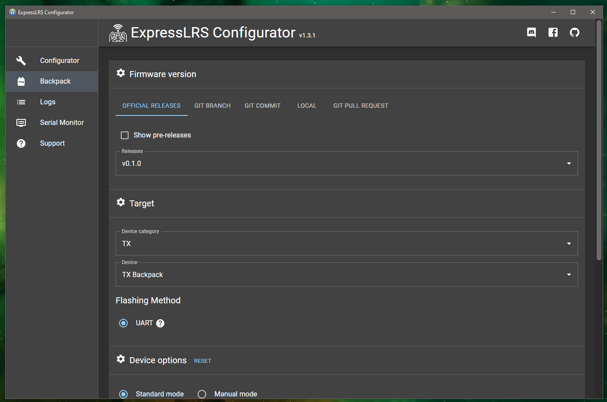
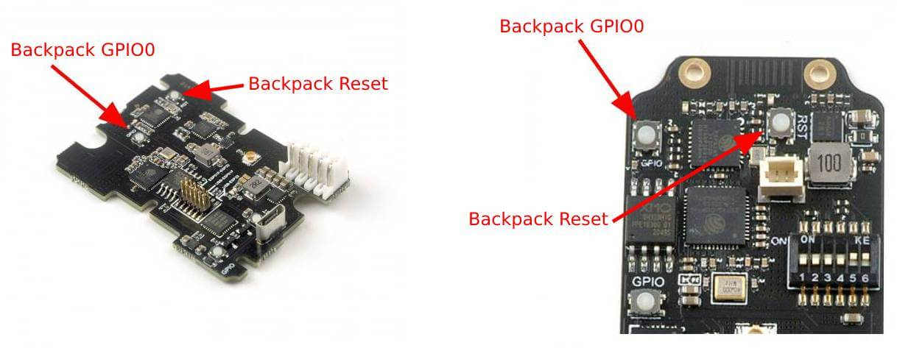
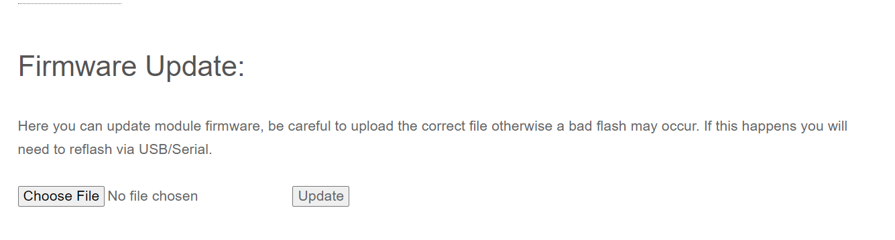
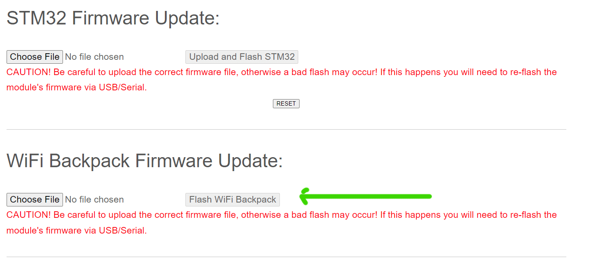

## Preparing the TX Module for Backpack Firmware Flashing

For the Happymodel TX Modules, you will need to move the jumpers or dipswitches into the correct position before flashing the firmware. Please see the USB/UART Flashing section of your particular TX Module for the jumper or dipswitch position.

- [ES24TX Jumpers](../../quick-start/transmitters/es24tx.md#flashing-via-usbuart)
- [ES900TX Jumpers](../../quick-start/transmitters/es900tx.md#flashing-via-usbuart)

You need to activate the `Backpack Flashing` jumper or dipswitch (middle pair). Opening up the module enclosure will be needed as well to access the Buttons on the modules.
Make sure your computer recognizes your TX module as a `USB to UART Bridge`. Windows drivers are linked on the Flashing Guides.

For the NamimnoRC Flash and Voyager TX Modules without an OLED screen (Gen 1 STM-based), make sure you're able to access the Backpack Web Update page (see [Flashing Guide](../../quick-start/transmitters/flash2400.md)) via WiFi.

For the NamimnoRC OLED-equipped TX Modules, should already have ready-to-use Backpack firmware.

For the AxisFlying Thor modules, these should also come flashed with ready-to-use Backpack firmware.

## Backpack Firmware Flashing

<figure markdown>

<figcaption>Backpack Configurator</figcaption>
</figure>

Flashing Backpack firmware is supported by the ExpressLRS Configurator since v1.2.0. 

- Targets:
    - `HappyModel TX Backpack`
    - `AXIS THOR TX Backpack`
    - `FrSky TX Backpack`
    - `Namimno Non-OLED TX Backpack`
    - `Namimno Flash OLED TX Backpack`

### Flashing via USB/UART

For the Happymodel TX modules, connect it via USB to your computer. As stated above, the module should be detected as a `USB to UART Bridge` and the jumper/dipswitches are set in the correct position (middle pins/switches should be On).

On the ExpressLRS Configurator, select your Target and elect your binding phrase which will be used to bind the Backpacks together. It can be different from your usual binding phrase, but there's no issue if you want to use the same. You can also set the Home Network SSID and Password (version 0.2.0).

Once set, click **Build and Flash** on the ExpressLRS Configurator.

**Button Dance:** A few buttons are needed to be pressed on the module while the firmware is compiling. Press and Hold the `GPI0` button then the `RST` button (GPIO is still pressed) then release the `RST` button and then the `GPIO` button.

<figure markdown>

<figcaption>Module Buttons</figcaption>
</figure>

If you did things right, a `Success` message should appear. 

Unplug the USB and change the position of the jumpers/dipswitches for the `Normal Operation` (refer back to the module's Flashing Guide page for the correct position).

Put back the cover of the module and attach it to your module bay.

### Flashing via Passthrough

Applies to: `Radiomaster Ranger Series`

These devices use the base `HappyModel TX Backpack` as target.

- Plug in a USB Data Cable into the module.
- Select the latest Backpack Release version.
- Select the device target, `HappyModel TX Backpack`.
- Select the `via Passthrough` flashing method.
- Set your runtime options.
- Click `Build and Flash`
- Wait for the process to complete.

### Flashing via WiFi (ESP-based TX Modules)

!!! info "Note"
    The following section applies to more recently released TX modules like the NamimnoRC OLED-equipped Modules. If you have the older Happymodel modules, and have updated their backpack firmwares to at least 0.1.0, then this can be used for future updates.

Using the ExpressLRS v2.0 Lua script, navigate to `WiFi Connectivity` and select `Enable Backpack WiFi`. The Backpack WiFi Access Point will immediately activate. Connect to the `ExpressLRS TX Backpack` AP (password is `expresslrs`). Navigate your browser to http://10.0.0.1/.

**Build** the TX firmware using the ExpressLRS Configurator. Grab the built `firmware.bin` and drag-and-drop it into the File Upload section of the webpage and click **Update**. Wait a bit (~10s) for the "Update Success! Rebooting...". The AP should automatically disappear and disconnect.

<figure markdown>

<figcaption>WiFi ESP</figcaption>
</figure>

### Flashing via WiFi (NamimnoRC Gen1 TX Modules)

For the First Generation NamimnoRC TX modules (No OLED), you will have to first **Build** the Backpack firmware. Once built, grab the `backpack.bin` file from the folder that the ExpressLRS Configurator opened. Open the URL http://elrs_tx.local on your browser and scroll down to where the **WiFi Backpack Firmware Update** section is (shown in the image below). If the page isn't loading, make sure you have followed the Wifi Flashing guide for these modules (see [Flashing Guide](../../quick-start/transmitters/flash2400.md#flashing-via-wifi)).

<figure markdown>

<figcaption>Wifi Backpack</figcaption>
</figure>

Wait for a bit (~10s) after the message "Update Success! Rebooting..." appears before you power-cycle the module. Your TX Backpack should now be ready.

### Flashing via ETX Passthrough

- Targets: 
    - `RadioMaster Zorro TX Backpack`
    - `RadioMaster TX16S Backpack`
    - `RadioMaster TX12 Backpack`
    - `RadioMaster Boxer Backpack`

!!! info "FYI"
    This method is the result of the collaborative effort between EdgeTX, RadioMaster and ExpressLRS.

With your handset turned on, connect a USB data cable to the USB data port of the Radio. Select `USB Serial(Debug)` or `USB Serial(VCP)` in the options window that pops up.

<figure markdown>

</figure>

<figure markdown>

</figure>

Using the ExpressLRS Configurator, select the appropriate version and the correct Device Target and set the Flashing method to `EdgeTXPassthrough`.

Set your Binding Phrase and your Home WiFi SSID and Password (Optional).

Click **Build and Flash** on the ExpressLRS Configurator.

Wait for the process to complete and you should see the green `Success` notification.

Unplug the USB from the handset and you're set!

## Starting in 0.2.0, you can Update via your Home WiFi Network

With your Home Network SSID and Password set, when you activate the WiFi mode via the Lua script (`WiFi Connectivity` -> `Enabled Backpack WiFi`), the Backpack will try to connect to your Home WiFi Network. Once connected, you can access the Web Update page via http://elrs_txbp.local/ and upload your firmware there.

The ExpressLRS Configurator will also detect the device after it has been connected. It will be listed in the "Device List" section, and you can press `SELECT`, so that the correct target is automatically selected for **Build**.

Alternatively, you can also **Build and Flash** via the Configurator through WiFi without having to access the Web Update page (just like any ESP-based ExpressLRS receiver).

## How to check you have updated the TX Backpack Firmware?

Make sure you set the jumpers or dipswitches on your modules (if yours have one; present them on the Happymodel TX Modules) to the `Normal Operations` position (refer to the top of this page). This allows the main ESP32 chip to talk to the Backpack chip. The Backpack will **NOT** work properly without setting those dipswitches or jumper pins.

!!! info "Attention"
    Change the position of the dipswitches or jumper pins to the `Normal Operations` positions if you have the Happymodel TX modules.

Navigate to the `WiFi Connectivity` folder of the ExpressLRS v2 Lua script and select `Enable Backpack WiFi`. Scan for Access Points and **ExpressLRS TX Backpack** should appear. Connect to it and point your browser to http://10.0.0.1/.

If you have set your Home Network SSID and Password, point your browser to http://elrs_txbp.local/.

The main banner will show you what kind of device it is and the firmware version that's flashed into it.

## Setup your VRx Backpack

The [VRx Backpack Setup](backpack-vrx-setup.md) section discusses the methodology of setting up a VRx Backpack. If you want to setup, please go through it.

## Operation

The [Backpack Usage](esp-backpack.md#backpack-usage) section discusses the Operation of the Backpacks in detail, including Binding, LED Status codes and more.