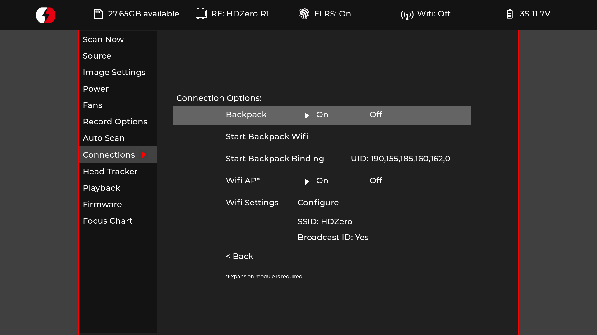
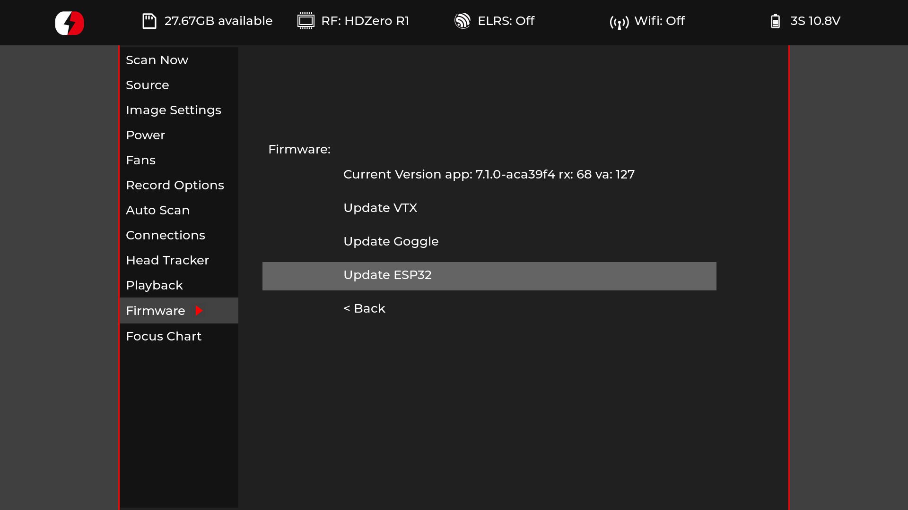
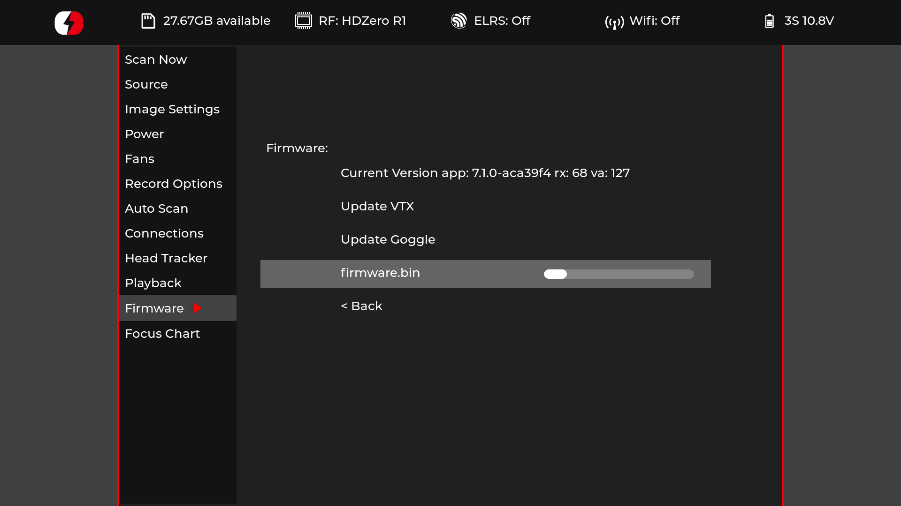
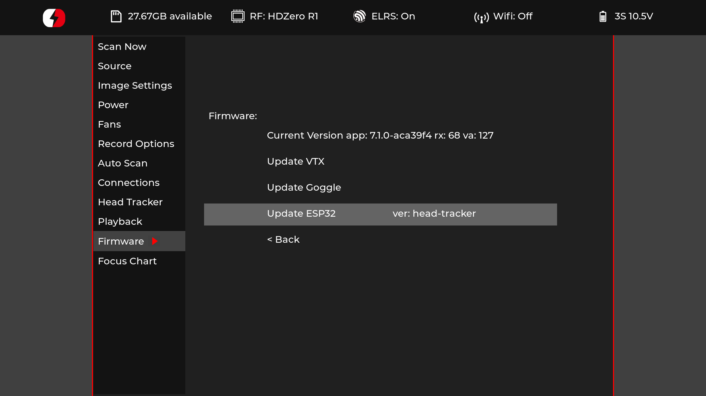

## Flashing the HDZero Goggles Backpack:

After building the VRx firmware, copy the following 4 files into a folder named `ELRS` on the root of the SD card.
- firmware.bin
- partitions.bin
- bootloader.bin
- boot_app0.bin

Insert the SD card into the goggles and boot the goggles as normal.

The first step is to ensure that you have the backpack enabled in the `Connections` page in the goggles.

Scroll down to the `Firmware` page and select the `Update ESP32` option

The 4 firmware files will be flashed to the ESP32 backpack and you should see the progress bar, with the nanme of the current file being flashed at the start.

When the upload has completed the page will display the version (or branch) of backpack firmware that is installed next to the update button.

## Starting Backpack WiFi

To start the WiFi endpoint on the backpack, navigate to the `Connections` page of the goggles UI and select the `Start Backpack WiFi` option. If you have configured your backpack with you home WiFi credentials, it will attempt to connect to that and will fallback to creating an access point if it cannot connect, with name `ExpressLRS VRx Backpack` and password `expresslrs`. The web UI will be available as `http://elrs_vrx` or `http://elrs_vrx.local`

## Binding to Your Transmitter

!!! info "Attention"
    Since the goggles have a bind button in the `Connections` page in the UI, the option to enter binding mode by power-cycling 3x to bind has been disabled.

If you entered the same bind-phrase as on your TX module and TX backpack when building the goggle backpack firmware then your device will already be bound and you can validate this looking at the UID next to the `Start Backpack Binding` button on the `Connections` page in the goggle UI.

If you have NOT entered your bind-phrase into ExpressLRS Configurator when building your backpack firmware, you can use the `Start Backpack Binding` option in the `Connections` page in the UI. Once you have selected this option the goggles will wait for a bind message from your transmitter. To perform the bind from the transmitter, load the ExpressLRS Lua Script on your radio handset and select the `[Bind]` option there. When the message is sent and the goggles have received the bind message, they should display `Success` in place of the button text. If they do not receive a bind message then they will timeout after 2 minutes and display a `Timeout` message.

You can validate the binding by navigating to the `Connections` page and the bound UID should be displayed next to the `Start backpack Binding` button.
