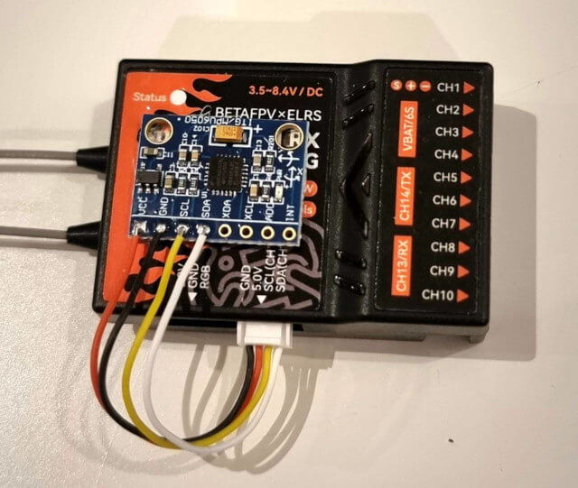
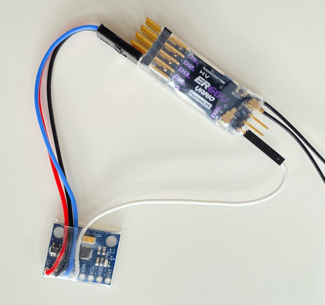

## Overview

ExpressLRS receivers that are equipped with an _inertial measurement unit_ (IMU) / gyro can provide stabilization for aircraft without a flight controller. See [Gyro](../software/gyro.md) for details.

This guide explains how to attach a DIY board to an existing receiver.

## Supported hardware

### IMU / gyro boards:

- MPU6050: very common, supports 5V.
- LSM6Dxx: not that common. Only supports 3.3V and will need a voltage regulator.

### Receivers

Any receiver based on the ESP32 chip, with an accessible I2C or SPI bus. Example: BetaFPV Super-P, RadioMaster ER6 or ER8 (via PWM pins).

## Wiring

=== "I2C"

    TK

=== "SPI"

    TK

### Wiring examples

<figure markdown>
  
  <figcaption>BetaFPV Super-P with MPU6050 over I2C</figcaption>
</figure>

<figure markdown>
  
  <figcaption>RadioMaster ER6GV with MPU6050 over I2C via PWM pins</figcaption>
</figure>

## Receiver configuration

=== "WebUI"

    TK

=== "Target file"

    TK

## Testing

=== "Lua script"

    TK

=== "Serial console"

    TK
