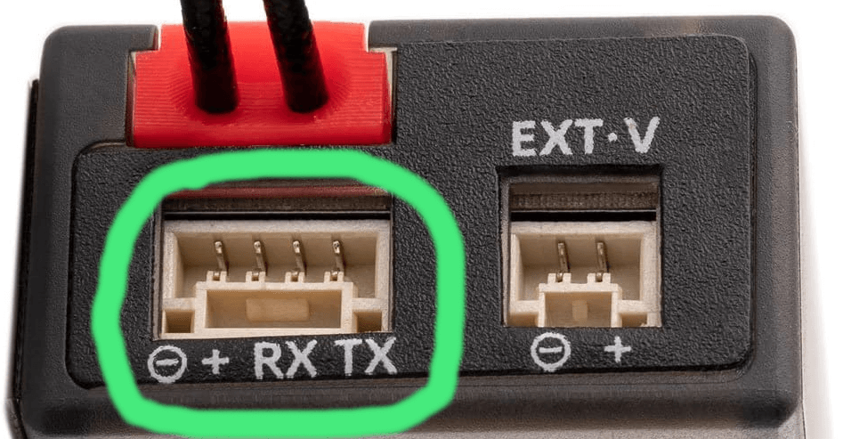

ExpressLRS now supports direct PWM output from receivers. This documentation refers to only receivers with native PWM output, not receivers attached to external CRSF to PWM converters such as the [CRServoF](https://github.com/CapnBry/CRServoF/) or [Matek CRSF-PWM-C](http://www.mateksys.com/?portfolio=crsf-pwm).

## Channel Mapping and Failsafe
The default channel mapping is straight through: CH1 from the TX goes to PWM Output 1, CH2 to Output 2, etc. To change this on ESP-based receivers, allow the receiver to go into WiFi mode then use the WebUI to configure the mapping. Any input channel can be mapped to any output channel, and the same input can be used for as many outputs as desired. AUX1/CH5 is always 1-bit, so you'll likely want to change this mapping to a channel with more resolution.

<figure markdown>

<figcaption>PWM Output WebUI</figcaption>
</figure>

Failsafe values are set using this UI as well with values that can range from 988us to 2012us. Failsafe is entered if the receiver is connected and 1 second passes without a valid channels packet being received. On startup, no pulses are generated until a transmitter connects, allowing ESC throttle calibration with the standard "raise the throttle before connecting" method. The default failsafe value is 1500us for all channels except Output 3, which defaults to 988us.

## Channel Resolution
PWM output is still subject to the resolution of the ELRS protocol, which means by default there are still only 4x full resolution channels (10-bit CH1-CH4) and 8x switch channels (CH5-CH12). For the best resolution on the switch channels, use `Switch Mode: Wide` and a `TLM Ratio` of `1:8` to `1:256` for 7-bit (128 pos) switch channel resolution. Higher TLM Ratios (1:2 and 1:4) are reduced to 6-bit (64 pos) resolution. Remember that switch channels are sent one per packet in Wide mode, taking 8 packets to send all 7 channels (e.g. 150Hz mode 1:64 = 18.657Hz updates to CH6-CH12). AUX1/CH5 is sent in every packet in all switch modes but is only 1-bit (2-pos). See [Switch Configs](https://www.expresslrs.org/software/switch-config/) for more information.

!!! hint "Full-Resolution Switch Modes"
	ELRS v3 now supports [full-res switch modes](https://www.expresslrs.org/software/switch-config/#full-resolution-switch-configuration-modes), which provide 8, 12, or 16 full-resolution (10-bit) channels at 100Hz (900MHz and 2.4GHz) or 333Hz (2.4GHz only). For PWM receivers with more than 4 channels, it is recommended that you use one of the full-res modes for best performance. 

## Supported Output Modes
ELRS receivers support the following PWM output modes: 
* PWM output frequencies: 50Hz, 60Hz, 100Hz, 160Hz, 333Hz, 400Hz
* 10kHz Duty Cycle 0-100% PWM (e.g. for driving a brushed motor FET)
* Binary On/Off (High/Low signal output)
* DSHOT300 (for driving brushless motor ESCs; ESP32-based receivers only)

## Serial Output
PWM receivers can also output any supported [serial protocol](https://www.expresslrs.org/software/serial-protocols/), such as CRSF or SBUS. [Select the desired output protocol](https://www.expresslrs.org/software/serial-protocols/#receiver-protocol-selection) using the ELRS lua, or on the Model tab in the receiver's WebUI. 
The default pins used for serial output vary by receiver. If your receiver has a dedicated serial port (e.g. RadioMaster ER6, ER8, ER8G(V)), serial output will be over this port. Otherwise, [check the Model tab](https://www.expresslrs.org/software/serial-protocols/#pwm-receiver-serial-pin-selection) in the receiver's WebUI to see which pins can be mapped to Serial TX and RX (usually Ch2 and Ch3). 

<figure markdown>

<figcaption>JST-GH Serial Port on RadioMaster ER6 PWM Receiver</figcaption>
</figure>

!!! warning "Advanced Output Mapping"
	Advanced users can remap serial, I2C, and PWM outputs to any available pin using the hardware.html page in the receiver's WebUI. Please ask on the [ELRS Discord](https://discord.gg/dS6ReFY) if you need help configuring non-standard receiver output mapping. 