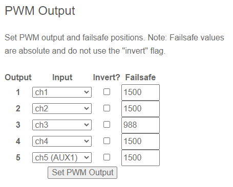

ExpressLRS now supports direct PWM output from receivers. This documentation refers to only receivers with native PWM output, not receivers attached to external CRSF to PWM converters such as the [CRServoF](https://github.com/CapnBry/CRServoF/) or [Matek CRSF-PWM-C](http://www.mateksys.com/?portfolio=crsf-pwm).

## Channel Mapping and Failsafe
The default channel mapping is straight through: CH1 from the TX goes to PWM Output 1, CH2 to Output 2, etc. To change this on ESP-based receivers, allow the receiver to go into WiFi mode then use the WebUI to configure the mapping. Any input channel can be mapped to any output channel, and the same input can be used for as many outputs as desired. AUX1/CH5 is always 1-bit, so you'll likely want to change this mapping to a channel with more resolution.

<figure markdown>

<figcaption>PWM Output WebUI</figcaption>
</figure>

Failsafe values are set using this UI as well with values that can range from 476us to 2523us. Failsafe is entered if the receiver is connected and Link Quality (LQ) drops to 0, or 1 second has passed without a valid channels packet being received, whichever comes first. On startup, no pulses are generated until a transmitter connects, allowing ESC throttle calibration with the standard "raise the throttle before connecting" method. The default failsafe value is 1500us for all channels except Output 3, which defaults to 880us.

## Channel Resolution
PWM output is still subject to the resolution of the ELRS protocol, which means by default there are still only 4x full resolution channels (10-bit CH1-CH4) and 8x switch channels (CH5-CH12). For the best resolution on the switch channels, use `Switch Mode: Wide`, which gives 6-bit (64 pos) switch channel resolution at every `TLM Ratio`. In ExpressLRS 3.x, Wide mode gave 7-bit (128 pos) resolution at the slower telemetry ratios. ExpressLRS 4.x uses 6-bit resolution at all telemetry ratios. Remember that switch channels are sent one per packet in Wide mode, taking 8 packets to send all 7 channels (e.g. 150Hz mode 1:64 = 18.657Hz updates to CH6-CH12). AUX1/CH5 is sent in every packet in all switch modes but is only 1-bit (2-pos). See [Switch Configs](https://www.expresslrs.org/software/switch-config/) for more information.

!!! hint "Full-Resolution Switch Modes"
	ELRS v3 now supports [full-res switch modes](https://www.expresslrs.org/software/switch-config/#full-resolution-switch-configuration-modes), which provide 8, 12, or 16 full-resolution (10-bit) channels at 100Hz (900MHz and 2.4GHz) or 333Hz (2.4GHz only). For PWM receivers with more than 4 channels, it is recommended that you use one of the full-res modes for best performance. 

## Supported Output Modes
ELRS receivers support the following PWM output modes:

* PWM output frequencies: 50Hz, 60Hz, 100Hz, 160Hz, 333Hz, 400Hz
* Normal pulse width (988-2012us - center 1500us), and extended pulse width (880-2120us - center 1500us) when CRSF Extended Limits are in use
* 10kHz Duty Cycle 0-100% PWM (e.g. for driving a brushed motor FET)

On top of this, outputs can also be set to:

* Binary On/Off (High/Low signal output)
* `DShot` (DSHOT300, for driving brushless motor ESCs; ESP32-based receivers only)
* `DShot 3D` (DSHOT300 with reverse, for ESCs configured for 3D or bidirectional use; ESP32-based receivers only)

The half pulse width servo mode (494-1006us) was removed in ExpressLRS 4.0. Use Servo Stretch instead, described below.

### DShot and DShot 3D
The two DShot modes differ in how the input channel maps to the throttle value sent to the ESC.

| Mode | Motor stopped | Forward | Reverse |
|---|---|---|---|
| `DShot` | 1000us | 1001-2000us | not available |
| `DShot 3D` | 1500us | 1501-2000us | 1499-1000us |

Set the ESC to 3D or bidirectional mode before you select `DShot 3D`. An ESC that is not configured for 3D will not respond correctly to the reverse half of the range.

!!! warning "Warning"
	Both DShot modes drive a motor. Remove the propellers before you change an output to `DShot` or `DShot 3D`, and before you test the output range.

## Servo Stretch
Each output has a `Stretch` checkbox in the WebUI. When `Stretch` is enabled, the input channel is mapped to 476-2523us instead of the normal 988-2012us. Use it for servos and actuators that need more travel than a standard PWM range gives.

!!! warning "Warning"
	Not all servos accept pulses outside the 988-2012us range. A pulse that is too short or too long can drive a servo into its mechanical stops and can damage the servo or the linkage. Check the specification of your servo first, then test the full range of travel on the bench.

A `Set Position` failsafe value does not use the `Stretch` or `Invert` flags. A failsafe value is always an absolute pulse width in microseconds.

## Serial Output
PWM receivers can also output any supported [serial protocol](https://www.expresslrs.org/software/serial-protocols/), such as CRSF or SBUS. [Select the desired output protocol](https://www.expresslrs.org/software/serial-protocols/#receiver-protocol-selection) using the ELRS lua, or on the Model tab in the receiver's WebUI. 
The default pins used for serial output vary by receiver. If your receiver has a dedicated serial port (e.g. RadioMaster ER6, ER8, ER8G(V)), serial output will be over this port. Otherwise, [check the Model tab](https://www.expresslrs.org/software/serial-protocols/#pwm-receiver-serial-pin-selection) in the receiver's WebUI to see which pins can be mapped to Serial TX and RX (usually Ch2 and Ch3). 

<figure markdown>

<figcaption>JST-GH Serial Port on RadioMaster ER6 PWM Receiver</figcaption>
</figure>

!!! warning "Advanced Output Mapping"
	Advanced users can remap serial, I2C, and PWM outputs to any compatible pin using the hardware.html page in the receiver's WebUI. Please ask on the [ELRS Discord](https://discord.gg/dS6ReFY) if you need help configuring non-standard receiver output mapping. 

!!! note "Output-Only Pins"
	Some receivers drive their PWM pins through a buffer or a Schmitt trigger. Such a pin can send a signal out, but it cannot read a signal in. On these receivers the `Serial RX`, `Serial TX`, `Serial2 RX`, `Serial2 TX`, `I2C SCL`, and `I2C SDA` modes are not shown in the mode list for the PWM pins. The PWM frequency modes, `On/Off`, `10kHzDuty`, `DShot`, and `DShot 3D` remain available. This is a property of the receiver hardware. You cannot enable the missing modes from the Hardware Layout page.
