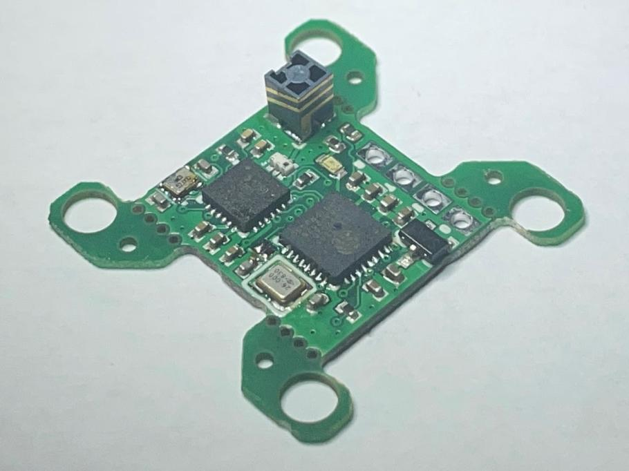

## Nuclear RX
### Overview

The Nuclear RX is designed to be as small as possible, using the same software target as the DIY Nano RX, and assembled by JLCPCB. It uses the 2400MHz band and the ExpressLRS firmware.

### Features
 
- 20x20 stack mounting with break-off tabs for compact applications  
- [SMD Antenna](../smd-antenna.md)
- [WiFi updating](../../software/updating/wifi-updating.md)
- Up to 500Hz packet rate  

<figure markdown>
{ width=50% class="center-img" }
</figure>

When you get your Nuclear RX, it will likely be on the latest release firmware. You'll probably have to update it to work with your TX. To update, follow the steps in the [WiFi updating](../../software/updating/wifi-updating.md) page. Alternatively, you can use [betaflight passthrough](../../software/updating/betaflight-passthrough.md) should work, but the boot jumper must be bridged while applying power to the RX.

When building, use one of the `DIY_2400_RX_ESP8285_SX1280_via_X` targets. To use `via_wifi`, put your RX in binding mode, connect your computer to the RX WiFi, and hit upload.

| LED | Status |
| --- | ------ |
| Blinking Slowly | Waiting for Connection  |
| Fast Double Blink | Binding Mode  |
| Super Fast Blink | WiFi Updating Mode  |
| Solid On | Connected  |

If for some reason the RX needs to be in boot mode, bridge the jumpers as shown here:

<figure markdown>
{ width="50%" class="center-img" }
</figure>

## Nuclear TX
### Overview

The Nuclear TX is designed to be the same size as a FrSky slim module and use the same software target as the DIY Slim TX. It uses the 2400MHz band and the ExpressLRS firmware. There is also a case that fits a full size JR module bay with the same PCB.

### Before Flight

If you ordered a Nuclear TX that wasn't fully assembled, these steps should help you finish it.

#### Print a case

The latest version of the Nuclear TX STL files can be found [here](https://github.com/ExpressLRS/ExpressLRS-Hardware/tree/master/PCB/2400MHz/TX_SX1280_Super_Slim/stl). Print the pieces in the orientation in the image and use support. Tree support in Cura works great. Keep in mind that PLA may melt if left in a hot car or in direct sunlight.  

<figure markdown>
{ width=50% }
</figure>

#### Assemble

Slap it together as seen below. Solder the wires to the pin header in the order in the picture, then slide it in from the outside. The header should press in with a little force. Add some glue on the inside to keep it from sliding out when removing it from your handset. Put the SMA pigtail in the hole in the top and screw it down. Use a wrench to make sure it doesn't come loose when you screw on your antenna. Plug the U.FL into the module and route it under, and loop up around the side.  

<figure markdown>
{ width=50% }
</figure>

#### Upload firmware

When you get your Nuclear RX, it will likely be on the latest release firmware. You'll probably have to update it to work with the RX you have. To update, follow the steps in the [WiFi updating](../../software/updating/wifi-updating.md) page. If your transmitter module ever becomes bricked from a bad upload, connect it with a serial adapter as shown here. **MAKE SURE THE ADAPTER IS SET TO 3.3V; 5V WILL KILL THE MODULE!** Use tweezers or solder to bridge the boot jumper while you power on the module to put it in boot mode. Use the target `DIY_2400_TX_ESP32_SX1280_E28_via_UART`.  

<figure markdown>
{ width=50% }
</figure>

!!! note "Note"
    The version of the boards with the 6-pad layout for programming has the TX and RX named backward. The actual order of the pins is TX, RX, 3V3, GND, GND.
