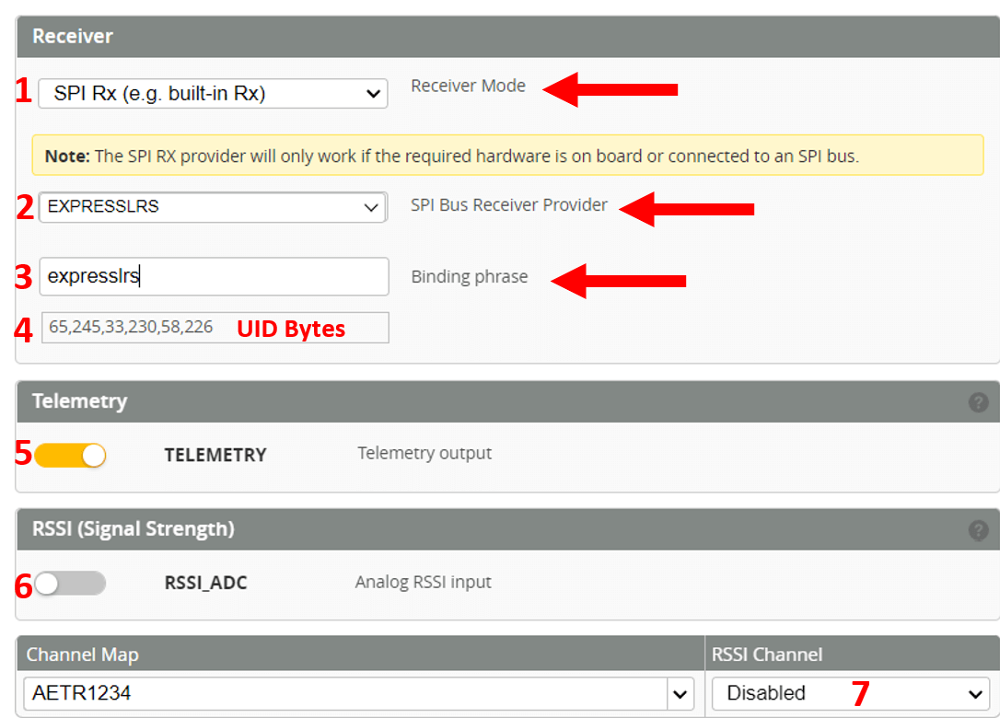

!!! note "Supported RF Modes"
    SPI receivers **DO NOT** support D(D250, D500), F(F500, F1000) and Full Res(100Hz Full Res, 333Hz Full Res) Modes (Packet Rates) and thus will not bind or sync with a TX module in any of these modes.

A few Flight Controllers and AIOs have been released with ExpressLRS receivers on-board using SPI instead of a regular UART. This means you can build a more compact and lightweight whoop or nano longrange rig without the need for an external receiver. More of these flight controllers are coming into stores.

Because the ExpressLRS code is "baked-in" to the flight controller firmware instead of using a second microcontroller, these can not be updated the same way external UART-based receivers are updated. 

!!! info "NOTE"
    You cannot use the ExpressLRS Configurator to update these FCs. You must update the flight controller software, eg Betaflight.

SPI receiver compatibility with ExpressLRS v3.x *requires* your flight controller be flashed with [Betaflight 4.4](https://github.com/betaflight/betaflight/releases/tag/4.4.0). If you are running [Betaflight 4.3.0](https://github.com/betaflight/betaflight/releases/tag/4.3.0) or [Betaflight 4.3.1](https://github.com/betaflight/betaflight/releases/tag/4.3.1), your receiver will only work with ExpressLRS v2.x. Please update to Betaflight 4.4 for ExpressLRS v3.x compatibility. 


In preparation for updating, you should save a copy of your `diff all` dump. Simply go into the CLI Tab of the Betaflight Configurator and execute the command `diff all` then press enter. A bunch of text will show up on the screen. At the bottom of the page, click the **Save to File** button and navigate to the folder you want the file to be saved. Finally click `Save` after taking note of the folder and filename of the text file. You will need to navigate to this file later on, moreover if you already have customized your settings on the flight controller, like rates, PID tune, OSD. For newly acquired flight controllers, this is often unnecessary.

Using the latest [Betaflight Configurator](https://github.com/betaflight/betaflight-configurator/releases), navigate into `Firmware Flasher` and select the latest [Betaflight release](https://github.com/betaflight/betaflight/releases/tag/4.4.0-RC2). Depending on your AIO board, the target will differ:

* Happymodel AIO: CRAZYBEEF4SX1280
* BetaFPV AIO: BETAFPVF4SX1280
* SPRacing SPH7RF: Coming soon!

If your Flight Controller model is not in the list above, consult your Flight Controller manufacturer for details.

!!! info "NOTE"
    The Happymodel Mobula6 900MHz AIO with the CrazyF4 ELRS FC (Target: CRAZYBEEF4DX) doesn't use an SPI ExpressLRS receiver. Check the page for [ES915RX](../quick-start/receivers/hmes900.md#es915868rx-discontinued) instead.
    
    Likewise, the [v2.0 BetaFPV F4 1S 5A](https://betafpv.com/collections/brushless-flight-controller/products/f4-1s-5a-aio-brushless-flight-controller-elrs-2-4g) comes with an on-board UART-based ExpressLRS Receiver and doesn't use the SPI ExpressLRS implementation. Use the `BETAFPV AIO 2400 RX` Device target.

Once flashed, you will need to paste in the `diff all` you have saved. Don't forget to type in `save` and press enter once done. Power cycle your flight controller, and you should be set. Review your Betaflight settings (no changes needed for the Receiver Type and Protocol; should already be set with `SPI Receiver`, with Provider as `ExpressLRS`).

As of Betaflight 4.4 (with Betaflight Configurator version 10.9.0 or newer), your ExpressLRS Binding Phrase can be set directly on the receiver tab in Betaflight Configurator.

<figure markdown>

</figure>
Proper configuration of the Betaflight Receiver tab for ExpressLRS SPI Receivers. Receiver Mode (1) should be set to SPI Rx. SPI Bus Receiver Provider (2) should be set to EXPRESSLRS. Enter your binding phrase in the box (3) and it will be converted to UID bytes (4) and saved to your Betaflight config. You can also take this opportunity to enable Telemetry (5) if desired, and make sure RSSI_ADC (6) and RSSI Channel (7) are disabled as shown. 

## Alternate Binding Procedures

There are two ways to bind the receiver, as shown below

### Button Binding

Put the receiver into bind mode using any of these procedures:

- "Bind" button in the Betaflight Configurator, Receiver Page (if can't be found, [update](#updating) the Betaflight firmware).
- Using the CLI, type in `bind_rx` and press enter once.
- Press the bind button on the flight controller.
- Using the CLI, type in `set expresslrs_uid = 0`, press enter once, then save and reboot

Once the SPI receiver is in Bind Mode (indicated by two immediate blinks followed by a short pause), execute the [ExpressLRS Lua script](../quick-start/transmitters/lua-howto.md) in your handset and press the `Bind` option. The RX and TX should be now bound (indicated by a SOLID LED on the Flight Controller).

**Please mind the order, RX first, TX second.**

Video Tutorial (thanks to @JyeSmith):

<figure markdown>
<iframe width="560" height="315" src="https://www.youtube.com/embed/U2sxqx2oT4k" title="YouTube video player" frameborder="0" allow="accelerometer; autoplay; clipboard-write; encrypted-media; gyroscope; picture-in-picture" allowfullscreen></iframe>
</figure>

### Binding Phrase via CLI

The binding phrase is hashed into 6 bytes represented as numbers. These 6 bytes are referred to as the UID bytes. 
UID bytes are entered into the Betaflight CLI for binding. Please [look below](#setting-binding-phrase) for instructions. 

!!! info "NOTE"
    When building via ExpressLRS Configurator or via VS Code, note down the UID bytes from the build log. You can also use the [generator below](#uid-byte-generator) to retrieve your UID bytes from your binding phrase.

<figure markdown>

</figure>

#### UID Byte Generator

Binding Phrase:

<div class="bp-wrapper">
  <input class="md-input bp-input" type="text" placeholder="expresslrs" />
</div>

!!! info "Not updating?"
    If the fields below don't update as you type your binding phrase above, refresh or reload this page in your browser.

UID Bytes
```
```

#### Setting Binding Phrase
Go to Betaflight CLI and enter the following commands.
```
```

<script type="text/javascript" src="//unpkg.com/crypto-js@4.1.1/crypto-js.js"></script>
<script type="text/javascript">
  window.addEventListener("load", (event) => {
    initBindingPhraseGen();
  });
</script>

As shown above, Betaflight Configurator 10.9.0 also supports entering the Binding Phrase directly in the Receiver Tab. It will generate the UID bytes for you. Clicking `Save and Reboot` will save the Binding Phrase into the flight controller configuration.

!!! note "Supported RF Modes"
    SPI receivers **DO NOT** support D(D250, D500), F(F500, F1000) and Full Res(100Hz Full Res, 333Hz Full Res) Modes (Packet Rates) and thus will not bind or sync with a TX module in any of these modes.

## Acknowledgements

The SPI ExpressLRS implementation would not have been possible without the work and huge efforts from the following developers:

- Paweł Stefański ([@phobos-](https://github.com/phobos-))
- Dominic Clifton ([@hydra](https://github.com/hydra))
- Hans Christian Olaussen ([@klutvott123](https://github.com/klutvott123))
- Steve Evans ([@SteveCEvans](https://github.com/SteveCEvans))
- Ctzsnooze ([@ctzsnooze](https://github.com/ctzsnooze))
