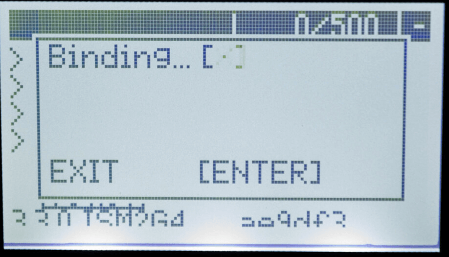

Binding can be done with either a hard-coded unique Binding Phrase or in a more traditional way where you put the receiver and transmitter into bind mode, and they link up.

If you'll be updating or reflashing your ExpressLRS firmware into your device anyway, using a Binding Phrase is a no-brainer. 

With the release of ExpressLRS v3.0, updating your Binding Phrase via the WebUI is an even more compelling reason to use a Binding Phrase.

Below are the different Binding Procedures for ExpressLRS.

## Unique Phrase
You can select a short and simple Binding Phrase for your devices before flashing or updating using the field in the [ExpressLRS Configurator](installing-configurator.md).

<figure markdown>

<figcaption>Binding Phrase Field</figcaption>
</figure>

Alternatively, you can also change the Binding Phrase via the WebUI if your device has WiFi capabilities and is already updated to ExpressLRS 3.0 or newer. See this [page](webui.md) for the WebUI User's Guide.

<figure markdown>

<figcaption>Binding Phrase Field in the WebUI</figcaption>
</figure>

We recommend using a **unique** phrase with at least 8 alpha-numeric characters. The best candidate is your Pilot Handle. This phrase need not be complicated or super-secret as it isn't a password or encryption key. 

??? info "Is my binding phrase a secret?"
    No, just like what channel your VTX is on is not a secret. The binding phrase is not security, it is anti-collision. If everyone kept their VTX channel a secret, the chances of you blasting someone out of the sky accidentally are pretty high. To provide the best chance of not interfering with other pilots and them not interfering with you, be sure you're not using the same dumb bind phrase as someone else. Express your style with a hilarious or saucy bind phrase.

## Traditional Binding

For traditional binding to work, a Binding Phrase must not be set, at least for the Receiver.

!!! warning "Notice"
    A Receiver flashed or set with a Binding Phrase WILL NOT initiate Manual Binding mode, however many times you try the procedure below. You must first reflash the receiver with the Binding Phrase field disabled and/or unset. Why would you not use a bind phrase though if you're already having to flash the RX anyway? :grin:

1. Power off your transmitter/radio.
2. Power-cycle the receiver 3 times. 
    - Supply power to the receiver.
    - The receiver LED lights up.
    - Turn it Off.
    - Repeat 2 more times.

    !!! warning "Caution"
        This step is best done using a LiPo flight pack, so make sure you've wired your flight controller properly and checked for any shorts. You don't want to let out the blue smoke!

3. Make sure the LED is doing a quick double-blink, which indicates the receiver is in bind mode.

    <figure markdown>
    
    </figure>

4. Power up your transmitter/radio and use the ++"[BIND]"++ button on the ExpressLRS Lua script, which sends out a binding pulse. The Popup will briefly show up and then disappear.

    <figure markdown>
    
    </figure>

5. If the receiver LED turned into a solid light, it's bound!

    <figure markdown>
    
    </figure>

??? danger "Receiver LED doesn't Blink"
    Consult the [Receiver Wiring](receivers/wiring-up.md) guide, particularly the expandable section near the bottom titled "My Receiver is in Bootloader Mode".

## Connection Check

Using the [ExpressLRS Lua Script](transmitters/lua-howto.md), look for a `C` in the top-right corner of the screen which indicates TX module and Receiver are Connected and Communicating.

1. Press the ++"SYS"++ Key on your Radio.
    - Older Radios or those with only one Menu Key will need to long-press the ++context-menu++ Key to access the System Menu.
    - Consult your Radio User's Manual on how to access the System Menu.

2. You are now in the Tools Menu where Lua Scripts can be found. Scroll down and select `ExpressLRS` Lua Script.

    <figure markdown>
    ![Lua Script]
    </figure>

    - If the script is nowhere to be found, download it from [this page](transmitters/lua-howto.md) and save it into your Radio SD Card Scripts/Tools/ folder.

3. Press ++enter++ to Load it.
            
    <figure markdown >
    ![Lua Running]
    </figure> 

    - If the script is stuck on a "Loading..." screen, go back to the [Radio Preparation](transmitters/tx-prep.md) Page and make sure you have configured your radio properly for ExpressLRS use.

4. A `C` in the top-right corner should be visible indicating TX module and Receiver are connected and Communicating.

    <figure markdown>
    
    </figure>

??? tip "Model Mismatch"
    If the ExpressLRS Lua Script is showing a `C` in the top-right corner alright, but then that line disappears and is replaced with a line saying "Model Mismatch", do not worry. ExpressLRS has detected that the set Model ID in the Receiver is different from the Receiver ID set in the current Model in your Radio Model Configuration.

    This is also indicated by the Receiver LED as 3 fast blinks then a pause:
    
    <figure markdown>
    
    </figure>

    If you've deliberately set up Model Matching following [this page](../software/model-config-match.md), make sure your settings are correct.

    If the Model Match item in the ExpressLRS Lua is set to On, and you do want to use the Model Matching Feature, briefly set it to Off, then set it back to On to assign the current Receiver and Model ID to the Receiver.

    Otherwise, simply set the Model Match item to Off.

    If Model Match is set to Off, briefly set it to On and after a second or so, set it back to Off. This should clear the Model Match ID in the receiver.

    This must be done while the TX module and Receiver are both powered up and connected/bound.

[Lua Script]: ../assets/images/lua1.jpg
[Lua Running]: ../assets/images/lua/config-bw.png
