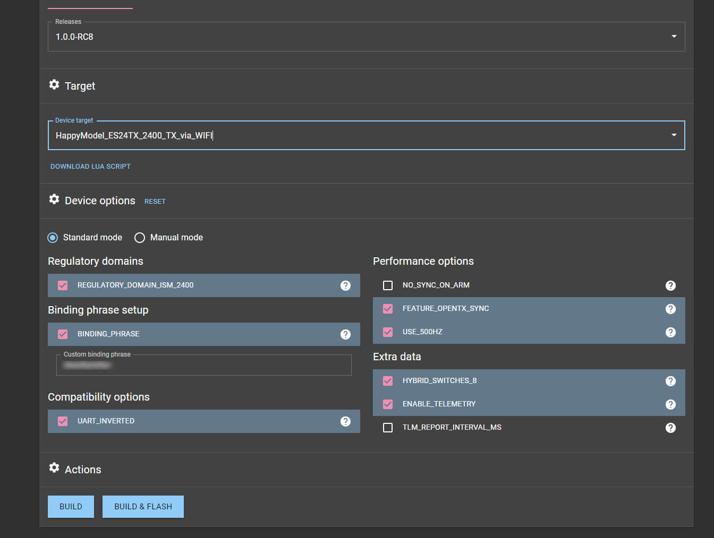
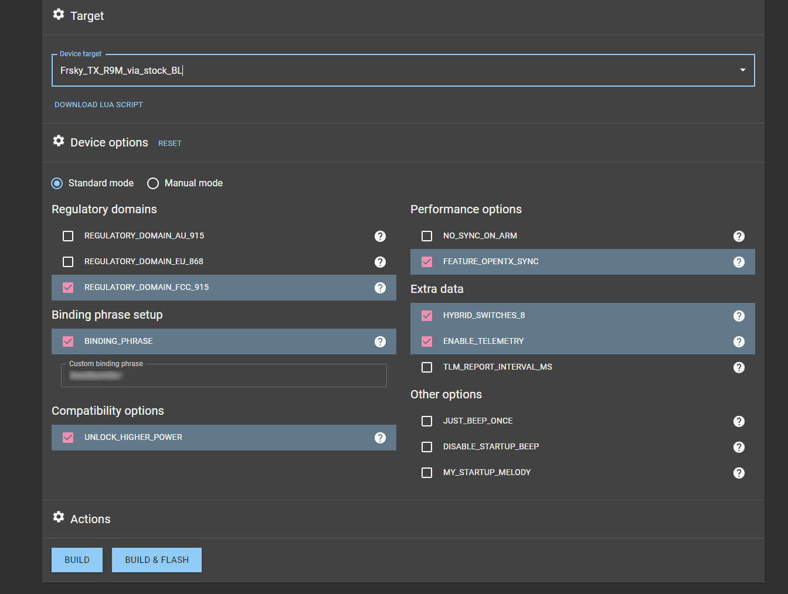

This page aims to explain which options to set on the ExpressLRS Configurator for a particular Hardware. It helps guide you through which options you should enable for your purposes or which options should be left at default.

Some of these options are present on both the Tx and Rx Targets. It is important that these options match to both the TX module and receiver in order for them to bind. `team2400` and `team900` also share a few options and some options are unique to that frequency band. Shown below are common options available on `team2400` and `team900` TXes respectively.





## Regulatory Domains
```
Regulatory_Domain_AU_915
Regulatory_Domain_EU_868
Regulatory_Domain_FCC_915
Regulatory_Domain_ISM_2400
```
This is a relatively simple one - enable whatever regulatory domain you are in. `EU 868` is compliant to the frequency but **is not** LBT compliant 👂 . Every other band is near compliant 👿  but may not be fully compliant for your regulatory domain. 

## Binding Phrase

This step is simple but **important**. Both the TX and RX NEED to have the same binding phrase or **ExpressLRS WILL NOT WORK**. Anyone using the same binding phrase as you will be able to control your model, so be unique. Set something memorable, and limit to alphanumeric phrases conforming to the Latin alphabet. Receivers flashed with firmware builds that do not have binding phrase enabled will support and require the traditional [binding method](../../quick-start/binding/). 📜 

## Performance Options
```
NO_SYNC_ON_ARM
```
**no sync on arm** doesn't transmit sync packets while armed. This is useful for racing as there is less time & packets wasted 🗑️ on sending sync packets. **HOWEVER** if you are doing serious long range ⛰️, keep this commented because in the case of a sustained failsafe, link can not be regained while armed.

AUX1 is the channel ExpressLRS uses to detect "ARMED", and this feature assumes that a **low value of the arm switch is disarmed, and a high value is armed**. OpenTX can invert your switch if you prefer it to be mechanically inverted. It may be best not to enable no sync on arm when you are first setting up ExpressLRS as it can be a source of confusion.

```
FEATURE_OPENTX_SYNC
```
This option enables **lower latency** 🏃‍♂️ from the OpenTX radio to the TX and should be kept enabled. To get the full benefit of the option, you should be running an OpenTX version with CRSFShot or Mixer Sync enabled.

## Extra Data

```
TLM_REPORT_INTERVAL_MS
```
It makes the TX module send the telemetry data to OpenTX to the interval you set. This stops the telemetry lost warnings when running a high telemetry ratio, or low rates like 50hz.
     
Default value is **320LU**. If you want to change that you have to suffix your milliseconds value with **LU**. For example, in order to specify 100 ms telemetry update rate you have to enter it like this: **100LU**.

Typically, you want to keep **320LU** value for OpenTX based radios, and **100LU** for ErskyTx ones.

*Tip: only check this if you're changing the value. No need to enable it if you'll be using the default 320LU value*

## Network Options

```
AUTO_WIFI_ON_INTERVAL
```
*Note: In version 2.0, this option became available for Transmitter Modules.*

⚠️ Must be defined if you plan to update your RX over wifi without using a button on the RX ⚠️ This will automatically turn the wifi 📶 ON for any module that has an ESP8285 on it if no TX connection is established after N seconds from boot (Factory Firmware of the HappyModel receivers set this to the previous default of 20s. RC8 has increased the interval to 30s). This enables pushing firmware updates to the RX by connecting to its wifi network and visiting http://10.0.0.1.

```
HOME_WIFI_SSID
HOME_WIFI_PASSWORD
```
*New in 2.0*

These options set Home Network Access for your Wifi-enabled hardware. With these set, the devices will connect to your WiFi Network when you click on "(Wifi) Update" on the ExpressLRS Lua script (for some Tx Modules) or automatically after your set interval time (Receivers). Once the devices connect to your Home WiFi, the Update page can be accessed anywhere, in any device in the same network. Tx Module Wifi update page can be reached using the address http://elrs_tx.local, while receivers' update page can be reached via http://elrs_rx.local.

## Other Options

```
JUST_BEEP_ONCE
DISABLE_STARTUP_BEEP
MY_STARTUP_MELODY="<music string>|<bpm>|<semitone offset>"
```
For TXes like the R9M, this sets if the TX only beeps one-time, not beep at all or play custom a startup song. By default it is set to play the ExpressLRS Startup Tune 🎼 , but if you don't prefer it, or simply want to go stealthy, enable any of these options. ✖️
 
For all your customization needs, use `MY_STARTUP_MELODY` to define your own startup melody using either the BlHeli32 syntax or RTTL. 
The BlHeli32 Synatax has the required parameters `music string` and `bpm`, and `semitone offset` is optional to transpose the entire melody up or down by the defined amount of semitones. Example BlHeli32 melodies are available on [Rox Wolfs youtube channel](https://www.youtube.com/playlist?list=PL_O0XT_1mZinetucKyuBUvkju8P7DEg-v), some experimentation may be required though. :musical_note: To write your own melody, **[this (Sheet Music 101)](https://github.com/nseidle/AxelF_DoorBell/wiki/How-to-convert-sheet-music-into-an-Arduino-Sketch)** and **[this (BLHeli Piano)](https://dra6n.github.io/blhelikeyboard.github.io/)** are useful resources.

The RTTL Syntax is the same as used in old mobil phones for ringtones and some examples of it can be found [here](http://esctunes.com/), where you can search through many existing RTTL melodies.

```
UNLOCK_HIGHER_POWER 
```
Majority of the ExpressLRS modules maxes out at 250mW. With this option, higher power levels can be unlocked on the modules that supports it. However, it is imperative that you have taken measures to provide ample cooling to the module's internals through the use of a [Fan Mod](../../hardware/fan-mod/). This specifically applies to the R9M, which, from factory, supports a higher power level up to 1W; but because ExpressLRS runs at a much higher duty cycle, it taxes the circuity and thus produces heat much earlier. To keep it stable, cooling should be implemented. Without any cooling, you run the risk of ending up with a red paperweight.

```
UART_INVERTED
```
This **only works** with ESP based TXes (will not work with modules without built-in inversion/uninversion), but enables compatibility with radios that output inverted CRSF, such as the FrSky QX7, TBS Tango 2, RadioMaster TX16S. You want to keep this enabled in most of the cases. If your radio is T8SG V2 or you use Deviation firmware turn this setting off.

## Receiver Only Options ##


*Note: Configuration of the Receivers should match the configuration of the Transmitter Module for Sync/Binding to happen between devices.*

The explanation of the options for the Transmitter Modules also apply for the Receivers.

But here's a few Receiver-specific Options you can configure:

```
LOCK_ON_FIRST_CONNECTION
```
RF Mode Locking - When the RX is waiting for a connection, it cycles through all available rates waiting for a connection on each one. By default, ExpressLRS will go back to this mode after a disconnect (failsafe). If LOCK_ON_FIRST_CONNECTION is used, ELRS will not cycle after a disconnect, but instead just stay on whatever rate the last connection was. This makes connection re-establishment quick, because the RX is always listening at the proper rate. This is generally what everyone wants, but there is utility in being able to switch the TX to the lowest rate to get more range to re-establish a link with a downed model, which can't happen if the RX is locked at the previous rate.
When cycling through the rates, the RX starts with the fastest packet rate and works down to the slowest, then repeats. It waits PACKET_INTERVAL * PACKS_PER_HOP * HOP_COUNT * 1.1 at each rate. Example: 4ms * 4 * 80 * 1.1 = 1.408s for 250Hz. The duration is extended 10x if a valid packet is received during that time. Even with LOCK_ON_FIRST_CONNECTION, the rate can be changed by changing the TX rate using ELRS.lua while connected, or by power cycling the RX.

```
USE_DIVERSITY
```
Enable antenna-switching diversity for Receivers that support it.

```
USE_R9MM_R9MINI_SBUS
```
**This does not turn on SBUS protocol** it simply changes the pin used for communication from those two side pins (A9 and A10) to use the pin labeled "SBUS" on the RX, which is inverted. This is useful for F4 FCs which only have an inverted receiver input UART RX. 🔼. This is only one way, so you lose the telemetry downlink to your radio as well as passthrough flashing. Enabling this turns on CRSF protocol output on the S.BUS 🚌 pin on your R9MM/R9Mini. set serialrx_inverted = ON may also be needed within Betaflight 🐝 for compatibility

*For a complete list of User Defines, head over to the [User Defines page](../../software/user-defines/).*

**Done! It's time to flash the firmware on your transmitter**
