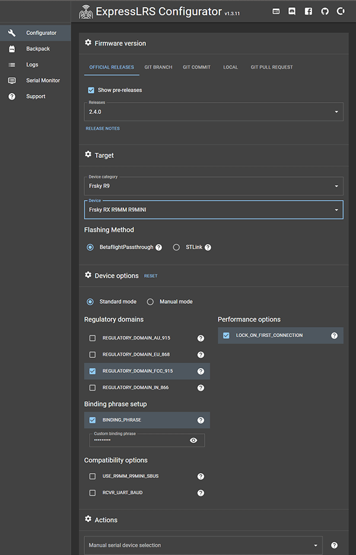

This page aims to explain only the key options in ExpressLRS Configurator you may need for your initial setup. For a full description of **all** the options available, see the [User Defines page](../software/user-defines.md).

Some of these options are present on both the Tx and Rx Targets. It is important that these options match to both the TX module and receiver in order for them to bind. `team2400` and `team900` also share a few options and some options are unique to that frequency band. Shown below are common options available on `team2400` and `team900` TXes respectively.

<figure markdown>

</figure>

<figure markdown>

</figure>

## Regulatory Domains
```
Regulatory_Domain_AU_915
Regulatory_Domain_EU_868
Regulatory_Domain_IN_866
Regulatory_Domain_FCC_915

Regulatory_Domain_ISM_2400
Regulatory_Domain_EU_CE_2400
```
This is a relatively simple one - enable whatever regulatory domain you are in to select the frequency range to be used.

EU Regulatory domains are now LBT compliant!

## Binding Phrase

Entering a binding phrase allows you to skip the binding step with your receivers-- you want this set. Any transmitter using the same binding phrase will connect to any receiver with the same binding phrase, so be unique. Limit to alphanumeric phrases conforming to the Latin alphabet. Receivers flashed with firmware builds that do not have binding phrase enabled will require binding with the traditional [binding method](binding.md).

## Network Options

```
HOME_WIFI_SSID
HOME_WIFI_PASSWORD
```
Set these to have the "Wifi Update" mode try to connect to an existing wifi network using these credentials. Configure them with the wifi settings for where you'll be flashing your firmware, to save the step of switching wifi networks on your computer or phone during the flashing process. If the device is unable to connect to this network, it will create its own network.

## Other Options

```
UNLOCK_HIGHER_POWER 
```
Enables higher output power for devices that support it but will possibly melt themselves to give it to you. Do not enable it without first updating your cooling setup or verifying the device isn't overheating when running at your chosen power.

```
UART_INVERTED
```
This **only works** with ESP32 based TXes. **Almost all handsets** require `UART_INVERTED` on, such as the FrSky QX7, TBS Tango 2, and RadioMaster TX16S. For T8SG V2 or Deviation firmware turn this setting off.

## Receiver Only Options

<figure markdown>

</figure>

<figure markdown>

</figure>

!!! attention "Note"
    Configuration of Receivers should match the configuration of the Transmitter Module for Sync/Binding to happen between devices.

Most of the options listed above for the Transmitter Modules also apply to Receivers. The following are options specific to receivers that you might need.

### Output Inverting

```
RCVR_INVERT_TX
```
If using an a flight controller that **only** has an RXI / SBUS (RX inverted) pad, turn on this option to invert the CRSF output from the receiver to be able to use that pad. This does not convert the output to SBUS, it is inverted CRSF, so CRSF should still be the receiver protocol selected in the flight controller software. ESP-based receivers only.

```
USE_R9MM_R9MINI_SBUS
```
On the R9MM/R9Mini only, this changes the pin used to output CRSF from the receiver the two side pins (A9 and A10) to the pin labeled "SBUS" on the RX, which is inverted. Similar to `RCVR_INVERT_TX` this does not convert the output to SBUS protocol, so CRSF should still be the receiver protocol selected in the flight controller software.

## Should I turn these off/on?

```
NO_SYNC_ON_ARM
```
Sync packets are one packet out of every 5 seconds when armed. Leave this off unless running telemetry ratio Off because you won't be able to reconnect after a failsafe while armed if this is on.

```
LOCK_ON_FIRST_CONNECTION
```
Keeps the receiver on the last packet rate it was on if it failsafes, instead of trying every packet rate to reconnect. Should be left on.

## Full List

For a complete list of User Defines, head over to the [User Defines page](../software/user-defines.md).

**Done! It's time to flash the firmware on your transmitter**
