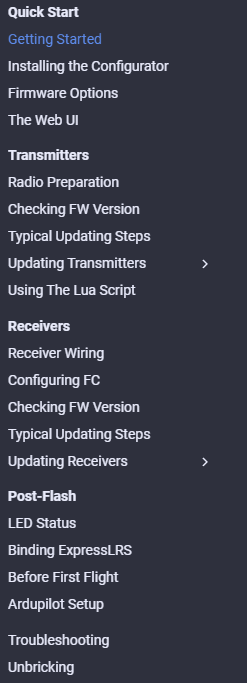

## Welcome to the Quick Start Guide

### Prerequisites

You should be comfortable navigating through your Radio Handset firmware (OpenTX/EdgeTX) and setting up models, as the guide on this website mainly covers setting up your radio for you to be able to use ExpressLRS.
    
Likewise, you should also be comfortable with your Flight Controller firmware (Betaflight, INAV, etc), as the guide only covers setting up your ExpressLRS receiver to work with your flight controller firmware.

### How to Use or Navigate through the Guide

This User Guide is organized to cater to both new and seasoned users of the system. The navigation at the side of the Quick Start section is arranged starting from getting the ExpressLRS Configurator installed, an Explanation of the Options available, Steps concerning the Radio and TX module, FC and Receiver setup, a "Before you Fly" page and a Troubleshooting page:

<figure markdown>

</figure>

You can also use the Footer Navigation shown below to go through these steps:

<figure markdown>

</figure>

For a specific hardware flashing guide, the pages are either in the Flashing Receivers or Flashing Transmitters sections organized semi-alphabetically. You can also use the Search Bar for any topic or info you are after:

<figure markdown>

</figure>

Longer pages have a **Table of Contents** menu found on the right hand side of the page.

We hope these pages will help you get started with ExpressLRS and experience one of the best and most innovative RC links in the hobby.

If you have other questions or concerns, or maybe you need further help that isn't covered by this Guide, head over to our Discord Channel!

[ExpressLRS Discord :fontawesome-brands-discord:](https://discord.gg/dS6ReFY){ .md-button .md-button--primary .center-block }

## Where are the Video Guides?

Due to the current fast pace of development, video guides often end up outdated faster than intended. Specific hardware guides sometimes use pre-release firmware targets or targets intended for different hardware which can confuse when specific firmware targets are added. 

We will be adding a separate videos section soon, but for now, until we find high quality, relevant and applicable guides, you are on your own. Please take note of the publication date for these videos to make sure they are still relevant.
