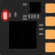
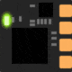
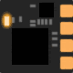
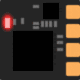
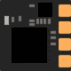

## Receiver/Transmitter LED Status

ExpressLRS uses the LED to communicate the status of the transmitter/receiver.

The conditions and status LED are as follows:

=== "Receiver Single Color LED"
    |                                                                                         | LED Indication                  | Status                                                            |
    |-----------------------------------------------------------------------------------------|---------------------------------|-------------------------------------------------------------------|
    |                                                | Solid on                        | Connected to a transmitter, or bootloader mode enabled            |
    |                      | Double blink then pause         | Binding mode enabled                                              |
    |                   | Slow blink 500ms on/off         | Waiting for connection from transmitter                           |
    |  | Triple blink then pause         | Connected to transmitter but mismatched model-match configuration |
    |                  | Medium speed blink 100ms on/off | Radio chip not detected                                           |
    |                       | Fast blinking 25ms on/off       | WiFi mode enabled                                                 |

=== "Receiver RGB LED"
    |                                                                                     | LED Indication                 | Status                                                            |
    |-------------------------------------------------------------------------------------|--------------------------------|-------------------------------------------------------------------|
    |                            | Rainbow fade effect            | Starting Up                                                       |
    |                    | Green heartbeat                | Web update mode enabled                                           |
    |  | Slow blink 500ms on/off        | Waiting for connection from transmitter                           |
    |                  | Red flashing 100ms on/off      | Radio chip not detected                                           |
    |                    | Orange Double blink then pause | Binding mode enabled                                              |
    |              | Orange Triple blink then pause | Connected to transmitter but mismatched model-match configuration |
    |                                 | Solid single color             | Connected to a transmitter, color indicates packet rate           |
    |                               | No Light                       | Off or in Bootloader Mode                                         |

    | LED Color    | 2.4GHz Packet rate (Hz) | 915/868MHz Packet rate (Hz) |
    |--------------|-------------------------|-----------------------------|
    | Red          | F1000                   | 200                         |
    | Yellow       | F500                    |                             |
    | Yellow-Green | D500                    | 100 Full                    |
    | Green        | D250                    | 100                         |
    | Cyan         | 333 Full                |                             |
    | Light Blue   | 500                     | 50                          |
    | Blue         | 250                     | 25                          |
    | Blue-Purple  | 150                     |                             |
    | Purple       | 100 Full                | D50                         |
    | Magenta      | 50                      |                             |
    
=== "Transmitter RGB LED"
    | LED Indication                | Status                                                 |
    |-------------------------------|--------------------------------------------------------|
    | Rainbow fade effect           | Starting Up                                            |
    | Green heartbeat               | Web update mode enabled                                |
    | Blue heartbeat                | Bluetooth joystick enabled                             |
    | Red flashing 100ms on/off     | Radio chip not detected                                |
    | One Orange flash every second | No handset connection                                  |
    | Solid single color            | Connected to receiver, color indicates packet rate     |
    | Fading single color           | No connection to receiver, color indicates packet rate |

    | LED Color    | 2.4GHz Packet rate (Hz) | 915/868MHz Packet rate (Hz) |
    |--------------|-------------------------|-----------------------------|
    | Red          | F1000                   | 200                         |
    | Yellow       | F500                    |                             |
    | Yellow-Green | D500                    | 100 Full                    |
    | Green        | D250                    | 100                         |
    | Cyan         | 333 Full                |                             |
    | Light Blue   | 500                     | 50                          |
    | Blue         | 250                     | 25                          |
    | Blue-Purple  | 150                     |                             |
    | Purple       | 100 Full                | D50                         |
    | Magenta      | 50                      |                             |
