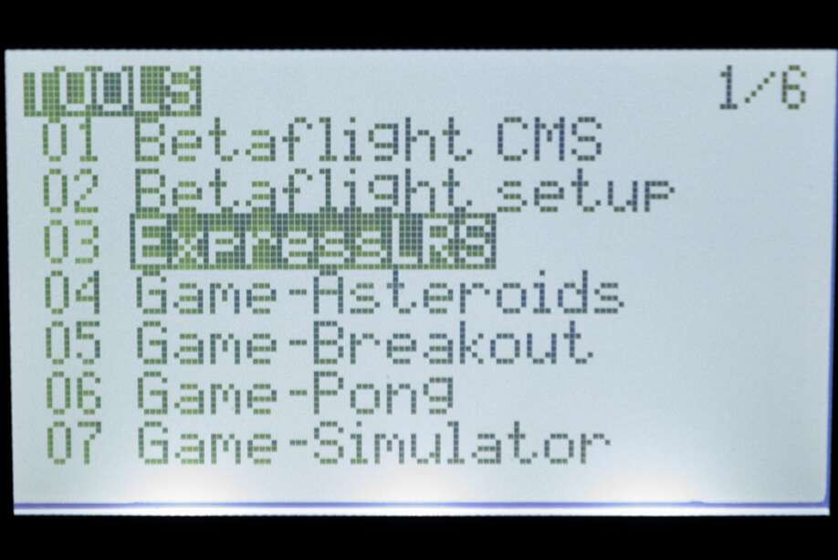
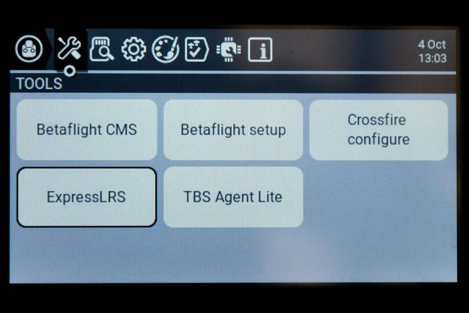
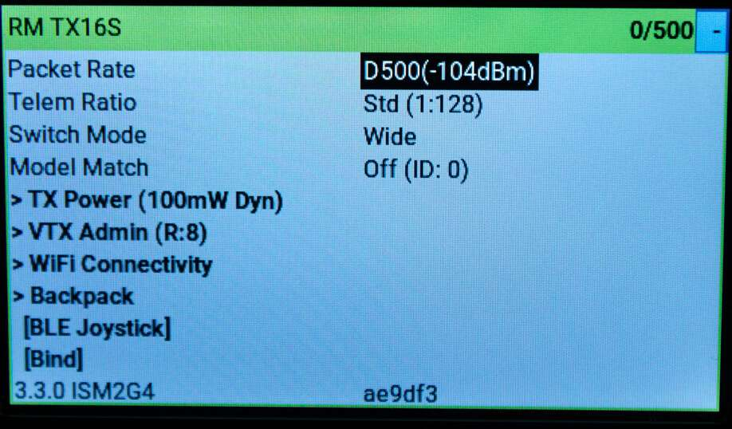
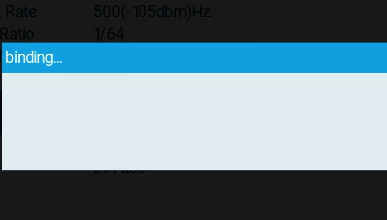
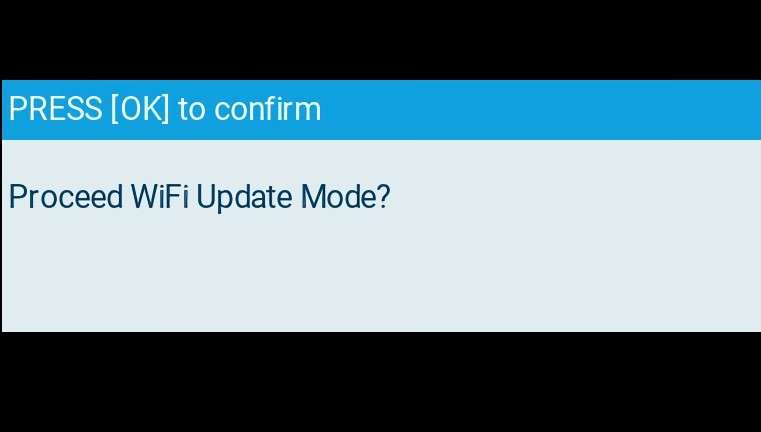

Now that you have flashed your TX it is time to learn how to use the ELRS lua script!

*If you flashed via WiFi you need a different version of the lua than you already installed.*

## Installing the Lua Script

Download the [ELRSv2 Lua Script](https://github.com/ExpressLRS/ExpressLRS/tree/master/src/lua) for your specific radio type onto the radio's SD Card in the `Scripts/Tools` folder and Long Press the "SYS" button (for T16 or similar Radios) or the "Menu" button (for Taranis X9D or similar Radios) to access the Tools Menu where you can find ELRS script ready to run with only one click.

Which version?

* if your handset has the black and white display and your handset is NOT an X9D or X9D+, use: **black_and_white_display_128x64**

* if your handset is the X9D or X9D+, use: **x9d_212x64**

* if your handset has the colored screen display, use: **color_display_480x272**

Here's how it looks in the Tools Menu (X9D+ and T16 Shown):

## Check your TX is Connected

Enter the Lua Script by short pressing it in the Tools menu. The next section is to check if your TX and Handset are communicating.

If no parameter is shown for a long time in the Lua Script, that would means the Protocol set for the External Module is incorrect or that the module is not properly connected to the pins of the jr bay of the radio. The latter could mean that the module's PCB has gotten loose, common with the first batches of the ES24TX modules from Happymodel.

If a parameter does show up, but the Bad/Good section on the right of the header from the lua script is showing 0/142, etc., have a look at your model settings and make sure the internal RF module is set to off.

If the Bad/Good persists to be something different than `0/your packet rate` that means `CRSFshot` is not working - verify that you properly followed the [Radio Preparation](./../tx-prep) Guide.

The `simplify-serial-out   0519fd` from the photo above is the git commit hash of the firmware version that the module has. You can reference this hash from [Releases](https://github.com/ExpressLRS/ExpressLRS/releases).

## Understanding and Using the Lua Script
Now, we can explore the complexities of the lua script, and how to interpret each of it's many sections

### Packet Rate and Telemetry Ratio
These are shown as `Packet Rate` and `Telem Ratio` in the lua script, which allow you to change your performance parameters. 

For `Packet Rate`: the options for Team2.4 are: `50, 150, 250 & 500` Hz and the options for Team900 are `25, 50, 100 & 200` Hz. 

For `Telem Ratio`: the options are: `1/2, 1/4, 1/8, 1/16, 1/32, 1/64, 1/128 & off`. For more detail on what these mean for telemetry, there is further explanation [here](./../pre-1stflight/#telemetry) and [here](../../info/telem-bandwidth/).

### Model Configuration

Model Configurations can also be added using the CRSF Model Number for per-reciever settings customizability and lowered risk of accidentally connecting to multiple recievers at the same time. For more information on configuring this check out [this page](../../software/model-config-match/).

### TX Power

This is the first folder in the LUA script and allows to set your Max Power level and Dynamic Power. Pressing it enters the folder, If you want to exit the folder, press RTN.

For `Max Power`: the options are `10, 25, 50, 100, 250, 500, 1000 & 2000` mW. With Dynamic Power `off` this is the power level your TX transmits at. Selecting a power level higher that your TX supports will revert down to the max supported level.

For `Dynamic`: the options are `Off, On, AUX9, AUX10, AUX11, AUX12`. `Off` means that the TX will transmit at Max Power constantly. `On` means the TX will dynamically lower power below max to preserve energy. `AUX9-12` means that the TX can be changed from max power to dynamic power by changing the position of the switch where switch ON = dynamic power, switch OFF = max power. For more information, [this](../../software/dynamic-transmit-power) provides a deeper dive on the algorithm and usage.

### VTX Administrator

This is the second folder in the LUA script and allows you to change your VTX settings directly from your radio. This requires some initial setup, but after that allows for quick VTX setting changes. Pressing it enters the folder, and if you want to exit the folder, press RTN.

VTX Settings are sent every time a new TLM connection is acquired, or when `[Send VTX]` is pressed. **VTX Administrator can only send data when disarmed**

For `Band`: the options are `Off, A, B, E, F, R & L`, which are the standard analog FPV bands. Off means that VTX Administrator will not send data.

For `Channel`: the options are `1, 2, 3, 4, 5, 6, 7 & 8` which are the standard channels in the above bands.

For `Pwr Lvl`: the options are `-, 1, 2, 3, 4, 5, 6, 7, & 8` which are the power levels that your VTX can do. Refer to your VTX table for the exact power levels - for example a vtx may have (1 = 25mW, 2 = 100mwW, 3 = 200mW, 4 = 500mW etc.).

For `Pitmode`: the options are `On & Off` which allow you to quickly switch into or out of pitmode

Finally pressing the `[Send VTX]` button sends your configuration and changes the VTXes settings.

### Bind

Pressing the `[Bind]` button activates binding mode for traditional binding. For  more information check out this page on [binding](./../binding).

### Wifi Update (ESP32 TXes Only)

Pressing the `[Wifi Update]` selection activates Wifi Update mode on ESP32 TXes. Visit [this page](../../software/updating/wifi-updating.md) for instructions on how the updating process works. Reboot or change models to exit this mode.

### BLE Joystick (ESP32 TXes Only)

Pressing the `[BLE Joystick]` selection activates Bluetooth mode which allows connection to most flight simulators through the bluetooth of your computer. Reboot or change models to exit this mode.