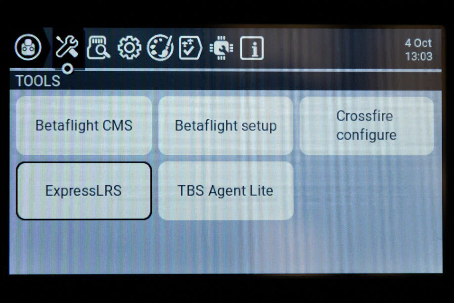

Now that you have flashed your TX it is time to learn how to use the ELRS lua script!

*If you flashed via WiFi or were on a version previous to 2.x you need a different version of the lua than you already installed.*

## Installing the Lua Script

Download the [ELRSv2 Lua Script](https://github.com/ExpressLRS/ExpressLRS/tree/master/src/lua) for your specific radio type onto the radio's SD Card in the `Scripts/Tools` folder and Long Press the "SYS" button (for T16 or similar Radios) or the "Menu" button (for Taranis X9D or similar Radios) to access the Tools Menu where you can find ELRS script ready to run with only one click.

Which version?

* if your handset has the black and white display and your handset is NOT an X9D or X9D+, use: **black_and_white_display_128x64**

* if your handset is the X9D or X9D+, use: **x9d_212x64**

* if your handset has the colored screen display, use: **color_display_480x272**

Here's how it looks in the Tools menu (X9D+ and T16 Shown):

## Check your TX is Connected

Enter the Lua script by selecting "ExpressLRS" in the Tools menu and pressing ENTER.

If the parameter list does not populate after a few seconds, first verify the ExpressLRS module has power by checking its LED. If there is no power, it is possible the Protocol set for the External Module is incorrect or that the module is not properly connected to the pins of the JR bay of the radio. The latter could mean that the module's PCB has gotten loose, common with the first batches of the ES24TX modules from HappyModel.

If parameters do show up, but the Bad/Good section on the right side of the header is showing an unstable value, have a look at your model settings and make sure the Internal RF module is set to Off. If the Bad/Good indciates something other than `0/your packet rate` this means `CRSFshot` is not working-- verify that you properly followed the [Radio Preparation](./../tx-prep) Guide.

The `simplify-serial-out   0519fd` from the photo above is the git commit hash of the firmware version that the module has. You can reference this hash from [Releases](https://github.com/ExpressLRS/ExpressLRS/releases).

## Understanding and Using the Lua Script
Now, we can explore the complexities of the lua script, and how to interpret each of its many sections. ExpressLRS supports multiple configuration profiles, and the configuration profile is selected by setting the "Receiver" property in handset Model Setup -> External Module -> Receiver (number).

### Packet Rate and Telemetry Ratio

These are shown as `Packet Rate` and `Telem Ratio` in the lua script, which allow you to change your performance parameters. 

* `Packet Rate` sets how fast data packets are sent, higher rates send packets more frequently and have lower latency, but have reduced range. The options for Team2.4 are: `50, 150, 250 & 500` Hz and the options for Team900 are `25, 50, 100 & 200` Hz. The number following the rate in parentheses (e.g. -105dBm for 500Hz) is the Sensitivity Limit for the rate, the lowest RSSI where packets will still be received. See [Signal Health](../../info/signal-health) for more information about the sensitivity limit.

* `Telem Ratio` sets the telemetry ratio, how much of the packet rate is used to send telemetry. The options, in order of increasing telemetry rate, are: `Off, 1:128, 1:64, 1:32, 1:16, 1:8, 1:4, 1:2`. A Telem Ratio of 1:64 means one out of every 64 packets are used for telemetry data. For information on telemetry setup, see [First Flight: Telemetry](./../pre-1stflight/#telemetry) and [Telemetry Bandwidth](../../info/telem-bandwidth/).

### Switch Mode

The Switch Mode setting controls how channels AUX1-AUX8 are sent to the receiver (the 4 main channels are always 10-bit). The options are `Hybrid & Wide`. Hybrid mode is 6x 2/3/6-position + 1x 16-position, and Wide is 7x 64 or 128-position. For detail about the differences, see the [Switch Configs](../../software/switch-config/) documentation.

### Model Match

Model Match is used to prevent accidentally connecting to multiple recievers at the same time, or using selecting the wrong model in the handset. For more information on configuring this check out [this page](../../software/model-config-match/).

### TX Power
 
 

TX Power is a folder, press ENTER to enter the TX Power settings and use RTN/EXIT to exit the folder.

* `Max Power` sets the maxumum power level your TX will transmit at. Selecting a power level higher or lower than your TX supports will revert to the closest supported level. The options are `10, 25, 50, 100, 250, 500, 1000 & 2000` mW. If Dynamic Power is set to `Off` this is the power level your TX always uses. 

* `Dynamic` enables the Dynamic Power feature. `Off` means that the TX will transmit at Max Power at all times. `On` means the TX will dynamically _lower_ power to save energy when maximum power is not needed. The options `AUX9, AUX10, AUX11, AUX12` indicate that the TX can be changed from max power to dynamic power by changing the position of a switch. where switch HIGH (>1500us) = dynamic power, switch LOW (<1500us) = max power. For more information, [Dynamic Transmit Power](../../software/dynamic-transmit-power) provides a deeper dive on the algorithm and usage.

### VTX Administrator

VTX Administrator allows you to change your VTX settings directly from your radio, and have those VTX settings be applied to any receiver you connect to. The VTX settings are sent every time a new connection is acquired, or when `[Send VTX]` is pressed. **VTX Administrator will only send data when disarmed**

* `Band` sets the VTX band, the options are `Off, A, B, E, F, R & L`, the standard analog FPV bands. `Off` means that VTX Administrator will not adjust any VTX settings.

* `Channel` sets the VTX channel, the options are `1, 2, 3, 4, 5, 6, 7 & 8` which are the standard channels in the above bands.

* `Pwr Lvl` sets the VTX power by index, the options are `-, 1, 2, 3, 4, 5, 6, 7, & 8` which are the power levels that your VTX can do. Refer to your VTX table settings on the flight controller for the exact power levels. For example a VTX may have 1 = 25mW, 2 = 100mwW, 3 = 200mW, 4 = 500mW.

* `Pitmode` the options are `On & Off` which allow you to quickly switch into or out of pitmode

* Finally pressing the `[Send VTX]` button sends the configured settings to the receiver and on to the VTX. These settings are also sent every time a connection is established.

### Bind

Pressing the `[Bind]` button activates binding mode for traditional binding. This does nothing for users who have configured a bind phrase and is not needed. For more information check out this page on [binding](./../binding).

### Wifi Update (ESP32 TXes Only)

Pressing the `[Wifi Update]` selection activates Wifi Update mode ESP32 TXes. Visit [this page](../../software/updating/wifi-updating) for instructions on how the updating process works. Reboot or change models to exit this mode.

### BLE Joystick (ESP32 TXes Only)

Pressing the `[BLE Joystick]` selection activates BluetoothLE Joystick mode which allows connection to simulators through the bluetooth of your computer. Reboot or change models to exit this mode.