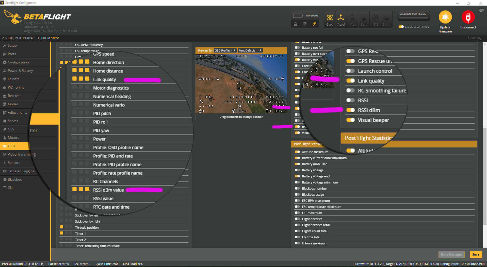

Prior to your first ExpressLRS flight, you may want to do a few tweaks to your setup to ensure a fun and trouble-free ExpressLRS experience!

## Modes

By default, ExpressLRS uses limited bits for AUX switches (1-bit for AUX1, and 3-4 bits for other AUX channels), which results in very coarse resolutions up to 8 or 16 positions to Betaflight/INAV on the AUX channels. In most cases, it is enough (especially on a multirotor), but if you need finer resolution, enabling the **Wide** Switch Mode option expands the resolution of AUX2-AUX8 up to 128 positions. For more information, read the [switch modes page](../software/switch-config.md).

One important thing to keep in mind is that Aux1 should be used as your Arming switch, with LOW (~1000us) as `disarmed` and HIGH (~2000us) as `armed`. AUX1 is the low-latency switch, sent with every packet, and only supports on/off (2-position) operation. ExpressLRS uses AUX1 to determine if your model is armed and this is the most reliable way to be able to tell your model to disarm. If your arm switch is in another aux channel, it may be several packets before that switch is transmitted, and there's no guarantee that the Receiver will receive that packet.

!!! warning "WARNING" 
    Please make sure your **ARM mode is on the AUX1 channel, and the armed state is set ~2000.**

<figure markdown>

</figure>

## RSSI and Link Quality

To get RSSI and Link Quality displayed in the OSD set RSSI Channel to "Disabled" in the Receiver tab of the Betaflight/iNav Configurator, and RSSI_ADC should be disabled on the Configuration tab. Both of these are the default. On the OSD menu, use the **Link Quality** and **RSSI dBm value** elements (not "RSSI Value"). iNav has put this in the `CRSF RX Statistics` section.

<figure markdown>

</figure>

If you wish to enable the RSSI dBm warning, you'll have to change the alarm level using `set osd_rssi_dbm_alarm = -100` in CLI. A sensible value is 5-10 higher than the sensitivity shown in the ELRS.lua for the packet rate (e.g. 250Hz=-108, so -103 to -98 for the alarm).

If using DJI Goggles, you're required to use "RSSI Value" as the OSD element. Therefore you have to decide between LQ or RSSI, by selecting either AUX11 (LQ) or AUX12 (RSSI) as RSSI Channel on the Receiver tab.

More information about signal metrics is found in this great [article on signal health](../info/signal-health.md).

## Bench Test

<figure markdown>

<figcaption>ExpressLRS Bench Test</figcaption>
</figure>

Shown above is a Bench Test to determine if you're getting a good signal from your radio. This aims to provide you with information on whether you should check your antennas (particularly the R9's Super 8) or if you have good hardware overall. 

- Set your ExpressLRS module to the lowest power level using the Lua script. The packet rate doesn't matter much here.
- Put your radio 1m (3ft) from your receiver and power it up. Make sure the receiver and TX module antennas are oriented in the same way. (You might want to disconnect your vtx/air unit temporarily, put vtx on pit mode or have a fan blowing on it).
- Using your OSD or the Telemetry Page of your radio, take note of the RSSI dBm or the 1RSS telemetry data.

On the 900Mhz hardware, a -20dBm or thereabouts is a good indication your hardware is in working order. On the 2.4 GHz hardware, around -40dBm up to -25dBm should be good. If you're getting lower numbers than these (closer to 0 is higher and better), here are a few things you could check:

- The ExpressLRS module antenna could be loose. On some 3D printed module cases, the print may be too thick at the part where the pigtail's RP-SMA/SMA end would be attached; if so, tighten the nut on the RP-SMA/SMA to give the antenna some more space to get tightened up.
- The antenna pigtail may be damaged or not connected properly to the module's mainboard.
- On receivers using SMD antennas, expect lower values than those equipped with wire antennas. If the receiver with the SMD antenna has heat shrink, enclosed in a whoop canopy, surrounded with carbon parts or buried inside a plane/fixed wing, expect some more attenuation of the signal.
- The Super 8 antenna from Frsky, which most of the R9Ms came with is notorious for being faulty or would degrade from just a few weeks of use. Replace it or as a temporary fix, solder all around the junction where the coax shielding and the RP-SMA meet. Another failure point is the connection of the coax to the active elements itself. It would seem okay, but due to the twisting of the antenna, the connection could be severed.

<figure markdown>

</figure>

<figure markdown>

<figcaption>Super8 Antenna's common points of failure</figcaption>
</figure>

- Check if there aren't any missing components in your receivers, like the RF filter (can be found near the antenna or ufl). Also check if the SMD antenna is not broken or damaged and it's soldered in properly.

<figure markdown>

</figure>

- Most DIY modules require moving the 0-ohm resistor on the E28 from the PCB antenna side towards the UFL side. A solder bridge will work just fine as well, but make sure it is on the correct pads.
- Swap out antennas on the receiver and/or the TX module; Most ExpressLRS receiver antennas use IPEX 1/UFL connectors and as long as the frequency tuning of the antenna is appropriate for the frequency you're in, it should work. You can also use old 2.4GHz WiFi Router antennas for your 2.4GHz modules, but avoid those that are dual-band. Also, make sure that the connector on the antenna is the appropriate one (RP-SMA on R9 modules; SMA on most off-the-shelf ExpressLRS modules)

## Blackbox

Blackbox is handy for evaluating the performance of the RF link for a flight. Set your BB to debug mode `RC_SMOOTHING_RATE`, which will capture the rate that Betaflight is receiving RC Packets from the RX.

## Telemetry

The RX transmits a subset of telemetry it receives from the flight controller. Disabling certain messages only works if the flight controller firmware does support it. For Betaflight this is possible with the telemetry_disabled_* CLI settings:

```
# Disable Attitude telemetry item
set telemetry_disabled_pitch = ON
set telemetry_disabled_roll = ON
set telemetry_disabled_heading = ON
# Disable Battery telemetry item
set telemetry_disabled_voltage = ON
set telemetry_disabled_current = ON
set telemetry_disabled_fuel = ON
# Disable GPS telemetry item
set telemetry_disabled_altitude = ON
set telemetry_disabled_lat_long = ON
set telemetry_disabled_ground_speed = ON
set telemetry_disabled_heading = ON
# Disable Flight Mode telemetry item (BF >4.2.9)
set telemetry_disabled_mode = ON 
```

Since telemetry messages are sent with low priority it may take some time to transmit the data. The telemetry rate in the Lua settings script controls how often a telemetry message should be sent. So a ratio of 1:2 means that every second message is a telemetry message, so the telemetry data is transferred very fast. A ratio of 1:64 means that only one of 64 messages is a telemetry message and so the transfer happens much slower.

The refresh rate also impacts the transfer speed. 50 Hz is slower compared to 200 Hz. So if you need fast a fast telemetry update rate choose a high refresh rate, and a ratio that favors telemetry messages e.g. 200 Hz and 1:16 usually works well. For detailed information on telemetry bandwidth at different rates and ratios, see [this page on telemetry bandwidth](../info/telem-bandwidth.md).

To finish the telemetry setup open the telemetry page on your transmitter and select "Discover new sensors" and wait for the list to fill. 

!!! hint "* Indication"
    Notice, that there is a * sign for each row. This star indicates that this telemetry sensor was just updated.  

!!! hint "[ ] Indication"
    If you see a row that does not change, and the name of the row is in square brackets it means that this sensor was not updated for some time.

The first values (including RSSI and link quality) should always be updated (flashing stars). If this does not happen multiple times per second the transmitter will issue a "telemetry warning". To prevent this warning use the setting TLM_REPORT_INTERVAL_MS.

It should look like this (and if it does not there is something wrong with your setup):

<figure markdown>

</figure>

The remaining values are updated at a different rate (depending on refresh rate and tlm ratio). So if you use 50 Hz and 1:64 it will happen slowly, and the update takes multiple seconds for each sensor:

<figure markdown>

</figure>

If you use 200Hz and 1:2 tlm ratio the stars will not even blink because the update happens so fast:

<figure markdown>

</figure>

## MSP

To configure betaflight from your transmitter it's possible to use the betaflight lua scripts. 
This requires the telemetry feature enabled for the RX+TX. If the telemetry page of OpenTx does not show regular updates for all sensors the LUA script will also not work.

To get a responsive UI configure ExpressLRS for fast data transfer so make sure to use something like `200Hz/500Hz` with `1:2` tlm and a serial baud rate of `400000`. Currently, MSP is limited to `50Hz` on `115200` Baud and does not work with a `500`` Hz` refresh rate. The initial VTX tables download does take some time - but is cached after that. 

If you get a "retrying" message while saving changes it means that the Lua script did not receive a response fast enough. But the change usually still goes through so try reloading the page to check if the change was saved. With the recommended settings this does not happen but with slower settings, it could happen.

## MAVLINK

See [Airport](../software/airport.md).

**Done. Go Fly!**
