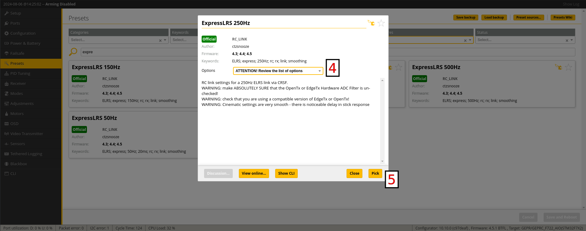
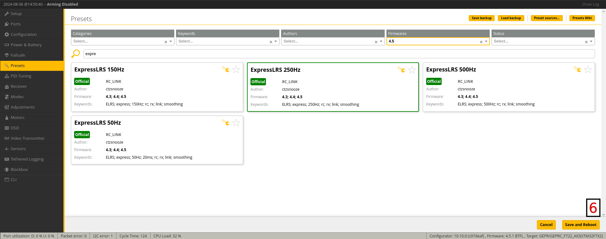

## Serial RX Setup

Once you've [wired up](wiring-up.md) your Receiver to your Flight Controller, you need to setup the UART for Serial RX. This is usually done on the Ports Tab of your Flight Controller Configurator.

In the example below, the Receiver is wired to UART1 (TX1 and RX1 pads), and so the Serial RX column should be enabled on UART1 in the Ports Tab.

!!! note "NOTE"
    This is ONLY an example. Set your Ports according to how your peripherals, including the Receiver, are [wired up](wiring-up.md).

<figure markdown>

<figcaption>Example Betaflight Serial RX Configuration</figcaption>
</figure>

<figure markdown>

<figcaption>Example INAV Serial RX Configuration</figcaption>
</figure>

## Serial Receiver Protocol

UART-based ExpressLRS Receivers use the CRSF Serial Protocol to communicate with a Flight Controller.

Follow the steps below to set up your Serial Receiver Protocol:

1. Navigate to ++"Receiver"++ Tab on your Flight Controller Configurator.

2. Set `Receiver Mode` or `Receiver Type` to {==Serial==}.

3. Set `Serial Receiver Provider` to {==CRSF==}.

4. Set `Telemetry` to {==Enabled==}.
    - On INAV, `Telemetry` can be found under the ++"Configuration"++ Tab.

5. Make sure you set `RSSI Channel` to {==Disabled==} if you are using an Analog FPV System, or any FPV System with MSP DisplayPort or "Canvas Mode" support.
    - Also make sure `RSSI ADC` is {==Disabled==}.

!!! Note
    The Location or Labels of these settings can change from version to version of your Flight Controller Configurator. Please consult your Flight Controller Configurator User Guides.

<figure markdown>

</figure>

<figure markdown>

</figure>

<figure markdown>

</figure>

## Software Inversion and Duplex Modes

The CRSF Protocol requires a full UART pair, uninverted and in full-duplex mode. To check for these settings, use the ++"CLI"++ Tab of your Flight Controller Configurator and execute `get serialrx`.

- `serialrx_inverted` should be **OFF**; configure it with `set serialrx_inverted = off`.
- `serialrx_halfduplex` should be **OFF**; configure it with `set serialrx_halfduplex = off`.
- Don't forget to use `save` once you're done setting these up.

## RC Link Preset (BETAFLIGHT ONLY)
For flight controllers based on Betaflight, there are 'RC Link Presets' available that configure feedforward smoothing and associated link settings based on your packet rate and usage case.

!!! Warning
    Using no link preset, or using the incorrect one for your packet rate, can result in unwanted noise and jitter in feedforward, which can affect setpoint tracking and thus flight characteristics.

To install the correct 'RC Link Preset', follow these steps in **Betaflight Configurator**:

1. Select the **Preset** tab
1. In the preset tab, select **Save Backup** and save a backup to a safe location before applying any preset.
1. Search for 'ExpressLRS' and select the Link Preset that matches your [Packet Rate](../transmitters/lua-howto.md#packet-rate-and-telemetry-ratio). If no direct match is available, choose the closest preset below your packet rate.

    

1. Read through the options by selecting the dropdown list. NOTE: These are all optional, if none of them apply to your circumstances, it is OK to leave everything unticked.

1. Select 'Pick' to stage the preset:

    
    
1. Select **Save and Reboot** to apply the preset:

    

!!! important
    Close your Flight Controller Configurator once you've set it up for ExpressLRS. Keeping it open could prevent the next steps from completing properly, particularly flashing via Passthrough. You must also unplug the FC from USB before proceeding to the next steps to refresh the connection.

With your Flight Controller configured, you can now proceed to the next step: [Checking RX Firmware Version](./firmware-version.md).