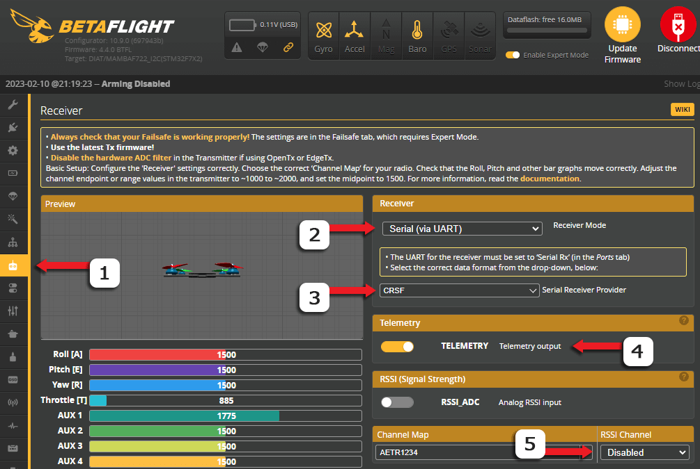

## Serial RX Setup

Once you've [wired up](wiring-up.md) your Receiver to your Flight Controller, you need to setup the UART for Serial RX. This is usually done on the Ports Tab of your Flight Controller Configurator.

In the example below, the Receiver is wired to UART1 (Tx1 and Rx1 pads), and so the Serial RX column should be enabled on UART1 in the Ports Tab.

!!! note "NOTE"
    This is ONLY an example. Set your Ports according to how your peripherals, including the Receiver, are [wired up](wiring-up.md).

<figure markdown>

<figcaption>Example Betaflight Serial RX Configuration</figcaption>
</figure>

<figure markdown>

<figcaption>Example INAV Serial RX Configuration</figcaption>
</figure>

## Serial Receiver Protocol

UART-based ExpressLRS Receivers use the CRSF Serial Protocol to communicate with a Flight Controller.

Follow the steps below to set up your Serial Receiver Protocol:

1. Navigate to ++"Receiver"++ Tab on your Flight Controller Configurator.

2. Set `Receiver Mode` or `Receiver Type` to {==Serial==}.

3. Set `Serial Receiver Provider` to {==CRSF==}.

4. Set `Telemetry` to {==Enabled==}.
    - On INAV, `Telemetry` can be found under the ++"Configuration"++ Tab.

5. Make sure you set `RSSI Channel` to {==Disabled==} if you are using an Analog FPV System.
    - Also make sure `RSSI ADC` is {==Disabled==}.

!!! Note
    The Location or Labels of these settings can change from version to version of your Flight Controller Configurator. Please consult your Flight Controller Configurator User Guides.

<figure markdown>

</figure>

<figure markdown>

</figure>

<figure markdown>

</figure>

### Ardupilot

TODO: copied from https://ardupilot.org/plane/docs/common-holybro-pix32v6.html#rc-input, redact
To allow CRSF and embedded telemetry a full UART, such as SERIAL6 (UART3) would need to be used for receiver connections.
Any UART can be used for RC system connections in ArduPilot also, and is compatible with all protocols except PPM. See Radio Control Systems for details.

### PX4 Autopilot

TODO: copied from https://discuss.px4.io/t/connecting-elrs-receiver-to-pixhawk-2-4-8-under-px4-pro-possible-or-not-need-guidance/31199/3?u=not7cd
The setup is more involved as it requires firmware compilation. Use `boardconfig`, go to `drivers/rc_inputs`, and enable `crsf_rc`. Compile and upload the firmware to the FC.
After that, you need to set RC_CRSF_PRT_CFG parameter to the serial that you’re using. 

## Software Inversion and Duplex Modes

The CRSF Protocol requires a full UART pair, uninverted and in full-duplex mode. To check for these settings, use the ++"CLI"++ Tab of your Flight Controller Configurator and execute `get serialrx`.

- `serialrx_inverted` should be **OFF**; configure it with `set serialrx_inverted = off`.
- `serialrx_halfduplex` should be **OFF**; configure it with `set serialrx_halfduplex = off`.
- Don't forget to use `save` once you're done setting these up.

!!! important
    Close your Flight Controller Configurator once you've set it up for ExpressLRS. Keeping it open could prevent the next steps from completing properly, particularly flashing via Passthrough. You must also unplug the FC from USB before proceeding to the next steps to refresh the connection.

With your Flight Controller configured, you can now proceed to the next step: [Checking RX Firmware Version](../receivers/firmware-version.md).
