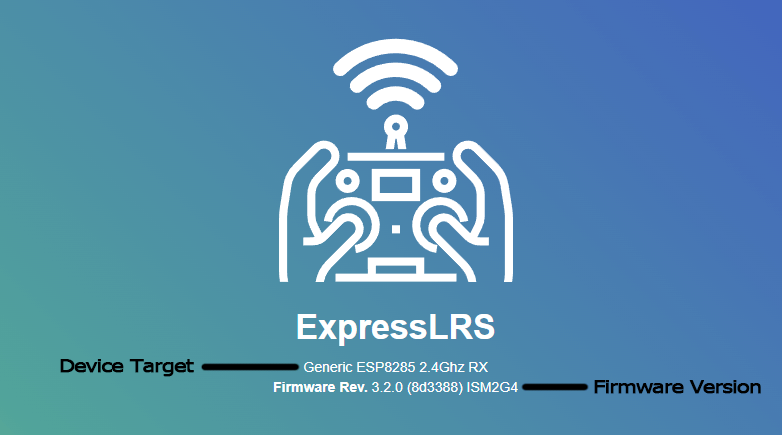
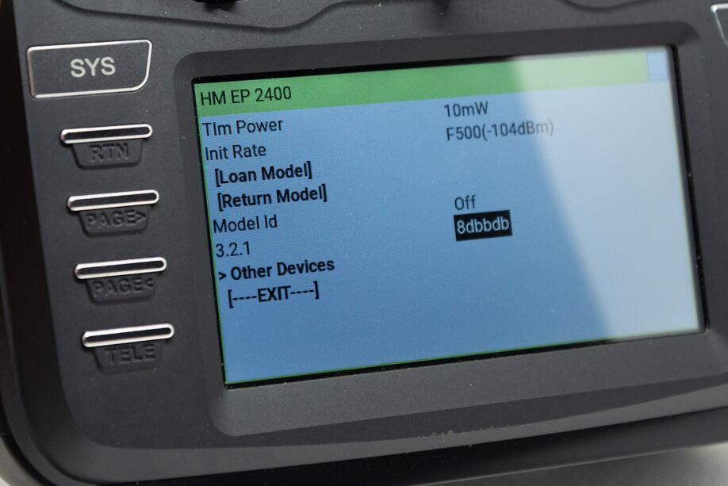
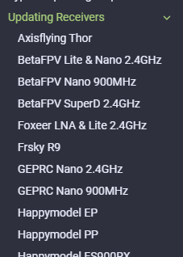

## Why do you have to know the Firmware Version?

Knowing the ExpressLRS Firmware Version that's currently in your devices will determine whether there is a need to update to a newer version or whether you can simply get your devices bound together without updating. For newcomers in the hobby, or for those just starting with ExpressLRS, it can be a bit daunting to flash a new device. 

It is still recommended that you update your gear to the latest firmware version to ensure you have all the bugfixes and latest features.

## Receiver Firmware Version

=== "via Web UI"

    1. Put your Receiver into WiFi mode.

        === "using Auto WiFi mode"

            1. Power up your Receiver. 
                            
                - If you will have to plug in LiPo to power up your Receiver:

                    - make sure you've already checked the wiring from the previous step.
                    - make sure you have some airflow blowing over your Video Transmitter (VTX). You can also temporarily unplug it from the Flight Controller.

                - If it's already powered and connected or in sync with a TX Module, power Off the Radio & TX Module first then power-cycle (Turn Off, then Turn back On) the Receiver.

            2. Let it be for at least 60s and the LED will turn into either a Rapid Blinking pattern or a Green Breathing LED pattern(for Receivers using an RGB LED) indicating it is now in WiFi Mode.

                - The Auto WiFi On Interval setting controls how long the device will wait to initiate WiFi Mode when it's powered up and it's not getting valid CRSF packets.

                <figure markdown>
                
                </figure>

        === "using the ExpressLRS Lua Script" 

            !!! Note
                This method only works if your Receiver is already in sync and bound with your TX Module.

            1. Press the ++"SYS"++ Key on your Radio.
                - Older Radios or those with only one Menu Key will need to long-press the ++context-menu++ Key to access the System Menu.
                - Consult your Radio User's Manual on how to access the System Menu.
            2. You are now in the Tools Menu where Lua Scripts can be found. Scroll down and select `ExpressLRS` Lua Script.
                - If the script is nowhere to be found, download it from [this page](../transmitters/lua-howto.md) and save it into your Radio SD Card Scripts/Tools/ folder.
            3. Press ++enter++ to Load it.
            
                <figure markdown >
                ![Lua Running]
                </figure> 

                - If the script is stuck on a "Loading..." screen, go back to the [Radio Preparation](../transmitters/tx-prep.md) Page and make sure you have configured your radio properly for ExpressLRS use.
            4. Scroll down and select `Wifi Connectivity` and press ++enter++.
            5. Select `Enable RX WiFi` and press ++enter++.
            
                <figure markdown>
                ![Lua WiFi]
                </figure>
            
            6. The Receiver LED will turn into either a Rapid Blinking pattern or a Green Breathing LED pattern(for Receivers using an RGB LED) indicating it is now in WiFi Mode.

                <figure markdown>
                
                </figure>

    2. Scan for the `ExpressLRS RX` Access Point. 
        ![WiFi Hotspot]{ align=right }

        - If your Receiver is previously flashed with your Home WiFi SSID and Password, and it is able to connect to that WiFi Network, then the Access Point will not show up.
        - `expresslrs` is the Password for this Access Point.

        ??? question "Where's the Access Point?"
            If you cannot find the Access Point, make sure the device you're using is capable of connecting to 2.4GHz WiFi Networks. Also, try putting the devices closer together.
                
            If you still cannot find the Access Point, chances are that you have set it with your WiFi SSID and Password before, and it has connected to your WiFi Network.

         

    3. Load the Web UI on your browser using these addresses:
        - http://10.0.0.1/ -If you have connected to the `ExpressLRS RX` Access Point
            
            !!! Note
                This IP address is also often used by some routers. Computers with an ethernet connection to their routers will find that this page doesn't load the ExpressLRS Web UI and instead loads their router or ISP modem configuration dashboards.

                We recommend disconnecting from the network first or trying a different device instead, e.g. smartphone or tablet.
        
        - http://elrs_rx.local - If you have previously set your Home WiFi SSID and Password into your Receiver when you flashed it.

            !!! Note
                If your browser cannot resolve this address, chances are MDNS is not set up and working on your computer or network.

            ??? tip "Use the IP Address instead!"
                === "The `arp` Command"

                    1. Open up a Command Prompt window on your computer.
                    2. Execute the command `arp -a` which will list all the devices in the Network.
                    3. Try each of the IP Addresses marked as `Dynamic` as a URL in your Browser until you get to the ExpressLRS Web UI.

                === "Router DHCP List"
                    1. Log in to your Router dashboard.
                    2. Check the DHCP List and look for the "elrs" device.
                    3. Take note of the IP Address given by your router.
                    4. Use this IP address in your Browser as the URL.

    4. The Banner of the Web UI should tell you the firmware version flashed into your Receiver.

        <figure markdown>
        
        <figcaption>The ExpressLRS Web UI Banner </figcaption>
        </figure>

=== "via Lua Script"

    !!! Note
        This method only works if your Receiver is already in sync and bound with your TX Module.

    1. Press the ++"SYS"++ Key on your Radio.

        - Older Radios or those with only one Menu Key will need to long-press the ++context-menu++ Key to access the System Menu.
        - Consult your Radio User's Manual on how to access the System Menu.

    2. You are now in the Tools Menu where Lua Scripts can be found. Scroll down and select `ExpressLRS` Lua Script.

        - If the script is nowhere to be found, download it from [this page](../transmitters/lua-howto.md) and save it into your Radio SD Card Scripts/Tools/ folder.

    3. Press ++enter++ Key to activate the Script.

        <figure markdown >
        ![Lua Running]
        </figure> 

        - If the script is stuck on a "Loading..." screen, go back to the [Radio Preparation](../transmitters/tx-prep.md) Page and make sure you have configured your radio properly for ExpressLRS use.

    4. Scroll to the bottom of the page and select `Other Devices`.

    5. Press the ++enter++ Key to open the Folder.

    6. Select the Receiver Device and Press ++enter++ to query its parameters.

    7. The image below shows the Receiver Firmware Version info.
        - Shows the Happymodel EP Receiver has 3.2.1 Firmware Version with the Git Hash 8dbbdb.

        <figure markdown>
        
        <figcaption>Receiver Version Line on Colored Screen Radio</figcaption>
        </figure>

Once you have determined the firmware version that's currently flashed into your Receiver, you can now decide to whether keep using it as is or update to the latest version.

!!! Info "Versioning Scheme"
    The ExpressLRS Firmware Versioning scheme is based on the [semantic versioning scheme](https://semver.org/).

    A Version is defined or formatted as "Major.Minor.Patch"

        - major = major new feature and/or incompatible changes
        - minor = minor features or enhancements and/or new targets
        - patch = bug-fixes
    
    That first number in the Version string should match between a TX Module and a Receiver.
    Examples:

    - a Receiver with version string of 3.1.2 will sync and work with a TX Module with firmware version 3.0.1
    - a Receiver with version string of 3.2.0 will NOT sync or bind with a TX Module with firmware version 2.4.0

For the latest ExpressLRS firmware version, check the [Releases page in Git Hub](https://github.com/ExpressLRS/ExpressLRS/releases)

## I Know the Version. What Now?

=== "I have an old version"

    See the [next page](../receivers/updating.md) for the typical updating procedure or expand the `Updating Receivers` section of the Menu on the left shown below.

    <figure markdown>
    
    </figure>

    You can also use the Search Bar on top of this page to search for the specific Updating/Flashing Guide for your Receiver.

=== "I have a recent one"

    See the [Binding Procedure](../binding.md) to sync your Receiver with your TX Module.

[Lua Running]: ../../assets/images/lua/config-bw.png
[Lua WiFi]: ../../assets/images/lua/wifi-bw.png
[WiFi Hotspot]: ../../assets/images/WifiHotspot.png
