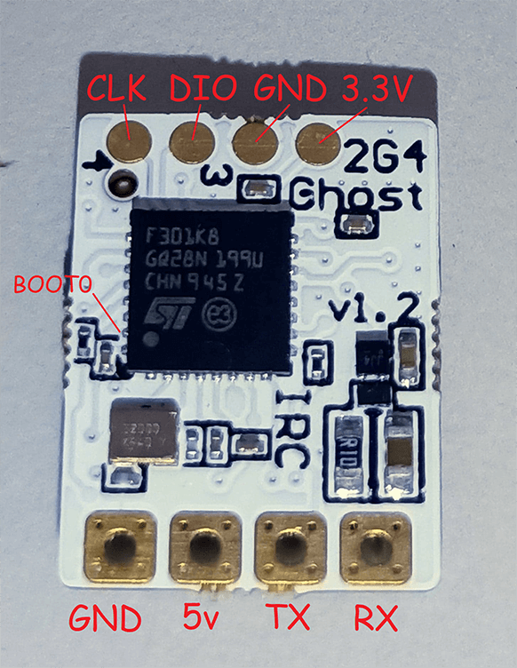

## Flashing/Updating your Receiver Firmware 

=== "via STLink"

    !!! note "Note"
        The only way to flash the Ghost Atto/Zepto to ExpressLRS for the first time is using STLink. This is a one-way process, there is no returning to the stock firmware after flashing.

    <figure markdown>
    
    </figure>

    1. Disconnect the Receiver from your Flight Controller.

    2. Wire up the Receiver into an STLink V2 dongle. Find the CLK, DIO,RST, 3v3 and Gnd pads and wire them straight up.

        <figure markdown>
        
        <figcaption>IMRC Ghost</figcaption>
        </figure>

    3. Launch the [ExpressLRS Configurator](../installing-configurator.md) on your Computer.
        ![Configurator Release]{ align=right }

        - Make sure Official Releases is active from the horizontal tab.
        - Make sure you have selected the Released version you want to flash into your Receiver.

         
    4. Select the Device Category and Device target matching your hardware.

        - Device Category: `ImmersionRC Ghost`

        - Device: `GHOST ATTO 2400 RX`

    5. Set the Flashing Method to `STLink`

        <figure markdown>
        
        </figure>

    6. Set the [firmware options] for your device.
        - Regulatory Domain (Mandatory. Choose the domain appropriate for the location or country you're flying).
        - Binding Phrase (Optional, but Highly Recommended. Take note of this phrase as this should be the same on your other devices or they will not bind or sync).

    7. Click the ++"Build & Flash"++ button.

        <figure markdown>
        ![Build & Flash]
        </figure>
          
    8. Wait for the process to finish. A Green Success bar will show up in the ExpressLRS Configurator.

    9. The LED on the Receiver should return to Slow Blinking LED after a few seconds.

        <figure markdonw>
        
        </figure> 

    10. Rewire your receiver to your Flight Controller.

=== "via Passthrough"

    !!! note "Note"
        This method can only be used to UPDATE the ExpressLRS firmware on a Ghost Atto/Zepto.

    <figure markdown>
    
    </figure>

    1. Make sure you have done your [Receiver Wiring] properly and that your Flight Controller is [Configured]. Also make sure [bootloaders] are already flashed to your R9 receiver when applicable.

        !!! Warning "Important Step!"
            This is an important step and guarantees updating success. If you haven't done these, GO BACK to those pages.

        - Disconnect and close Betaflight Configurator or INAV Configurator.
        - Power-cycle the Flight Controller.
            - If you plugged in LiPo, unplug it.
            - Unplug-replug the USB Cable from your Flight Controller or Computer.
            - If you will have to plug in LiPo to power up your Receiver, make sure you have some airflow blowing over your Video Transmitter (VTX). You can also temporarily unplug it from the Flight Controller.

    2. Launch the [ExpressLRS Configurator](../installing-configurator.md) on your Computer.
        ![Configurator Release]{ align=right }

        - Make sure Official Releases is active from the horizontal tab.
        - Make sure you have selected the Released version you want to flash into your Receiver.

         
    3. Select the Device Category and Device target matching your hardware.

        - Device Category: `ImmersionRC Ghost`

        - Device: `GHOST ATTO 2400 RX`

    4. Set the Flashing Method to `BetaflightPassthrough`

        <figure markdown>
        
        </figure>

    5. Set the [firmware options] for your device.
        - Regulatory Domain (Mandatory. Choose the domain appropriate for the location or country you're flying).
        - Binding Phrase (Optional, but Highly Recommended. Take note of this phrase as this should be the same on your other devices or they will not bind or sync).

    6. Click the ++"Build & Flash"++ button.

        <figure markdown>
        ![Build & Flash]
        </figure>
    
    7. Wait for the `Retry...` lines to appear in the Build Log. Connect the LiPo to power up the Receiver if it only powers up with a LiPo connected.

        - `Retry...` lines will not show up if your receiver is already in bootloader mode and gets powered up by USB.
        
    8. Wait for the process to finish. A Green Success bar will show up in the ExpressLRS Configurator.

    9. The LED on the Receiver should return to Slow Blinking LED after a few seconds.

        <figure markdonw>
        
        </figure> 

[Configurator Release]: ../../assets/images/ConfiguratorRelease.png
[Build & Flash]: ../../assets/images/BuildFlash.png
[Build]: ../../assets/images/Build.png
[Receiver Wiring]: ../receivers/wiring-up.md
[Configured]: ../receivers/configuring-fc.md
[firmware options]: ../firmware-options.md
[Receiver Wiring]: ../wiring-up/#connecting-a-receiver