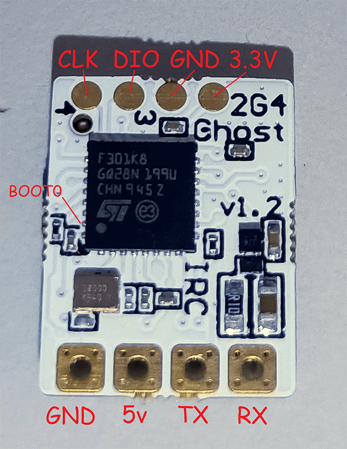

## Flashing via STLink (Ghost Atto/Zepto RX's)

- Target: `GHOST_ATTO_2400_RX_via_STLINK`

- Device Category: `ImmersionRC Ghost`

- Device: `GHOST ATTO 2400 RX`

<figure markdown>

<figcaption>Flashing via STLink</figcaption>
</figure>

Flashing the Ghost RX's is currently a **1 WAY** flash. Once you flash ExpressLRS to these RX's you will not be able to use them with Ghost TX.  You will need a `StLink V2` to flash the RX's.

<figure markdown>

<figcaption>IMRC Ghost</figcaption>
</figure>

Connect your STLink into `GND`, `DIO`, `CLK`, `3.3V` of the receiver. Select the `GHOST_ATTO_2400_via_STLINK` target, set your [Firmware Options] and hit **Build & Flash** on the ExpressLRS Configurator.

<figure markdown>
![Build & Flash]
</figure>

Once done, wire your receiver to your Flight Controller as normal (i.e. Rx to Tx, and Tx to Rx).

## Updating via Passthrough

- Target: `GHOST_ATTO_2400_RX_via_BetaflightPassthrough`

- Device Category: `ImmersionRC Ghost`

- Device: `GHOST ATTO 2400 RX`

<figure markdown>

<figcaption>Updating via Passthrough</figcaption>
</figure>

After flashing via STLink, the `GHOST_ATTO_2400_RX_via_BetaflightPassthrough` target may now be used for future firmware updates.
Select the target and set your [Firmware Options] and once done, click on **Build and Flash**.

<figure markdown>
![Build & Flash]
</figure>

[Build & Flash]: ../../assets/images/BuildFlash.png
[Firmware Options]: ../firmware-options.md