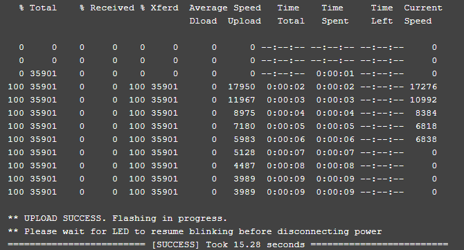

## Wiring up your receiver

!!! attention "Note"
    There are Flight Controllers that will pull the RX pads `LOW` which will put the ESP-based receivers into `Bootloader Mode` unintentionally. A solid LED light on these receivers even with the TX module off is a sign they are in Bootloader Mode. If this is the case, rewire the receiver to a different UART.

<figure markdown>

<figcaption>HGLRC Hermes 2.4GHz</figcaption>
</figure>

The image above show the receiver pinouts and their connections. As we're dealing with UART connection, Rx on receiver goes to a TX pad in the FC, and Tx on Receiver goes to an uninverted Rx pad on the FC. It also shows where the Boot pads are.

There are Flight Controllers that put their Receiver UART's RX pads Low, which in turn, puts the ESP-based (e.g. EP1 and EP2) receivers to Bootloader mode unintentionally. One remedy is to wire them into a different UART, or wire a pull-up resistor (300-1k ohm) between the Rx pad of the FC and a 3.3v or 5v pad, as shown below.

<figure markdown>

<figcaption>Wiring up receiver</figcaption>
</figure>

## Configuring your Flight Controller

To configure your flight controller properly, please go through [Configure FC page](configuring-fc.md). These settings apply on INAV, Betaflight and other flight controller software.

Ports Tab should be setup so that Serial RX is on the UART where you have soldered the receiver.

Receiver protocol is `CRSF` with `serialrx_inverted = off` and `serialrx_halfduplex = off`.

The next step will not be able to proceed properly and you'll have issues later if any of these are set differently. Once you have configured your Flight Controller software, close its Configurator and unplug-replug the USB cable from the FC or your computer. This will refresh the connection and you'll be ensured that the port is not busy (of high importance with the Passthrough Flashing Method).

## Flashing via WiFi

- Target: `HGLRC_Hermes_2400_RX_via_WIFI`

- Device Category: `HGLRC 2.4 GHz`

- Device: `HGLRC Hermes 2400 RX`

<figure markdown>

<figcaption>Flashing via WiFi</figcaption>
</figure>

### Method 1

With the receiver [wired properly] to your FC, select the correct target and set the [Firmware Options] in the ExpressLRS Configurator.

**Build** the firmware. Once done, it should open a new window where the `HGLRC_Hermes_2400_RX-<version>.bin` is. Do not close this window so you can easily navigate to it once it's time to upload the firmware into the receiver.

<figure markdown>
![Build]
</figure>

Power your Flight Controller by either connecting a LiPo or attaching the USB cable (if the receiver gets powered from USB via a 4v5 pad). The receiver's LED will blink slowly at first, and after 20s or 30s (can be adjusted via ExpressLRS Configurator using `AUTO_WIFI_ON_INTERVAL`), it should blink fast indicating it's on Wifi Hotspot Mode.

<figure markdown>

</figure>

Connect to the Wifi Network the receiver has created. It should be named something like `ExpressLRS RX` with the same `expresslrs` password as the TX Module Hotspot.

<figure markdown>

</figure>

Navigate to the same web address as the TX Module (usually http://10.0.0.1). The Firmware upload page should load, and using the File Upload Form, navigate where the correct Receiver `HGLRC_Hermes_2400_RX-<version>.bin` is (like with the Tx module, you can also drag-and-drop the firmware file into the form field or use the `Browse` or `Choose File` button). Click on the **Update** button and the firmware file will be uploaded and the update process should commence.

A white page should load momentarily with the message **Update Success! Rebooting...**. Wait a little bit (**you can wait until the LED on the Receiver starts to blink slowly again**) and the receiver should be updated. Power cycle and your module and receiver should now be bound (given you have updated the Tx Module as well, and that they have the same binding phrase and options).

!!! Info "Update for version 2.0"
    Once you have updated to firmware version 2.0 or newer, the Web Update page on the Hotspot will get a few updates of its own. It will get the Update progress bar, and a Popup will be shown for Success or Error messages. Additionally, you can configure Home Network SSID and Password if you chose not to use ExpressLRS Configurator to set them. Once these are set, you can use the two methods below.

<figure markdown>

</figure>

### Method 2

!!! note "Note"
    This method will only work once the Home Network SSID and Password has been configured with the receiver.

With the receiver [wired properly] to your FC, select the right target and set your [Firmware Options] in the ExpressLRS Configurator.

**Build** the firmware. Once done, it should open a new window where the `HGLRC_Hermes_2400_RX-<version>.bin` is. Do not close this window so you can easily navigate to it once it's time to upload the firmware into the receiver.

<figure markdown>
![Build]
</figure>

Power up your Flight Controller by either connecting a LiPo or attaching the USB cable (if the receiver gets powered from USB via a 4v5 pad). The receiver's LED will blink slowly at first, and after 20s or 30s (can be adjusted via ExpressLRS Configurator using `AUTO_WIFI_ON_INTERVAL`), it should blink fast indicating it's on Wifi AP Mode. The fast blink will pause and flash fast once again, indicating connection to your Home Network.

<figure markdown>

</figure>

Using your browser, navigate to http://elrs_rx.local/. The Wifi Update page should load. It should show your device target along with the version of the firmware it currently has.

Scroll down to the Firmware Update section, shown below:

<figure markdown>

</figure>

Drag-and-drop the `HGLRC_Hermes_2400_RX-<version>.bin` file created by the ExpressLRS Configurator into the Choose File field, or manually navigate to the Folder by clicking the `Choose File` button. Once the correct file is selected, click the `Update`. Wait for the process to complete, indicated by a Green popup screen. 

Wait a little bit (**you can wait until the LED on the Receiver starts to blink slowly again**) and the receiver should be updated.

You can now power down your Flight Controller along with the receiver.

### Method 3

!!! note "Note"
    This method will only work once the Home Network SSID and Password has been configured with the receiver.

With the receiver [wired properly] to your FC, select the right target and set your [Firmware Options] in the ExpressLRS Configurator.

Power up your Flight Controller by either connecting a LiPo or attaching the USB cable (if the receiver gets powered from USB via a 4v5 pad). The receiver's LED will blink slowly at first, and after 20s or 30s (can be adjusted via ExpressLRS Configurator using `AUTO_WIFI_ON_INTERVAL`), it should blink fast indicating it's on Wifi Mode.

<figure markdown>

</figure>

**Build & Flash** the firmware using the ExpressLRS Configurator. Wait for the process to complete, indicated by the "Success" prompt and the Receiver LED has gone back to the Slow Blink mode. You can now power down the Flight Controller.

<figure markdown>
![Build & Flash]
</figure>

<figure markdown>

</figure>

## Flashing via Passthrough

- Target: `HGLRC_Hermes_2400_RX_via_BetaflightPassthrough`

- Device Category: `HGLRC 2.4 GHz`

- Device: `HGLRC Hermes 2400 RX`

<figure markdown>

<figcaption>Flashing via Passthrough</figcaption>
</figure>

Make sure you have your receiver [wired properly]. Rx pad on the Receiver wired up to a Tx pad on the FC, and the Tx pad on the Receiver wired up to an Rx pad on the FC. Also make sure you have setup your FC firmware to use CRSF Protocol, and that the UART is not inverted or running in half duplex.

For the following steps, you should be disconnected from Betaflight or INAV Configurator. Close the FC Configurator and unplug the FC from USB to refresh the connection.

You will need to bridge the `Boot` pads on the receiver the first time you'll be updating via this method. The [Wiring Guide] shows where the `Boot` pads are. A solid LED indicates the receiver is in `Bootloader` mode when the TX module is OFF (Solid LED also indicates Radio+module & Receiver is bound and has connection). 

!!! attention "Note"
    If you haven't bridged the `Boot` pads but the receiver has solid LED light, your FC is probably pulling the current UART's RX pad `LOW` which will interfere with the normal and passthrough flashing of this receiver. Find another UART and wire your receiver there instead.

These procedures will not be needed in subsequent passthrough flashing. This is only needed on the first time you'd update the receiver from its factory firmware.

Select the corresponding target in the ExpressLRS Configurator, set your [Firmware Options] and then click **Build and Flash**. For first time flashing/updating, it would normally take a while.

<figure markdown>
![Build & Flash]
</figure>

A `Success` message will be shown once the process is complete.

## Flashing via FTDI

- Target: `HGLRC_Hermes_2400_RX_via_UART`

- Device Category: `HGLRC 2.4 GHz`

- Device: `HGLRC Hermes 2400 RX`

<figure markdown>

<figcaption>Flashing via UART</figcaption>
</figure>

Wire the receiver into the FTDI, with TX on receiver connected to the Rx on the FTDI, and RX on receiver connected to the Tx of the FTDI. Wire 5V and GND of the FTDI to 5V and GND of the Receiver. Solder the boot pads together to manually put the receiver into bootloader mode upon power up. Now connect your FTDI Adapter to a USB port in your computer.

<figure markdown>

</figure>

Select the target and set your [Firmware Options] and once done, click on **Build and Flash**.

<figure markdown>
![Build & Flash]
</figure>

[Build]: ../../assets/images/Build.png
[Build & Flash]: ../../assets/images/BuildFlash.png
[Firmware Options]: ../firmware-options.md
[wired properly]: #wiring-up-your-receiver
[Wiring Guide]: #wiring-up-your-receiver