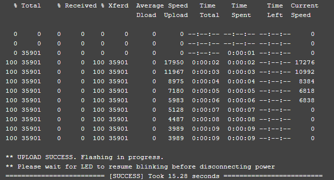

## ES900RX

### Flashing via Passthrough

Target: `HappyModel_RX_ES900RX_via_BetaflightPassthrough`

Device Category: `Happymodel 900 MHz`

Device: `HappyModel RX ES900RX`

With the receiver [wired properly] to your FC, select the right target and set your [Firmware Options] in the ExpressLRS Configurator, then click on **Build and Flash**. First time compiles naturally takes a while but if you do the prep work properly, you'll be greeted with the `Success` message soon enough!

### Flashing via Wifi

Target: `HappyModel_RX_ES900RX_via_Wifi`

Device Category: `Happymodel 900 MHz`

Device: `HappyModel RX ES900RX`

#### Method 1

**(Recommended as first-flash method)**

With the receiver [wired properly] to your FC, select the right target and set your [Firmware Options] in the ExpressLRS Configurator.

**Build** the firmware. Once done, it should open a new window where the `HappyModel_RX_ES900RX-<version>.bin` is. Do not close this window so you can easily navigate to it once it's time to upload the firmware into the receiver.

Power your Flight Controller by either connecting a LiPo or attaching the USB cable (if the receiver gets powered from USB via a 4v5 pad). The receiver's LED will blink slowly at first, and after 20s or 30s (can be adjusted via ExpressLRS Configurator using `AUTO_WIFI_ON_INTERVAL`), it should blink fast indicating it's on Wifi Hotspot Mode.

Connect to the Wifi Network the receiver has created. It should be named something like `ExpressLRS RX` with the same *expresslrs* password as the TX Module Hotspot.

<figure markdown>

</figure>

Navigate to the same web address as the TX Module (usually http://10.0.0.1). The Firmware upload page should load, and using the File Upload Form, navigate where the correct Receiver `HappyModel_RX_ES900RX-<version>.bin` is (like with the Tx module, you can also drag-and-drop the firmware file into the form field or use the `Browse` or `Choose File` button). Click on the **Update** button and the firmware file will be uploaded and the update process should commence.

A white page should load momentarily with the message **Update Success! Rebooting...**. Wait a little bit (**you can wait until the LED on the Receiver starts to blink slowly again**) and the receiver should be updated. Power cycle and your module and receiver should now be bound (given you have updated the Tx Module as well, and that they have the same binding phrase and options).

**Update for version 2.0**

Once you have updated to firmware version 2.0 or newer, the Web Update page on the Hotspot will get a few updates of its own. It will get the Update progress bar, and a Popup will be shown for Success or Error messages. Additionally, you can configure Home Network SSID and Password if you chose not to use ExpressLRS Configurator to set them. Once these are set, you can use the two methods below.

#### Method 2

!!! note ""
    Note: This method will only work once the Home Network SSID and Password has been configured with the receiver

With the receiver [wired properly] to your FC, select the right target and set your [Firmware Options] in the ExpressLRS Configurator.

**Build** the firmware. Once done, it should open a new window where the `HappyModel_RX_ES900RX-<version>.bin` is. Do not close this window so you can easily navigate to it once it's time to upload the firmware into the receiver.

Power up your Flight Controller by either connecting a LiPo or attaching the USB cable (if the receiver gets powered from USB via a 4v5 pad). The receiver's LED will blink slowly at first, and after 20s or 30s (can be adjusted via ExpressLRS Configurator using `AUTO_WIFI_ON_INTERVAL`), it should blink fast indicating it's on Wifi AP Mode. The fast blink will pause and flash fast once again, indicating connection to your Home Network.

Using your browser, navigate to http://elrs_rx.local/. The Wifi Update page should load. It should show your device target along with the version of the firmware it currently has.

Scroll down to the Firmware Update section, shown below:

Drag-and-drop the `HappyModel_RX_ES900RX-<version>.bin` file created by the ExpressLRS Configurator into the Choose File field, or manually navigate to the Folder by clicking the `Choose File` button. Once the correct file is selected, click the `Update`. Wait for the process to complete, indicated by a Green popup screen. 

Wait a little bit (**you can wait until the LED on the Receiver starts to blink slowly again**) and the receiver should be updated.

You can now power down your Flight Controller along with the receiver.

#### Method 3

!!! note ""
    Note: This method will only work once the Home Network SSID and Password has been configured with the receiver

With the receiver [wired properly] to your FC, select the right target and set your [Firmware Options] in the ExpressLRS Configurator.

Power up your Flight Controller by either connecting a LiPo or attaching the USB cable (if the receiver gets powered from USB via a 4v5 pad). The receiver's LED will blink slowly at first, and after 20s or 30s (can be adjusted via ExpressLRS Configurator using `AUTO_WIFI_ON_INTERVAL`), it should blink fast indicating it's on Wifi Mode.

**Build & Flash** the firmware using the ExpressLRS Configurator. Wait for the process to complete, indicated by the "Success" prompt and the Receiver LED has gone back to the Slow Blink mode. You can now power down the Flight Controller.

## ES915/868RX (Discontinued)

### Flashing via Passthrough

Target: `HappyModel_RX_ES915RX_via_BetaflightPassthrough`

Device Category: `Happymodel 900 MHz`

Device: `HappyModel RX ES915RX`

Once [wired properly](wiring-up.md#happymodel-es915868rx-discontinued) to your FC, connect USB. Did your receiver powered up too (with both LEDs lit)? If so, disconnect USB, hold the bind button on your receiver, and reconnect to USB. The LED should start alternating between the Green and Red LEDs. Once it's alternating, you can then let go of the Bind Button.

If your receiver didn't get powered from USB, have a lipo ready and continue with the next steps. On the ExpressLRS Configurator, with your [Firmware Options] set, click on **Build & Flash**. Like on the TX module, it will take a while on the first time. Watch out for the `Passthrough Init` stage. This stage will check your FC Configuration for the Serial RX UART (Software Inversion via "set serialrx_inverted" and Half Duplex mode via "set serialrx_halfduplex" will be checked; both should be off.)

Once `Retry... ` lines appear, connect a LiPo if your receiver isn't powered by the USB (i.e. power up your receiver and FC). On subsequent flash, you can have the LiPo plugged in and receiver powered up from the start.

Wait for this process to finish. It's done once the "Success" prompt is shown.

### Flashing via STLink

Target: `HappyModel_RX_ES915RX_via_STLINK`

Device Category: `Happymodel 900 MHz`

Device: `HappyModel RX ES915RX`

Connect your STLink into `GND`, `DIO`, `CLK`, `3V3` of the receiver. These pads are marked clearly in the image above.

Using the correct target specific for your receiver, set your [Firmware Options] and hit **Build & Flash** on the ExpressLRS Configurator.

Once done, wire your receiver to your Flight Controller. Passthrough flashing can now be used for updating the receiver.

[Firmware Options]: ../firmware-options.md
[wired properly]: wiring-up.md#happymodel-es900rx
