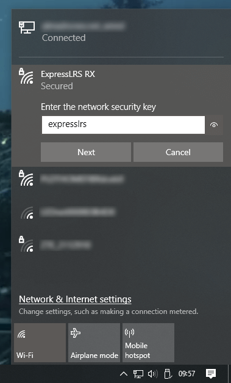

!!! danger "Advisory"
    If this is the first time you're flashing/updating your receiver or you're updating it from a previous 2.x firmware via WiFi, first ensure that it has version 2.5.2. Once it has the 2.5.2 flashed, you can then update it to 3.x via WiFi.

    If you're flashing it straight to 3.x and you're getting "Not Enough Space" popup during WiFi flashing, flash the receiver to 2.5.2 first, and then flash it to 3.x.

    If receiver firmware is already 3.x, and you're still getting the "Not Enough Space" error when flashing via WiFi, make sure you are selecting the correct method in the Configurator(via WiFi, in this case). See the steps outlined below.

    You can update straight to 3.x via Passthrough or via UART.

    The Repartitioner is for **TX only**.

## Wiring up your receiver

!!! attention "Note"
    There are Flight Controllers that will pull the RX pads `LOW` which will put the ESP-based receivers into `Bootloader Mode` unintentionally. A solid LED light on these receivers even with the TX Module off is a sign they are in Bootloader Mode. If this is the case, rewire the receiver to a different UART.

<figure markdown>

<figcaption>Happymodel ES900RX</figcaption>
</figure>

The image above shows the receiver pinouts and their connections. As we're dealing with a UART connection, Rx on the receiver goes to a TX pad on the FC, and Tx on the receiver goes to an uninverted Rx pad on the FC.

See the [Receiver Wiring] page for a more in-depth guide and troubleshooting procedures. Some of the updating procedures below will not go through if your receiver is not wired correctly and behaving properly.

## Configuring your Flight Controller

To configure your flight controller properly, please go through [Configure FC page](configuring-fc.md). These settings apply to INAV, Betaflight, and other flight controller software.

Ports Tab should be set up so that Serial RX is on the UART where you have soldered the receiver.

Receiver protocol is `CRSF` with `serialrx_inverted = off` and `serialrx_halfduplex = off`.

The next steps will not be able to proceed properly and you'll have issues later if any of these are set differently. Once you have configured your Flight Controller software, close its Configurator and unplug-replug the USB cable from the FC or your computer to refresh the connection and you'll be ensured that the port is not busy.

Some of the following procedures will not go through, particularly the via Passthrough method; or your receiver will not be fully functional, if these settings are incorrect.

## Updating your Receiver Firmware (ES900RX)

=== "via Passthrough"

    <figure markdown>
    
    </figure>

    1. Make sure you have done your [Receiver Wiring] properly and that your Flight Controller is [Configured].

        !!! Warning "Important Step!"
            This is an important step and guarantees updating success. If you haven't done these, GO BACK to those pages.

        - Disconnect and close your FC Configurator app (Betaflight Configurator, INAV Configurator, etc).
        - Power-cycle the Flight Controller.
            - If you plugged in LiPo, unplug it.
            - Unplug-replug the USB Cable from your Flight Controller or Computer.
            - Plug in a LiPo if your receiver **doesn't** power up with just USB connected into the Flight Controller. Make sure you have some airflow blowing over your Video Transmitter (VTX) to keep it cool. You can also temporarily unplug the VTX from the Flight Controller.

    2. Launch the [ExpressLRS Configurator](../installing-configurator.md) on your Computer.
        ![Configurator Release]{ align=right }

        - Make sure `Official Releases` is active from the horizontal tab.
        - Ensure you select the Released version you want to flash into your Receiver.

         
    3. Select the Device Category and Device target matching your hardware.

        - Device Category: 
            - `Happymodel 900 MHz`

        - Device: 
            - `HappyModel ES900 RX`
            - `HappyModel ES900 Dual RX`

    4. Set the Flashing Method to `BetaflightPassthrough`

        <figure markdown>
        
        </figure>

    5. Set the [firmware options] for your device.
        - Regulatory Domain (Mandatory. Choose the domain appropriate for the location or country you're flying).
        - Binding Phrase (Optional, but Highly Recommended. Note this phrase as it should be the same on your other devices, or they will not bind or sync).
        - Local WiFi Network Credentials (Optional. Will be used the next time the device goes into WiFi mode).
    6. Click the ++"Flash"++ button.

        <figure markdown>
        ![Flash]
        </figure>
        
    7. Wait for the process to finish. A Green Success bar will show up in the ExpressLRS Configurator.

    8. The LED on the Receiver should return to Slow Blinking LED pattern after a few seconds.

        <figure markdonw>
        
        </figure>

=== "via UART"

    <figure markdown>
    
    </figure>

    1. Connect your Receiver to your UART Adapter as shown in the image below.

        <figure markdown>
        
        </figure>

        - YES, you will need to disconnect your Receiver from your Flight Controller and connect it to a UART/FTDI Adapter.

    2. If your Receiver has Boot Pads instead of a Boot Button, solder the Boot Pads together or connect it to Ground. If your Receiver has a Boot Button, locate it then press & hold it. 

    3. Plug in your UART Adapter into a USB Port on your Computer.
        - The LED on the Receiver should light up Solid. If it's Blinking, repeat the previous step.

        ??? Warning "Receiver LED already Solid"
            If the Receiver LED has become Solid from a failed update, and you're reflashing through this method, you still need to do the previous step: Manually putting the receiver into Bootloader Mode. This ensures the Receiver is indeed in a Bootloader state rather than some random boot loop.
        
    4. Determine whether your UART Adapter is being detected correctly as a USB-to-UART Device.

        ![CP210x]{ align=right }

        - Windows Users can check via Device Manager, Ports device grouping.
        - Drivers will be needed if the UART Adapter is not being detected corrrectly. This is indicated by a Yellow Caution Triangle :material-alert-outline: in Device Manager.
        - Common USB-to-UART Adapter chip include: [CP210x](https://www.silabs.com/developers/usb-to-uart-bridge-vcp-drivers?tab=downloads), [FTDI FT232](https://ftdichip.com/drivers/vcp-drivers/), [CH340](https://sparks.gogo.co.nz/ch340.html) and the [CH9102](https://sparks.gogo.co.nz/ch340.html) (driver download pages linked).

         

    5. Launch the [ExpressLRS Configurator](../installing-configurator.md) on your Computer.
        ![Configurator Release]{ align=right }

        - Make sure `Official Releases` is active from the horizontal tab.
        - Ensure you select the Released version you want to flash into your Receiver.

         
    6. Select the Device Category and Device target matching your hardware.

        - Device Category: 
            - `Happymodel 900 MHz`

        - Device: 
            - `HappyModel ES900 RX`
            - `HappyModel ES900 Dual RX`

    7. Set the Flashing Method to `UART`

        <figure markdown>
        
        </figure>

    8. Set the [firmware options] for your device.
        - Regulatory Domain (Mandatory. Choose the domain appropriate for the location or country you're flying).
        - Binding Phrase (Optional, but Highly Recommended. Note this phrase as it should be the same on your other devices, or they will not bind or sync).
        - Local WiFi Network Credentials (Optional. Will be used the next time the device goes into WiFi mode).
    9. Click the ++"Flash"++ button.

        <figure markdown>
        ![Flash]
        </figure>
        
    10. Wait for the process to finish. A Green Success bar will show up in the ExpressLRS Configurator.

    11. The LED on the Receiver should return to Slow Blinking LED pattern after a few seconds.

        <figure markdonw>
        
        </figure>

=== "via WiFi"

    <figure markdown>
    
    </figure>

    === "Manual Upload via AP"

        !!! Info "Heads up!"
            This option is only possible if you haven't previously flashed or configured your Receiver with your Home WiFi SSID and Password or it's unable to connect to said WiFi Network because the router is Off or unreachable.

        1. Launch the [ExpressLRS Configurator](../installing-configurator.md) on your Computer.
            ![Configurator Release]{ align=right }

            - Make sure `Official Releases` is active from the horizontal tab.
            - Ensure you select the Released version you want to flash into your Receiver.

             

        2. Select the Device Category and Device target matching your hardware.
            
            - Device Category: 
                - `Happymodel 900 MHz`

            - Device: 
                - `HappyModel ES900 RX`
                - `HappyModel ES900 Dual RX`

        3. Set the Flashing Method to `WiFi`.

            <figure markdown>
            
            </figure>

        4. Set the [firmware options] for your device.
            - Regulatory Domain (Mandatory. Choose the domain appropriate for the location or country you're flying).
            - Binding Phrase (Optional, but Highly Recommended. Note this phrase as it should be the same on your other devices, or they will not bind or sync).
            - Local WiFi Network Credentials (Optional. Will be used the next time the device goes into WiFi mode).
        5. Click the ++"Build"++ button.
            
            <figure markdown>
            ![Build]
            </figure>
            
        6. Once the Build process is done, a Temp folder window containing your firmware binaries should pop up.

            ![Temp RX]{ align=right }

            - Do not close this Temp folder because this is where you will take your firmware from in the later steps. If you are planning on using your phone or tablet to upload the firmware file later, copy the firmware file into your device.

            !!! tip "NOTICE"
                With the release of ExpressLRS 3.3.0 and ExpressLRS Configurator 1.6.0, only one file will show up. 

                - The file for the ES900 receivers will be in a gzip format (`firmware.bin.gz`). Use this file as is, without extracting or unzipping.
                - The file for the ES900 Dual will be in bin format (`firmware.bin`). 

             
            
        7. Put your Receiver into WiFi mode.

            === "using Auto WiFi mode"

                1. Power up your Receiver. 
                            
                    - If you will have to plug in LiPo to power up your Receiver:

                        - make sure you've already checked the wiring from the [Receiver Wiring] step.
                        - make sure you have some airflow blowing over your Video Transmitter (VTX). You can also temporarily unplug it from the Flight Controller.

                    - If it's already powered and connected or in-sync with a TX Module, power Off the Radio & TX Module first, then power-cycle (Turn Off, then Turn back On) the Receiver.

                2. Let it be for at least 60s and the LED will turn into either a Rapid Blinking pattern or a Green Breathing LED pattern(for Receivers using an RGB LED) indicating it is now in WiFi Mode.

                    - The Auto WiFi On Interval setting controls how long the device will wait to initiate WiFi Mode when it's powered up and it's not getting valid CRSF packets.

                    <figure markdown>
                    
                    </figure>

            === "using the ExpressLRS Lua Script" 

                !!! Note
                    This method only works if your Receiver is already in sync and bound with your TX Module.

                1. Press the ++"SYS"++ Key on your Radio.
                    - Older Radios or those with only one Menu Key will need to long-press the ++context-menu++ Key to access the System Menu.
                    - Consult your Radio User's Manual on how to access the System Menu.
                2. You are now in the Tools Menu where Lua Scripts can be found. Scroll down and select `ExpressLRS` Lua Script.
                    - If the script is nowhere to be found, download it from [this page](../transmitters/lua-howto.md) and save it into your Radio SD Card Scripts/Tools/ folder.
                3. Press ++enter++ to Load it.
            
                    <figure markdown >
                    ![Lua Running]
                    </figure> 

                    - If the script is stuck on a "Loading..." screen, return to the [Radio Preparation](../transmitters/tx-prep.md) Page and make sure you have configured your radio properly for ExpressLRS use.
                4. Scroll down and select `Wifi Connectivity` and press ++enter++.
                5. Select `Enable RX WiFi` and press ++enter++.
            
                    <figure markdown>
                    ![Lua WiFi]
                    </figure>
            
                6. The Receiver LED will turn into either a Rapid Blinking pattern or a Green Breathing LED pattern(for Receivers using an RGB LED) indicating it is now in WiFi Mode.

                    <figure markdown>
                    
                    </figure>

            ??? Warning "My Receiver has Solid LED and won't go into WiFi Mode!"
                Go back to the [Receiver Wiring] step.
                
                If you have previously attempted updating your receiver, there's a possibility it was soft-bricked. Go over the [Unbricking] procedure to recover it.

        8. Using a WiFi-capable device such as your smartphone or laptop, scan for the `ExpressLRS RX` Access Point. Connect to this Access Point.

            { align=right }

            - If your Receiver is flashed or configured with your Home WiFi SSID and Password, and can connect to that WiFi Network, then the Access Point will not appear.
            - `expresslrs` is the Password for this Access Point.

            ??? question "Where's the Access Point?"
                If you cannot find the Access Point, make sure the device you're using is capable of connecting to 2.4GHz WiFi Networks. Also try putting the devices closer together.

                If you still cannot find the Access Point, chances are that you have set it with your WiFi SSID and Password before, and it has connected to your WiFi Network.

             

        9. Once you have connected to the `ExpressLRS RX` Access Point, open up a Browser window and type in the IP Address `10.0.0.1` on the Address Bar and press ++enter++. The ExpressLRS Web UI will load.
        10. Activate the `Update` Tab.

            <figure markdown>
            ![Web UI Banner]
            </figure>

            - If your Receiver is still on an earlier firmware version, then there's no Update Tab, and instead, you will need to scroll down to find the Firmware Update section.

            <figure markdown>
            ![Old File Upload]
            </figure>

        11. Drag and drop the Firmware file from the Temp folder into the File Upload field.
            - You can also use the Browse or Choose File button and browse for the file yourself, especially if you've copied/moved it somewhere else on an earlier step.
        12. Click the ++"Update"++ button to start the Updating procedure.
        13. Wait for the firmware file to get uploaded and flashed into your device. It only takes a minute or two, and you will see the Success Popup Message.

            <figure markdown>
            ![Success WiFi]
            </figure>

        14. The LED on the Receiver should return to Slow Blinking LED pattern after a few seconds.

            <figure markdonw>
            
            </figure>

    === "Manual Upload via Local WiFi"

        !!! Info "Heads up!"
            This option is only possible if you have previously flashed or configured your Receiver with your Home WiFi SSID and Password and the device is able to connect to said WiFi Network.

        1. Launch the [ExpressLRS Configurator](../installing-configurator.md) on your Computer.
            ![Configurator Release]{ align=right }

            - Make sure `Official Releases` is active from the horizontal tab.
            - Ensure you select the Released version you want to flash into your Receiver.

             
        2. Select the Device Category and Device target matching your hardware.

            - Device Category: 
                - `Happymodel 900 MHz`

            - Device: 
                - `HappyModel ES900 RX`
                - `HappyModel ES900 Dual RX`

        3. Set the Flashing Method to `WiFi`.

            <figure markdown>
            
            </figure>

        4. Set the [firmware options] for your device.
            - Regulatory Domain (Mandatory. Choose the domain appropriate for the location or country you're flying).
            - Binding Phrase (Optional, but Highly Recommended. Note this phrase as it should be the same on your other devices, or they will not bind or sync).
            - Local WiFi Network Credentials (Optional. Will be used the next time the device goes into WiFi mode).
        5. Click the ++"Build"++ button.
            
            <figure markdown>
            ![Build]
            </figure>
            
        6. Once the Build process is done, a Temp folder window should popup containing your firmware binaries.
            ![Temp RX]{ align=right }

            - Do not close this Temp folder because this is where you will take your firmware from in the later steps. If you are planning on using your phone or tablet to upload the firmware file later, copy the firmware file into your device.

            !!! tip "NOTICE"
                With the release of ExpressLRS 3.3.0 and ExpressLRS Configurator 1.6.0, only one file will show up. 

                - The file for the ES900 receivers will be in a gzip format (`firmware.bin.gz`). Use this file as is, without extracting or unzipping.
                - The file for the ES900 Dual will be in bin format (`firmware.bin`). 

             

        7. Put your Receiver into WiFi mode.

            === "using Auto WiFi mode"

                1. Power up your Receiver. 
                            
                    - If you will have to plug in LiPo to power up your Receiver:

                        - make sure you've already checked the wiring from the [Receiver Wiring] step.
                        - make sure you have some airflow blowing over your Video Transmitter (VTX). You can also temporarily unplug it from the Flight Controller.

                    - If it's already powered and connected or in-sync with a TX Module, power Off the Radio & TX Module first, then power-cycle (Turn Off, then Turn back On) the Receiver.

                2. Let it be for at least 60s and the LED will turn into either a Rapid Blinking pattern or a Green Breathing LED pattern(for Receivers using an RGB LED) indicating it is now in WiFi Mode.

                    - The Auto WiFi On Interval setting controls how long the device will wait to initiate WiFi Mode when it's powered up and it's not getting valid CRSF packets.

                    <figure markdown>
                    
                    </figure>

            === "using the ExpressLRS Lua Script" 

                !!! Note
                    This method only works if your Receiver is already in sync and bound with your TX Module.

                1. Press the ++"SYS"++ Key on your Radio.
                    - Older Radios or those with only one Menu Key will need to long-press the ++context-menu++ Key to access the System Menu.
                    - Consult your Radio User's Manual on how to access the System Menu.
                2. You are now in the Tools Menu where Lua Scripts can be found. Scroll down and select `ExpressLRS` Lua Script.
                    - If the script is nowhere to be found, download it from [this page](../transmitters/lua-howto.md) and save it into your Radio SD Card Scripts/Tools/ folder.
                3. Press ++enter++ to Load it.
            
                    <figure markdown >
                    ![Lua Running]
                    </figure> 

                    - If the script is stuck on a "Loading..." screen, return to the [Radio Preparation](../transmitters/tx-prep.md) Page and make sure you have configured your radio properly for ExpressLRS use.
                4. Scroll down and select `Wifi Connectivity` and press ++enter++.
                5. Select `Enable RX WiFi` and press ++enter++.
            
                    <figure markdown>
                    ![Lua WiFi]
                    </figure>
            
                6. The Receiver LED will turn into either a Rapid Blinking pattern or a Green Breathing LED pattern(for Receivers using an RGB LED) indicating it is now in WiFi Mode.

                    <figure markdown>
                    
                    </figure>

            ??? Warning "My Receiver has Solid LED and won't go into WiFi Mode!"
                Go back to the [Receiver Wiring] step.
                
                If you have previously attempted updating your receiver, there's a possibility it was soft-bricked. Go over the [Unbricking] procedure to recover it.

        8. With your receiver now in WiFi Mode and it was able to connect to your Local WiFi Network, open a Browser window on any WiFi-capable device that is also connected to the same Local WiFi Network. Type in the Address http://elrs_rx.local on your browser's Address Bar. The ExpressLRS Web UI should load.
            - If your browser cannot resolve this address and it cannot load the ExpressLRS Web UI, this means that MDNS is not working on your device or network.

            ??? tip "MDNS is not working!"
                === "The `arp` Command"

                    1. Open up a Command Prompt window on your computer.
                    2. Execute the command `arp -a`, which will list all the devices in the Network.
                    3. Use each of the IP Addresses marked as `Dynamic` as a URL in your Browser until you get to the ExpressLRS Web UI.

                === "Router DHCP List"
                    1. Log in into your Router dashboard.
                    2. Check the DHCP List and look for the "elrs" device.
                    3. Take note of the IP Address given by your router.
                    4. Use this IP address in your Browser as the URL.

        9. Activate the `Update` Tab.

            <figure markdown>
            ![Web UI Banner]
            </figure>

            - If your Receiver is still on an earlier firmware version, then there's no Update Tab, and instead, you will need to scroll down to find the Firmware Update section.

            <figure markdown>
            ![Old File Upload]
            </figure>

        10. Drag and drop the Firmware file from the Temp folder into the File Upload field.
            - You can also use the Browse or Choose File button and browse for the file yourself, especially if you've copied/moved it somewhere else on an earlier step.
        11. Click the ++"Update"++ button to start the Updating procedure.
        12. Wait for the firmware file to get uploaded and flashed into your device. It only takes a minute or two, and you will see the Success Popup Message.

            <figure markdown>
            ![Success WiFi]
            </figure>

        13. The LED on the Receiver should return to Slow Blinking LED pattern after a few seconds.

            <figure markdonw>
            
            </figure>

    === "Auto Upload"

        !!! Info "Heads up!"
            This option is only possible if you have previously flashed or configured your Receiver with your Home WiFi SSID and Password and the device is able to connect to said WiFi Network. 
            
            MDNS must also be working so your browser can resolve the address http://elrs_rx.local and load the ExpressLRS Web UI from said address.

        1. Put your Receiver into WiFi mode.

            === "using Auto WiFi mode"

                1. Power up your Receiver. 
                            
                    - If you will have to plug in LiPo to power up your Receiver:

                        - make sure you've already checked the wiring from the [Receiver Wiring] step.
                        - make sure you have some airflow blowing over your Video Transmitter (VTX). You can also temporarily unplug it from the Flight Controller.

                    - If it's already powered and connected or in-sync with a TX Module, power Off the Radio & TX Module first, then power-cycle (Turn Off, then Turn back On) the Receiver.

                2. Let it be for at least 60s and the LED will turn into either a Rapid Blinking pattern or a Green Breathing LED pattern(for Receivers using an RGB LED) indicating it is now in WiFi Mode.

                    - The Auto WiFi On Interval setting controls how long the device will wait to initiate WiFi Mode when it's powered up and it's not getting valid CRSF packets.

                    <figure markdown>
                    
                    </figure>

            === "using the ExpressLRS Lua Script" 

                !!! Note
                    This method only works if your Receiver is already in sync and bound with your TX Module.

                1. Press the ++"SYS"++ Key on your Radio.
                    - Older Radios or those with only one Menu Key will need to long-press the ++context-menu++ Key to access the System Menu.
                    - Consult your Radio User's Manual on how to access the System Menu.
                2. You are now in the Tools Menu where Lua Scripts can be found. Scroll down and select `ExpressLRS` Lua Script.
                    - If the script is nowhere to be found, download it from [this page](../transmitters/lua-howto.md) and save it into your Radio SD Card Scripts/Tools/ folder.
                3. Press ++enter++ to Load it.
            
                    <figure markdown >
                    ![Lua Running]
                    </figure> 

                    - If the script is stuck on a "Loading..." screen, return to the [Radio Preparation](../transmitters/tx-prep.md) Page and make sure you have configured your radio properly for ExpressLRS use.
                4. Scroll down and select `Wifi Connectivity` and press ++enter++.
                5. Select `Enable RX WiFi` and press ++enter++.
            
                    <figure markdown>
                    ![Lua WiFi]
                    </figure>
            
                6. The Receiver LED will turn into either a Rapid Blinking pattern or a Green Breathing LED pattern(for Receivers using an RGB LED) indicating it is now in WiFi Mode.

                    <figure markdown>
                    
                    </figure>

            ??? Warning "My Receiver has Solid LED and won't go into WiFi Mode!"
                Go back to the [Receiver Wiring] step.
                
                If you have previously attempted updating your receiver, there's a possibility it was soft-bricked. Go over the [Unbricking] procedure to recover it.

        2. Launch the [ExpressLRS Configurator](../installing-configurator.md) on your Computer.
            ![Configurator Release]{ align=right }

            - Make sure `Official Releases` is active from the horizontal tab.
            - Ensure you select the Released version you want to flash into your Receiver.

             
        3. Select the Device Category and Device target matching your hardware.

            - Device Category: 
                - `Happymodel 900 MHz`

            - Device: 
                - `HappyModel ES900 RX`
                - `HappyModel ES900 Dual RX`

        4. Set the Flashing Method to `WiFi`.

            <figure markdown>
            
            </figure>

        5. Set the [firmware options] for your device.
            - Regulatory Domain (Mandatory. Choose the domain appropriate for the location or country you're flying).
            - Binding Phrase (Optional, but Highly Recommended. Note this phrase as it should be the same on your other devices, or they will not bind or sync).
            - Local WiFi Network Credentials (Optional. Will be used the next time the device goes into WiFi mode).
        6. Click the ++"Flash"++ button.

            <figure markdown>
            ![Flash]
            </figure>
        
        7. Wait for the upload to finish. A Green Success bar will show up in the ExpressLRS Configurator.

            <figure markdown>
            
            </figure>

        8. The LED on the Receiver should return to Slow Blinking LED pattern after a few seconds.

            <figure markdonw>
            
            </figure>

## Updating your Receiver Firmware (ES915RX/ES868RX)

=== "via Passthrough"

    <figure markdown>
    
    </figure>

    1. Make sure you have done your [Receiver Wiring] properly and that your Flight Controller is [Configured].

        !!! Warning "Important Step!"
            This is an important step and guarantees updating success. If you haven't done these, GO BACK to those pages.

        - Disconnect and close your FC Configurator app (Betaflight Configurator, INAV Configurator, etc).
        - If your receiver powers up with just USB connected to your flight controller, unplug it. Press and Hold the boot button on the receiver (not the FC) and then plug in the USB. Release the button right after the LED turn solid.
        - If your receiver only powers up with a LiPo connected to your flight controller, unplug it. Then unplug-replug the USB cable to your flight controller. Do not replug LiPo yet.

    2. Launch the [ExpressLRS Configurator](../installing-configurator.md) on your Computer.
        ![Configurator Release]{ align=right }

        - Make sure `Official Releases` is active from the horizontal tab.
        - Ensure you select the Released version you want to flash into your Receiver.

         
    3. Select the Device Category and Device target matching your hardware.

        - Device Category: 
            - `Happymodel 900 MHz`

        - Device: 
            - `HappyModel ES915 RX`

    4. Set the Flashing Method to `BetaflightPassthrough`

        <figure markdown>
        
        </figure>

    5. Set the [firmware options] for your device.
        - Regulatory Domain (Mandatory. Choose the domain appropriate for the location or country you're flying).
        - Binding Phrase (Optional, but Highly Recommended. Note this phrase as it should be the same on your other devices, or they will not bind or sync).

    6. Click the ++"Flash"++ button.

        <figure markdown>
        ![Flash]
        </figure>
    
    7. Wait for the `Retry...` lines to appear in the Build Log. Connect the LiPo to power up the Receiver if it only powers up with a LiPo connected.

        - `Retry...` lines will not show up if your receiver is already in bootloader mode and gets powered up by USB.
        
    8. Wait for the process to finish. A Green Success bar will show up in the ExpressLRS Configurator.

    9. The LED on the Receiver should return to Slow Blinking LED pattern after a few seconds.

        <figure markdonw>
        
        </figure> 

=== "via STLink"

    <figure markdown>
    
    </figure>

    1. Disconnect the Receiver from your Flight Controller.

    2. Wire up the Receiver into an STLink V2 dongle. Find the CLK, DIO, 3v3 and Gnd pads and wire them to the corresponding pins of the dongle.

    3. Launch the [ExpressLRS Configurator](../installing-configurator.md) on your Computer.
        ![Configurator Release]{ align=right }

        - Make sure `Official Releases` is active from the horizontal tab.
        - Ensure you select the Released version you want to flash into your Receiver.

         
    4. Select the Device Category and Device target matching your hardware.

        - Device Category: 
            - `Happymodel 900 MHz`

        - Device: 
            - `HappyModel ES915 RX`

    5. Set the Flashing Method to `STLink`

        <figure markdown>
        
        </figure>

    6. Set the [firmware options] for your device.
        - Regulatory Domain (Mandatory. Choose the domain appropriate for the location or country you're flying).
        - Binding Phrase (Optional, but Highly Recommended. Note this phrase as it should be the same on your other devices, or they will not bind or sync).

    7. Click the ++"Flash"++ button.

        <figure markdown>
        ![Flash]
        </figure>
          
    8. Wait for the process to finish. A Green Success bar will show up in the ExpressLRS Configurator.

    9. The LED on the Receiver should return to Slow Blinking LED pattern after a few seconds.

        <figure markdonw>
        
        </figure> 

    10. Rewire your receiver to your Flight Controller.

[Lua Running]: ../../assets/images/lua/config-bw.png
[Lua WiFi]: ../../assets/images/lua/wifi-bw.png
[Configurator Release]: ../../assets/images/ConfiguratorRelease.png
[Temp RX]: ../../assets/images/build-temp-rx.png
[Flash]: ../../assets/images/BuildFlash.png
[Build]: ../../assets/images/Build.png
[CP210x]: ../../assets/images/device-mngr-cp210x.png
[Web UI Banner]: ../../assets/images/web-update-rx.png
[Success WiFi]: ../../assets/images/receiverWiFiUpdateSuccess.jpg
[Old File Upload]: ../../assets/images/web-firmwareupdate.png
[Receiver Wiring]: ../receivers/wiring-up.md
[Unbricking]: ../unbricking.md
[Configured]: ../receivers/configuring-fc.md
[firmware options]: ../firmware-options.md
[Receiver Wiring]: wiring-up.md#connecting-a-receiver
