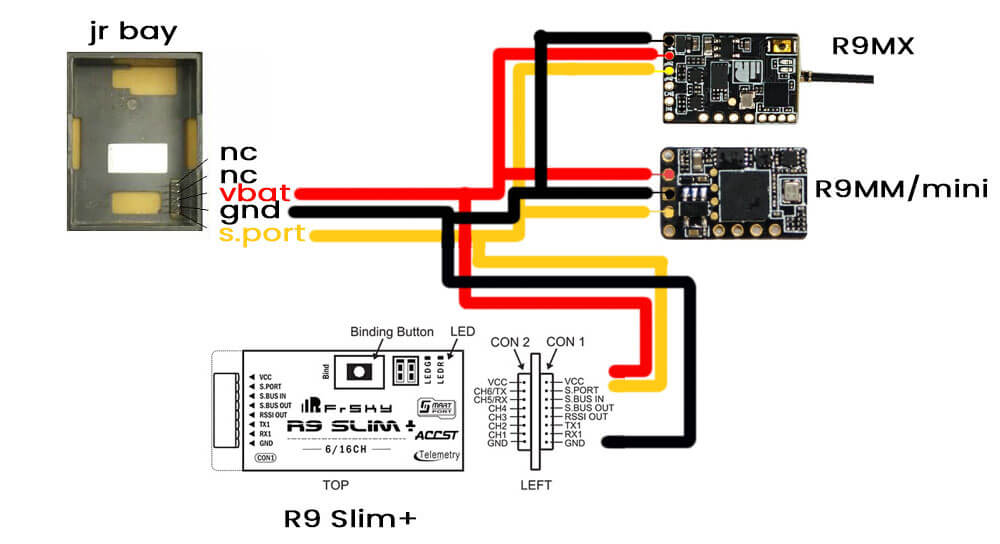
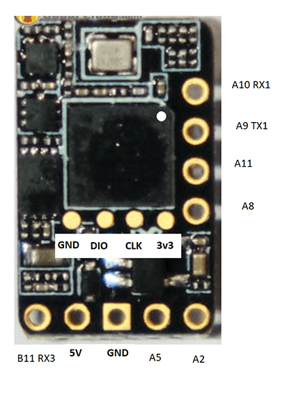
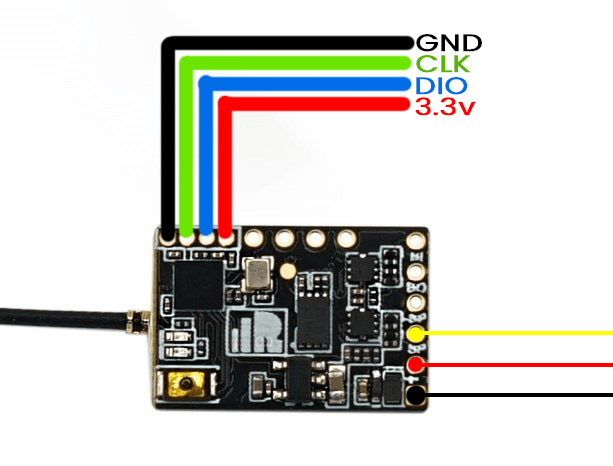
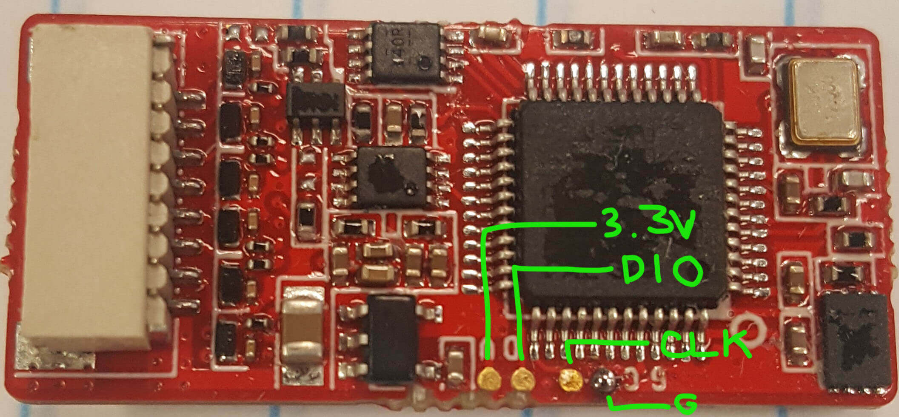

## Bootloaders

The R9Mini/R9MM, R9MX and R9Slim+ require ExpressLRS Bootloaders to be flashed before the ExpressLRS firmware. The R9Slim doesn't have a bootloader and first time flash requires STLink.

Download the bootloader `.frk` file for your respective receiver. The files are as follows:

- R9mm/mini: [`r9mm_elrs_bl.frk`](https://github.com/AlessandroAU/ExpressLRS/blob/master/src/bootloader/r9mm_elrs_bl.frk?raw=true) (14kb) or [`r9mm_no_btn_elrs_bl.frk`](https://github.com/ExpressLRS/ExpressLRS/raw/master/src/bootloader/r9mm_no_btn_elrs_bl.frk?raw=true) (14kb) (no_btn bootloader is only used if your bind/boot button on the receiver is faulty or has gone bad.)
- R9mx: [`r9mx_elrs_bl.frk`](https://github.com/ExpressLRS/ExpressLRS/blob/master/src/bootloader/r9mx_elrs_bl.frk?raw=true) (20kb)
- R9Slim+ (ACCST): [`r9slim_plus_elrs_bl.frk`](https://github.com/ExpressLRS/ExpressLRS/blob/master/src/bootloader/r9slim_plus_elrs_bl.frk?raw=true) (14kb)
- R9Slim+ (ACCESS/OTA): [`r9slim_plus_ota_elrs_bl.frk`](https://github.com/ExpressLRS/ExpressLRS/blob/master/src/bootloader/r9slim_plus_ota_elrs_bl.frk?raw=true) (18kb)

Copy the relevant file to your handset's SD card (You can put it inside `/FIRMWARE` folder for easy access).

Wire the receiver to your radio's Smart Port, as shown:

<figure markdown>

</figure>

Next, flash the `.frk` via the `S.port` flashing option in `OpenTX` or `EdgeTX` :zap: (It helps if the External RF module is set to `PPM` mode.) 

- Open the System Menu on the Radio
    - For radio handsets with dedicated System Key, press the ++"SYS"++ Key.
    - For radio handsets with a single Menu Key, long-press the ++context-menu++ Key.
- Press the ++"Page"++ Key until you reach the `SD-HC Card` page.
- Select the `FIRMWARE` folder and press ++enter++.
- Select the `.frk` bootloader file then long-press the ++enter++ Key.
- Select **Flash external module** and press ++enter++
- Press ++enter++ once the Writing is complete.

Once done, unplug the receiver and your bootloader is flashed.

!!! info "FYI"
    You only need to flash the Bootloader ONCE. After it's flashed into the receiver, you **don't** have to reflash it in every update.

    R9Slim doesn't have a bootloader. As such, you need to flash it first via STLink.

### Troubleshooting No Sync

- Setting the External RF module to `PPM` mode helps.
- Check if the receiver has its LED lit up or if it's powered.
- Check whether you've set your `Max Bauds` to `115200`, especially if you're using a **QX7** or an **X9D** (on OneBit Firmwares or EdgeTX). If so, put it back to `400000` and try again.

## Wiring up your receiver

<figure markdown>

<figcaption>Wiring up receiver</figcaption>
</figure>

!!! attention "Note"
    This will be the same wiring you'll use for flying and the subsequent firmware updates (via Passthrough). Forget the factory wiring guide!

    R9Slim need to be flashed via STLink first before you [wire] it up to your Flight Controller.

## Configuring your Flight Controller

To configure your flight controller properly, please go through [Configure FC page](configuring-fc.md). These settings apply on INAV, Betaflight and other flight controller software.

Ports Tab should be setup so that Serial RX is on the UART where you have soldered the receiver.

Receiver protocol is `CRSF` with `serialrx_inverted = off` and `serialrx_halfduplex = off`.

The next steps will not be able to proceed properly and you'll have issues later if any of these are set differently. Once you have configured your Flight Controller software, close its Configurator and unplug-replug the USB cable from the FC or your computer to refresh the connection and you'll be ensured that the port is not busy.

## Updating your Receiver Firmware

=== "via Passthrough"

    <figure markdown>
    
    </figure>

    1. Make sure you have done your [Receiver Wiring] properly and that your Flight Controller is [Configured]. Also make sure [bootloaders] are already flashed to your R9 receiver when applicable.

        !!! Warning "Important Step!"
            This is an important step and guarantees updating success. If you haven't done these, GO BACK to those pages.

        - Disconnect and close your FC Configurator app (Betaflight Configurator, INAV Configurator, etc).
        - If your receiver powers up with just USB connected to your flight controller, unplug it. Press and Hold the boot button on the receiver (not the FC) and then plug in the USB. Release the button once the green and red LEDs blink alternately.
        - If your receiver only powers up with a LiPo connected to your flight controller, unplug it. Then unplug-replug the USB cable to your flight controller. Do not replug LiPo yet.

    2. Launch the [ExpressLRS Configurator](../installing-configurator.md) on your Computer.
        ![Configurator Release]{ align=right }

        - Make sure `Official Releases` is active from the horizontal tab.
        - Ensure you select the Released version you want to flash into your Receiver.

         
    3. Select the Device Category and Device target matching your hardware.

        - Device Category: 
            - `Frsky 900 MHz`

        - Device:
            - `FrSky R9MM/Mini 900MHz RX`
            - `FrSky R9MX 900MHz RX`
            - `FrSky R9 Slim 900MHz RX` (If already flashed via STLink)
            - `FrSky R9 Slim Plus 900MHz RX`
            - `FrSky R9 Slim Plus OTA 900MHz RX`

    4. Set the Flashing Method to `BetaflightPassthrough`

        <figure markdown>
        
        </figure>

    5. Set the [firmware options] for your device.
        - Regulatory Domain (Mandatory. Choose the domain appropriate for the location or country you're flying).
        - Binding Phrase (Optional, but Highly Recommended. Note this phrase as it should be the same on your other devices, or they will not bind or sync).

    6. Click the ++"Flash"++ button.

        <figure markdown>
        ![Flash]
        </figure>
    
    7. Wait for the `Retry...` lines to appear in the Build Log. Connect the LiPo to power up the Receiver if it only powers up with a LiPo connected.

        - `Retry...` lines will not show up if your receiver is already in bootloader mode and gets powered up by USB.
        
    8. Wait for the process to finish. A Green Success bar will show up in the ExpressLRS Configurator.

    9. The LED on the Receiver should return to Slow Blinking LED pattern after a few seconds.

        <figure markdonw>
        
        </figure> 

=== "via STLink"

    <figure markdown>
    
    </figure>

    1. Disconnect the Receiver from your Flight Controller.

    2. Wire up the Receiver into an STLink V2 dongle. Find the CLK, DIO, 3v3 and Gnd pads and wire them to the corresponding pins of the dongle.

        <figure markdown>
        
        <figcaption>R9Mini/R9MM<figcaption>
        </figure>

        <figure markdown>
        
        <figcaption>R9MX<figcaption>
        </figure>

        <figure markdown>
        
        <figcaption>R9Slim/R9Slim+<figcaption>
        </figure>

    3. Launch the [ExpressLRS Configurator](../installing-configurator.md) on your Computer.
        ![Configurator Release]{ align=right }

        - Make sure `Official Releases` is active from the horizontal tab.
        - Ensure you select the Released version you want to flash into your Receiver.

         
    4. Select the Device Category and Device target matching your hardware.

        - Device Category: 
            - `Frsky 900 MHz`

        - Device:
            - `FrSky R9MM/Mini 900MHz RX`
            - `FrSky R9MX 900MHz RX`
            - `FrSky R9 Slim 900MHz RX` (If already flashed via STLink)
            - `FrSky R9 Slim Plus 900MHz RX`
            - `FrSky R9 Slim Plus OTA 900MHz RX`

    5. Set the Flashing Method to `STLink`

        <figure markdown>
        
        </figure>

    6. Set the [firmware options] for your device.
        - Regulatory Domain (Mandatory. Choose the domain appropriate for the location or country you're flying).
        - Binding Phrase (Optional, but Highly Recommended. Note this phrase as it should be the same on your other devices, or they will not bind or sync).

    7. Click the ++"Flash"++ button.

        <figure markdown>
        ![Flash]
        </figure>
          
    8. Wait for the process to finish. A Green Success bar will show up in the ExpressLRS Configurator.

    9. The LED on the Receiver should return to Slow Blinking LED pattern after a few seconds.

        <figure markdonw>
        
        </figure> 

    10. Rewire your receiver to your Flight Controller.

[Configurator Release]: ../../assets/images/ConfiguratorRelease.png
[Flash]: ../../assets/images/BuildFlash.png
[Build]: ../../assets/images/Build.png
[Receiver Wiring]: ../receivers/wiring-up.md
[Configured]: ../receivers/configuring-fc.md
[firmware options]: ../firmware-options.md
[Receiver Wiring]: wiring-up.md#connecting-a-receiver
[Bootloaders]: #bootloaders
[wire]: ../receivers/wiring-up.md 
