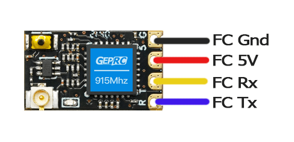
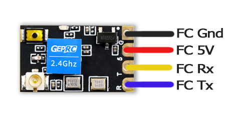
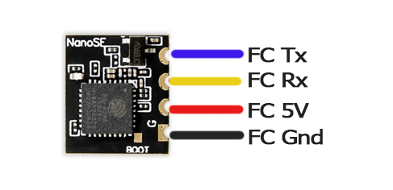

!!! tip "Hot Tip"
    Manufacturer-suggested Receiver UARTs, or UARTs alloted for Receivers usually have a pull-down resistor to aid with SBUS (RX pad inversion) which will result into SOLID LEDs on the ESP-based ExpressLRS Receivers. It is best to avoid those UARTs unless you know your UARTs.

    > When in doubt, avoid that UART. --deadbyte

!!! tip "Hint!"
    KISS FCs may label its UARTs differently. You might have to wire up the Rx pin into an RX pad, and the Tx pin into a TX pad. Always check your FC wiring guide/manual.

## Preparations

Have your Flight Controller Wiring Manual handy before you proceed. Make sure you have the right wiring diagram for your flight controller. Some Flight Controllers have different board revisions and they could have changed the board layout or pin assignments.

Determine if your Flight Controller have specific UARTs (RX and TX pair) for specific purpose. An example of such were ESC Telemetry UARTs or VTX SmartAudio/Tramp UARTs. Some Flight Controllers, specially those based off the F4 MCUs with limited UARTs, tend to have two of the same UART pads in different locations. You would want to make sure no other peripheral is wired up on the UART you chose for your ExpressLRS Receiver. You can move your existing wiring to other UARTs to make sure your ExpressLRS receiver will get a full UART connection (Rx and Tx pair of pads). Think of a UART as a USB port on your computer that can host different USB devices at one time.

<figure markdown>

<figcaption>An FC Pinout Diagram  with RX6 & TX3 in two locations</figcaption>
</figure>

Flight Controllers have at least 2 UARTs. One for the VTX Smartaudio/Tramp Protocol connection (only requires a TX pad), and another for a Receiver. There are Flight Controllers that often only have an RX pad for the Receiver UART, which you can still use for your ExpressLRS Receiver although you will have to forego Telemetry and Passthrough Updates. If you must have Telemetry from the FC to your radio, you will need a full UART (RX and TX pair) and in such cases you can use Soft Serial for your VTX Smartaudio/Tramp connection and use the other UART for your Receiver.

F7-based Flight Controllers, like those with F722 or F745 MCUs, often suggests wiring receivers on a particular UART. Because you can invert the UART signal for these MCUs, there's no specific pad for SBUS, and as such, these suggested *Receiver UARTS* often have a pull-down resistor to aid with the signal inversion. If you have wired your ESP-based ExpressLRS Receiver (e.g. EP1 or EP2) to these UARTs and the LED doesn't blink at all and stays solid (indicating it is in bootloader mode), there's a high chance that the UART's RX pad have such pull-down resistor. To test for this, unsolder the rx and tx wires of the Receiver from the FC, and verify the LED blinks slow and after some 20-30s (or 60s), the LED would blink fast to indicate WiFi mode.

There are F4-based Flight Controllers that also use the same UART for SBUS and other protocols. An example is the iFlight F405 Succex Flight Controllers. They often suggest using UART2 for Receivers. An inverted R2 pad is provided for SBUS receivers (sometimes labeled iR2 or nR2) and the regular R2 pad for other protocols. We suggest avoiding such UARTs altogether.

Here's some Receiver LED patterns:

|| LED Indication | Status |
|---|---|---|
|| Slow blink 500ms on/off | Waiting for connection from transmitter |
|| Fast blinking 25ms on/off | WiFi mode enabled |
|| Solid on | Connected to a transmitter, or bootloader mode enabled |

For other modes, see the [LED Status page](../led-status.md).

Should you really need to use that particular UART that puts your ESP-based ExpressLRS Receiver into Bootloader mode, you can wire up a pull-up resistor between the RX pad of the FC UART and a 3.3v or 5v pad. You can use any resistor with values ranging from 300ohm to 1K ohm. The wattage rating isn't as important as this will be a signal pull-up, but choose an appropriate size.

<figure markdown>

<figcaption>Pull up resistor wiring</figcaption>
</figure>

Those using DJI Air Units require another set of UARTs. The SBUS connection from the Air Unit to the FC is not needed and sometimes interfere with the ExpressLRS Receiver, moreover if it's wired up to the same UART as the Receiver. It's generally a good idea to disconnect that SBUS wire altogether. If the UART that's left for your ExpressLRS Receiver has a pull-down resistor making your Receiver stay in Bootloader Mode, swap the two devices (i.e. Air Unit goes to the Receiver UART, ExpressLRS Receiver goes into the Air Unit UART).

## AxisFlying Receivers

<figure markdown>

<figcaption>Axisflying Thor, ESP-based</figcaption>
</figure>

Connect Rx to a Tx pad in the FC and the Tx to an Rx pad in the FC. Of course, don't forget to connect VCC to a 5V pad, and GND to a GND pad on the FC.

This is an ESP-based receivers and updating via WiFi is supported.

Connect your FC to USB and configure your FC firmware as shown on the [next page].

## BetaFPV Receivers

<figure markdown>

<figcaption>BetaFPV 900MHz Nano, ESP-based</figcaption>
</figure>

<figure markdown>

<figcaption>BetaFPV 2.4GHz Nano, ESP-based</figcaption>
</figure>

<figure markdown>

<figcaption>BetaFPV 2.4GHz Lite (Flat & Tower), ESP-based</figcaption>
</figure>

Connect Rx to a Tx pad on the FC and Tx to an Rx pad on the FC. Don't forget to also wire up 5v(VCC) and Gnd.

These are ESP-based receivers and updating via WiFi is supported.

Connect your FC to USB and configure your FC firmware as shown on the [next page].

## Frsky R9MM/mini, R9mx, R9Slim, R9Slim+

<figure markdown>

</figure>

!!! attention ""
    Note: This will be the same wiring you'll use for flying and the subsequent firmware updates (via Passthrough). Forget the factory wiring guide!

AFTER you've flashed the [bootloader](r9.md#bootloaders) and wired your receiver as above, proceed to configure up your flight controller as shown on the [next page].

!!! note ""
    Note: R9 Slim requires flashing via STLink first. Passthrough should work for updates.

## GEPRC 900MHz & 2.4GHz

<figure markdown>

<figcaption>GEPRC Nano 900MHz, ESP-based</figcaption>
</figure>

<figure markdown>

<figcaption>GEPRC Nano, ESP-based</figcaption>
</figure>

<figure markdown>

<figcaption>GEPRC Nano SE, ESP-based</figcaption>
</figure>

Connect Rx to a Tx pad on the FC and Tx to an Rx pad on the FC. Take note the location of the Nano SE Boot pad, and the Boot buttons of the Nano.

As this is an ESP-based receiver, be aware that there are certain FCs that puts their Receiver UART's RX pads Low, which in turn, puts the receiver to Bootloader mode unintentionally.

After you've wired your receiver, proceed to configuring your FC firmware as shown on the [next page].

## Happymodel EP1, EP2, PP

<figure markdown>

<figcaption>Happymodel EP1 & EP2, ESP-based</figcaption>
</figure>

<figure markdown>

<figcaption>Happymodel PP</figcaption>
</figure>

The EP receivers require their Boot pads (see figure above) be bridged on first time Passthrough Flash from their factory firmwares. After the first passthrough flashing, the bridge needs to be removed, and is no longer needed for subsequent passthrough flashing.

Flashing via Wifi doesn't need the Boot Pads bridged. Moreover, if it is bridged, the receiver will stay in bootloader mode (indicated with a solid LED) and won't activate the wifi hotspot.

The PP doesn't have boot pads and also do not support WiFi as it uses an STM-based MCU.

After you've wired your receiver, proceed to configuring your FC firmware as shown on the [next page].

## Happymodel ES900RX

<figure markdown>

<figcaption>ES900RX, ESP-based</figcaption>
</figure>

Connect Rx to a Tx pad on the FC and Tx to an Rx pad on the FC. Additionally, the Boot Pads, encircled in the photo above, needs to be bridged for the first-time passthrough flash from the factory firmware.

As this is an ESP-based receiver, be aware that there are certain FCs that puts their Receiver UART's RX pads Low, which in turn, puts the receiver to Bootloader mode unintentionally.

Should you be updating via Wifi, the bridging of the boot pads is not needed. 

After you've wired your receiver, proceed to configuring your FC firmware as shown on the [next page].

## Happymodel ES915/868RX

<figure markdown>

</figure>

Connect Rx to a Tx pad in the FC and the Tx to an Rx pad in the FC. Of course, don't forget to connect VCC to a 5V pad, and GND to a GND pad on the FC.

These receivers are STM-based, and thus no support for WiFi Flashing/Updating.

Connect your FC to USB and configure your FC firmware as shown on the [next page].

## iFlight 900MHz & 2.4GHz

<figure markdown>

<figcaption>iFlight 900MHz & 2.4GHz Dipole, ESP-based</figcaption>
</figure>

<figure markdown>

<figcaption>iFlight 2.4GHz SMD, ESP-based</figcaption>
</figure>

Connect Rx to a Tx pad on the FC and Tx to an Rx pad on the FC. Boot buttons are indicated above.

As this is an ESP-based receiver, be aware that there are certain FCs that puts their Receiver UART's RX pads Low, which in turn, puts the receiver to Bootloader mode unintentionally.

After you've wired your receiver, proceed to configuring your FC firmware as shown on the [next page].

## Jumper Aion

<figure markdown>

<figcaption>Jumper Aion, ESP-based</figcaption>
</figure>

Connect Rx to a Tx pad in the FC and the Tx to an Rx pad in the FC. Of course, don't forget to connect VCC to a 5V pad, and GND to a GND pad on the FC.

This is an ESP-based receivers and updating via WiFi is supported.

Connect your FC to USB and configure your FC firmware as shown on the [next page].

## MatekSys Receivers

<figure markdown>

<figcaption>R24-D (Antenna) Diversity, ESP-based</figcaption>
</figure>

<figure markdown>

<figcaption>R24-S SMD Antenna, ESP-based</figcaption>
</figure>

Connect Rx/R to a Tx pad on the FC and Tx/T to an Rx pad on the FC. Don't forget to also wire up 5v and Gnd.

These are ESP-based receivers and updating via WiFi is supported.

Connect your FC to USB and configure your FC firmware as shown on the [next page].

## NamimnoRC Voyager & Flash

<figure markdown>

<figcaption>Namimno Voyager 900MHz Receiver</figcaption>
</figure>

<figure markdown>

<figcaption>Namimno Flash 2.4GHz Receiver v1</figcaption>
</figure>

<figure markdown>

<figcaption>Namimno Flash V2 SMD; ESP-based</figcaption>
</figure>

<figure markdown>

<figcaption>Namimno Flash V2 T-Dipole; ESP-based</figcaption>
</figure>

<figure markdown>

<figcaption>Namimno Flash V2 Diversity; ESP-based</figcaption>
</figure>

Connect Rx to a Tx pad in the FC and the Tx to an Rx pad in the FC. Of course, don't forget to connect VCC to a 5V pad, and GND to a GND pad on the FC.

Also shown above were the boot pads for the V2 of these receivers.

Connect your FC to USB and configure your FC firmware as shown on the [next page].

## RadioMaster RP

<figure markdown>

<figcaption>RadioMaster RP1, ESP-based</figcaption>
</figure>

<figure markdown>

<figcaption>RadioMaster RP2, ESP-based</figcaption>
</figure>

The RP receivers require their Boot pad (see figure above) shorted to ground on first time Passthrough Flash from their factory firmwares. After the first passthrough flashing, the Boot pad connection needs to be removed, and is no longer needed for subsequent passthrough flashing.

Flashing via Wifi doesn't need the Boot Pads bridged. Moreover, if it is bridged, the receiver will stay in bootloader mode (indicated with a solid LED) and won't activate the wifi hotspot.

After you've wired your receiver, proceed to configuring your FC firmware as shown on the [next page].

## Vantac ELRS

<figure markdown>

<figcaption>Vantac, ESP-based</figcaption>
</figure>

Connect Rx to a Tx pad in the FC and the Tx to an Rx pad in the FC. Of course, don't forget to connect VCC to a 5V pad, and GND to a GND pad on the FC.

This is an ESP-based receivers and updating via WiFi is supported.

Connect your FC to USB and configure your FC firmware as shown on the [next page].

!!! tip "Hint!"
    KISS FCs may label its UARTs differently. You might have to wire up the Rx pin into an RX pad, and the Tx pin into a TX pad. Always check your FC wiring guide/manual.

[next page]: configuring-fc.md