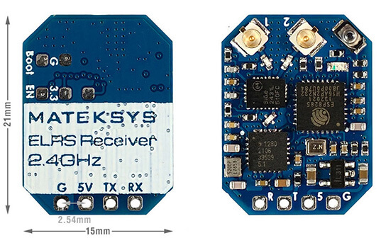
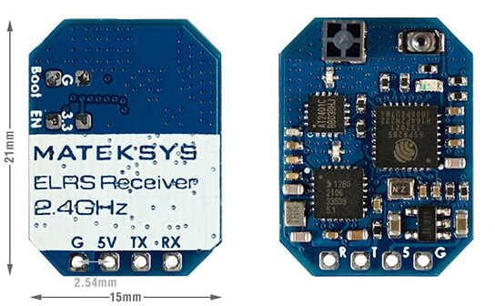
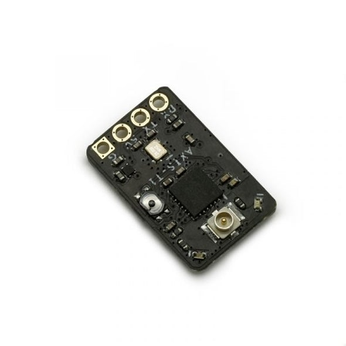

!!! tip "Hot Tip"
    Manufacturer-suggested Receiver UARTs, or UARTs alloted for Receivers usually have a pull-down resistor to aid with SBUS (RX pad inversion) which will result into SOLID LEDs on the ESP-based ExpressLRS Receivers. It is best to avoid those UARTs unless you know your UARTs.

    > When in doubt, avoid that UART. --deadbyte

!!! tip "Hint!"
    KISS FCs may label its UARTs differently. You might have to wire up the Rx pin into an RX pad, and the Tx pin into a TX pad. Always check your FC wiring guide/manual.

### R9MM/mini, R9mx, R9Slim, R9Slim+

<figure markdown>

</figure>

!!! attention ""
    Note: This will be the same wiring you'll use for flying and the subsequent firmware updates (via Passthrough). Forget the factory wiring guide!

AFTER you've flashed the [bootloader](r9.md#bootloaders) and wired your receiver as above, proceed to configure up your flight controller as shown on the [next page].

!!! note ""
    Note: R9 Slim requires flashing via STLink first. Passthrough should work for updates.

### Happymodel EP1, EP2, PP

<figure markdown>

<figcaption>Happymodel EP1 & EP2</figcaption>
</figure>

<figure markdown>

<figcaption>Happymodel PP</figcaption>
</figure>

Labels show the receiver pinouts and not to which pads to connect them (in case of the RX and Tx pads). As we're dealing with UART connection, Rx on receiver goes to a TX pad in the FC, and Tx on Receiver goes to an uninverted Rx pad on the FC.

There are certain FCs that puts their Receiver UART's RX pads Low, which in turn, puts the EP-based (e.g. EP1 and EP2) receivers to Bootloader mode unintentionally. One remedy is to wire them into a different UART, or wire a pull-up resistor (300-1k ohm) into the RX pad (FC Rx pad -> Resistor -> 3v3 pad).

Also of note is that the EP receivers require their Boot pads (see figure above) be bridged on first time Passthrough Flash from their factory firmwares. After the first passthrough flashing, the bridge needs to be removed, and is no longer needed for subsequent passthrough flashing.

Flashing via Wifi doesn't need the Boot Pads bridged. Moreover, if it is bridged, the receiver will stay in bootloader mode and won't activate the wifi hotspot.

Connect your FC to USB and configure your FC firmware as shown on the [next page].

### Happymodel ES900RX

<figure markdown>

</figure>

Shown above is the pinouts for the ES900RX receivers. Connect Rx to a Tx pad on the FC and Tx to an Rx pad on the FC. Additionally, the Boot Pads, encircled in the photo above, needs to be bridged in the first-time passthrough flash from the factory firmware.

As this is an ESP-based receiver, be aware that there are certain FCs that puts their Receiver UART's RX pads Low, which in turn, puts the receiver to Bootloader mode unintentionally. One remedy is to wire them into a different UART, or wire a pull-up resistor (300-1k ohm) into the RX pad (FC Rx pad -> Resistor -> 3v3 pad).

Should you be updating via Wifi, the bridging of the boot pads is not needed. 

Connect your FC to USB and configure your FC firmware as shown on the [next page].

### Happymodel ES915/868RX (Discontinued)

<figure markdown>

</figure>

Labels in the receiver show the pinouts. Connect Rx to a Tx pad in the FC and the Tx to an Rx pad in the FC. Of course, don't forget to connect VCC to a 5V pad, and GND to a GND pad on the FC.

Connect your FC to USB and configure your FC firmware as shown on the [next page].

### NamimnoRC Voyager & Flash

<figure markdown>

<figcaption>Namimno Voyager 900MHz Receiver</figcaption>
</figure>

<figure markdown>

<figcaption>Namimno Flash 2.4GHz Receiver</figcaption>
</figure>

Labels in the receiver show the pinouts. Connect Rx to a Tx pad in the FC and the Tx to an Rx pad in the FC. Of course, don't forget to connect VCC to a 5V pad, and GND to a GND pad on the FC.

Connect your FC to USB and configure your FC firmware as shown on the [next page].

### BetaFPV Receivers

<figure markdown>

<figcaption>BetaFPV 900MHz ExpressLRS Receiver</figcaption>
</figure>

<figure markdown>

<figcaption>BetaFPV 2.4GHz ExpressLRS Receiver</figcaption>
</figure>

<figure markdown>

<figcaption>BetaFPV 2.4GHz Lite Receivers (Flat & Tower)</figcaption>
</figure>

Shown above are the pinouts and various components of the receivers. Connect Rx to a Tx pad on the FC and Tx to an Rx pad on the FC. Don't forget to also wire up 5v(VCC) and Gnd.

Updating via WiFi is supported by these receivers.

Connect your FC to USB and configure your FC firmware as shown on the [next page].

### MatekSys Receivers

<figure markdown>

<figcaption>R24-D Diversity (Antenna)</figcaption>
</figure>

<figure markdown>

<figcaption>R24-S SMD Antenna</figcaption>
</figure>

Shown above are the pinouts and dimensions of the receivers. Connect Rx/R to a Tx pad on the FC and Tx/T to an Rx pad on the FC. Don't forget to also wire up 5v and Gnd.

Updating via WiFi is supported by these receivers.

Connect your FC to USB and configure your FC firmware as shown on the [next page].

### AxisFlying Receivers

<figure markdown>

<figcaption>Axisflying Thor</figcaption>
</figure>

Labels in the receiver show the pinouts. Connect Rx to a Tx pad in the FC and the Tx to an Rx pad in the FC. Of course, don't forget to connect VCC to a 5V pad, and GND to a GND pad on the FC.

Connect your FC to USB and configure your FC firmware as shown on the [next page].

!!! tip "Hint!"
    KISS FCs may label its UARTs differently. You might have to wire up the Rx pin into an RX pad, and the Tx pin into a TX pad. Always check your FC wiring guide/manual.

[next page]: configuring-fc.md