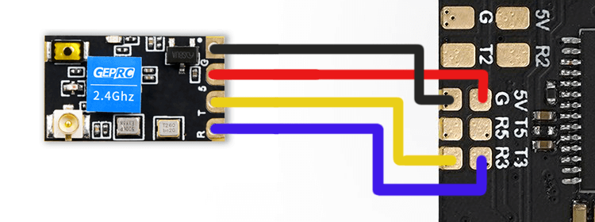
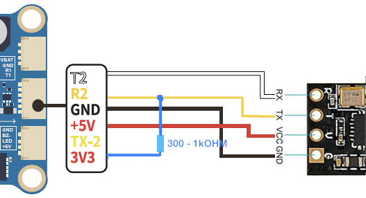

!!! tip "Hot Tip"
    Manufacturer-suggested Receiver UARTs, or UARTs alloted for Receivers usually have a pull-down resistor to aid with SBUS (RX pad inversion) which will result into SOLID LEDs on the ESP-based ExpressLRS Receivers. It is best to avoid those UARTs unless you know your UARTs.

!!! tip "Hint!"
    KISS FCs may label its UARTs differently. You might have to wire up the Rx pin into an RX pad, and the Tx pin into a TX pad. Always check your FC wiring guide/manual.

## Introduction

UART-based ExpressLRS Receivers use the CRSF Serial Protocol to communicate with a Flight Controller. This protocol uses two pins: one for the Control Signals and the other for the Telemetry Signals. Think of it as a two-lane, no-counterflow highway.

Here's a typical ExpressLRS Receiver pinout indicating to which Flight Controller pads each pin should be connected:

<figure markdown>

</figure>

The TX pin of an ExpressLRS Receiver sends or transmits the Control Signals it received from the Radio to the Flight Controller. Meanwhile, the RX pin of an ExpressLRS Receiver accepts or receives the Telemetry Data (like Battery Voltage, Current Draw, GPS Coordinates and/or Craft Attitude) from the Flight Controller for sending back to the Radio Handset.

??? Tip "What's a UART?"
    A UART is a pair of RX and TX pads on the Flight Controller. It's commonplace to refer to it as your Flight Controller's USB ports where you can connect different peripherals like a GPS or a Receiver. Only one device can occupy a UART and it can only do one function.

    R3 and T3 belongs to UART3; RX2 and TX2 belongs to UART2. Flight Controller Manufacturers label their UARTs differently. Some use just "R" and "T" followed by the UART number. Others use "RX" and "TX" followed by the UART number.

    __UART__ is an acronym for Universal Asynchronous Receiver/Transmitter

## Connecting a Receiver

Now that you have some basic info, connect your receiver to any free UART on your Flight controller. Check your Flight Controller Wiring Manual which UARTs you can use.

- The GND or G pad should be connected to any Ground pad on the Flight Controller(FC)
- The VCC or 5 pad should be connected to any 5v (or 4v5) pad on the Flight Controller(FC)
- The TX or T pad should be connected to an RX pad of the same UART number where the RX or R wire is on the Flight Controller(FC)
- The RX or R pad should be connected to a TX pad of the same UART number where the TX or T wire is on the Flight Controller(FC)

<figure markdown>

</figure>

Check for shorts between pads and clean up flux or any soldering residue if you have soldered the receiver yourself. 

!!! warning "Not so fast!"
    DO NOT shrink wrap or tuck away the receiver yet. We have to do some preliminary testing first!

Ensure there are no shorts on your wiring and power up the receiver.

- Best to power up the flight controller with a LiPo to ensure the receiver will work normally on flight-ready conditions. 
- It is important to ensure there are no shorts on your wiring BEFORE you power up the system.

Observe the Receiver LED. It should have one of these behaviors:

|| LED Indication | Status |
|---|---|---|
|| Slow blink 500ms on/off | Waiting for connection from transmitter |
|| Double blink then pause | Binding mode is active |
|| Fast blinking 25ms on/off | WiFi mode has started. Starts after 60s. |
|| Solid on | Bootloader mode is active |

If the Receiver uses an RGB LED(e.g. Foxeer LNA, BetaFPV SuperD, Happymodel EP Dual), the following can be observed:

| LED Indication | Status |
|---|---|
| Rainbow fade effect | Starting Up |
| Slow blink 500ms on/off | Waiting for connection from transmitter |
| Orange Double blink then pause | Binding mode enabled |
| Green heartbeat | WiFi mode has started. Starts after 60s  |

If the Receiver LED doesn't light up at all, quickly disconnect the power and check your wiring.

If your receiver has the RGB LED (e.g. Foxeer LNA, BetaFPV SuperD, Happymodel EP Dual), and the receiver LED is not lighting up despite making sure it's wired up correctly, this could mean that the Receiver is in Bootloader Mode.

If your Receiver LED lights up but it's just a Solid light, it is in Bootloader mode as the chart above indicates.

??? danger "My Receiver is in Bootloader Mode!"

    Here are the things you can do if the Receiver is in Bootloader Mode:

    1. Check if the Boot button on the Receiver is being pressed or if it's damaged.
        - If the button is being pressed or pinched, remove the cause of the pressing or pinching. Heatshrink can sometimes press a button on the receiver.
        - If the button is damaged, remove the button or replace the receiver with a better one. Consider asking the seller for a replacement.

    2. If the receiver doesn't have a Boot button and instead has a Boot pad, check if the Boot pad is not connected to a Ground pad. 
        - If the Boot pad is connected to a Ground pad, disconnect or remove the connection.

    3. Disconnect the RX and TX wires of the Receiver from the Flight Controller. Reconnect power to the drone or aircraft. Observe the LED on the Receiver once again.
        - If it starts Blinking Slowly (500ms Blink Pattern), you will need to move the receiver wiring to a different UART.
        - If the other UART is occupied by another peripheral, disconnect it and swap places with the Receiver.
        - If there is no other Full UART, you can try wiring a Pull-up Resistor: Connect a Resistor (300 Ohm to 1k Ohm value; a lower value is more effective) between this UART's RX pad and either a 5v or 3.3v pad as shown below:        

        <figure markdown>
        
        </figure>

    4. If you are using any of the Digital FPV systems like the DJI FPV Air Unit, Caddx Vista or DJI O3 Air Unit, and you wired or connected all six wires to your Flight Controller, you will need to remove the SBUS/DJI HDL wire.

If your receiver is behaving normally (i.e. not in Bootloader Mode), then you can power down your aircraft and proceed to the next step: [Configuring your Flight Controller](../receivers/configuring-fc.md)
