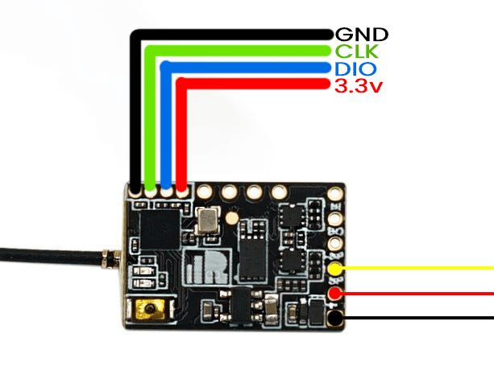

Disable readout protection as shown in this video:
<iframe width="560" height="315" src="https://www.youtube-nocookie.com/embed/SEYQ1HpRmk0" title="YouTube video player" frameborder="0" allow="accelerometer; autoplay; clipboard-write; encrypted-media; gyroscope; picture-in-picture" allowfullscreen></iframe>

## R9MM/Mini

Connect the STLink V2 into the pads shown below: `3v3`, `GND`, `C = CLK` and `D = DIO`. 

## R9MX

Connect the STLink V2 into the pads shown below: `3v3`, `GND`, `C = CLK` and `D = DIO`. 

## R9Slim
This RX requires an StLink v2 to be flashed. 

Wire up the RX to the STLink using `3v3`, `GND`, `CLK` and `DIO`. 

*Wiring the R9 Slim+ for STLink flashing will be the same*

## Jumper R900 Mini
This also requires an STLink, so the wiring is as follows: 
Wire `+ = 3v3`, `- = GND`, `C = CLK` and `D = DIO` to their respective pins on the RX from the StLink.

Because those pins are so small one option is to only solder a wire on the `CLK` and `DIO` then power it with the 5v pin with an external power source. 

## ES915RX (Discontinued)

Connect your STLink into `GND`, `DIO`, `CLK`, `3V3` of the receiver. These pads are marked clearly as in the image above.

**Use the Navigation Menu to proceed to the Flashing Guides for these Receivers (under the section `Flashing Receivers`).**