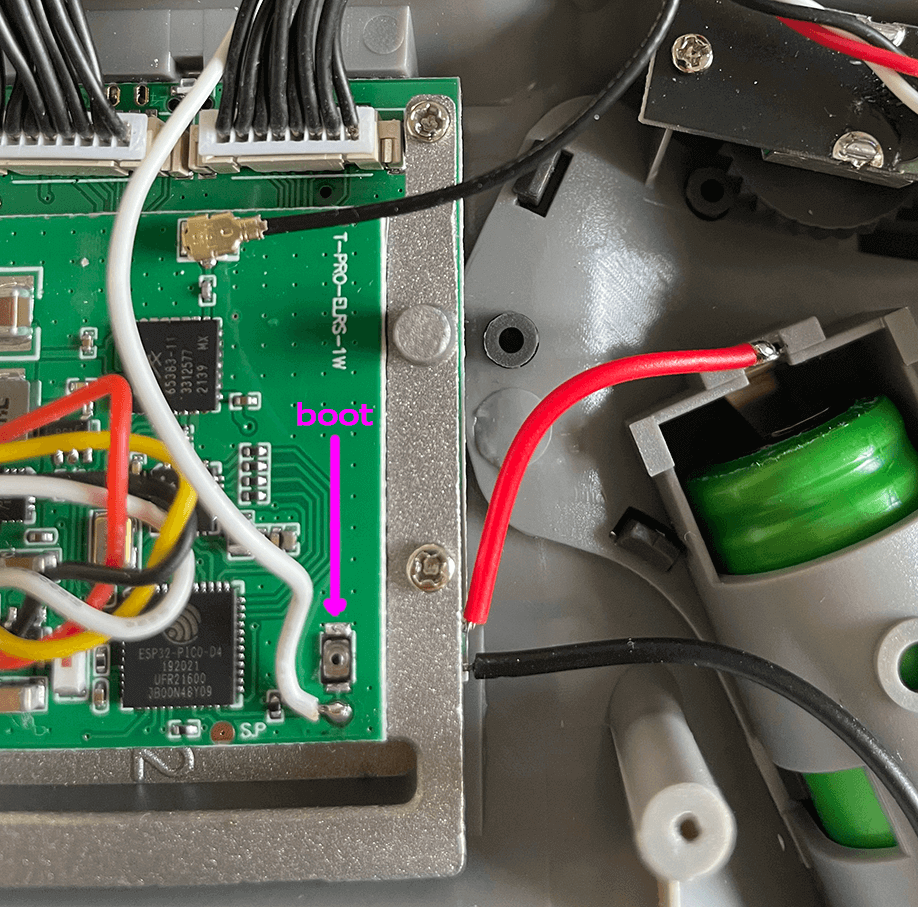

!!! danger "Flashing ExpressLRS 3.x Firmware"
    1. If flashing/updating for the first time from the factory firmware or an older firmware, flash the module to version 2.5.1.
    2. Use the [Repartitioner](https://github.com/ExpressLRS/repartitioner) binary [file](https://github.com/ExpressLRS/repartitioner/releases/download/1.0/repartitioner.bin) (right click, save as/save file as) to flash it.
        - If Target Mismatch error appears, click `Flash Anyway`.
    3. Follow method 1 or 2 from the WiFi Flashing Guide to flash to the 3.x firmware.
    
    !!! info "Repartitioner is not necessary when flashing via USB/UART."

    **Reference**: Joshua Bardwell's video on the topic can be found [here](https://www.youtube.com/watch?v=2kcRi1cHejM).

## Flashing Internal Jumper T-Pro

Following are the flashing methods for Internal Jumper T-Pro.

### Flashing via WiFi
??? Note "Flashing via WiFi"

    - Target: `Jumper_AION_T-Pro_2400_TX_via_WIFI`

    - Device Category: `Jumper 2.4 GHz`

    - Device: `Jumper AION T-Pro 2400 TX`

    <figure markdown>
    
    <figcaption>Flashing via WiFi</figcaption>
    </figure>

    #### Method 1
    ??? Note "Method 1"

        1. Select the correct target and set [Firmware Options] using the ExpressLRS Configurator.
        2. Build the firmware, which will open the Target folder where the `Jumper_AION_T-Pro_2400_TX-<version>.bin` file is located. Do not close this window so you can easily locate the correct file to upload to the module.

            <figure markdown>
            ![Build]
            </figure>

        3. Download the [ExpressLRS Lua script] (right-click, save as) and save it to your Radio's `/Scripts/Tools` folder.
        4. Insert the module into the module bay and make sure it's securely connected to the radio (see the [Radio Preparation](tx-prep.md) page).
        5. Execute the ExpressLRS Lua script by going to "System Menu" on your radio, then under Tools, select `ExpressLRS`.

            <figure markdown>
            
            </figure>

            <figure markdown>
            
            </figure>

            !!! Info "Troubleshooting the ExpressLRS Lua Script"
                If you encounter an issue where the script is stuck at `Loading...`, please refer to the [troubleshooting guide](http://localhost:8000/quick-start/troubleshooting/#expresslrs-lua-script-is-stuck-at-loading) for help.

            <figure markdown>
            
            </figure>

        6. From the ExpressLRS Lua script, select "WiFi Connectivity" and then "Enable WiFi". Confirm by pressing OK.

            <figure markdown>
            
            </figure>

        7. Connect to the Access Point created by the module, named `ExpressLRS TX`, using the password `expresslrs`.

            <figure markdown>
            
            </figure>

        8. Open your browser and navigate to http://10.0.0.1/ to access the upload form. Scroll down to find the form.
        9. Drag and drop the firmware file, `Jumper_AION_T-Pro_2400_TX-<version>.bin`, created by the ExpressLRS Configurator. Alternatively, use the `Choose File` button to select the file from the folder where the firmware was created.
        10. Ensure that you have selected the correct firmware file and click `Update`.

            <figure markdown>
            
            </figure>

        11. Once the file is uploaded, a pop-up confirmation will show up.

            <figure markdown>
            
            </figure>
            
        12. Wait for the confirmation pop-up and for the "WiFi Running" screen to close.
        13. Close and relaunch the script.
        14. Verify the firmware version and hash in the main screen of the ExpressLRS Lua script.

        !!! info
            You can configure Home Network SSID and Password if you chose not to use ExpressLRS Configurator to set them. Once these are set, you can use the next two methods below.

        <figure markdown>
        
        </figure>

    #### Method 2
    ??? Note "Method 2"

        1. Select the correct target and set [Firmware Options] using the ExpressLRS Configurator.
        2. Build the firmware, which will open the Target folder where the `Jumper_AION_T-Pro_2400_TX-<version>.bin` file is located. Do not close this window so you can easily locate the correct file to upload to the module.

            <figure markdown>
            ![Build]
            </figure>

        3. Using the [ExpressLRS Lua script] (right-click, save as), select "WiFi Connectivity" and then "Enable WiFi". Confirm by pressing OK.

            <figure markdown>
            
            </figure>

        4. If you have previously set up your Tx Module with your home WiFi network details, it will connect automatically.
        5. Using a browser, navigate to http://elrs_tx.local.
        6. The WiFi Update page will appear. Scroll down to the "Firmware Update" section.

            <figure markdown>
            
            </figure>

        7. Drag-and-drop the `Jumper_AION_T-Pro_2400_TX-<version>.bin` file created by the ExpressLRS Configurator into the "Choose File" field, or manually navigate to the folder and select the file.
        8. Click the "Update" button. Wait for the process to complete (approx. 1 minute).
        9. Close and relaunch the script.
        10. Verify the version and hash in the main screen of the ExpressLRS Lua script.

    #### Method 3
    ??? Note "Method 3"

        1. Using the [ExpressLRS Lua script] (right-click, save as), select "WiFi Connectivity" and then "Enable WiFi". Confirm by pressing OK.

            <figure markdown>
            
            </figure>

        2. If you have previously set up your Tx Module with your home WiFi network details, it will connect automatically.
        3. Select the correct target and set [Firmware Options] using the ExpressLRS Configurator.
        4. Click **Build and Flash**. Wait for the compile process to complete.

            <figure markdown>
            ![Build & Flash]
            </figure>

        5. Once done, you should see a Success message, marking the update process complete.

            <figure markdown>
            
            </figure>

        6. Close and relaunch the script.
        7. Verify the version and hash in the main screen of the ExpressLRS Lua script.

## Steps to recover bricked internal module:

1. Download EdgeTX binary:
    - Allows you to use USB port on the radio to reflash the module
    - Download from [here](../../assets/recovery/tpro-ada778ee4.bin) (Right-click, Save-as)
    - Save it in Jumper T-Pro SD Card `/firmware` folder
    !!! Note
        Package not needed if radio is updated to EdgeTX 2.7.0
2. Download zip file with recovery scripts and firmwares:
    - Download from [here](../../assets/recovery/jumper-recover.zip) (Right-click, Save-as)
    - Extract it into a folder on hard drive
    - If desired, build `firmware.bin` file first via ExpressLRS Configurator
    - Replace `firmware.bin` in extracted folder to include Binding Phrase and [Firmware Options]

### Procedure

- Place the EdgeTX binary in the `/firmware` folder of the SD Card.
- Enter DFU/Bootloader mode by holding the trim switches inward and pressing the power button. Release the button and trim switches to enter DFU/Bootloader mode.
- Write the firmware into the radio and reboot to ensure it has been written.
- Verify the firmware has been written by checking for the USB Serial (Debug/VCP) menu item after plugging in a USB cable.
- Turn off the radio.
- Take apart the radio using a small Philips screwdriver (10 screws hold the two halves together).

<figure markdown>

</figure>

!!! warning "Handle with Care"
    There are a couple of wires connecting the module to the main board of the radio, along with battery leads. Do not yank out the back cover of the radio from its front half. You can leave the battery in its cradle as you will need to power up the radio in the next steps.

!!! Note
    Leave all wiring intact as it is necessary for the next steps.

- Power up the radio and make sure the internal ExpressLRS module is the active one.
- Plug in a USB cable and select `USB Serial (Debug)` or `USB Serial (VCP)`.
- Check Device Manager on Windows and make sure device is detected as "STMicroelectronics Virtual COM Port."
- If not and yellow warning icons are displayed for the RadioMaster Serial Port, install drivers from [here](https://www.st.com/en/development-tools/stsw-stm32102.html).
- For Windows 10, use the `W7_x64` executable.

<figure markdown>

</figure>

- Open the folder containing the extracted recovery scripts.
- Locate the Boot button on the Internal ExpressLRS module.
- Press and hold the Boot button.
- Double-click the recover.bat script.
- Release the Boot button when you see the Features: line appear.

<figure markdown>

</figure>

<figure markdown>

</figure>

- Wait for the recovery process to finish. You will see a message `Hard resetting via RTS pin...` once it's done. The script should terminate on its own.
- Unplug the USB cable from the T-Pro and check with the Lua Script if the Internal module has been successfully restored.
- If you used the original `firmware.bin` file in the Recovery zip, it doesn't include your previous `Binding Phrase` or other [Firmware Options]. You'll need to reflash the module via WiFi using the steps outlined above.
- Don't forget to reassemble the T-Pro, making sure not to lose any screws.

## Recovery Method via EdgeTX Passthrough

!!! note
    This could soon supersede the steps above. This method could also change slightly in the near future.

You'll need the following:

1. A piece of wire about 4" (10cm) in length.
2. An EdgeTX Build that gives the `USB Serial(Debug)` or `USB Serial (VCP)` option when a USB Data cable is connected. You can download it [here](../../assets/recovery/tpro-ada778ee4.bin) (Right-click, Save-as). **NOTE** if your radio is already updated to EdgeTX 2.7.0, this package is no longer needed.

### Procedure

- Place the EdgeTX binary in /firmware SD Card folder.
- Boot the radio into DFU/Bootloader mode: hold trim switches inwards, press power button, release button and trim switches.
- Write firmware into the radio, then reboot to confirm it's written.
- Check if USB Serial (Debug/VCP) menu item is available after connecting a USB cable.
- Turn off the radio.
- Take apart the radio using a small Philips screwdriver (10 screws).

<figure markdown>

</figure>

!!! warning "Handle with Care"
    There are a couple of wires connecting the module to the main board of the radio, along with battery leads. Do not yank out the back cover of the radio from its front half. You don't need to disconnect the wires from the mainboard.

Once you have both halves of the radio apart,

- Solder a wire on the Boot pad in the radio
- Connect one end of the wire to one of the momentary switches
- Refer to the image below for the correct location to solder the ends of the wire.

<figure markdown>

</figure>

Once the wire is properly soldered, 
- Reassemble the radio. 
- Tighten up the 10 screws to secure both halves of the radio. 

!!! note
    If you're planning to use the switch as an Aux channel, you might want to remove the wire afterward. Leaving this wire connected means the Aux channel will output a constant "High" signal.

- Replace battery (if removed) and power up the radio
- Make sure internal ExpressLRS module is active
- Plug in USB cable
- Select USB Serial (Debug) or USB Serial (VCP) as shown below

<figure markdown>

</figure>

- On Windows, check Device Manager for the STMicroelectronics Virtual COM Port device. If not and you are seeing a bunch of Yellow Warning icons, download the drivers from [here](https://www.st.com/en/development-tools/stsw-stm32102.html) and extract the contents. Run the VCP_V1.5.0_Setup_W7_x64_64bits executable.

    <figure markdown>
    
    </figure>

- In the ExpressLRS Configurator, select the correct Device Target and Device(`Jumper AION T-Pro 2400 TX`) and set the Flashing method to `EdgeTXPassthrough`. 

- Set your [Firmware Options] and click **Build and Flash** and wait for the Success banner.

<figure markdown>

<figcaption>Flashing via EdgeTXPassthrough</figcaption>
</figure>

- Wait for the Passthrough Init or Passthrough Done section of the log
- Press the switch in the radio where the boot button is wired
- Hold it until the script has connected
- See the image below for correct timing

<figure markdown>

</figure>

- If you didn't get it right and it fails, don't worry. Just retry and it should go through.

<figure markdown>

</figure>

- Unplug the USB and check via the ExpressLRS Lua script your module is flashed and working properly again.

## Recovery Method via FTDI or USB to Serial Adapter

### Requirements

- FTDI dongle or USB to Serial Adapter
- Installed and recognized Serial Adapter drivers
- Radio disassembly for access to module connections and boot button

### Procedure

- Turn off radio and remove battery
- Take off back cover of radio by loosening 10 small Philips screws.

<figure markdown>

</figure>

!!! warning "Handle with Care"
    There are a couple of wires connecting the module to the main board of the radio, along with battery leads. Do not yank out the back cover of the radio from its front half. You don't need to disconnect the wires from the mainboard, but if you do so, be very careful!

- Need 4 wires connecting ExpressLRS internal module to Module daughterboard
- Pin-out as follows:
    - White wire: RX
    - Yellow wire: TX
    - Red wire: 5v
    - Black wire: Gnd

<figure markdown>

</figure>

- Connect the 4 wires into your FTDI dongle or a USB to Serial Adapter as follows
    - Connect RX to TX
    - Connect TX to RX
    - Connect 5v to 5v
    - Connect Gnd to Gnd

<figure markdown>

</figure>

- Hold down the Boot button. Keep the button pressed until you have connected the Serial Adapter to your USB port
- Connect the FTDI dongle/Serial Adapter to the USB port of your computer
- Use the `via UART` flashing method on the ExpressLRS Configurator
- Set [Firmware Options]
- Click **Build and Flash**
- Wait for the process to complete

<figure markdown>

<figcaption>Flashing via UART</figcaption>
</figure>

- Verify connections are correct and secure.
- Press and hold the boot button.
- Connect the Serial Adapter to the USB port.
- Verify success of reflash by checking for "Success" banner.
- Carefully unplug the Serial Adapter and disconnect the module pins.
- Reinsert the connector into the module port as shown below.

<figure markdown>

</figure>

- Reassemble the radio, excluding screws.
- Verify module is working by running the Lua script.
- Replace screws and tighten.
- Celebrate!

[ExpressLRS Lua script]: https://github.com/ExpressLRS/ExpressLRS/blob/3.x.x-maintenance/src/lua/elrsV3.lua?raw=true
[Build]: ../../assets/images/Build.png
[Build & Flash]: ../../assets/images/BuildFlash.png
[Firmware Options]: ../firmware-options.md

