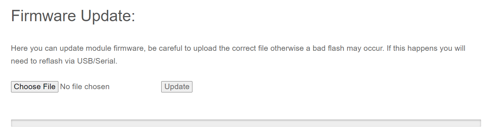

## Flashing via WiFi

- Target: `AXIS_THOR_2400_TX_via_WIFI`

- Device Category: `AXIS 2.4 GHz`

- Device: `AXIS THOR 2400TX`

<figure markdown>

<figcaption>Flashing via WiFi</figcaption>
</figure>

!!! attention
    The methods below apply if you've already updated your Tx modules to 2.x. For modules still in firmwares pre 2.x, you should use 1.x WiFi flashing method to update to 2.x. Or update to 2.x via USB instead.

### Method 1

With the correct target selected and [Firmware Options] set, **Build** your firmware using the ExpressLRS Configurator.

<figure markdown>
![Build]
</figure>

Once it's done, it should open the Target folder for you where the `AXIS_THOR_2400_TX-<version>.bin` file is. Do not close this window so you can easily locate the correct file to upload to the module.

The next steps will require the [ExpressRLS Lua script] (right-click, save as). Download the ExpressLRS Lua script and save it to your Radio's `/Scripts/Tools` folder. Insert/attach your module into your module bay and make sure it's not loose and there's a proper connection with the radio (see the [Radio Preparation](tx-prep.md) page). Execute the ExpressLRS Lua script by pressing "System Menu" on your radio and then under Tools, select `ExpressLRS`.

<figure markdown>

</figure>

<figure markdown>

</figure>

If the script is stuck at `Loading...`, then there's a chance your module is still in v1.x firmware, your External RF module is not set to CRSF or your module is not well-connected to the module bay pins.

<figure markdown>

</figure>

Select **WiFi Connectivity** from the Lua script and then select **Enable WiFi**. Press OK once more to activate the WiFi on the Tx Module. Connect to the Access Point the module will create called `ExpressLRS TX`, with the password being `expresslrs`.

<figure markdown>

</figure>

Using your browser, navigate to the correct page (typically http://10.0.0.1/) and it should show an upload form (you will have to scroll down a bit). You can drag-and-drop the `AXIS_THOR_2400_TX-<version>.bin` file that the ExpressLRS Configurator created. You can also click the `Choose File` button and navigate to the folder where the firmware was created. Ensure that you have selected the correct firmware file and click `Update`.

Once the file is uploaded, a pop-up confirmation will show up.

<figure markdown>

</figure>

Wait for the Lua script screen to close the "WiFi Running" screen and your module should be updated now.

Verify the version and hash in the main screen of the ExpressLRS Lua script.

**Join Local Network**

You can configure Home Network SSID and Password if you chose not to use ExpressLRS Configurator to set them. Once these are set, you can use the next two methods below.

<figure markdown>

</figure>

### Method 2

With the correct target selected and [Firmware Options] set, **Build** your firmware using the ExpressLRS Configurator.

<figure markdown>
![Build]
</figure>

Once it's done, it should open the Target folder for you where the `AXIS_THOR_2400_TX-<version>` file is. Do not close this window so you can easily locate the correct file to upload to the module.

Using the [ExpressLRS Lua script] (right-click, save as), select `Wifi Connectivity` then choose `Enable WiFi` and if you have flashed your Tx Module with your Home WiFi Network details or have set it in the Join Network section of the Update Page, it will connect to the local network automatically.

Using your browser, navigate to http://elrs_tx.local and the WiFi Update page should show up. Scroll down towards the Firmware Update section, as shown below:

<figure markdown>

</figure>

Drag-and-drop the `AXIS_THOR_2400_TX-<version>.bin`  file created by the ExpressLRS Configurator into the Choose File field, or manually navigate to the Folder by clicking the `Choose File` button. Once the correct file is selected, click the `Update`. Wait for the process to complete, and the module will reboot (~1min).

Verify the version and hash in the main screen of the ExpressLRS Lua script.

### Method 3

Using the [ExpressLRS Lua script] (right-click, save as), select `Wifi Connectivity` then choose `Enable WiFi` and if you have flashed your Tx Module with your Home WiFi Network details or have set it in the Join Network section of the Update Page, it will connect to the network automatically.

Using the ExpressLRS Configurator, select the correct Target and set your [Firmware Options]. Click **Build and Flash** and wait for the compile process to complete. You should see a section as pictured below and the Success message marking the update process complete.

<figure markdown>
![Build & Flash]
</figure>

<figure markdown>

</figure>

Verify the version and hash in the main screen of the ExpressLRS Lua script.

## Flashing via USB/UART

- Target: `AXIS_THOR_2400_TX_via_UART`

- Device Category: `AXIS 2.4 GHz`

- Device: `AXIS THOR 2400TX`

<figure markdown>

<figcaption>Flashing via UART</figcaption>
</figure>

Attach a USB Data Cable to your module and Computer. Windows users might have to install [CP210x Drivers](https://www.silabs.com/developers/usb-to-uart-bridge-vcp-drivers) to ensure the device is properly detected and initialized. 

<figure markdown>

</figure>

!!! note
    To flash the TX itself, the switch on the back side of the module must be set to the **leftmost** position. To flash the TX backpack, the switch must be set to the **rightmost** position. For normal operation, the switch must be **centered**.
    
<figure markdown>

</figure>

Using the ExpressLRS Configurator with the correct Target selected and [Firmware Options] set, hit **Build & Flash**. Wait for the process to finish, and you should be greeted with the "Success" message.

<figure markdown>
![Build & Flash]
</figure>

Verify the version and hash in the main screen of the ExpressLRS Lua script.

## Using the module on a DX9

- Install the latest DX9 firmware with CRSF v2 support via Serial port.
- Wire up Power (Vbat & GND) as per Crossfire install instructions.
- Use Signal from DX9 to S.Port pin of the Thor TX module.
- Optional: Connect an external power source via XT30.
- Flash the TX module with `UART_INVERTED` **unchecked**.
- Adjust your Packet Rate to 250Hz using the Screen & Joystick.

## Acknowledgement

This guide is contributed by discord user ChaserP.

[ExpressLRS Lua script]: https://github.com/ExpressLRS/ExpressLRS/blob/3.x.x-maintenance/src/lua/elrsV3.lua?raw=true
[Build]: ../../assets/images/Build.png
[Build & Flash]: ../../assets/images/BuildFlash.png
[Firmware Options]: ../firmware-options.md
