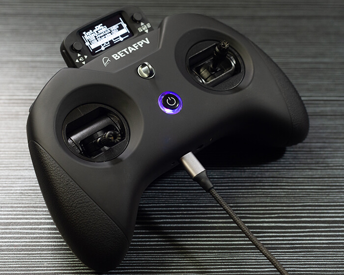
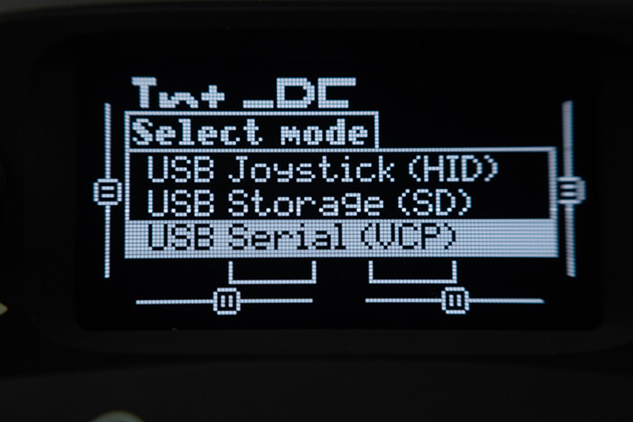
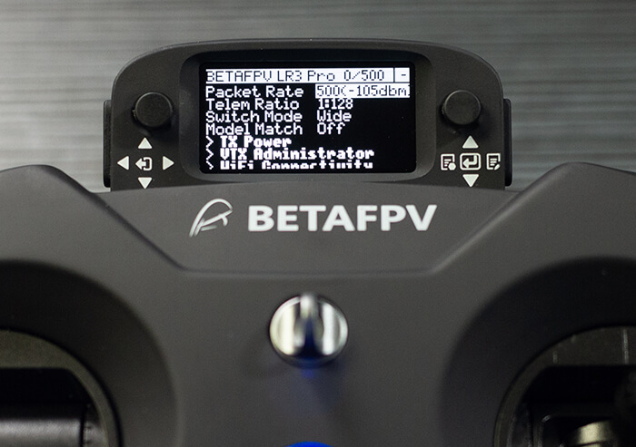

!!! danger "Advisory"
    If you are flashing/updating your TX module via WiFi for the first time from the factory firmware, or from an older firmware, to ExpressLRS 3.x firmware you will first need to flash it to version 2.5.1 then flash it with the [Repartitioner](https://github.com/ExpressLRS/repartitioner) binary [file](https://github.com/ExpressLRS/repartitioner/releases/download/1.0/repartitioner.bin) (right click, save as/save file as). Should it complain about Target Mismatch, just click `Flash Anyway`. Only then you can flash to 3.x firmware following method 1 or 2 from the WiFi Flashing Guide below.

    Joshua Bardwell has a video about it [here](https://www.youtube.com/watch?v=2kcRi1cHejM).

    Repartitioner is not needed if flashing via USB/UART.

## Flashing via EdgeTX Passthrough

- Target: `BETAFPV_2400_TX_LITERADIO3_via_ETX`

- Device Category: `BETAFPV 2.4 GHz`

- Device: `BETAFPV LiteRadio 3 Pro`

Before starting, make sure that the Serial Ports, USB-VCP setting is set to `CLI` mode on your Radio. This setting can be found in the `System Menu` -> `Hardware` Page.

With your handset turned on, connect a USB data cable to the USB port of the Radio. Select `USB Serial(VCP)` in the options window that pops up. 

<figure markdown>

</figure>

<figure markdown>

</figure>

!!! tip "Important"
    This is a vital step and a common failure point. Pay attention.

Windows users should check Device Manager and make sure your device is being detected as **STMicroelectronics Virtual COM Port** device. 

<figure markdown>

</figure>

If not and you're seeing a bunch of Yellow Warning icons for the BetaFPV Lite Radio 3 Serial Port, download the drivers from [here](https://www.st.com/en/development-tools/stsw-stm32102.html). Extract/unzip the contents of the package into a folder and run the `VCP_V1.5.0_Setup_W7_x64_64bits` executable. 

Using the ExpressLRS Configurator, select the appropriate version and the correct Device Target and set the Flashing method to `EdgeTXPassthrough`.

<figure markdown>

<figcaption>Flashing via EdgeTXPassthrough</figcaption>
</figure>

Select the `Regulatory Domain` appropriate for your location.

Set your Binding Phrase (optional) and other relevant [Firmware Options] like Local WiFi Network SSID and password.

Once that's done, click **Build and Flash** and wait for the Success banner from the Configurator.

<figure markdown>
![Build & Flash]
</figure>

Unplug the USB and verify with the [ExpressLRS Lua script] (right-click, save as) you have a working internal module and that you have updated to the version you have selected.

<figure markdown>

</figure>

## Flashing via WiFi

- Target: `BETAFPV_2400_TX_LITERADIO3_via_WIFI`

- Device Category: `BETAFPV 2.4 GHz`

- Device: `BETAFPV LiteRadio 3 Pro`

<figure markdown>

<figcaption>Flashing via WiFi</figcaption>
</figure>

### Method 1

With the correct target selected and [Firmware Options] set, **Build** your firmware using the ExpressLRS Configurator.

<figure markdown>
![Build]
</figure>

Once it's done, it should open the Target folder for you where the `BETAFPV_2400_TX_LITERADIO3-<version>.bin` file is. Do not close this window so you can easily locate the correct file to upload to the module.

Execute the ExpressLRS Lua script by pressing "System Menu" on your radio and then under Tools, select `ExpressLRS`. If the ExpressLRS Lua script is not in the list, download it from [here] (right-click, save as) and save it to your Radio's `/Scripts/Tools` folder.

<figure markdown>

</figure>

Select **WiFi Connectivity** from the Lua script and then select **Enable WiFi**. Press OK once more to activate the WiFi on the Tx Module. Connect to the Access Point the module will create called `ExpressLRS TX`, with the password being `expresslrs`.

<figure markdown>

</figure>

<figure markdown>

</figure>

Using your browser, navigate to the correct page (typically http://10.0.0.1/) and it should show an upload form (you will have to scroll down a bit). You can drag-and-drop the `BETAFPV_2400_TX_LITERADIO3-<version>.bin` file that the ExpressLRS Configurator created. You can also click the `Choose File` button and navigate to the folder where the firmware was created. Ensure that you have selected the correct firmware file and click `Update`.

<figure markdown>

</figure>

Once the file is uploaded, a pop-up confirmation will show up.

<figure markdown>

</figure>

Wait for the Lua script screen to close the "WiFi Running" screen and your module should be updated now.

Verify the version and hash in the main screen of the ExpressLRS Lua script (you will first need to close it and relaunch the script).

**Join Local Network**

You can configure Home Network SSID and Password if you chose not to use ExpressLRS Configurator to set them. Once these are set, you can use the next two methods below.

<figure markdown>

</figure>

### Method 2

With the correct target selected and [Firmware Options] set, **Build** your firmware using the ExpressLRS Configurator.

<figure markdown>
![Build]
</figure>

Once it's done, it should open the Target folder for you where the `BETAFPV_2400_TX_LITERADIO3-<version>.bin` file is. Do not close this window so you can easily locate the correct file to upload to the module.

Using the [ExpressLRS Lua script] (right-click, save as), select `Wifi Connectivity` then choose `Enable WiFi` and if you have flashed your Tx Module with your Home WiFi Network details or have set it in the Join Network section of the Update Page, it will connect to the local network automatically.

<figure markdown>

</figure>

Using your browser, navigate to http://elrs_tx.local and the WiFi Update page should show up. Scroll down towards the Firmware Update section, as shown below:

<figure markdown>

</figure>

Drag-and-drop the `BETAFPV_2400_TX_LITERADIO3-<version>.bin` file created by the ExpressLRS Configurator into the Choose File field, or manually navigate to the Folder by clicking the `Choose File` button. Once the correct file is selected, click the `Update`. Wait for the process to complete, and once the file is uploaded, a pop-up confirmation will show up.

<figure markdown>

</figure>

Wait for the Lua script screen to close the "WiFi Running" screen and your module should be updated now.

Verify the version and hash in the main screen of the ExpressLRS Lua script (you will first need to close it and relaunch the script).

### Method 3

Using the [ExpressLRS Lua script] (right-click, save as), select `Wifi Connectivity` then choose `Enable WiFi` and if you have flashed your Tx Module with your Home WiFi Network details or have set it in the Join Network section of the Update Page, it will connect to the network automatically.

<figure markdown>

</figure>

Using the ExpressLRS Configurator, select the correct Target and set your [Firmware Options]. Click **Build and Flash** and wait for the compile process to complete. 

<figure markdown>
![Build & Flash]
</figure>

You should see a section as pictured below and the Success message marking the update process complete.

<figure markdown>

</figure>

Wait for the Lua script screen to close the "WiFi Running" screen and your module should be updated now.

Verify the version and hash in the main screen of the ExpressLRS Lua script (you will first need to close it and relaunch the script).

[ExpressLRS Lua script]: https://github.com/ExpressLRS/ExpressLRS/blob/3.x.x-maintenance/src/lua/elrsV3.lua?raw=true
[Build]: ../../assets/images/Build.png
[Build & Flash]: ../../assets/images/BuildFlash.png
[Firmware Options]: ../firmware-options.md
