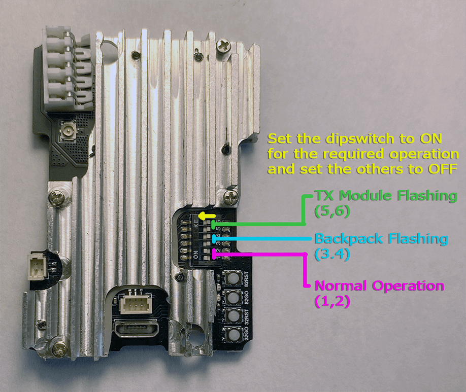

!!! note 
    This guide applies to all of the following HappyModel TX modules: ES24TX, ES24TX Lite, ES24TX Iron Man, ES24TX Slim Pro and ES24TX Pro Micro. Any module with "Pro" in the name uses the `_Pro_Series` target.

!!! danger "Advisory"
    If you are flashing/updating your TX module via WiFi for the first time from the factory firmware, or from an older firmware, to ExpressLRS 3.x firmware, you will first need to flash it to version 2.5.2, then flash it with the [Repartitioner](https://github.com/ExpressLRS/repartitioner) binary [file](https://github.com/ExpressLRS/repartitioner/releases/download/1.0/repartitioner.bin) (right click, save as/save file as). Should it complain about Target Mismatch, just click `Flash Anyway`. Only then you can flash to 3.x firmware via WiFi.

    Joshua Bardwell has a video about it [here](https://www.youtube.com/watch?v=2kcRi1cHejM).

    Updating to 3.x via UART or ETX Passthrough doesn't require 2.5.2 firmware or the Repartitioner.

## Flashing/Updating your TX Module Firmware

=== "via WiFi"

    <figure markdown>
    
    </figure>

    === "Manual Upload via AP"

        !!! Info "Heads up!"
            This option is only possible if you haven't previously flashed or configured your TX Module with your Home WiFi SSID and Password or if it's unable to connect to said WiFi Network because the router is Off or unreachable.

        1. Launch the [ExpressLRS Configurator](../installing-configurator.md) on your Computer.
            ![Configurator Release]{ align=right }

            - Make sure `Official Releases` is active from the horizontal tab.
            - Ensure you select the Released version you want to flash into your TX module.

             

        2. Select the Device Category and Device target matching your hardware.

            - Device Category: 
                - `Happymodel 2.4 GHz`

            - Device:
                - `HappyModel ES24 2.4GHz TX` for ES24TX (non-Pro Micro), ES24TX Lite, ES24TX Slim
                - `HappyModel ES24 Pro 2.4GHz TX` for ES24TX Pro Micro
                - `HappyModel ES24 Slim Pro 2.4GHz TX` for ES24TX Slim Pro

        3. Set the Flashing Method to `WiFi`.

            <figure markdown>
            
            </figure>

        4. Set the [firmware options](../firmware-options.md) for your device.
            - Regulatory Domain (Mandatory. Choose the domain appropriate for the location or country you're flying).
            - Binding Phrase (Optional, but Highly Recommended. Note this phrase as it should be the same on your other devices, or they will not bind or sync).
            - Local WiFi Network Credentials (Optional. Will be used the next time the device goes into WiFi mode).
        5. Click the ++"Build"++ button.
            
            <figure markdown>
            ![Build]
            </figure>
            
        6. Once the Build process is done, a Temp folder window containing your firmware binaries should pop up.

            ![Temp TX]{ align=right }

            - Do not close this Temp folder because this is where you will take your firmware from in the later steps. If you are planning on using your phone or tablet to upload the firmware file later, copy the firmware file into your device.

            !!! tip "NOTICE"
                With the release of ExpressLRS 3.3.0 and ExpressLRS Configurator 1.6.0, only one file will show up. Use the `firmware.bin` file for the next steps.

             
            
        7. Press the ++"SYS"++ Key on your Radio to display the Tools Menu, where you can find the Lua Scripts.
            - Older Radios or those with only one Menu Key must long-press the ++context-menu++ Key to access the System Menu.
            - Consult your Radio User's Manual on how to access the System Menu.

        8. Scroll down and select `ExpressLRS` Lua Script.

            <figure markdown>
            ![Lua Script]
            </figure>

            - If the script is nowhere to be found, download it from [this page](../transmitters/lua-howto.md) and save it into your Radio SD Card Scripts/Tools/ folder.

        9. Press ++enter++ to Load it.

            <figure markdown>
            ![Lua Running]
            </figure>

            - If the script is stuck on a "Loading..." screen, return to the [Radio Preparation](../transmitters/tx-prep.md) Page and make sure you have configured your radio properly for ExpressLRS use.
        10. Scroll down and select `WiFi Connectivity` and press ++enter++.
        11. Select `Enable WiFi` and press ++enter++.

            <figure markdown>
            ![Lua WiFi]
            </figure>

        12. The `WiFi Running` screen will show up. Your TX module is now in WiFi mode.
            - Do not worry if the Script stops and shows a Syntax Error. The module is still in WiFi mode. The Syntax Error could be because you're on an older radio, older EdgeTX/OpenTX firmware, or both. It could also be because your TX module is on an earlier firmware version, and you're using a more recent Lua Script.

        13. Using a WiFi-capable device such as your smartphone or laptop, scan for the `ExpressLRS TX` Access Point. Connect to this Access Point.

            { align=right }

            - If your TX Module is previously flashed with your Home WiFi SSID and Password, and it is able to connect to that WiFi Network, then the Access Point will not show up.
            - `expresslrs` is the Password for this Access Point.

            ??? question "Where's the Access Point?"
                If you cannot find the Access Point, make sure the device you're using is capable of connecting to 2.4GHz WiFi Networks. Also try putting the devices closer together.
                
                If you still cannot find the Access Point, chances are that you have set it with your WiFi SSID and Password before, and it has connected to your WiFi Network.

             

        14. Once connected to the `ExpressLRS TX` Access Point, open up a Browser window, type in the IP Address `10.0.0.1` on the Address Bar, and press ++enter++. The ExpressLRS Web UI will load.
        15. Activate the `Update` Tab.

            <figure markdown>
            ![TX update tab]
            </figure>

            - If your TX Module is still on an earlier firmware version, then there's no Update Tab, and instead, you will need to scroll down to find the Firmware Update section.

            <figure markdown>
            ![Old File Upload]
            </figure>

        16. Drag and drop the Firmware file from the Temp folder into the File Upload field.
            - You can also use the Browse or Choose File button and browse for the file yourself, especially if you've copied/moved it somewhere else on an earlier step.
        17. Click the ++"Update"++ button to start the Updating procedure.
        18. Wait for the firmware file to get uploaded and flashed into your device. It only takes a minute or two, and you will see the Success Popup Message.

            <figure markdown>
            ![Success WiFi]
            </figure>

        19. On your Radio, the `WiFi Running` screen should disappear and should be back to the WiFi Connectivity Menu of the ExpressLRS Lua Script.
        20. Long-press the ++"RTN"++ Key to exit the ExpressLRS Lua Script. Then reload it to check for the ExpressLRS Firmware version and verify your TX module has been updated.

    === "Manual Upload via Local WiFi"

        !!! Info "Heads up!"
            This option is only possible if you have previously flashed or configured your TX Module with your Home WiFi SSID and Password and the module is able to connect to said WiFi Network.

        1. Launch the [ExpressLRS Configurator](../installing-configurator.md) on your Computer.
            ![Configurator Release]{ align=right }

            - Make sure `Official Releases` is active from the horizontal tab.
            - Ensure you select the Released version you want to flash into your TX module.

             
        2. Select the Device Category and Device target matching your hardware.

            - Device Category: 
                - `Happymodel 2.4 GHz`

            - Device:
                - `HappyModel ES24 2.4GHz TX` for ES24TX (non-Pro Micro), ES24TX Lite, ES24TX Slim
                - `HappyModel ES24 Pro 2.4GHz TX` for ES24TX Pro Micro
                - `HappyModel ES24 Slim Pro 2.4GHz TX` for ES24TX Slim Pro

        3. Set the Flashing Method to `WiFi`.

            <figure markdown>
            
            </figure>

        4. Set the [firmware options](../firmware-options.md) for your device.
            - Regulatory Domain (Mandatory. Choose the domain appropriate for the location or country you're flying).
            - Binding Phrase (Optional, but Highly Recommended. Note this phrase as it should be the same on your other devices, or they will not bind or sync).
            - Local WiFi Network Credentials (Optional. Will be used the next time the device goes into WiFi mode).
        5. Click the ++"Build"++ button.
            
            <figure markdown>
            ![Build]
            </figure>
            
        6. Once the Build process is done, a Temp folder window containing your firmware binaries should pop up.
            ![Temp TX]{ align=right }

            - Do not close this Temp folder because this is where you will take your firmware from in the later steps. If you are planning on using your phone or tablet to upload the firmware file later, copy the firmware file into your device.

            !!! tip "NOTICE"
                With the release of ExpressLRS 3.3.0 and ExpressLRS Configurator 1.6.0, only one file will show up. Use the `firmware.bin` file for the next steps.

             
        7. Press the ++"SYS"++ Key on your Radio to display the Tools Menu, where you can find the Lua Scripts.
            - Older Radios or those with only one Menu Key must long-press the ++context-menu++ Key to access the System Menu.
            - Consult your Radio User's Manual on how to access the System Menu.

        8. Scroll down and select `ExpressLRS` Lua Script.

            <figure markdown>
            ![Lua Script]
            </figure>

            - If the script is nowhere to be found, download it from [this page](../transmitters/lua-howto.md) and save it into your Radio SD Card Scripts/Tools/ folder.

        9. Press ++enter++ to Load it.

            <figure markdown>
            ![Lua Running]
            </figure>

            - If the script is stuck on a "Loading..." screen, return to the [Radio Preparation](../transmitters/tx-prep.md) Page and make sure you have configured your radio properly for ExpressLRS use.
        10. Scroll down and select `Wifi Connectivity` and press ++enter++.
        11. Select `Enable WiFi` and press ++enter++.
            
            <figure markdown>
            ![Lua WiFi]
            </figure>

        12. The `WiFi Running` screen will show up. Your TX module is now in WiFi mode.
            - Do not worry if the Script stops and shows a Syntax Error. The module is still in WiFi mode. The Syntax Error could be because you're on an older radio, older EdgeTX/OpenTX firmware, or both. It could also be because your TX module is on an earlier firmware version, and you're using a more recent Lua Script.

        13. With your module now in WiFi Mode and it was able to connect to your Local WiFi Network, open a Browser window on any WiFi-capable device that is also connected to the same Local WiFi Network. Type in the Address http://elrs_tx.local on your browser's Address Bar. The ExpressLRS Web UI should load.
            - If your browser cannot resolve this address and it cannot load the ExpressLRS Web UI, this means that MDNS is not working on your device or network.

            ??? tip "MDNS is not working!"
                === "The `arp` Command"

                    1. Open up a Command Prompt window on your computer.
                    2. Execute the command `arp -a`, which will list all the devices in the Network.
                    3. Use each of the IP Addresses marked as `Dynamic` as a URL in your Browser until you get to the ExpressLRS Web UI.

                === "Router DHCP List"
                    1. Log in into your Router dashboard.
                    2. Check the DHCP List and look for the "elrs" device.
                    3. Take note of the IP Address given by your router.
                    4. Use this IP address in your Browser as the URL.

        14. Activate the `Update` Tab.

            <figure markdown>
            ![TX update tab]
            </figure>

            - If your TX Module is still on an earlier firmware version, then there's no Update Tab, and instead, you will need to scroll down to find the Firmware Update section.

            <figure markdown>
            ![Old File Upload]
            </figure>

        15. Drag and drop the Firmware file from the Temp folder into the File Upload field.
            - You can also use the Browse or Choose File button and browse for the file yourself, especially if you've copied/moved it somewhere else on an earlier step.
        16. Click the ++"Update"++ button to start the Updating procedure.
        17. Wait for the firmware file to get uploaded and flashed into your device. It only takes a minute or two, and you will see the Success Popup Message.

            <figure markdown>
            ![Success WiFi]
            </figure>

        18. On your Radio, the `WiFi Running` screen should disappear and should be back to the WiFi Connectivity Menu of the ExpressLRS Lua Script.
        19. Long-press the ++"RTN"++ Key to exit the ExpressLRS Lua Script. Then reload it to check for the ExpressLRS Firmware version and verify your TX module has been updated.

    === "Auto Upload"

        !!! Info "Heads up!"
            This option is only possible if you have previously flashed or configured your TX Module with your Home WiFi SSID and Password and the module is able to connect to said WiFi Network.
            
            MDNS must also be working so your browser can resolve the address http://elrs_tx.local and load the ExpressLRS Web UI from said address.

        1. Press the ++"SYS"++ Key on your Radio to display the Tools Menu, where you can find the Lua Scripts.
            - Older Radios or those with only one Menu Key must long-press the ++context-menu++ Key to access the System Menu.
            - Consult your Radio User's Manual on how to access the System Menu.

        2. Scroll down and select `ExpressLRS` Lua Script.

            <figure markdown>
            ![Lua Script]
            </figure>

            - If the script is nowhere to be found, download it from [this page](../transmitters/lua-howto.md) and save it into your Radio SD Card Scripts/Tools/ folder.

        3. Press ++enter++ to Load it.

            <figure markdown>
            ![Lua Running]
            </figure>

            - If the script is stuck on a "Loading..." screen, return to the [Radio Preparation](../transmitters/tx-prep.md) Page and make sure you have configured your radio properly for ExpressLRS use.
        4. Scroll down and select `Wifi Connectivity` and press ++enter++.
        5. Select `Enable WiFi` and press ++enter++.
            
            <figure markdown>
            ![Lua WiFi]
            </figure>
            
        6. The `WiFi Running` screen will show up. Your TX module is now in WiFi mode.
            - Do not worry if the Script stops and shows a Syntax Error. The module is still in WiFi mode. The Syntax Error could be because you're on an older radio, older EdgeTX/OpenTX firmware, or both. It could also be because your TX module is on an earlier firmware version, and you're using a more recent Lua Script.
        7. Launch the [ExpressLRS Configurator](../installing-configurator.md) on your Computer.
            ![Configurator Release]{ align=right }

            - Make sure `Official Releases` is active from the horizontal tab.
            - Ensure you select the Released version you want to flash into your TX module.

             
        8. Select the Device Category and Device target matching your hardware.

            - Device Category: 
                - `Happymodel 2.4 GHz`

            - Device:
                - `HappyModel ES24 2.4GHz TX` for ES24TX (non-Pro Micro), ES24TX Lite, ES24TX Slim
                - `HappyModel ES24 Pro 2.4GHz TX` for ES24TX Pro Micro
                - `HappyModel ES24 Slim Pro 2.4GHz TX` for ES24TX Slim Pro

        9. Set the Flashing Method to `WiFi`.

            <figure markdown>
            
            </figure>

        10. Set the [firmware options](../firmware-options.md) for your device.
            - Regulatory Domain (Mandatory. Choose the domain appropriate for the location or country you're flying).
            - Binding Phrase (Optional, but Highly Recommended. Note this phrase as it should be the same on your other devices, or they will not bind or sync).
            - Local WiFi Network Credentials (Optional. Will be used the next time the device goes into WiFi mode).
        11. Click the ++"Flash"++ button.

            <figure markdown>
            ![Flash]
            </figure>
        
        12. Wait for the upload to finish. A Green Success bar will show up in the ExpressLRS Configurator.

            <figure markdown>
            
            </figure>

        13. On your Radio, the `WiFi Running` screen should disappear and should be back to the WiFi Connectivity Menu of the ExpressLRS Lua Script.
        14. Long-press the ++"RTN"++ Key to exit the ExpressLRS Lua Script. Then reload it to check for the ExpressLRS Firmware version and verify your TX module has been updated.

=== "via UART"

    <figure markdown>
    
    </figure>

    1. Connect your TX Module to your Computer via a USB Data Cable. Best if you remove it from your Radio.
        - For these TX Modules, you will have to take off the front cover to get access to the USB Port and/or dipswitches/jumper blocks.
    2. Determine whether your TX Module is being detected properly as a USB-to-UART Device.

        ![CP210x]{ align=right }

        - Windows Users can check via Device Manager, Ports device grouping.
        - Drivers will be needed if the TX Module is not being detected correctly. This is indicated by a Yellow Caution Triangle :material-alert-outline: in Device Manager.
        - You can download the drivers from here: [CP210x Drivers](https://www.silabs.com/developers/usb-to-uart-bridge-vcp-drivers?tab=downloads)
            - Windows Users should download the `CP210x Windows Drivers` package for easier installation. Unzip/Extract the contents of the package and run the setup wizard.

         
    3. These TX Modules have switches to change how the USB port interacts with the different components in the module. Make sure to set it in the position for "TX Module Flashing via UART".

        <figure markdown>
        
        <figcaption>ES24TX Full Size, Non Pro</figcaption>
        </figure>

        <figure markdown>
        
        <figcaption>ES24TX Lite, for Jumper T-Lite</figcaption>
        </figure>

        <figure markdown>
        
        <figcaption>ES24TX Slim, Iron Man</figcaption>
        </figure>

        <figure markdown>
        
        <figcaption>ES24TX Slim Pro</figcaption>
        </figure>

        <figure markdown>
        
        <figcaption>ES24TX Pro 1W</figcaption>
        </figure>

    4. Launch the [ExpressLRS Configurator](../installing-configurator.md) on your Computer.
        ![Configurator Release]{ align=right }

        - Make sure `Official Releases` is active from the horizontal tab.
        - Ensure you select the Released version you want to flash into your TX module.

         
    5. Select the Device Category and Device target matching your hardware.

        - Device Category: 
            - `Happymodel 2.4 GHz`

        - Device:
            - `HappyModel ES24 2.4GHz TX` for ES24TX (non-Pro Micro), ES24TX Lite, ES24TX Slim
            - `HappyModel ES24 Pro 2.4GHz TX` for ES24TX Pro Micro
            - `HappyModel ES24 Slim Pro 2.4GHz TX` for ES24TX Slim Pro

    6. Set the Flashing Method to `UART`

        <figure markdown>
        
        </figure>

    7. Set the [firmware options](../firmware-options.md) for your device.
        - Regulatory Domain (Mandatory. Choose the domain appropriate for the location or country you're flying).
        - Binding Phrase (Optional, but Highly Recommended. Note this phrase as it should be the same on your other devices, or they will not bind or sync).
        - Local WiFi Network Credentials (Optional. Will be used the next time the device goes into WiFi mode).
    8. Click the ++"Flash"++ button.

        <figure markdown>
        ![Flash]
        </figure>
        
    9. Wait for the process to finish. A Green Success bar will show up in the ExpressLRS Configurator.
    10. Unplug your module from USB. Return any dipswitches or jumper blocks to their "Normal Operation" position.
    11. Reattach the TX module cover, making sure no wires are being pinched and the antenna pigtail is connected properly.
    12. Reconnect your TX module into your Radio's External Module bay.
    13. Using the [ExpressLRS Lua Script] from the Tools Menu, check  if the firmware version got updated.

[Lua Script]: ../../assets/images/lua1.jpg
[Lua Running]: ../../assets/images/lua/config-bw.png
[Lua WiFi]: ../../assets/images/lua/wifi-bw.png
[Configurator Release]: ../../assets/images/ConfiguratorRelease.png
[Temp TX]: ../../assets/images/build-temp-tx.png
[Flash]: ../../assets/images/BuildFlash.png
[Build]: ../../assets/images/Build.png
[CP210x]: ../../assets/images/device-mngr-cp210x.png
[TX update tab]: ../../assets/images/web-update-tx.png
[Success WiFi]: ../../assets/images/txmoduleWiFiUpdateSuccess.jpg
[Old File Upload]: ../../assets/images/web-firmwareupdate.png
[ExpressLRS Lua Script]: firmware-version.md#via-lua-script
