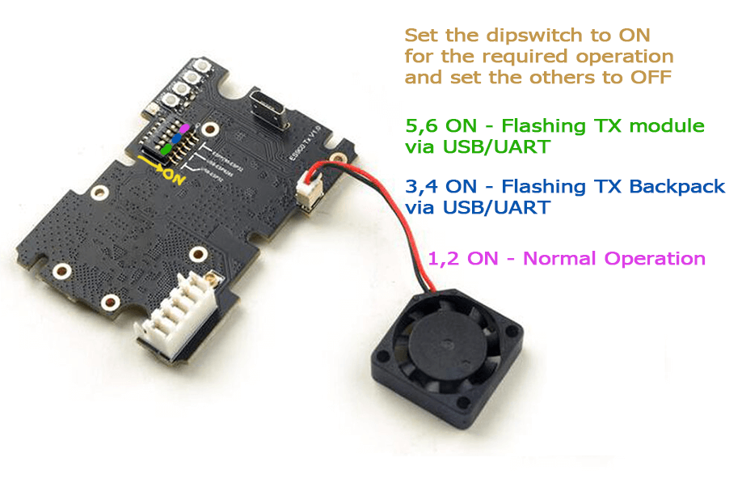

## Flashing via Wifi

Target: `HappyModel_TX_ES900TX_via_WIFI`

Device Category: `Happymodel 900 MHz`

Device: `HappyModel TX ES900TX`

!!! attention
    The methods below applies if you've already updated your Tx modules to 2.x. For modules still in firmwares pre 2.x, you should use [1.x WiFi flashing method](https://www.expresslrs.org/1.0/quick-start/tx-es900tx/) to update to 2.x. Or update to 2.x via USB instead.

### Method 1

With the correct target selected and [Firmware Options] set, **Build** your firmware using the ExpressLRS Configurator.

Once it's done, it should open the Target folder for you where the `HappyModel_TX_ES900TX-<version>.bin` file is. Do not close this window so you can easily locate the correct file to upload to the module.

The next steps will require the [ExpressLRS Lua Script](https://github.com/ExpressLRS/ExpressLRS/blob/master/src/lua/elrsV2.lua?raw=true) (right-click, save as). Download the ExpressLRS lua script and save it to your Radio's `/Scripts/Tools` folder. Insert/attach your module into your module bay and make sure it's not loose and there's proper connection with the radio (see the [Radio Preparation] page). Execute the ExpressLRS lua script by pressing "System Menu" in your radio and then under Tools, select `ExpressLRS`.

If the script is stuck at `Loading...`, then there's a chance your module is still in v1.x firmware, your External RF module is not set to CRSF or that your module is not well-connected to the module bay pins.

Select **WiFi Connectivity** from the Lua script and then select **Enable WiFi**. Press OK once more to activate the WiFi on the Tx Module. Connect to the Access Point the module will create called `ExpressLRS TX Module`, with the password being `expresslrs`.

Using your browser, navigate to the correct page (typically http://10.0.0.1/) and it should show an upload form (you will have to scroll down a bit). You can drag-and-drop the `HappyModel_TX_ES900TX-<version>.bin` file that the ExpressLRS Configurator created. You can also click the `Choose File` button and navigate to the folder where the firmware was created. Ensure that you have selected the correct firmware file and click `Update`.

Once the file is uploaded, a pop-up confirmation will show up. Wait for the Lua script screen to close the "WiFi Running" screen and your module should be updated now.

Verify the version and hash in the main screen of ExpressLRS Lua script.

**Update for version 2.0**

Once you have updated to firmware version 2.0 or newer, the Web Update page on the Hotspot will get a few updates of its own. It will get the Update progress bar, and a Popup will be shown for Success or Error messages. Additionally, you can configure Home Network SSID and Password if you chose not to use ExpressLRS Configurator to set them. Once these are set, you can use the two methods below.

### Method 2

With the correct target selected and [Firmware Options] set, **Build** your firmware using the ExpressLRS Configurator.

Once it's done, it should open the Target folder for you where the `HappyModel_TX_ES900TX-<version>.bin` file is. Do not close this window so you can easily locate the correct file to upload to the module.

Using the [ExpressLRS Lua Script](https://github.com/ExpressLRS/ExpressLRS/blob/master/src/lua/elrsV2.lua?raw=true) (right-click, save as), select `Wifi Connectivity` then choose `Enable WiFi` and if you have flashed your Tx Module with your Home WiFi Network details or have set it in Join Network section of the Update Page, it will connect to the local network automatically.

Using your browser, navigate to http://elrs_tx.local and the WiFi Update page should show up. Scroll down towards the Firmware Update section, as shown below:

Drag-and-drop the `HappyModel_TX_ES900TX-<version>.bin` file created by the ExpressLRS Configurator into the Choose File field, or manually navigate to the Folder by clicking the `Choose File` button. Once the correct file is selected, click the `Update`. Wait for the process to complete, and the module will reboot (~1min).

Verify the version and hash in the main screen of ExpressLRS Lua script.

### Method 3

Using the [ExpressLRS Lua Script](https://github.com/ExpressLRS/ExpressLRS/blob/master/src/lua/elrsV2.lua?raw=true) (right-click, save as), select `Wifi Connectivity` then choose `Enable WiFi` and if you have flashed your Tx Module with your Home WiFi Network details or have set it in Join Network section of the Update Page, it will connect to the network automatically.

Using the ExpressLRS Configurator, select the correct Target and set your [Firmware Options]. Click **Build and Flash** and wait for the compile process to complete. You should see a section as pictured below and the Success message marking the update process complete.

Verify the version and hash in the main screen of ExpressLRS Lua script.

### Flashing via USB

Target: `HappyModel_TX_ES900TX_via_UART`

Device Category: `Happymodel 900 MHz`

Device: `HappyModel TX ES900TX`

This method requires you move two jumpers into specific pins in the module board. See the following image for the jumper location and which pin should be bridged for this method to work.

The 2 bottom-most dipswitch should be moved into the position as shown in the image above. Attach your USB cable into the module and your computer. [CP210x Drivers](https://www.silabs.com/developers/usb-to-uart-bridge-vcp-drivers) will have to be installed for this to work properly (Windows). Make sure your computer recognizes the module as a USB-to-UART Bridge device, otherwise, this method will not work.

Using the ExpressLRS Configurator with the correct Target selected and [Firmware Options] set, hit **Build & Flash**. Wait for the process to finish, and you should be greeted with the "Success" message.

Assemble the module back together and attach it to your radio module bay and verify the version and hash in the main screen of ExpressLRS Lua script.

## ES915/868TX (Discontinued)

### Flashing via OpenTX

Target: `HappyModel_TX_ES915TX_via_stock_BL`

Device Category: `Happymodel 900 MHz`

Device: `HappyModel TX ES915TX`

Using **Build** in the ExpressLRS Configurator, wait for the firmware to be compiled.

After that's done, ExpressLRS Configurator Log should show the `Success` Message, and it will automatically open the folder where the **firmware.elrs** can be found. Put (copy-paste) the firmware.elrs to your Radio's SD Card (preferably to the `/FIRMWARE` folder for easy access). Once on your radio, navigate to the `/FIRMWARE` folder, select the firmware.elrs and click-hold the Enter button and select "Flash External ELRS".

Wait for the flashing to finish, module will reboot and you should hear the tune and two beeps (if external module is now set to CRSF protocol).

### Flashing via STLink

Target: `HappyModel_TX_ES915TX_via_STLINK`

Device Category: `Happymodel 900 MHz`

Device: `HappyModel TX ES915TX`

Connect your STLink v2 to the pads shown on the image below.

With the module connected shown above, and your configuration set, hit **Build & Flash** in the ExpressLRS Configurator and wait for the process to finish.

Once that's done, and the Success Message showing, you can now remove/unsolder the STLink, and re-assemble the module, and put it into your Radio's Module Bay. The ExpressLRS tune should play and then two beeps after that can be heard.

Verification can be done using the [ExpressLRS lua](lua-howto.md) script. It should show the Version Number and Hash at the bottom, as well as the options you can set. If it's showing "Loading" at the top, check if External Module is set to CRSF for the selected model in your radio, and that internal RF module is set to off. See [General Troubleshooting](../troubleshooting.md#general-troubleshooting) section for other ways to determine your module is flashed and ready for flying.

[Firmware Options]: ../firmware-options.md
[Radio Preparation]: tx-prep.md