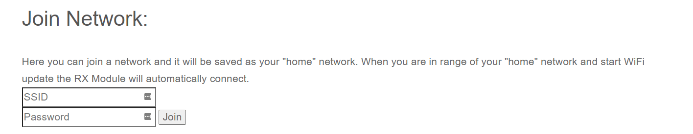

<figure markdown>

</figure>

!!! danger "Flashing ExpressLRS 3.x Firmware"
    1. If flashing/updating for the first time from the factory firmware or an older firmware, flash the module to version 2.5.1.
    2. Use the [Repartitioner](https://github.com/ExpressLRS/repartitioner) binary [file](https://github.com/ExpressLRS/repartitioner/releases/download/1.0/repartitioner.bin) (right click, save as/save file as) to flash it.
        - If Target Mismatch error appears, click `Flash Anyway`.
    3. Follow method 1 or 2 from the WiFi Flashing Guide to flash to the 3.x firmware.
    
    !!! info "Repartitioner is not necessary when flashing via USB/UART."

    **Reference**: Joshua Bardwell's video on the topic can be found [here](https://www.youtube.com/watch?v=2kcRi1cHejM).

## Flashing 2nd Gen, OLED-equipped NamimnoRC Flash

These newer devices are now using an ESP-based MCU compared to the first version. With this in mind, the Flashing method will differ slightly, and should now be the same as with other ESP-based Tx Modules.

### Flashing via WiFi
??? Note "Flashing via WiFi"

    - Target: `NamimnoRC_FLASH_2400_OLED_TX_via_WIFI`

    - Device Category: `NamimnoRC FLASH 2.4 GHz`

    - Device: `NamimnoRC FLASH 2400 OLED TX`

    <figure markdown>
    
    <figcaption>Flashing via WiFi</figcaption>
    </figure>

    #### Method 1
    ??? Note "Method 1"

        1. Select the correct target and set [Firmware Options] using the ExpressLRS Configurator.
        2. Build the firmware, which will open the Target folder where the `NamimnoRC_FLASH_2400_OLED_TX-<version>.bin` file is located. Do not close this window so you can easily locate the correct file to upload to the module.

            <figure markdown>
            ![Build]
            </figure>

        3. Download the [ExpressLRS Lua script] (right-click, save as) and save it to your Radio's `/Scripts/Tools` folder.
        4. Insert the module into the module bay and make sure it's securely connected to the radio (see the [Radio Preparation](tx-prep.md) page).
        5. Execute the ExpressLRS Lua script by going to "System Menu" on your radio, then under Tools, select `ExpressLRS`.

            <figure markdown>
            
            </figure>

            <figure markdown>
            
            </figure>

            !!! Info "Troubleshooting the ExpressLRS Lua Script"
                If you encounter an issue where the script is stuck at `Loading...`, please refer to the [troubleshooting guide](http://localhost:8000/quick-start/troubleshooting/#expresslrs-lua-script-is-stuck-at-loading) for help.

            <figure markdown>
            
            </figure>

        6. From the ExpressLRS Lua script, select "WiFi Connectivity" and then "Enable WiFi". Confirm by pressing OK.

            <figure markdown>
            
            </figure>

        7. Connect to the Access Point created by the module, named `ExpressLRS TX`, using the password `expresslrs`.

            <figure markdown>
            
            </figure>

        8. Open your browser and navigate to http://10.0.0.1/ to access the upload form. Scroll down to find the form.
        9. Drag and drop the firmware file, `NamimnoRC_FLASH_2400_OLED_TX-<version>.bin`, created by the ExpressLRS Configurator. Alternatively, use the `Choose File` button to select the file from the folder where the firmware was created.
        10. Ensure that you have selected the correct firmware file and click `Update`.

            <figure markdown>
            
            </figure>

        11. Once the file is uploaded, a pop-up confirmation will show up.

            <figure markdown>
            
            </figure>
            
        12. Wait for the confirmation pop-up and for the "WiFi Running" screen to close.
        13. Close and relaunch the script.
        14. Verify the firmware version and hash in the main screen of the ExpressLRS Lua script.

        !!! info
            You can configure Home Network SSID and Password if you chose not to use ExpressLRS Configurator to set them. Once these are set, you can use the next two methods below.

        <figure markdown>
        
        </figure>

    #### Method 2
    ??? Note "Method 2"

        1. Select the correct target and set [Firmware Options] using the ExpressLRS Configurator.
        2. Build the firmware, which will open the Target folder where the `NamimnoRC_FLASH_2400_OLED_TX-<version>.bin` file is located. Do not close this window so you can easily locate the correct file to upload to the module.

            <figure markdown>
            ![Build]
            </figure>

        3. Using the [ExpressLRS Lua script] (right-click, save as), select "WiFi Connectivity" and then "Enable WiFi". Confirm by pressing OK.

            <figure markdown>
            
            </figure>

        4. If you have previously set up your Tx Module with your home WiFi network details, it will connect automatically.
        5. Using a browser, navigate to http://elrs_tx.local.
        6. The WiFi Update page will appear. Scroll down to the "Firmware Update" section.

            <figure markdown>
            
            </figure>

        7. Drag-and-drop the `NamimnoRC_FLASH_2400_OLED_TX-<version>.bin` file created by the ExpressLRS Configurator into the "Choose File" field, or manually navigate to the folder and select the file.
        8. Click the "Update" button. Wait for the process to complete (approx. 1 minute).
        9. Close and relaunch the script.
        10. Verify the version and hash in the main screen of the ExpressLRS Lua script.

    #### Method 3
    ??? Note "Method 3"

        1. Using the [ExpressLRS Lua script] (right-click, save as), select "WiFi Connectivity" and then "Enable WiFi". Confirm by pressing OK.

            <figure markdown>
            
            </figure>

        2. If you have previously set up your Tx Module with your home WiFi network details, it will connect automatically.
        3. Select the correct target and set [Firmware Options] using the ExpressLRS Configurator.
        4. Click **Build and Flash**. Wait for the compile process to complete.

            <figure markdown>
            ![Build & Flash]
            </figure>

        5. Once done, you should see a Success message, marking the update process complete.

            <figure markdown>
            
            </figure>

        6. Close and relaunch the script.
        7. Verify the version and hash in the main screen of the ExpressLRS Lua script.

### Flashing via USB/UART
??? Note "Flashing via USB/UART"

    <figure markdown>
    
    </figure>

    !!! attention
        The left position of the switch is for flashing the [backpack](../../hardware/backpack/backpack-tx-setup.md). The right position of the switch is for flashing the TX itself. The right position is the default, so there is no need to open your module unless you need to unbrick your TX backpack!

    - Target: `NamimnoRC_FLASH_2400_OLED_TX_via_UART`

    - Device Category: `NamimnoRC FLASH 2.4 GHz`

    - Device: `NamimnoRC FLASH 2400 OLED TX`

    <figure markdown>
    
    <figcaption>Flashing via UART</figcaption>
    </figure>

    1. Attach a USB Data Cable to your module and computer.
    2. Windows users need to download the [CH340 Drivers](https://sparks.gogo.co.nz/assets/_site_/downloads/CH34x_Install_Windows_v3_4.zip) and install it by unzipping the content and run the executable installer to ensure the module USB-SERIAL CH340 is properly recognized and initialized.
    3. For other Operating Systems, head to this [site](http://www.wch-ic.com/downloads/CH341SER_ZIP.html) to download your needed drivers.

        !!! tip "Important"
            Check Device Manager on your Windows system before proceeding. Ensure the correct drivers are installed. Some Linux distros might also need drivers. The drivers can be downloaded [here](https://sparks.gogo.co.nz/assets/_site_/downloads/CH34x_Install_Windows_v3_4.zip).

    4. Select the correct target and set [Firmware Options] using the ExpressLRS Configurator.
    5. Click **Build and Flash**. Wait for the compile process to complete.

        <figure markdown>
        ![Build & Flash]
        </figure>

    6. Once done, you should see a Success message, marking the update process complete.

        <figure markdown>
        
        </figure>

    7. Close and relaunch the script.
    8. Verify the version and hash in the main screen of the ExpressLRS Lua script.

## Flashing First Gen, No OLED Screen NamimnoRC Flash

Following are the flashing methods for First Gen, No OLED Screen NamimnoRC Flash.

### Flashing via WiFi
??? Note "Flashing via WiFi"

    - Target: `NamimnoRC_Flash_2400_TX_via_WiFi`

    - Device Category: `NamimnoRC FLASH 2.4 GHz`

    - Device: `NamimnoRC FLASH 2400 TX`

    <figure markdown>
    
    <figcaption>Flashing via WiFi</figcaption>
    </figure>

    #### Method 1
    ??? Note "Method 1"

        1. Select the correct target and set [Firmware Options] using the ExpressLRS Configurator.
        2. **Build** your firmware using the ExpressLRS Configurator.

            <figure markdown>
            ![Build]
            </figure>

        3. Once done, it should open the Target folder for you where the `firmware.elrs` file is. 
        4. Do not close this window so you can easily locate the correct file to upload to the module.
        5. STM32-based TX modules require a separate ESP "backpack" device for Wifi Flashing/Updating. 
        6. Attach the module to your JR Bays and power it up. 
        7. Connect to the `ESP Wifi Manager` Hotspot that the device will activate. 
        8. Once connected, navigate to http://elrs_tx.local/.

            <figure markdown>
            
            </figure>

        9. Press `Configure WiFi` and set your home network SSID and password. This will enable your Tx Module to connect to your local home network.
        10. On your browser, refresh the http://elrs_tx.local/ and scroll towards the STM32 Firmware Update section, as shown below:

            <figure markdown>
            
            </figure>

        11. Drag-and-drop the `firmware.elrs` file created by the ExpressLRS Configurator into the "Choose File" field, or manually navigate to the folder and select the file but change the offset to _0x4000_.
        12. click `Upload` and `Flash` STM32. Wait for the process to complete (approx. 1 minute).
        13. Close and relaunch the script.
        14. Verify the version and hash in the main screen of the [ExpressLRS Lua] script.

    #### Method 2
    ??? Note "Method 2"

        1. STM32-based TX modules require a separate ESP "backpack" device for Wifi Flashing/Updating. 
        2. Attach the module to your JR Bays and power it up. 
        3. Connect to the `ESP Wifi Manager` Hotspot that the device will activate. 
        4. Once connected, navigate to http://elrs_tx.local/.

            <figure markdown>
            
            </figure>

        5. Press `Configure WiFi` and set your home network SSID and password. This will enable your Tx Module to connect to your local home network.
        6. Select the correct target and set [Firmware Options] using the ExpressLRS Configurator.
        7. **Build and Flash** your firmware using the ExpressLRS Configurator.
        8. Wait for the process to complete. You should see a section as pictured below and the Success message marking the update process complete.

            <figure markdown>
            ![Build & Flash]
            </figure>

            <figure markdown>
            
            </figure>

        9. Verify the version and hash in the main screen of the [ExpressLRS Lua] script.

### Flashing via OpenTX Radio
??? Note "Flashing via OpenTX Radio"

    - Target: `NamimnoRC_Flash_2400_TX_via_WiFi`

    - Device Category: `NamimnoRC FLASH 2.4 GHz`

    - Device: `NamimnoRC FLASH 2400 TX`

    <figure markdown>
    
    <figcaption>Flashing via WiFi</figcaption>
    </figure>

    1. Select the correct target and set [Firmware Options] using the ExpressLRS Configurator.
    2. **Build** your firmware using the ExpressLRS Configurator.

        <figure markdown>
        ![Build]
        </figure>

    3. Once done, it should open the Target folder for you where the `NamimnoRC_Flash_2400_TX-<version>.elrs` file is. 
    4. Do not close this window so you can easily locate the correct file to upload to the module.
    5. Copy the `NamimnoRC_Flash_2400_TX-<version>.elrs` file into your radio's SD Card `/FIRMWARE` folder.
    6. Once copied, navigate to the `/FIRMWARE` Folder on your Radio and select/highlight the `NamimnoRC_Flash_2400_TX-<version>.elrs` file, long-press the Enter key and select `Flash external ELRS`. 
    7. Flashing will then commence and after a few seconds, the radio should show a `Flash Successful` message and you're done!
    8. Verify the version and hash in the main screen of the [ExpressLRS Lua] script.

### Flashing via STLink
??? Note "Flashing via STLink"

    - Target: `NamimnoRC_Flash_2400_TX_via_STLINK`

    - Device Category: `NamimnoRC FLASH 2.4 GHz`

    - Device: `NamimnoRC FLASH 2400 TX`

    <figure markdown>
    
    <figcaption>Flashing via STLink</figcaption>
    </figure>

    !!! attention 
        Only use this method if the firmware has been corrupted.

    1. Disassembling the module by unscrewing the 4 screws at the rear of the module with a 1.5mm hex wrench. 
    2. Carefully separate the parts of the module and detach the cable from the main PCB.

        <figure markdown>
        
        </figure>

        <figure markdown>
        
        </figure>

    3. Wire your `STLink v2` to the module's pins as shown below:

        <figure markdown>
        
        </figure>

    4. With the module connected shown above, and your configuration set, hit **Build & Flash** in the ExpressLRS Configurator and wait for the process to finish.

        <figure markdown>
        ![Build & Flash]
        </figure>

    5. Once the Success Message appears, remove/unsolder the STLink, re-assemble the module, and place it in your Radio's Module Bay.
    6. If the Radio has CRSF selected, the light should turn green meaning the module has communication with your radio.
    7. Use the ExpressLRS Lua script to verify that the Version Number and Hash are displayed at the bottom, along with the options you set. If "Loading" is displayed at the top, check if External Module is set to CRSF for the selected model in your radio, and that the internal RF module is turned off.

    !!! Note
        For further troubleshooting, refer to the [General Troubleshooting](../troubleshooting.md#general-troubleshooting).

[ExpressLRS Lua script]: https://github.com/ExpressLRS/ExpressLRS/blob/3.x.x-maintenance/src/lua/elrsV3.lua?raw=true
[Build]: ../../assets/images/Build.png
[Build & Flash]: ../../assets/images/BuildFlash.png
[Firmware Options]: ../firmware-options.md
[Radio Preparation]: tx-prep.md
[ExpressLRS Lua]: lua-howto.md
[General Troubleshooting]: ../troubleshooting.md#general-troubleshooting

