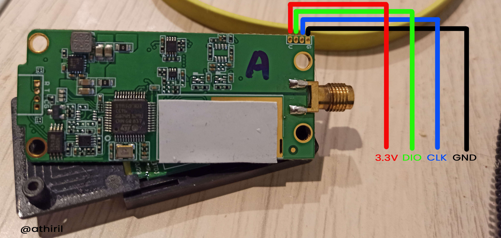

!!! warning
    The R9M Lite Pro **can not** be flashed via OpenTx or EdgeTX, and therefore requires an STLink v2 to flash. See the guide [below](#flashing-using-stlink)

## Flashing via OpenTX

!!! info
    This method requires OpenTX 2.3.12 or newer; or EdgeTX 2.4.0 or newer.

### Flashing the Bootloader

The bootloader is required to be flashed first prior to flashing the ExpressLRS firmware as the bootloader will replace the factory-bootloader, and enable the hardware to instead use the ExpressLRS code.

!!! info "FYI"
    You only need to flash the Bootloader ONCE. After it's flashed into the receiver, you **don't** have to reflash it in every update.

Using an `OpenTX` transmitter, you flash the bootloader, and then flash ELRS.

Here is a quick 2 minute demo if you would rather watch a video than read the steps:
<figure markdown>
<iframe width="560" height="315" src="https://www.youtube.com/embed/DG3f-lnNlms" title="YouTube video player" frameborder="0" allow="accelerometer; autoplay; clipboard-write; encrypted-media; gyroscope; picture-in-picture" allowfullscreen></iframe>
</figure>

With the previous step ([Radio Preparation]) done, you should now readily flash your R9 Transmitter Module.

Copy [`r9m_elrs_bl.frk`](https://github.com/ExpressLRS/ExpressLRS/blob/master/src/bootloader/r9m_elrs_bl.frk?raw=true)(14kb) onto the SD card of your radio, in the `/FIRMWARE` folder.

Flash `r9m_elrs_bl.frk` to your TX module:

* Navigate in OpenTX to the TOOLS menu (hold SYS button)
* Page to the SD-HC CARD page, then the `FIRMWARE` folder
* Flash the frk file by holding OK and selecting "Flash external module"

### Flashing the firmware

- Targets: 
    - `Frsky_TX_R9M_via_stock_BL`
    - `Frsky_TX_R9M_LITE_via_stock_BL`

- Device Category: 
    - `Frsky R9`

- Device:
    - `Frsky TX R9M`
    - `Frsky TX R9M LITE`

<figure markdown>

<figcaption>Flashing via Stock_BL</figcaption>
</figure>

In the ExpressLRS Configurator, select the correct target for your module and set your [Firmware Options]. 

Click on **Build** and wait for the firmware to be compiled.

<figure markdown>
![Build]
</figure>

After that's done, ExpressLRS Configurator Log should show the `Success` Message, and it will automatically open the folder where the **firmware.elrs** can be found. Put (copy-paste) the firmware.elrs to your Radio's SD Card (preferably to the `/FIRMWARE` folder for easy access). Once on your radio, navigate to the `/FIRMWARE` folder, select the firmware.elrs and click-hold the Enter button and select "Flash External ELRS".

By this point, the bootloader (r9m_elrs_bl.frk) should've been flashed already. Wait for the flashing to finish, and if your module is equipped with a speaker (full size R9Ms), you should hear the tune and two beeps (if the external module is now set to CRSF protocol).

## Flashing via STLink

- Targets:
    - `Frsky_TX_R9M_via_STLINK`
    - `Frsky_TX_R9M_LITE_via_STLINK`
    - `Frsky_TX_R9M_LITE_PRO_via_STLINK`

- Device Category: 
    - `Frsky R9`

- Device:
    - `Frsky TX R9M`
    - `Frsky TX R9M LITE`
    - `Frsky TX R9M LITE PRO`

<figure markdown>

<figcaption>Flashing via STLink</figcaption>
</figure>

This method is an **irreversible** one. You will not be able to go back to Frsky firmwares with this method. You have been warned!

This method also involves taking apart your module and soldering wires directly into its board. If you're not comfortable doing this, **STOP** now.

<figure markdown>
%20st%20link%20connection.png)
<figcaption>R9M STLink Connection</figcaption>
</figure>

<figure markdown>

<figcaption>R9M Lite STLink Connection</figcaption>
</figure>

<figure markdown>

<figcaption>R9M Lite Pro STLink Connection</figcaption>
</figure>

Wire up your module as shown above to your STLink device. This is important before any of the steps below.

Before flashing, disable `'Readout Protection'`. To do this download the [ST-LINK Utility](https://www.st.com/en/development-tools/stsw-link004.html) and follow this quick [how to video](https://youtu.be/SEYQ1HpRmk0). After such, you can now disconnect (Target -> Disconnect) and close the ST-Link Utility.

With the module still connected to the STLink, and your [Firmware Options] set, hit **Build & Flash** in the ExpressLRS Configurator and wait for the process to finish.

<figure markdown>
![Build & Flash]
</figure>

Once that's done, and the Success Message showing, you can now remove/unsolder the STLink, re-assemble the module, and put it into your Radio's Module Bay. The ExpressLRS tune should play and then two beeps after that can be heard, for units that have a speaker (R9Ms) and if the External Module is set to CRSF Protocol.

Verification can be done using the [ExpressLRS Lua] script. It should show the Version Number and Hash at the bottom, as well as the options you can set. If it's showing "Loading" at the top, check if External Module is set to CRSF for the selected model in your radio, and that the internal RF module is set to off. See the [General Troubleshooting] section for other ways to determine whether your module is flashed and ready for flying.

[Build]: ../../assets/images/Build.png
[Build & Flash]: ../../assets/images/BuildFlash.png
[Firmware Options]: ../firmware-options.md
[Radio Preparation]: tx-prep.md
[ExpressLRS Lua]: lua-howto.md
[General Troubleshooting]: ../troubleshooting.md#general-troubleshooting