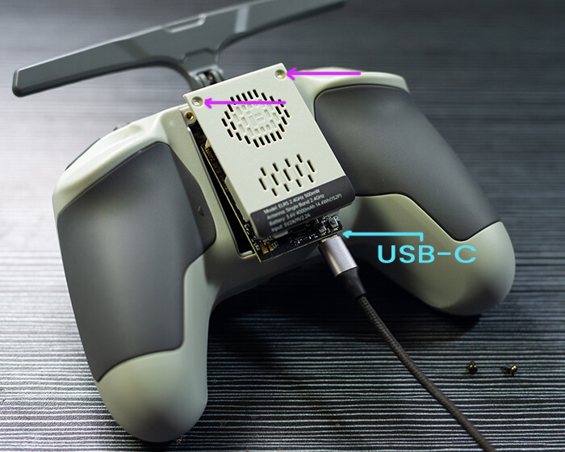

!!! warning "WARNING"
    Make sure you are selecting the right Device Category (2.4GHz or 900MHz) that's appropriate for the hardware you have. You cannot flash a 2.4GHz module with the firmware for the 900MHz module and expect it to work properly. Likewise, you cannot flash a 900MHz module with the firmware for the 2.4GHz module. They have different sets of hardware.

    You can damage your hardware if you do so. You have been warned!

!!! danger "Advisory"
    If you are flashing/updating your TX module for the first time from the factory firmware, or from an older firmware, to ExpressLRS 3.x firmware, you will first need to flash it to version 2.5.1 then flash it with the [Repartitioner](https://github.com/ExpressLRS/repartitioner) binary [file](https://github.com/ExpressLRS/repartitioner/releases/download/1.0/repartitioner.bin) (right click, save as/save file as). Should it complain about Target Mismatch, just click `Flash Anyway`. Only then you can flash to 3.x firmware following method 1 or 2 from the WiFi Flashing Guide below.

    Joshua Bardwell has a video about it [here](https://www.youtube.com/watch?v=2kcRi1cHejM).

## Flashing via WiFi

- Targets:
    - `iFlight_2400_TX_via_WIFI`
    - `iFlight_900_TX_via_WIFI`

- Device Categories:
    - `iFlight 2.4 GHz`
    - `iFlight 900 MHz`

- Devices: 
    - `iFlight 2400TX`
    - `iFlight 900TX`

<figure markdown>

<figcaption>Flashing via WiFi</figcaption>
</figure>

### Method 1

With the correct target selected and [Firmware Options] set, **Build** your firmware using the ExpressLRS Configurator.

<figure markdown>
![Build]
</figure>

Once it's done, it should open the Target folder for you where the `iFlight_2400_TX-<version>.bin` or `iFlight_900_TX-<version>.bin` file is. Do not close this window so you can easily locate the correct file to upload to the module.

The next steps will require the [ExpressLRS Lua script] (right-click, save as). Download the ExpressLRS Lua script and save it to your Radio's `/Scripts/Tools` folder. Execute the ExpressLRS Lua script by pressing "System Menu" on your radio and then under Tools, select `ExpressLRS`.

<figure markdown>

</figure>

<figure markdown>

</figure>

If the script is stuck at `Loading...`, then there's a chance your Radio External RF module is not set to CRSF.

<figure markdown>

</figure>

Select **WiFi Connectivity** from the Lua script and then select **Enable WiFi**. Press OK once more to activate the WiFi on the Tx Module. Connect to the Access Point the module will create called `ExpressLRS TX`, with the password being `expresslrs`.

<figure markdown>

</figure>

Using your browser, navigate to the correct page (typically http://10.0.0.1/) and it should show an upload form (you will have to scroll down a bit). You can drag-and-drop the `iFlight_2400_TX-<version>.bin` or `iFlight_900_TX-<version>.bin` file that the ExpressLRS Configurator created. You can also click the `Choose File` button and navigate to the folder where the firmware was created. Ensure that you have selected the correct firmware file and click `Update`.

Once the file is uploaded, a pop-up confirmation will show up. Wait for the Lua script to close the "WiFi Running" screen and your module should be updated now.

Verify the version and hash in the main screen of the ExpressLRS Lua script.

**Join Local Network**

You can configure Home Network SSID and Password if you chose not to use ExpressLRS Configurator to set them. Once these are set, you can use the next two methods below.

<figure markdown>

</figure>

### Method 2

With the correct target selected and [Firmware Options] set, **Build** your firmware using the ExpressLRS Configurator.

<figure markdown>
![Build]
</figure>

Once it's done, it should open the Target folder for you where the `iFlight_2400_TX-<version>.bin` or `iFlight_900_TX-<version>.bin` file is. Do not close this window so you can easily locate the correct file to upload to the module.

Using the [ExpressLRS Lua script] (right-click, save as), select `Wifi Connectivity` then choose `Enable WiFi` and if you have flashed your Tx Module with your Home WiFi Network details or have set it in the Join Network section of the Update Page, it will connect to the local network automatically.

Using your browser, navigate to http://elrs_tx.local and the WiFi Update page should show up. Scroll down towards the Firmware Update section, as shown below:

<figure markdown>

</figure>

Drag-and-drop the `iFlight_2400_TX-<version>.bin` or `iFlight_900_TX-<version>.bin` file created by the ExpressLRS Configurator into the Choose File field, or manually navigate to the Folder by clicking the `Choose File` button. Once the correct file is selected, click the `Update`. Wait for the process to complete, and the module will reboot (the "Wifi Running" window on the Lua Script will disappear once it has rebooted).

Verify the version and hash in the main screen of the ExpressLRS Lua script.

### Method 3

Using the [ExpressLRS Lua script] (right-click, save as), select `Wifi Connectivity` then choose `Enable WiFi` and if you have flashed your Tx Module with your Home WiFi Network details or have set it in the Join Network section of the Update Page, it will connect to the network automatically.

Using the ExpressLRS Configurator, select the correct Target and set your [Firmware Options]. Click **Build and Flash** and wait for the compile process to complete. You should see a section as pictured below and the Success message marking the update process complete.

<figure markdown>
![Build & Flash]
</figure>

<figure markdown>

</figure>

Verify the version and hash in the main screen of the ExpressLRS Lua script.

## Flashing via USB/UART

- Targets:
    - `iFlight_2400_TX_via_UART`
    - `iFlight_900_TX_via_UART`

- Device Categories:
    - `iFlight 2.4 GHz`
    - `iFlight 900 MHz`

- Devices:
    - `iFlight 2400TX`
    - `iFlight 900TX`

<figure markdown>

<figcaption>Flashing via UART</figcaption>
</figure>

Unscrew the two screws holding the Transmitter Module to the back of the radio handset. Carefully lift the Transmitter Module to get access to the USB-c port. Do not tug too much as there are wires connecting the Transmitter Module to the mainboard of the radio handset, along with the antenna cable of the module itself.

<figure markdown>

<figcaption>TX Module and USB-C connection</figcaption>
</figure>

Attach a USB-C Data Cable to your module and Computer. Windows users might have to install [CP210x Windows Drivers](https://www.silabs.com/developers/usb-to-uart-bridge-vcp-drivers) to ensure the device is properly detected and initialized. Check Device Manager to verify the TX Module appears as a CP210x USB to UART Bridge, under the Ports grouping.

<figure markdown>

</figure>

Using the ExpressLRS Configurator with the correct Target selected and [Firmware Options] set, hit **Build & Flash**. Wait for the process to finish, and you should be greeted with the "Success" message.

<figure markdown>
![Build & Flash]
</figure>

Verify the version and hash in the main screen of the ExpressLRS Lua script.

[ExpressLRS Lua script]: https://github.com/ExpressLRS/ExpressLRS/blob/3.x.x-maintenance/src/lua/elrsV3.lua?raw=true
[Build]: ../../assets/images/Build.png
[Build & Flash]: ../../assets/images/BuildFlash.png
[Firmware Options]: ../firmware-options.md
