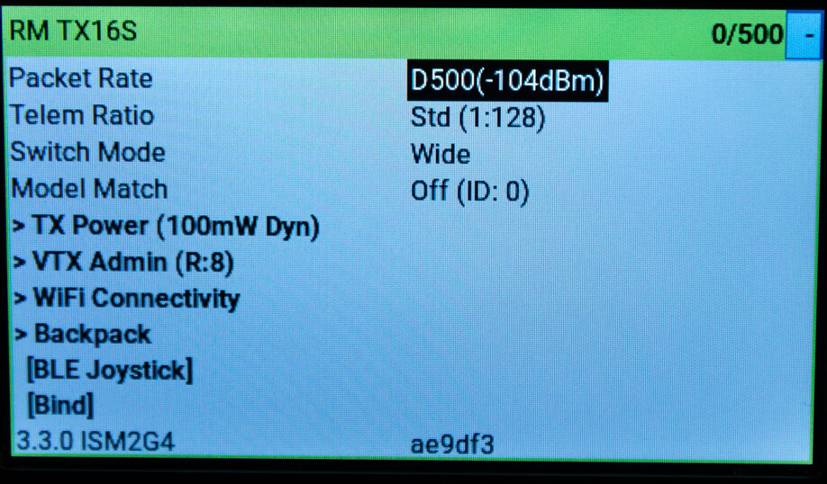

!!! warning "WARNING"
    Make sure you are selecting the right Device Category (2.4GHz or 900MHz) that's appropriate for the hardware you have. You cannot flash a 2.4GHz module with the firmware for the 900MHz module and expect it to work properly. Likewise, you cannot flash a 900MHz module with the firmware for the 2.4GHz module. They have different sets of hardware.

    You can damage your hardware if you do so. You have been warned!

!!! danger "Flashing ExpressLRS 3.x Firmware"
    1. If flashing/updating for the first time from the factory firmware or an older firmware, flash the module to version 2.5.1.
    2. Use the [Repartitioner](https://github.com/ExpressLRS/repartitioner) binary [file](https://github.com/ExpressLRS/repartitioner/releases/download/1.0/repartitioner.bin) (right click, save as/save file as) to flash it.
        - If Target Mismatch error appears, click `Flash Anyway`.
    3. Follow method 1 or 2 from the WiFi Flashing Guide to flash to the 3.x firmware.
    
    !!! info "Repartitioner is not necessary when flashing via USB/UART."

    **Reference**: Joshua Bardwell's video on the topic can be found [here](https://www.youtube.com/watch?v=2kcRi1cHejM).

## Flashing iFlight Commando

Following are the flashing methods for iFlight Commando

### Flashing via WiFi
??? Note "Flashing via WiFi"

    - Targets:
        - `iFlight_2400_TX_via_WIFI`
        - `iFlight_900_TX_via_WIFI`

    - Device Categories:
        - `iFlight 2.4 GHz`
        - `iFlight 900 MHz`

    - Devices: 
        - `iFlight 2400TX`
        - `iFlight 900TX`

    <figure markdown>
    
    <figcaption>Flashing via WiFi</figcaption>
    </figure>

    #### Method 1
    ??? Note "Method 1"

        1. Select the correct target and set [Firmware Options] using the ExpressLRS Configurator.
        2. Build the firmware, which will open the Target folder where the `iFlight_2400_TX-<version>.bin` or `iFlight_900_TX-<version>.bin` file is located. Do not close this window so you can easily locate the correct file to upload to the module.

            <figure markdown>
            ![Build]
            </figure>

        3. Download the [ExpressLRS Lua script] (right-click, save as) and save it to your Radio's `/Scripts/Tools` folder.
        4. Insert the module into the module bay and make sure it's securely connected to the radio (see the [Radio Preparation](tx-prep.md) page).
        5. Execute the ExpressLRS Lua script by going to "System Menu" on your radio, then under Tools, select `ExpressLRS`.

            <figure markdown>
            
            </figure>

            <figure markdown>
            
            </figure>

            !!! Info "Troubleshooting the ExpressLRS Lua Script"
                If you encounter an issue where the script is stuck at `Loading...`, please refer to the [troubleshooting guide](http://localhost:8000/quick-start/troubleshooting/#expresslrs-lua-script-is-stuck-at-loading) for help.

            <figure markdown>
            
            </figure>

        6. From the ExpressLRS Lua script, select "WiFi Connectivity" and then "Enable WiFi". Confirm by pressing OK.

            <figure markdown>
            
            </figure>

        7. Connect to the Access Point created by the module, named `ExpressLRS TX`, using the password `expresslrs`.

            <figure markdown>
            
            </figure>

        8. Open your browser and navigate to http://10.0.0.1/ to access the upload form. Scroll down to find the form.
        9. Drag and drop the firmware file, `iFlight_2400_TX-<version>.bin` or `iFlight_900_TX-<version>.bin`, created by the ExpressLRS Configurator. Alternatively, use the `Choose File` button to select the file from the folder where the firmware was created.
        10. Ensure that you have selected the correct firmware file and click `Update`.

            <figure markdown>
            
            </figure>

        11. Once the file is uploaded, a pop-up confirmation will show up.

            <figure markdown>
            
            </figure>
            
        12. Wait for the confirmation pop-up and for the "WiFi Running" screen to close.
        13. Close and relaunch the script.
        14. Verify the firmware version and hash in the main screen of the ExpressLRS Lua script.

        !!! info
            You can configure Home Network SSID and Password if you chose not to use ExpressLRS Configurator to set them. Once these are set, you can use the next two methods below.

        <figure markdown>
        
        </figure>

    #### Method 2
    ??? Note "Method 2"

        1. Select the correct target and set [Firmware Options] using the ExpressLRS Configurator.
        2. Build the firmware, which will open the Target folder where the `iFlight_2400_TX-<version>.bin` or `iFlight_900_TX-<version>.bin` file is located. Do not close this window so you can easily locate the correct file to upload to the module.

            <figure markdown>
            ![Build]
            </figure>

        3. Using the [ExpressLRS Lua script] (right-click, save as), select "WiFi Connectivity" and then "Enable WiFi". Confirm by pressing OK.

            <figure markdown>
            
            </figure>

        4. If you have previously set up your Tx Module with your home WiFi network details, it will connect automatically.
        5. Using a browser, navigate to http://elrs_tx.local.
        6. The WiFi Update page will appear. Scroll down to the "Firmware Update" section.

            <figure markdown>
            
            </figure>

        7. Drag-and-drop the `iFlight_2400_TX-<version>.bin` or `iFlight_900_TX-<version>.bin` file created by the ExpressLRS Configurator into the "Choose File" field, or manually navigate to the folder and select the file.
        8. Click the "Update" button. Wait for the process to complete (approx. 1 minute).
        9. Close and relaunch the script.
        10. Verify the version and hash in the main screen of the ExpressLRS Lua script.

    #### Method 3
    ??? Note "Method 3"

        1. Using the [ExpressLRS Lua script] (right-click, save as), select "WiFi Connectivity" and then "Enable WiFi". Confirm by pressing OK.

            <figure markdown>
            
            </figure>

        2. If you have previously set up your Tx Module with your home WiFi network details, it will connect automatically.
        3. Select the correct target and set [Firmware Options] using the ExpressLRS Configurator.
        4. Click **Build and Flash**. Wait for the compile process to complete.

            <figure markdown>
            ![Build & Flash]
            </figure>

        5. Once done, you should see a Success message, marking the update process complete.

            <figure markdown>
            
            </figure>

        6. Close and relaunch the script.
        7. Verify the version and hash in the main screen of the ExpressLRS Lua script.

### Flashing via USB/UART
??? Note "Flashing via USB/UART"

    - Targets:
        - `iFlight_2400_TX_via_UART`
        - `iFlight_900_TX_via_UART`

    - Device Categories:
        - `iFlight 2.4 GHz`
        - `iFlight 900 MHz`

    - Devices:
        - `iFlight 2400TX`
        - `iFlight 900TX`

    <figure markdown>
    
    <figcaption>Flashing via UART</figcaption>
    </figure>

    Unscrew the two screws holding the Transmitter Module to the back of the radio handset. Carefully lift the Transmitter Module to get access to the USB-c port. Do not tug too much as there are wires connecting the Transmitter Module to the mainboard of the radio handset, along with the antenna cable of the module itself.

    <figure markdown>
    
    <figcaption>TX Module and USB-C connection</figcaption>
    </figure>

    1. Attach a USB Data Cable to your module and computer.
    2. Windows users may need to install the [CP210x Drivers](https://www.silabs.com/developers/usb-to-uart-bridge-vcp-drivers) to ensure the device is properly recognized and initialized.

        !!! tip "Important"
            Check Device Manager on your Windows system before proceeding. Ensure the correct drivers are installed. Some Linux distros might also need drivers. The drivers can be downloaded [here](https://www.silabs.com/developers/usb-to-uart-bridge-vcp-drivers).

        <figure markdown>
        
        </figure>

    3. Select the correct target and set [Firmware Options] using the ExpressLRS Configurator.
    4. Click **Build and Flash**. Wait for the compile process to complete.

        <figure markdown>
        ![Build & Flash]
        </figure>

    5. Once done, you should see a Success message, marking the update process complete.

        <figure markdown>
        
        </figure>

    6. Close and relaunch the script.
    7. Verify the version and hash in the main screen of the ExpressLRS Lua script.

[ExpressLRS Lua script]: https://github.com/ExpressLRS/ExpressLRS/blob/3.x.x-maintenance/src/lua/elrsV3.lua?raw=true
[Build]: ../../assets/images/Build.png
[Build & Flash]: ../../assets/images/BuildFlash.png
[Firmware Options]: ../firmware-options.md

