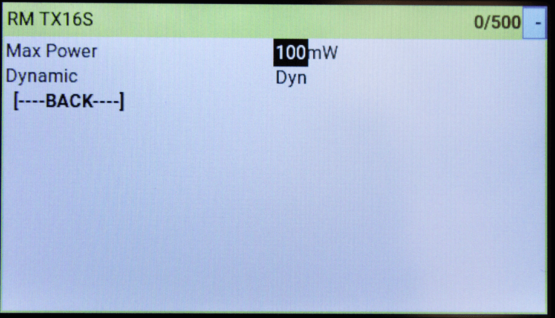
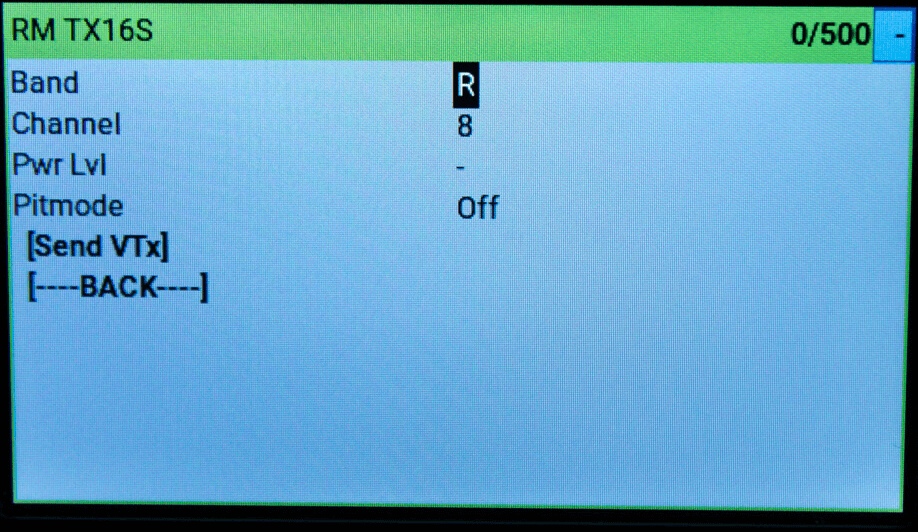
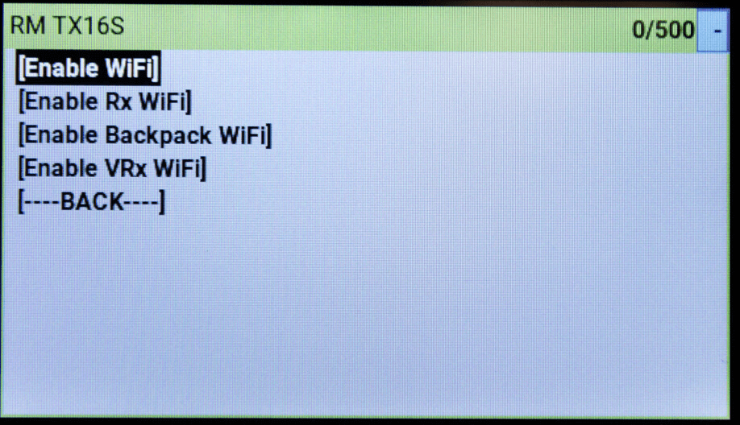

Now that you have flashed your TX it is time to learn how to use the ELRS Lua script!

## Installing the Lua Script

Download the [ELRSv3 Lua Script](https://github.com/ExpressLRS/ExpressLRS/blob/3.x.x-maintenance/src/lua/elrsV3.lua?raw=true) (you can simply right-click, save-as) into your radio's SD Card under the `Scripts/Tools` folder and Long Press the "SYS" button (for T16 or similar Radios) or the "Menu" button (for Taranis X9D or similar Radios) to access the Tools Menu where you can find the ExpressLRS script ready to run with only one click.

Here's how it looks in the Tools menu (X9D+ and T16 Shown):

<figure markdown>

</figure>

<figure markdown>

</figure>

## Check if your TX is Connected

Enter the Lua script by selecting "ExpressLRS" in the Tools menu and pressing ENTER.

If the parameter list does not populate after a few seconds, and it's stuck at `Loading...`, first verify the ExpressLRS module has power by checking its LED. If there is no LED lit up, it is possible the Protocol set for the External Module is incorrect (should be set to CRSF) or that the module is not properly connected to the pins of the JR bay of the radio. Another possible reason is that you haven't updated the firmware of the module to version 2.x.

If parameters do show up, but the Bad/Good section on the right side of the header is showing an unstable value, have a look at your model settings and make sure the Internal RF module is set to Off. If the Bad/Good indicates something other than `0/<your selected packet rate>` this means `CRSFshot` is not working-- verify that you properly followed the [Radio Preparation](tx-prep.md) Guide.

<figure markdown>

</figure>

<figure markdown>

</figure>

The `master 942c40` from the photo above is the git branch and commit hash of the firmware version that the module has. You can reference this hash from [Releases](https://github.com/ExpressLRS/ExpressLRS/releases). In the first photo above, `master` means the module is flashed with the `Master Branch` with the git commit `942c40`. If you're on a Released version or a Release Candidate, this will read something like `3.0` or `3.0-RC1` plus the commit hash of the release.

!!! note "Note"
    Colors may differ from Handset to Handset, depending on the current theme in use.

## Understanding and using the Lua Script
Now, we can explore the complexities of the Lua script, and how to interpret each of its many sections. ExpressLRS supports multiple configuration profiles, and the configuration profile is selected by setting the "Receiver" property in handset Model Setup -> External Module -> Receiver (number).

<figure markdown>

</figure>

!!! warning "WARNING"
	Do not change parameters while ARMED. When a parameter is changed, the module goes into Parameter Commit mode, interrupting the normal loop. This could result in a desync on some hardware combination which would result in a FAILSAFE.

### The Header

The first line, "Header", will show you some information about your ExpressLRS link. 

The first part will show you the current ExpressLRS TX Module ID, followed by the current status of the link.

The `0/nnn` is your Packet Counter. The second set of numbers should match your currently selected Packet Rate. e.g. If you've set your Packet Rate to 500Hz, the Packet Counter should show 0/500, which means you're not getting any Bad Packets ( 0 Bad Packets ) and only getting Good Packets ( 500 Good Packets ). Any small fluctuation is normal and often goes back to 100% Good Packets, especially when you change a setting and it's committed into memory. 

Should the indicator starts showing Bad Packets, and Good Packets goes down, it isn't a good situation. Make sure your module is not overheating and it's still getting a good connection with the radio. This is most dangerous when you're armed and flying several kilometers/miles out, as this could mean a sudden Failsafe.

The `Connection Status` indicator shows your current RC link status. When not connected to any receiver, it will show a dash (`-`); while a `C` shows up when bound and connected.

The `Model Mismatched` message will also show up to indicate you are connected to a receiver, but the model selected on your radio is incorrect. See the [Model Match](../../software/model-config-match.md) page for more info about Model Matching.

### Folder Titles

Items with `>` before the name is a folder that when selected shows another level of customization. `TX Power`, `VTX Administrator`, `Wifi Connectivity` are examples of these items.

:new: These items will now show what is currently set for the items within. An example would be on `TX Power`, which will show the current Power set, and if Dynamic Power is enabled, it will show the current set Max Power, followed by the indicator `Dyn`.

### Packet Rate and Telemetry Ratio

These are shown as `Packet Rate` and `Telem Ratio` in the Lua script, which allows you to change your performance parameters. 

* `Packet Rate` sets how fast data packets are sent, higher rates send packets more frequently and have lower latency.

	The following options are available for `2.4GHz`:

	- `50Hz, 150Hz, 250Hz & 500Hz`: Lora-based options. Higher means lower latency at the expense of sensitivity. Since v1.0.
	- `F500 & F1000` :new: : Pure FLRC for lowest latency, reduced range compared to LoRa, 500Hz and 1000Hz. [Details](https://github.com/ExpressLRS/ExpressLRS/pull/1277)
	- `D250 & D500` :new: : Redundant transmit FLRC modes.  `D` stands for `Déjà Vu`, 250Hz and 500Hz. Higher latency, reduced packet jitter and higher LQ. Same range as other FLRC modes. [Details](https://github.com/ExpressLRS/ExpressLRS/pull/1527)
	- `100Hz Full & 333Hz Full` :new: : Lora-based 10-bit Full Resolution with 8ch/12ch/16 Switch Mode options. [Details](https://github.com/ExpressLRS/ExpressLRS/pull/1572)
	
	The following options are available for `900MHz`:

	- `25Hz, 50Hz, 100Hz & 200Hz`: LoRa-based options. Higher means lower latency at the expense of sensitivity. Since v1.0.
	- `100Hz Full` :new: : Lora-based 10-bit Full Resolution with 8ch/12ch/16 Switch Mode options. [Details](https://github.com/ExpressLRS/ExpressLRS/pull/1572)

	The number following the rate in parentheses (e.g. -105dBm for 500Hz) is the Sensitivity Limit for the rate, the lowest RSSI where packets will still be received. See [Signal Health](../../info/signal-health.md) for more information about the sensitivity limit.

!!! warning "WARNING"
	Never change the packet rate while flying as this forces a disconnect between the TX and RX. 

* `Telem Ratio` sets the telemetry ratio or how much of the packet rate is used to send telemetry. The options, in order of increasing telemetry rate, are: `Off, 1:128, 1:64, 1:32, 1:16, 1:8, 1:4, 1:2`. A Telem Ratio of 1:64 means one out of every 64 packets are used for telemetry data.
	- :new: v3.0 comes with `Std` and `Race` options. `Std` changes ratio depending on the Packet Rate, and `Race` is the same as Std, but will disable telemetry and sync while Armed.

	For information on telemetry setup, see [First Flight: Telemetry](../pre-1stflight.md#telemetry) and [Telemetry Bandwidth](../../info/telem-bandwidth.md).

### Switch Mode

The Switch Mode setting controls how channels AUX1-AUX8 are sent to the receiver (the 4 main channels are always 10-bit). The options are `Hybrid & Wide`. **Hybrid** mode is 6x 2, 3 or 6-position + 1x 16-position, and **Wide** is 7x 64 or 128-position. For detail about the differences, see the [Switch Configs](../../software/switch-config.md) documentation.

:new: In full resolution modes, the Switch Mode parameter selects the number of channels to be used. [Full Resolution Switch Modes](../../software/switch-config.md#full-resolution-switch-configuration-modes) 

!!! hint "Hot Tip"
	The Switch Mode can only be changed when not connected to a receiver. The top right corner of the Lua script will show a `-` if you're not connected.

### Model Match

Model Match is used to prevent accidentally selecting the wrong model in the handset and flying with an unexpected handset or ELRS configuration. Setting this to `On` while a receiver is connected will make that receiver only connect with the current Receiver ID. Setting it to `Off` will allow a connection with any bound receiver (including those using a Bind Phrase). Both sides of the connection must agree on their Model Match setting. For a detailed explanation of how this restricts connections see [Model Match](../../software/model-config-match.md). The current Receiver ID is shown after the option value.

### TX Power

<figure markdown>

</figure>

<figure markdown>

</figure>

TX Power is a folder, press ENTER to enter the TX Power settings and use RTN/EXIT to exit the folder.

* `Max Power` sets the maximum power level your TX will transmit at. Selecting a power level higher or lower than your TX supports will revert to the closest supported level. The options are `10, 25, 50, 100, 250, 500, 1000 & 2000` mW. If Dynamic Power is set to `Off` this is the power level your TX always uses. 

* `Dynamic` enables the Dynamic Power feature. `Off` means that the TX will transmit at Max Power at all times. `Dyn` means the TX will dynamically _lower_ power to save energy when maximum power is not needed. The options `AUX9, AUX10, AUX11, AUX12` indicate that the TX can be changed from max power to dynamic power by changing the position of a switch. where switch HIGH (>1500us) = dynamic power, switch LOW (<1500us) = max power. For more information, [Dynamic Transmit Power](../../software/dynamic-transmit-power.md) provides a deeper dive into the algorithm and usage.

* `Fan Thresh` sets the power level the Fan should activate, e.g. if set to 100mW, then the fan should spin up if you set `Max Power` to 100mW with `Dynamic` set to OFF after a short delay. The fan will continue running for some time even after the power level goes below the threshold. Not all modules have a Fan header that benefits from the setting. . Default fan threshold is 250mW.

### VTX Administrator

<figure markdown>

</figure>

<figure markdown>

</figure>

VTX Administrator allows you to change your VTX settings directly from your radio, and have those VTX settings be applied to any receiver you connect to. The VTX settings are sent every time a new connection is acquired, or when `[Send VTX]` is pressed. **VTX Administrator will only send data when disarmed**

* `Band` sets the VTX band, the options are `Off, A, B, E, F, R & L`, the standard analog FPV bands. `Off` means that VTX Administrator will not adjust any VTX settings.

* `Channel` sets the VTX channel, the options are `1, 2, 3, 4, 5, 6, 7 & 8` which are the standard channels in the above bands.

* `Pwr Lvl` sets the VTX power by index, the options are `-, 1, 2, 3, 4, 5, 6, 7, & 8` which are the power levels that your VTX can do. Refer to your VTX table settings on the flight controller for the exact power levels. For example a VTX may have 1 = 25mW, 2 = 100mwW, 3 = 200mW, 4 = 500mW.

* `Pitmode` the options are `On & Off` which allow you to quickly switch into or out of pitmode

* Finally pressing the `[Send VTX]` button sends the configured settings to the receiver and on to the VTX. These settings are also sent every time a connection is established.

### WiFi Connectivity

<figure markdown>

</figure>

<figure markdown>

</figure>

This section contains all the WiFi-related functions.

* `Enable WiFi` will activate the Tx module WiFi mode for updating via WiFi (if the Tx Module has WiFi Capabilities). Visit [this page](../../software/updating/wifi-updating.md) for instructions on how the updating process works.

* `Enable Rx WiFi` will put the bound and connected receiver into WiFi mode to facilitate updating via WiFi (if the receiver has WiFi capabilities).

* `Enable Backpack WiFi` will put the Tx Backpack into WiFi mode (available only to TX modules with backpacks connected and updated to the new [Backpack](https://github.com/ExpressLRS/Backpack) firmwares).

* `Enable VRx WiFi` will put the VRx [Backpack](https://github.com/ExpressLRS/Backpack) that is bound and connected to the onboard TX Backpack into WiFi mode to facilitate updating via WiFi.

### Bind
<figure markdown>

</figure>

<figure markdown>

</figure>

Pressing the `[Bind]` button activates the binding mode for traditional binding. This does nothing for users who have configured a bind phrase and is not needed. For more information check out this page on [binding](../binding.md).

### BLE Joystick (ESP32 TXes Only)
<figure markdown>

</figure>

<figure markdown>

</figure>

Pressing the `[BLE Joystick]` selection activates BluetoothLE Joystick mode which allows connection to simulators through the bluetooth of your computer. Reboot or change models to exit this mode.

### Other Devices

The Other Devices folder, if present, allows changing the configuration of other connected devices, such as the current receiver. Options can include Telemetry Power, Diversity Mode, and the [Loan Model](../../software/loan-model.md) features.

## Recommendations

* For racing where maximum performance is a must, the `500Hz` modes or faster, with the `Race` Telemetry mode, is ideal. `Hybrid` Switch Mode is also good here.

* For freestyle and general everyday flying, you may use the `250Hz` modes or faster, with the `Std` Telemetry mode. Switch Mode doesn't matter as much here. Select what's appropriate for your Flight Mode settings.

* For fixed wings, we recommend using `100Hz Full Res`, together with either `Std` or your choice of Telemetry Ratio. Switch Mode will depend greatly on how many full resolution channels you intend to use.