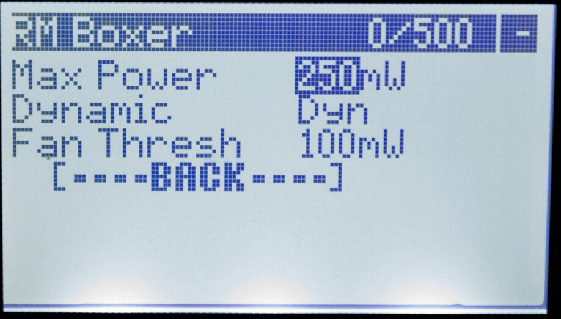
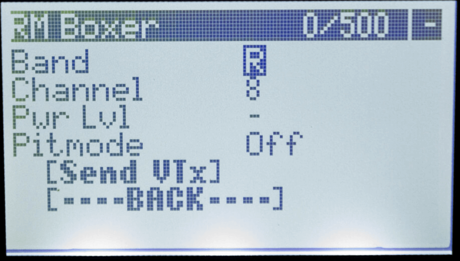

## Installing the Lua Script

Download the [ELRSv3 Lua Script](https://github.com/ExpressLRS/ExpressLRS/blob/3.x.x-maintenance/src/lua/elrsV3.lua?raw=true) (you can simply right-click, save-as) into your radio's SD Card under the `Scripts/Tools` folder.

<figure markdown>

</figure>

Access the script by navigating to your radio's System Menu.

1. Press the ++"SYS"++ Key on your Radio.
    - Older Radios or those with only one Menu Key will need to long-press the ++context-menu++ Key to access the System Menu.
    - Consult your Radio User's Manual on how to access the System Menu.
2. You are now in the Tools Menu where Lua Scripts can be found. Scroll down and select `ExpressLRS` Lua Script.
        
     Here's how it looks in the Tools menu (B&W and Color Screens):

    <figure markdown>
    
    </figure>

    <figure markdown>
    
    </figure>

3. Press ++enter++ to Load it.

??? failure "Stuck at `Loading...` (click/tap to expand)"
    Go back to the [Radio Preparation Guide](tx-prep.md) and make sure the current model is configured for ExpressLRS use.

    Also set your Internal or External RF Baudrate to a higher value if the Script still doesn't load after proper configuration of your Model. 
    
    As of 3.3.0:

    - 500Hz or faster packet rates require >400K Baudrate.
    - 333Hz is the fastest packet rate you can use with 400K Baudrate.

## Understanding and Using the Lua Script

### The Header

The first line, "Header", will show you some information about your ExpressLRS link. 

<figure markdown>

</figure>

**Module Identifier**

:   Shows the name of the current active Transmitter Module or Device.

**Packet Counter**

:   Shows the number of Bad and Good Packets the TX Module receives from the Radio. The second set of number should match your selected Packet Rate. e.g. If you've set your Packet Rate to 500Hz, the Packet Counter should show 0/500, which means you're not getting any Bad Packets ( 0 Bad Packets ) and only getting Good Packets ( 500 Good Packets ). Any small fluctuation is normal and often goes back to 100% Good Packets, especially when you change a setting and it's committed into memory. 

:   Should the indicator starts showing Bad Packets, and Good Packets goes down, it isn't a good situation. Make sure your module is not overheating and it's still getting a good connection with the radio. This is most dangerous when you're armed and flying several kilometers/miles out, as this could mean a sudden Failsafe.

**Connection Indicator**

:   Shows the current RC Link status. When not connected to any receiver, it will show a dash (`-`); while a `C` shows up when bound and connected.

The `Model Mismatch` message will also show up to indicate you are connected to a receiver, but the model selected on your radio is incorrect. See the [Model Match](../../software/model-config-match.md) page for more info about Model Matching.

<figure markdown>

</figure>

The `Armed` message will show up if you have the Arming Switch active (High, ~2000us). This is meant to warn users that changing parameters could result in a desync or disconnection with a receiver, resulting into a FAILSAFE.

If you do not meant to have your system Armed and ready for flying, make sure to toggle this switch to the Disarmed position (Low, ~1000us). Update your CH5 settings on the radio so that the output of this switch is correct (Low = disarmed; High = armed). See [Switch Configs](../../software/switch-config.md).

<figure markdown>

</figure>

!!! warning "WARNING"
	Do not change parameters while ARMED. When a parameter is changed, the module goes into Parameter Commit mode, interrupting the normal loop. This could result in a desync on some hardware combination which would result in a FAILSAFE.

### Version Line

The Version Line, found near the bottom of the Lua Script, indicates the firmware version flashed into the Device. This is present on both TX Modules and Receivers.

<figure markdown>

</figure>

<figure markdown>

</figure>

<figure markdown>

</figure>

From these examples:

* `3.3.0` - The numerical Version Number, in the form of `Major.Minor.Patch`.
    - See [semantic versioning scheme](https://semver.org/) for the origins of these numbers.

* `ISM2G4` - The Regulatory Domain set into the Device. TX and RX Regulatory Domains should match.

* `ae9df3` - The Git commit hash for the version or branch.

### Folder Titles

Items with `>` before the name is a folder that when selected shows another level of customization. `TX Power`, `VTX Administrator`, `Wifi Connectivity` are examples of these items.

:new: These items will now show what is currently set for the items within. An example would be on `TX Power`, which will show the current Power set, and if Dynamic Power is enabled, it will show the current set Max Power, followed by the indicator `Dyn`.

### Packet Rate and Telemetry Ratio

<figure markdown>

</figure>

<figure markdown>

</figure>

These are shown as `Packet Rate` and `Telem Ratio` in the Lua script, which allows you to change your performance parameters. 

* `Packet Rate` sets how fast data packets are sent, higher rates send packets more frequently and have lower latency.

	The following options are available for `2.4GHz`:

	- `50Hz, 150Hz, 250Hz & 500Hz`: Lora-based options. Higher means lower latency at the expense of sensitivity. Since v1.0.
	- `F500 & F1000` :new: : Pure FLRC for lowest latency, reduced range compared to LoRa, 500Hz and 1000Hz. [Details](https://github.com/ExpressLRS/ExpressLRS/pull/1277)
	- `D250 & D500` :new: : Redundant transmit FLRC modes.  `D` stands for `Déjà Vu`, 250Hz and 500Hz. Higher latency, reduced packet jitter and higher LQ. Same range as other FLRC modes. [Details](https://github.com/ExpressLRS/ExpressLRS/pull/1527)
	- `100Hz Full & 333Hz Full` :new: : Lora-based 10-bit Full Resolution with 8ch/12ch/16 Switch Mode options. [Details](https://github.com/ExpressLRS/ExpressLRS/pull/1572)
	
	The following options are available for `900MHz`:

	- `25Hz, 50Hz, 100Hz & 200Hz`: LoRa-based options. Higher means lower latency at the expense of sensitivity. Since v1.0.
	- `100Hz Full` :new: : Lora-based 10-bit Full Resolution with 8ch/12ch/16 Switch Mode options. [Details](https://github.com/ExpressLRS/ExpressLRS/pull/1572)

	The number following the rate in parentheses (e.g. -105dBm for 500Hz) is the Sensitivity Limit for the rate, the lowest RSSI where packets will still be received. See [Signal Health](../../info/signal-health.md) for more information about the sensitivity limit.

!!! warning "WARNING"
	Never change the packet rate while flying as this **FORCES A DISCONNECT** between the TX and RX. 

* `Telem Ratio` sets the telemetry ratio or how much of the packet rate is used to send telemetry. The options, in order of increasing telemetry rate, are: `Off, 1:128, 1:64, 1:32, 1:16, 1:8, 1:4, 1:2`. A Telem Ratio of 1:64 means one out of every 64 packets are used for telemetry data.
	- :new: v3.0 comes with `Std` and `Race` options. `Std` changes ratio depending on the Packet Rate, and `Race` is the same as Std, but will disable telemetry and sync while Armed.

	For information on telemetry setup, see [First Flight: Telemetry](../pre-1stflight.md#telemetry) and [Telemetry Bandwidth](../../info/telem-bandwidth.md).

### Switch Mode

The Switch Mode setting controls how channels AUX1-AUX8 are sent to the receiver (the 4 main channels are always 10-bit). The options are `Hybrid & Wide`. **Hybrid** mode is 6x 2, 3 or 6-position + 1x 16-position, and **Wide** is 7x 64 or 128-position. For detail about the differences, see the [Switch Configs](../../software/switch-config.md) documentation.

:new: In full resolution modes, the Switch Mode parameter selects the number of channels to be used. [Full Resolution Switch Modes](../../software/switch-config.md#full-resolution-switch-configuration-modes) 

!!! hint "Hot Tip"
	The Switch Mode can only be changed when not connected to a receiver. The top right corner of the Lua script will show a `-` if you're not connected.

### Antenna Mode

This option is only available to Gemini-capable TX Modules. See the [Gemini Page](../../software/gemini.md) for more details.

Available Options:

- `Gemini`

    * Transmit on two Tx antennas simultaneously at different frequencies 40MHz apart (for 2.4GHz) or ~10MHz apart (for 900MHz).

- `Ant 1/Ant 2`

    * Transmit only on one antenna.

- `Switch`

    * Alternate between the two Antennas.

### Model Match

ExpressLRS supports multiple configuration profiles, and the configuration profile is selected by setting the "Receiver ID" property in the Radio Handset's Model Setup -> Internal/External RF -> Receiver (number).

<figure markdown>

</figure>

Model Match is used to prevent accidentally selecting the wrong model in the handset and flying with an unexpected handset or ELRS configuration. Setting this to `On` while a receiver is connected will make that receiver only connect with the current Receiver ID. Setting it to `Off` will allow a connection with any bound receiver (including those using a Bind Phrase). Both sides of the connection must agree on their Model Match setting. For a detailed explanation of how this restricts connections see [Model Match](../../software/model-config-match.md).

The Receiver ID of the active model is shown after the option value.

### TX Power

<figure markdown>

</figure>

<figure markdown>

</figure>

The `TX Power` folder is where you can change your TX Module's Transmission Power settings. Press ++enter++ once to access the settings and Press ++"RTN"++ key to go back to the previous page.

* `Max Power` sets the maximum power level your TX will transmit at. Selecting a power level higher or lower than your TX supports will revert to the closest supported level. The options are `10, 25, 50, 100, 250, 500, 1000 & 2000` mW. If Dynamic Power is set to `Off` this is the power level your TX always uses. 

* `Dynamic` enables the Dynamic Power feature. `Off` means that the TX will transmit at Max Power at all times. `Dyn` means the TX will dynamically _lower_ power to save energy when maximum power is not needed. The options `AUX9, AUX10, AUX11, AUX12` indicate that the TX can be changed from max power to dynamic power by changing the position of a switch. where switch HIGH (>1500us) = dynamic power, switch LOW (<1500us) = max power. For more information, [Dynamic Transmit Power](../../software/dynamic-transmit-power.md) provides a deeper dive into the algorithm and usage.

* `Fan Thresh` sets the power level the Fan should activate, e.g. if set to 100mW, then the fan should spin up if you set `Max Power` to 100mW with `Dynamic` set to OFF after a short delay. The fan will continue running for some time even after the power level goes below the threshold. Not all modules have a Fan header that benefits from the setting. . Default fan threshold is 250mW.

### VTX Administrator

<figure markdown>

</figure>

<figure markdown>

</figure>

VTX Administrator allows you to change your VTX settings directly from your radio, and have those VTX settings be applied to any receiver you connect to. The VTX settings are sent every time a new connection is acquired, or when `[Send VTX]` is pressed.

!!! hint "Hot Tip"
    VTX Administrator will send the current VTX settings to the flight controller whenever the TX module detects a connection to the RX. This means that it will resend them after telemetry lost/recovered. So if you have used any other method to change the VTX power level (i.e. OSD), then that will be overridden if you lose/regain telemetry in flight.

* `Band` sets the VTX band, the options are `Off, A, B, E, F, R & L`, the standard analog FPV bands. `Off` means that VTX Administrator will not adjust any VTX settings.

* `Channel` sets the VTX channel, the options are `1, 2, 3, 4, 5, 6, 7 & 8` which are the standard channels in the above bands.

* `Pwr Lvl` sets the VTX power by index, the options are `-, 1, 2, 3, 4, 5, 6, 7, & 8` which are the power levels that your VTX can do. Refer to your VTX table settings on the flight controller for the exact power levels. For example a VTX may have 1 = 25mW, 2 = 100mwW, 3 = 200mW, 4 = 500mW.

* `Pitmode` the options are `On & Off` which allow you to quickly switch into or out of pitmode

* Finally pressing the `[Send VTX]` button sends the configured settings to the receiver and on to the VTX. These settings are also sent every time a connection is established.

### WiFi Connectivity

<figure markdown>

</figure>

<figure markdown>

</figure>

This section contains all the WiFi-related functions.

* `Enable WiFi` will activate the Tx module WiFi mode for updating via WiFi (if the Tx Module has WiFi Capabilities). Visit [this page](../../software/updating/wifi-updating.md) for instructions on how the updating process works.

* `Enable Rx WiFi` will put the bound and connected receiver into WiFi mode to facilitate updating via WiFi (if the receiver has WiFi capabilities).

* `Enable Backpack WiFi` will put the Tx Backpack into WiFi mode (available only to TX modules with backpacks connected and updated to the new [Backpack](https://github.com/ExpressLRS/Backpack) firmwares).

* `Enable VRx WiFi` will put the VRx [Backpack](https://github.com/ExpressLRS/Backpack) that is bound and connected to the onboard TX Backpack into WiFi mode to facilitate updating via WiFi.

### Backpack Options

The parameters in this folder enables you to change the Backpack-related parameters.

<figure markdown>

</figure>

<figure markdown>

</figure>

* `Backpack` - Turn the Backpack function On or Off.
* `DVR Rec` - Set which Aux Channel and what channel position will trigger DVR Recording on the goggles. Only possible on FPV Goggles with VRX Backpack integration.
* `DVR Srt Delay` - How soon should the DVR start Recording upon activation of the Aux switch?
* `DVR Stp Delay` - How soon should the DVR stop Recording upon deactivation of the Aux switch?
* `HT Enable` - Turn Headtracking On or Off. Only available on some FPV Goggles with VRX Backpack integration.
* `HT Start Channel` - Starting Channel to send Head Tracking positions to.
* `Version` - The Backpack Firmware version flashed into the TX Backpack.

For more information, see the [Backpack Guide](../../hardware/backpack/esp-backpack.md).

### Bind

!!! info "Take Notice!"
    This command will only work on receivers that are already in `Bind Mode` (indicated by two blinks LED pattern). Receivers with a binding phrase set/flashed into them will NOT EVER go into this Bind Mode, and thus this command will not do anything.

    Devices with the same binding phrase and compatible firmware versions should automatically sync/bind upon power up.

<figure markdown>

</figure>

<figure markdown>

</figure>

Pressing the `[Bind]` button activates the binding mode for traditional binding. This does nothing for users who have configured a bind phrase and is not needed. For more information check out this page on [binding](../binding.md).

### BLE Joystick (ESP32 TXes Only)

<figure markdown>

</figure>

<figure markdown>

</figure>

Pressing the `[BLE Joystick]` selection activates BluetoothLE Joystick mode which allows connection to simulators through the bluetooth of your computer. Reboot or change models to exit this mode.

## Other Devices

The Other Devices folder, if present, allows changing the configuration of other connected devices, such as the current receiver. It is also used to go back to the TX Module options.

<figure markdown>

</figure>

<figure markdown>

</figure>

## Receiver Options

<figure markdown>

</figure>

<figure markdown>

</figure>

<figure markdown>

</figure>

### Protocol

The `Protocol` setting controls the output of the connected receiver. The following options are available:

* `CRSF` - The regular CRSF Protocol Output. Recommended for most application.
* `Inverted CRSF` - The CRSF Protocol inverted for use in Flight Controllers that doesn't have any other uarts available and the only option is to connect the receiver TX pin into an SBUS pad (Inverted RX). This is the old `Invert TX Pin` option.
* `SBUS` - Let the receiver output SBUS signal for use with devices that doesn't support CRSF protocol, like Stabilizers, Heli Controllers etc.
* `Inverted SBUS` - Like the above, but inverted.
* `SUMD` - Graupner/HoTT
* `DJI RS2 Pro` - Mainly used for the RS2 Pro Gimbals

For more information, see [Receiver Serial Protocols](../../software/serial-protocols.md)

### Antenna Mode

The `Antenna Mode` setting is only available for Receivers with Antenna Diversity. These options are available:

* `Diversity` - Both Antennas will be active. Receiver will switch to the antenna with better RSSI.
* `Ant1/Ant2` - Only one antenna will be enabled (for both RC command reception and Telemetry sending).

### Receiver Mode

The `Receiver Mode` setting is only available for True Diversity receivers. These options are available:

* `Gemini` - Receive on two Rx antennas simultaneously at different frequency 40MHz apart (for 2.4GHz) or ~10MHz apart (for 900MHz). Best used when you have a Gemini-capable TX Module.
* `Diversity` - Both Antennas will be active. Receiver will switch to the antenna with better RSSI.
* `Ant1/Ant2` - Only one antenna will be working to receive RC commands (and send Telemetry).

### Tlm Power

The `Telemetry Power` setting is used to adjust the telemetry transmit power of the receiver. You can only adjust this on receivers with Power Amplifiers.

### Init Rate

The `Initialization Rate` setting controls the packet rate that the receiver will start checking for the Sync Packet. On boot, the receiver will listen for the Sync Packet starting with the fastest RF Mode or Packet Rate, down to the slowest, then cycles, until it finally Syncs and Binds. Setting this parameter closer or equal to the Packet Rate you've set for the TX module will allow the receiver to Bind or Connect much faster.

### Team Race

Team Racing allows selection between multiple connected models, failsafing all unselected models. See [Team Racing](../../software/teamracing.md)

* `Channel` (default CH11 / AUX7) TeamRace Channel - The channel that is checked on the receiver to determine the currently selected model. Has no effect if the TeamRace Position is set to Disabled.
* `Position` (default Disabled) TeamRace Position - Which position of the TeamRace Channel activates this model. 6-position switches are supported (1-6) as well as Low/Mid/High for using a 2 or 3-position switch.

### Loan Model/Return Model

These commands allow the user to Loan/Return the model. For more information, see the [Loan Model](../../software/loan-model.md) guide.

### Output Mapping

<figure markdown>

</figure>

This folder is only available to PWM receivers. This will allow users to set options for each of the output pins of their PWM receivers.

* `Output Ch` - Select the Channel or Pin in the PWM receiver to change settings for.
* `Input Ch` - Select which Channel on your Radio Mix will send its output to the Receiver PWM Channel.
* `Output Mode` - Select the command rate for the Output Pin. Best to set this to the refresh rate of the servo or device.
* `Invert` - Set this option to On or Off to toggle the direction for the Output Channel.

For more information, see [PWM Receivers](../../hardware/pwm-receivers.md) page.

### Model ID

This line shows the currently set Model ID for the receiver when Model Matching is enabled. This number should match the Receiver ID set with the current active Model on the Radio handset, otherwise, there will be Model Mismatch! See [Model Match](../../software/model-config-match.md) for more details.

## Recommendations

* For racing where maximum performance is a must, the `500Hz` modes or faster, with the `Race` Telemetry mode, is ideal. `Hybrid` Switch Mode is also good here.

* For freestyle and general everyday flying, you may use the `250Hz` modes or faster, with the `Std` Telemetry mode. Switch Mode doesn't matter as much here. Select what's appropriate for your Flight Mode settings.

* For fixed wings, we recommend using `100Hz Full Res`, together with either `Std` or your choice of Telemetry Ratio. Switch Mode will depend greatly on how many full resolution channels you intend to use.

## Troubleshooting the Lua Script

### ExpressLRS Lua Script is stuck at `Loading...`

??? Note "ExpressLRS Lua Script is stuck at `Loading...`"
    Go back to the [Radio Setup Guide](tx-prep.md) and make sure your radio is prepped up for ExpressLRS. Check that the ExpressLRS Tx module is enabled - otherwise the script cannot be loaded.

    Also, make sure your module has been flashed with v3.0 firmware. V3 Lua for V3.0-flashed modules, V2 Lua for v2.x-flashed modules (including some modules fresh from the factory).

    For newly-acquired ExpressLRS modules, flashing via USB is the recommended update method.

### I cannot change the Switch Mode!

??? Note "I cannot change the Switch Mode!"
    Changing switch modes requires that the TX module and Receiver aren't connected to each other (no C in the top right corner of the Lua Script). Power off the receiver first, change the Switch Mode from the Lua script, then power up the receiver. The Switch Mode should then apply.

### I cannot change my Packet Rate to F1000!

??? Note "I cannot change my Packet Rate to F1000!"
    F1000 requires higher than 400K baud rates. First update your baud rate setting either in the Model Setup menu or in the System Menu -> Hardware, reboot your radio to ensure that the baud rate setting got applied and then change the Packet Rate.

    Do note that not every handset is capable of higher than 400K baud rates. See the [Radio Setup Guide](tx-prep.md) for the details.

### I cannot change to Full Resolution Rates!

??? Note "I cannot change to Full Resolution Rates!"
    As Full Resolution Rates call for an entirely different Switch Modes, you need to first disconnect the Receiver and the TX module from each other, like how you would change Switch Modes. Power down the receiver, change the Packet Rate to the Full Resolution modes, select your Switch Mode scheme and then power up the receiver or the aircraft.

### VTX Admin is not working but I can change VTX channels via OSD Menu.

??? Note "VTX Admin is not working but I can change VTX channels via OSD Menu."
    As VTX Admin depends on MSP which then depends on Telemetry, ensure that you have Telemetry enabled on your FC Configuration and that you are getting more than 10 Telemetry Sensors on your Radio (Model Setup -> Telemetry page; Delete and Discover New sensors to refresh the sensor list.)
    Also, make sure Telem Ratio is not Off.

### There is no C on the top right corner, and I'm not getting Telemetry in my radio!

??? Note "There is no C on the top right corner, and I'm not getting Telemetry in my radio!"

    Make sure Telem Ratio is not set to `Off`.
    Set it to `Std`, or any other value other than `Off`.

### On v1.x, I can choose 2W on the Lua, but I cannot do that anymore. What gives?

??? Note "On v1.x, I can choose 2W on the Lua, but I cannot do that anymore. What gives?"
    This means your module cannot go that high or that low. The power levels you can select on the new Lua script are based on the power levels your module supports.
    This also applies to other options like `Enable Backpack WiFi` or `BLE Joystick`. If your module doesn't support any of these features, it won't show up on the Lua Script.

