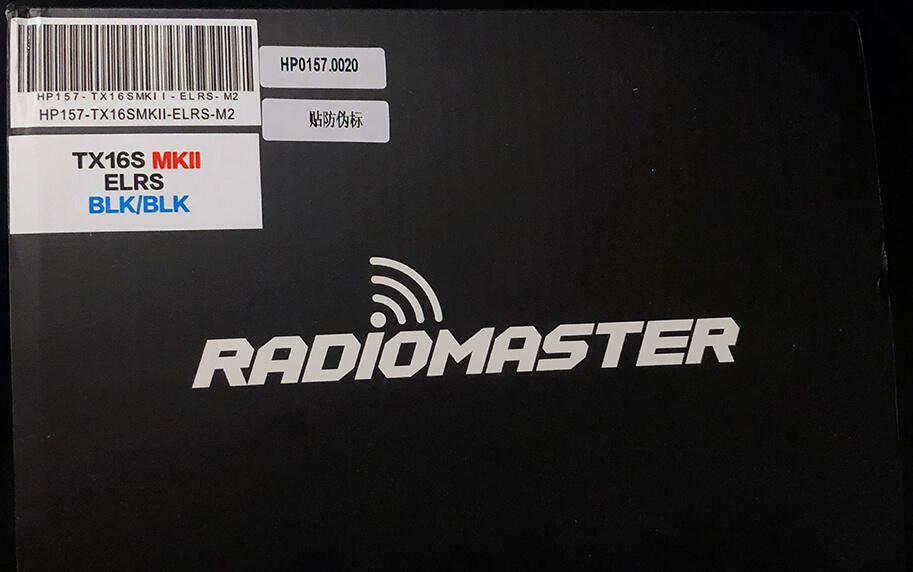

<figure markdown>

</figure>

!!! danger "Advisory"
    If you are flashing/updating your TX module via WiFi for the first time from the factory firmware, or from an older firmware, to ExpressLRS 3.x firmware, you will first need to flash it to version 2.5.2, then flash it with the [Repartitioner](https://github.com/ExpressLRS/repartitioner) binary [file](https://github.com/ExpressLRS/repartitioner/releases/download/1.0/repartitioner.bin) (right click, save as/save file as). Should it complain about Target Mismatch, just click `Flash Anyway`. Only then you can flash to 3.x firmware via WiFi.

    Joshua Bardwell has a video about it [here](https://www.youtube.com/watch?v=2kcRi1cHejM).

    Updating to 3.x via UART or ETX Passthrough doesn't require 2.5.2 firmware or the Repartitioner.

## Flashing/Updating your TX Module Firmware

=== "via WiFi"

    <figure markdown>
    
    </figure>

    === "Manual Upload via AP"

        !!! Info "Heads up!"
            This option is only possible if you haven't previously flashed or configured your TX Module with your Home WiFi SSID and Password or if it's unable to connect to said WiFi Network because the router is Off or unreachable.

        1. Launch the [ExpressLRS Configurator](../installing-configurator.md) on your Computer.
            ![Configurator Release]{ align=right }

            - Make sure `Official Releases` is active from the horizontal tab.
            - Ensure you select the Released version you want to flash into your TX module.

             

        2. Select the Device Category and Device target matching your hardware.

            - Device Category:
                - `RadioMaster 2.4 GHz`

            - Device:
                - `RadioMaster Zorro 2.4GHz TX`
                - `RadioMaster TX16S Internal 2.4GHz TX`
                - `RadioMaster TX12 Internal 2.4GHz TX`
                - `RadioMaster Boxer Internal 2.4GHz TX`

        3. Set the Flashing Method to `WiFi`.

            <figure markdown>
            
            </figure>

        4. Set the [firmware options](../firmware-options.md) for your device.
            - Regulatory Domain (Mandatory. Choose the domain appropriate for the location or country you're flying).
            - Binding Phrase (Optional, but Highly Recommended. Note this phrase as it should be the same on your other devices, or they will not bind or sync).
            - Local WiFi Network Credentials (Optional. Will be used the next time the device goes into WiFi mode).
        5. Click the ++"Build"++ button.
            
            <figure markdown>
            ![Build]
            </figure>
            
        6. Once the Build process is done, a Temp folder window containing your firmware binaries should pop up.

            ![Temp TX]{ align=right }

            - Do not close this Temp folder because this is where you will take your firmware from in the later steps. If you are planning on using your phone or tablet to upload the firmware file later, copy the firmware file into your device.

            !!! tip "NOTICE"
                With the release of ExpressLRS 3.3.0 and ExpressLRS Configurator 1.6.0, only one file will show up. Use the `firmware.bin` file for the next steps.

             
            
        7. Press the ++"SYS"++ Key on your Radio to display the Tools Menu, where you can find the Lua Scripts.

        8. Scroll down and select `ExpressLRS` Lua Script.

            <figure markdown>
            ![Lua Script]
            </figure>

            - If the script is nowhere to be found, download it from [this page](../transmitters/lua-howto.md) and save it into your Radio SD Card Scripts/Tools/ folder.

        9. Press ++enter++ to Load it.

            <figure markdown>
            ![Lua Running]
            </figure>

            - If the script is stuck on a "Loading..." screen, return to the [Radio Preparation](../transmitters/tx-prep.md) Page and make sure you have configured your radio properly for ExpressLRS use.
        10. Scroll down and select `WiFi Connectivity` and press ++enter++.
        11. Select `Enable WiFi` and press ++enter++.

            <figure markdown>
            ![Lua WiFi]
            </figure>

        12. The `WiFi Running` screen will show up. Your TX module is now in WiFi mode.

        13. Using a WiFi-capable device such as your smartphone or laptop, scan for the `ExpressLRS TX` Access Point. Connect to this Access Point.

            { align=right }

            - If your TX Module is previously flashed with your Home WiFi SSID and Password, and it is able to connect to that WiFi Network, then the Access Point will not show up.
            - `expresslrs` is the Password for this Access Point.

            ??? question "Where's the Access Point?"
                If you cannot find the Access Point, make sure the device you're using is capable of connecting to 2.4GHz WiFi Networks. Also try putting the devices closer together.
                
                If you still cannot find the Access Point, chances are that you have set it with your WiFi SSID and Password before, and it has connected to your WiFi Network.

             

        14. Once connected to the `ExpressLRS TX` Access Point, open up a Browser window, type in the IP Address `10.0.0.1` on the Address Bar, and press ++enter++. The ExpressLRS Web UI will load.
        15. Activate the `Update` Tab.

            <figure markdown>
            ![TX update tab]
            </figure>

            - If your TX Module is still on an earlier firmware version, then there's no Update Tab, and instead, you will need to scroll down to find the Firmware Update section.

            <figure markdown>
            ![Old File Upload]
            </figure>

        16. Drag and drop the Firmware file from the Temp folder into the File Upload field.
            - You can also use the Browse or Choose File button and browse for the file yourself, especially if you've copied/moved it somewhere else on an earlier step.
        17. Click the ++"Update"++ button to start the Updating procedure.
        18. Wait for the firmware file to get uploaded and flashed into your device. It only takes a minute or two, and you will see the Success Popup Message.

            <figure markdown>
            ![Success WiFi]
            </figure>

        19. On your Radio, the `WiFi Running` screen should disappear and should be back to the WiFi Connectivity Menu of the ExpressLRS Lua Script.
        20. Long-press the ++"RTN"++ Key to exit the ExpressLRS Lua Script. Then reload it to check for the ExpressLRS Firmware version and verify your TX module has been updated.

    === "Manual Upload via Local WiFi"

        !!! Info "Heads up!"
            This option is only possible if you have previously flashed or configured your TX Module with your Home WiFi SSID and Password and the module is able to connect to said WiFi Network.

        1. Launch the [ExpressLRS Configurator](../installing-configurator.md) on your Computer.
            ![Configurator Release]{ align=right }

            - Make sure `Official Releases` is active from the horizontal tab.
            - Ensure you select the Released version you want to flash into your TX module.

             
        2. Select the Device Category and Device target matching your hardware.

            - Device Category:
                - `RadioMaster 2.4 GHz`

            - Device:
                - `RadioMaster Zorro 2.4GHz TX`
                - `RadioMaster TX16S Internal 2.4GHz TX`
                - `RadioMaster TX12 Internal 2.4GHz TX`
                - `RadioMaster Boxer Internal 2.4GHz TX`

        3. Set the Flashing Method to `WiFi`.

            <figure markdown>
            
            </figure>

        4. Set the [firmware options](../firmware-options.md) for your device.
            - Regulatory Domain (Mandatory. Choose the domain appropriate for the location or country you're flying).
            - Binding Phrase (Optional, but Highly Recommended. Note this phrase as it should be the same on your other devices, or they will not bind or sync).
            - Local WiFi Network Credentials (Optional. Will be used the next time the device goes into WiFi mode).
        5. Click the ++"Build"++ button.
            
            <figure markdown>
            ![Build]
            </figure>
            
        6. Once the Build process is done, a Temp folder window containing your firmware binaries should pop up.
            ![Temp TX]{ align=right }

            - Do not close this Temp folder because this is where you will take your firmware from in the later steps. If you are planning on using your phone or tablet to upload the firmware file later, copy the firmware file into your device.

            !!! tip "NOTICE"
                With the release of ExpressLRS 3.3.0 and ExpressLRS Configurator 1.6.0, only one file will show up. Use the `firmware.bin` file for the next steps.

             
        7. Press the ++"SYS"++ Key on your Radio to display the Tools Menu, where you can find the Lua Scripts.

        8. Scroll down and select `ExpressLRS` Lua Script.

            <figure markdown>
            ![Lua Script]
            </figure>

            - If the script is nowhere to be found, download it from [this page](../transmitters/lua-howto.md) and save it into your Radio SD Card Scripts/Tools/ folder.

        9. Press ++enter++ to Load it.

            <figure markdown>
            ![Lua Running]
            </figure>

            - If the script is stuck on a "Loading..." screen, return to the [Radio Preparation](../transmitters/tx-prep.md) Page and make sure you have configured your radio properly for ExpressLRS use.
        10. Scroll down and select `WiFi Connectivity` and press ++enter++.
        11. Select `Enable WiFi` and press ++enter++.
            
            <figure markdown>
            ![Lua WiFi]
            </figure>

        12. The `WiFi Running` screen will show up. Your TX module is now in WiFi mode.

        13. With your module now in WiFi Mode and it was able to connect to your Local WiFi Network, open a Browser window on any WiFi-capable device that is also connected to the same Local WiFi Network. Type in the Address http://elrs_tx.local on your browser's Address Bar. The ExpressLRS Web UI should load.
            - If your browser cannot resolve this address and it cannot load the ExpressLRS Web UI, this means that MDNS is not working on your device or network.

            ??? tip "MDNS is not working!"
                === "The `arp` Command"

                    1. Open up a Command Prompt window on your computer.
                    2. Execute the command `arp -a`, which will list all the devices in the Network.
                    3. Use each of the IP Addresses marked as `Dynamic` as a URL in your Browser until you get to the ExpressLRS Web UI.

                === "Router DHCP List"
                    1. Log in into your Router dashboard.
                    2. Check the DHCP List and look for the "elrs" device.
                    3. Take note of the IP Address given by your router.
                    4. Use this IP address in your Browser as the URL.

        14. Activate the `Update` Tab.

            <figure markdown>
            ![TX update tab]
            </figure>

            - If your TX Module is still on an earlier firmware version, then there's no Update Tab, and instead, you will need to scroll down to find the Firmware Update section.

            <figure markdown>
            ![Old File Upload]
            </figure>

        15. Drag and drop the Firmware file from the Temp folder into the File Upload field.
            - You can also use the Browse or Choose File button and browse for the file yourself, especially if you've copied/moved it somewhere else on an earlier step.
        16. Click the ++"Update"++ button to start the Updating procedure.
        17. Wait for the firmware file to get uploaded and flashed into your device. It only takes a minute or two, and you will see the Success Popup Message.

            <figure markdown>
            ![Success WiFi]
            </figure>

        18. On your Radio, the `WiFi Running` screen should disappear and should be back to the WiFi Connectivity Menu of the ExpressLRS Lua Script.
        19. Long-press the ++"RTN"++ Key to exit the ExpressLRS Lua Script. Then reload it to check for the ExpressLRS Firmware version and verify your TX module has been updated.

    === "Auto Upload"

        !!! Info "Heads up!"
            This option is only possible if you have previously flashed or configured your TX Module with your Home WiFi SSID and Password and the module is able to connect to said WiFi Network.
            
            MDNS must also be working so your browser can resolve the address http://elrs_tx.local and load the ExpressLRS Web UI from said address.

        1. Press the ++"SYS"++ Key on your Radio to display the Tools Menu, where you can find the Lua Scripts.

        2. Scroll down and select `ExpressLRS` Lua Script.

            <figure markdown>
            ![Lua Script]
            </figure>

            - If the script is nowhere to be found, download it from [this page](../transmitters/lua-howto.md) and save it into your Radio SD Card Scripts/Tools/ folder.

        3. Press ++enter++ to Load it.

            <figure markdown>
            ![Lua Running]
            </figure>

            - If the script is stuck on a "Loading..." screen, return to the [Radio Preparation](../transmitters/tx-prep.md) Page and make sure you have configured your radio properly for ExpressLRS use.
        4. Scroll down and select `WiFi Connectivity` and press ++enter++.
        5. Select `Enable WiFi` and press ++enter++.
            
            <figure markdown>
            ![Lua WiFi]
            </figure>
            
        6. The `WiFi Running` screen will show up. Your TX module is now in WiFi mode.

        7. Launch the [ExpressLRS Configurator](../installing-configurator.md) on your Computer.
            ![Configurator Release]{ align=right }

            - Make sure `Official Releases` is active from the horizontal tab.
            - Ensure you select the Released version you want to flash into your TX module.

             
        8. Select the Device Category and Device target matching your hardware.

            - Device Category:
                - `RadioMaster 2.4 GHz`

            - Device:
                - `RadioMaster Zorro 2.4GHz TX`
                - `RadioMaster TX16S Internal 2.4GHz TX`
                - `RadioMaster TX12 Internal 2.4GHz TX`
                - `RadioMaster Boxer Internal 2.4GHz TX`

        9. Set the Flashing Method to `WiFi`.

            <figure markdown>
            
            </figure>

        10. Set the [firmware options](../firmware-options.md) for your device.
            - Regulatory Domain (Mandatory. Choose the domain appropriate for the location or country you're flying).
            - Binding Phrase (Optional, but Highly Recommended. Note this phrase as it should be the same on your other devices, or they will not bind or sync).
            - Local WiFi Network Credentials (Optional. Will be used the next time the device goes into WiFi mode).
        11. Click the ++"Flash"++ button.

            <figure markdown>
            ![Flash]
            </figure>
        
        12. Wait for the upload to finish. A Green Success bar will show up in the ExpressLRS Configurator.

            <figure markdown>
            
            </figure>

        13. On your Radio, the `WiFi Running` screen should disappear and should be back to the WiFi Connectivity Menu of the ExpressLRS Lua Script.
        14. Long-press the ++"RTN"++ Key to exit the ExpressLRS Lua Script. Then reload it to check for the ExpressLRS Firmware version and verify your TX module has been updated.

=== "via ETX Passthrough"

    <figure markdown>
    
    </figure>

    !!! info "Info"
        ETX Passthrough is the result of the collaborative effort between RadioMaster, EdgeTX and ExpressLRS.

        It is only available on Radios with Internal ExpressLRS Modules.
    
    Before you start, ensure you have the latest EdgeTX firmware version on your Radio. Consult the EdgeTX [documentation](https://github.com/EdgeTX/edgetx.github.io/wiki/EdgeTX-Installation-Guide) regarding the updating process.

    - `TX16S MK2`: Update it to at least EdgeTX 2.7.0 (f79978b) or EdgeTX 2.7.1 (a55aff0).
    - `Zorro`: Update it to at least EdgeTX 2.7.0 (f79978b) or EdgeTX 2.7.1 (a55aff0). It often comes with an earlier EdgeTX 2.7.0 version (2bdd4974) which results in unsuccessful flashing.
    - `TX12 MK2`: Update it to at least EdgeTX 2.8.0 (f6d140e) for full EdgeTX support.
    - `Boxer`: The factory EdgeTX firmware should be based off an early EdgeTX 2.8.0 and wouldn't need an update.

    !!! tip "Hot Tip"
        To ensure updating success with this method, update the EdgeTX firmware on the radio as mentioned above.

    ??? Tip "Simplest EdgeTX Updating Procedure"
        1. Visit http://buddy.edgetx.org/.
        2. Select the EdgeTX version and the Radio Model you want to update from the Left-hand side column.
        3. Click the ++"Download .bin"++ button at the bottom of the page.
        4. Save the firmware file into your Radio's SD Card, inside the `Firmware` Folder.
        5. Reboot the Radio into DFU/Bootloader mode.
            - Turn off your radio.
            - Press and hold the two horizontal Trim switches then press the Power button. The Screen should Light up. Let go of the buttons.
            - Some Radios have a different procedure, like the BetaFPV Lite Radio 3 Pro. Consult the Manual for the steps to get it into this DFU/Bootloader mode.
        6. Select `Write Firmware`.
        7. Navigate to the EdgeTx firmware file you just downloaded.
        8. Follow the screen prompts.
        9. Once Writing is complete, reboot the radio.
        10. Check the Radio's Version Page to verify you have the version you need.

    Also make sure you have an internal ELRS module on your Radio. The following steps only apply to handsets with ExpressLRS-specific internal modules. There are stickers marked with "ELRS" attached to your radio packaging or boxes, as well as on the JR module bays indicating the type of internal rf module the radio have.

    <figure markdown>
    
    <figcaption>Example Sticker On RadioMaster Handset/Radios</figcaption>
    </figure>

    The current Model on the radio should be using the [Internal ExpressLRS Module](../transmitters/tx-prep.md#rf-protocol). Test this by loading the ExpressLRS Lua Script from the Tools Menu.

    <figure markdown>
    ![Lua Running]
    </figure>

    There's one more setting you want to make sure is set properly before you proceed.

    1. Press the ++"SYS"++ Key on the Radio.
    2. Press the ++"PAGE"++ Key until you reach the Hardware Page.
    3. Scroll down until you get to the Serial Ports settings.
    4. Scroll down and select USB-VCP. Press ++enter++ and use the Scroll Wheel to set it to `CLI` mode if it is set to a different setting. Press ++enter++ once more to confirm the changes.
    5. Exit the Hardware menu by long-pressing ++"RTN"++ Key.

    Now follow the next steps to get your Internal ExpressLRS Module Updated:

    1. Connect your powered-up Radio to your Computer via a USB Data Cable.

        <figure markdown>
        
        </figure>

    2. On your Radio, scroll down and select `USB Serial(VCP)` then press the ++enter++ Key. Set your Radio aside in the meantime.

        <figure markdown>
        
        </figure>

    3. On your Computer, check whether your Radio is being recognized correctly as a {==STMicroelectronics Virtual COM Port==} device.

        !!! tip "Important"
            This is a vital step and a common failure point. Pay attention.

        Windows Users can use Device Manager to check whether the Radio is being recognized correctly.

        <figure markdown>
        
        </figure>

        :material-alert-outline: Yellow Caution Triangles in the Device Manager, or any mention of `<Radio Name> Serial Port` means drivers aren't installed.

        [Download](https://www.st.com/en/development-tools/stsw-stm32102.html) the Driver package first. Unzip/extract the contents of the package and run/execute (double-click) the installer file (`VCP_V1.5.0_Setup_W7_x64_64bits.exe` for Windows Users). 
        
        Once Drivers are installed, check again if the Radio is now being recognized correctly. You may have to unplug-replug the USB Cable first or even reboot your computer.

        You only have to do this once usually.
    
    4. Launch the [ExpressLRS Configurator](../installing-configurator.md) on your Computer.
        ![Configurator Release]{ align=right }

        - Make sure `Official Releases` is active from the horizontal tab.
        - Ensure you select the Released version you want to flash into your TX module.

         
    5. Select the Device Category and Device target matching your hardware.

        - Device Category:
            - `RadioMaster 2.4 GHz`

        - Device:
            - `RadioMaster Zorro 2.4GHz TX`
            - `RadioMaster TX16S Internal 2.4GHz TX`
            - `RadioMaster TX12 Internal 2.4GHz TX`
            - `RadioMaster Boxer Internal 2.4GHz TX`

    6. Set the Flashing Method to `EdgeTXPassthrough`

        <figure markdown>
        
        </figure>

    7. Set the [firmware options](../firmware-options.md) for your device.
        - Regulatory Domain (Mandatory. Choose the domain appropriate for the location or country you're flying).
        - Binding Phrase (Optional, but Highly Recommended. Note this phrase as it should be the same on your other devices, or they will not bind or sync).
        - Local WiFi Network Credentials (Optional. Will be used the next time the device goes into WiFi mode).
    8. Click the ++"Flash"++ button.

        <figure markdown>
        ![Flash]
        </figure>
        
    9. Wait for the process to finish. A Green Success bar will show up in the ExpressLRS Configurator.
    10. Unplug your Radio from USB.
    11. Using the [ExpressLRS Lua Script] from the Tools Menu, check if the firmware version got updated.
    
        <figure markdown>
        
        </figure>

[Lua Script]: ../../assets/images/lua2.jpg
[Lua Running]: ../../assets/images/lua3.jpg
[Lua WiFi]: ../../assets/images/lua/wifirm.png
[Configurator Release]: ../../assets/images/ConfiguratorRelease.png
[Temp TX]: ../../assets/images/build-temp-tx.png
[Flash]: ../../assets/images/BuildFlash.png
[Build]: ../../assets/images/Build.png
[CP210x]: ../../assets/images/device-mngr-cp210x.png
[TX update tab]: ../../assets/images/web-update-tx.png
[Success WiFi]: ../../assets/images/txmoduleWiFiUpdateSuccess.jpg
[Old File Upload]: ../../assets/images/web-firmwareupdate.png
[ExpressLRS Lua Script]: firmware-version.md#via-lua-script
