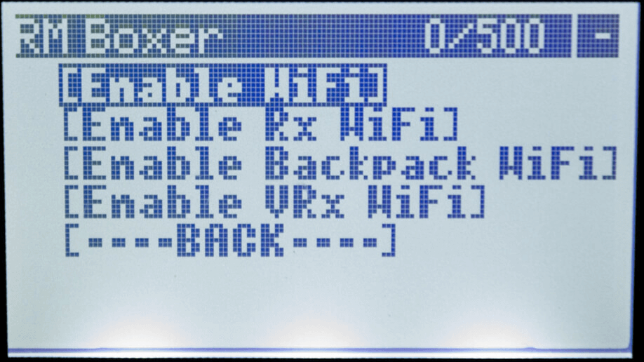

<figure markdown>

</figure>

!!! danger "Flashing ExpressLRS 3.x Firmware"
    1. If flashing/updating for the first time from the factory firmware or an older firmware, flash the module to version 2.5.1.
    2. Use the [Repartitioner](https://github.com/ExpressLRS/repartitioner) binary [file](https://github.com/ExpressLRS/repartitioner/releases/download/1.0/repartitioner.bin) (right click, save as/save file as) to flash it.
        - If Target Mismatch error appears, click `Flash Anyway`.
    3. Follow method 1 or 2 from the WiFi Flashing Guide to flash to the 3.x firmware.
    
    !!! info "Repartitioner is not necessary when flashing via USB/UART."

    **Reference**: Joshua Bardwell's video on the topic can be found [here](https://www.youtube.com/watch?v=2kcRi1cHejM).

## Flashing Internal RadioMaster

Following are the flashing methods for Internal RadioMaster.

### Flashing via EdgeTX Passthrough
??? Note "Flashing via EdgeTX Passthrough"

    !!! info "Info"
        This method is the result of the collaborative effort between EdgeTX, RadioMaster and ExpressLRS.

    - Targets:
        - `RadioMaster_Zorro_2400_TX_via_ETX`
        - `RadioMaster_TX16S_2400_TX_via_ETX`
        - `RadioMaster_Boxer_2400_TX_via_ETX`

    - Device Category:
        - `RadioMaster 2.4 GHz`

    - Device:
        - `RadioMaster Zorro 2400 TX`
        - `RadioMaster TX16S 2400 TX`
        - `RadioMaster TX12 2400 TX`
        - `RadioMaster Boxer 2400 TX`

    <figure markdown>
    
    <figcaption>Flashing via EdgeTXPassthrough</figcaption>
    </figure>

    #### Prerequisites

    1. Check that the latest EdgeTX firmware version is installed on your Handset. Refer to EdgeTX [documentation](https://github.com/EdgeTX/edgetx.github.io/wiki/EdgeTX-Installation-Guide) for updating process.
        
        - **Firmware Requirements**:
            - `TX16S MK2`: Update to EdgeTX 2.7.0 (f79978b) or EdgeTX 2.7.1 (a55aff0).
            - `Zorro`: Update to EdgeTX 2.7.0 (f79978b) or EdgeTX 2.7.1 (a55aff0). It often comes with an earlier EdgeTX 2.7.0 version (2bdd4974) which results in unsuccessful flashing.
            - `TX12 MK2`: Update to EdgeTX 2.8.0 (f6d140e) for full EdgeTX support.
            - `Boxer`: The factory EdgeTX firmware should be based off an early EdgeTX 2.8.0 and doesn't require an update.

    2. Make sure your Handset has an internal ELRS module and check the stickers marked with "ELRS" on your radio packaging or boxes, and on the JR module bays for confirmation.
    3. Confirm that the Serial Ports, USB-VCP setting is set to CLI mode in `System Menu` -> `Hardware Page`.
    4. Turn on the Handset and connect a USB data cable to the USB data port.
    5. Choose `USB Serial(Debug)` or `USB Serial(VCP)` in the options window that pops up.

        <figure markdown>
        
        </figure>

        <figure markdown>
        
        </figure>

        !!! tip "Important"
            This is a vital step and a common failure point. Pay attention.

    6. On Windows, check Device Manager for the STMicroelectronics Virtual COM Port device. If not and you are seeing a bunch of Yellow Warning icons, download the drivers from [here](https://www.st.com/en/development-tools/stsw-stm32102.html) and extract the contents. Run the VCP_V1.5.0_Setup_W7_x64_64bits executable.

        <figure markdown>
        
        </figure>

    7. In the ExpressLRS Configurator, select the correct Device Target and set the Flashing method to `EdgeTXPassthrough`. Choose the `Regulatory Domain` appropriate for your location.

    8. Using the ExpressLRS Configurator, select the appropriate version and the correct Device Target and set the Flashing method to `EdgeTXPassthrough`.

        !!! info "Optional" 
            Set the Binding Phrase and other relevant [Firmware Options], such as Local WiFi Network SSID and password.

    9. Click Build and Flash and wait for the Success banner.

        <figure markdown>
        ![Build & Flash]
        </figure>

    10. Unplug the USB and verify the internal module is working and updated to the selected version using the [ExpressLRS Lua script].

        <figure markdown>
        
        </figure>

### Flashing via WiFi
??? Note "Flashing via WiFi"

    - Targets:
        - `RadioMaster_Zorro_2400_TX_via_WIFI`
        - `RadioMaster_TX16S_2400_TX_via_WIFI`
        - `RadioMaster_Boxer_2400_TX_via_WIFI`

    - Device Category:
        - `RadioMaster 2.4 GHz`

    - Device: 
        - `RadioMaster Zorro 2400 TX`
        - `RadioMaster TX16S 2400 TX`
        - `RadioMaster TX12 2400 TX`
        - `RadioMaster Boxer 2400 TX`

    <figure markdown>
    
    <figcaption>Flashing via WiFi</figcaption>
    </figure>

    #### Method 1
    ??? Note "Method 1"

        1. Select the correct target and set [Firmware Options] using the ExpressLRS Configurator.
        2. Build the firmware, which will open the Target folder where the `RadioMaster_Zorro_2400_TX-<version>.bin` or `RadioMaster_TX16S_2400_TX-<version>.bin` file is located. Do not close this window so you can easily locate the correct file to upload to the module.

            <figure markdown>
            ![Build]
            </figure>

        3. Download the [ExpressLRS Lua script] (right-click, save as) and save it to your Radio's `/Scripts/Tools` folder.
        4. Insert the module into the module bay and make sure it's securely connected to the radio (see the [Radio Preparation](tx-prep.md) page).
        5. Execute the ExpressLRS Lua script by going to "System Menu" on your radio, then under Tools, select `ExpressLRS`.

            <figure markdown>
            
            </figure>

            <figure markdown>
            
            </figure>

            !!! Info "Troubleshooting the ExpressLRS Lua Script"
                If you encounter an issue where the script is stuck at `Loading...`, please refer to the [troubleshooting guide](http://localhost:8000/quick-start/troubleshooting/#expresslrs-lua-script-is-stuck-at-loading) for help.

            <figure markdown>
            
            </figure>

        6. From the ExpressLRS Lua script, select "WiFi Connectivity" and then "Enable WiFi". Confirm by pressing OK.

            <figure markdown>
            
            </figure>

        7. Connect to the Access Point created by the module, named `ExpressLRS TX`, using the password `expresslrs`.

            <figure markdown>
            
            </figure>

        8. Open your browser and navigate to http://10.0.0.1/ to access the upload form. Scroll down to find the form.
        9. Drag and drop the firmware file, `RadioMaster_Zorro_2400_TX-<version>.bin` or `RadioMaster_TX16S_2400_TX-<version>.bin`, created by the ExpressLRS Configurator. Alternatively, use the `Choose File` button to select the file from the folder where the firmware was created.
        10. Ensure that you have selected the correct firmware file and click `Update`.

            <figure markdown>
            
            </figure>

        11. Once the file is uploaded, a pop-up confirmation will show up.

            <figure markdown>
            
            </figure>
            
        12. Wait for the confirmation pop-up and for the "WiFi Running" screen to close.
        13. Close and relaunch the script.
        14. Verify the firmware version and hash in the main screen of the ExpressLRS Lua script.

        !!! info
            You can configure Home Network SSID and Password if you chose not to use ExpressLRS Configurator to set them. Once these are set, you can use the next two methods below.

        <figure markdown>
        
        </figure>

    #### Method 2
    ??? Note "Method 2"

        1. Select the correct target and set [Firmware Options] using the ExpressLRS Configurator.
        2. Build the firmware, which will open the Target folder where the `RadioMaster_Zorro_2400_TX-<version>.bin` or `RadioMaster_TX16S_2400_TX-<version>.bin` file is located. Do not close this window so you can easily locate the correct file to upload to the module.

            <figure markdown>
            ![Build]
            </figure>

        3. Using the [ExpressLRS Lua script] (right-click, save as), select "WiFi Connectivity" and then "Enable WiFi". Confirm by pressing OK.

            <figure markdown>
            
            </figure>

        4. If you have previously set up your Tx Module with your home WiFi network details, it will connect automatically.
        5. Using a browser, navigate to http://elrs_tx.local.
        6. The WiFi Update page will appear. Scroll down to the "Firmware Update" section.

            <figure markdown>
            
            </figure>

        7. Drag-and-drop the `RadioMaster_Zorro_2400_TX-<version>.bin` or `RadioMaster_TX16S_2400_TX-<version>.bin` file created by the ExpressLRS Configurator into the "Choose File" field, or manually navigate to the folder and select the file.
        8. Click the "Update" button. Wait for the process to complete (approx. 1 minute).
        9. Close and relaunch the script.
        10. Verify the version and hash in the main screen of the ExpressLRS Lua script.

    #### Method 3
    ??? Note "Method 3"

        1. Using the [ExpressLRS Lua script] (right-click, save as), select "WiFi Connectivity" and then "Enable WiFi". Confirm by pressing OK.

            <figure markdown>
            
            </figure>

        2. If you have previously set up your Tx Module with your home WiFi network details, it will connect automatically.
        3. Select the correct target and set [Firmware Options] using the ExpressLRS Configurator.
        4. Click **Build and Flash**. Wait for the compile process to complete.

            <figure markdown>
            ![Build & Flash]
            </figure>

        5. Once done, you should see a Success message, marking the update process complete.

            <figure markdown>
            
            </figure>

        6. Close and relaunch the script.
        7. Verify the version and hash in the main screen of the ExpressLRS Lua script.

[ExpressLRS Lua script]: https://github.com/ExpressLRS/ExpressLRS/blob/3.x.x-maintenance/src/lua/elrsV3.lua?raw=true
[Build]: ../../assets/images/Build.png
[Build & Flash]: ../../assets/images/BuildFlash.png
[Firmware Options]: ../firmware-options.md

