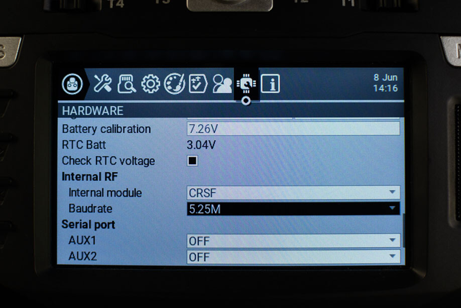
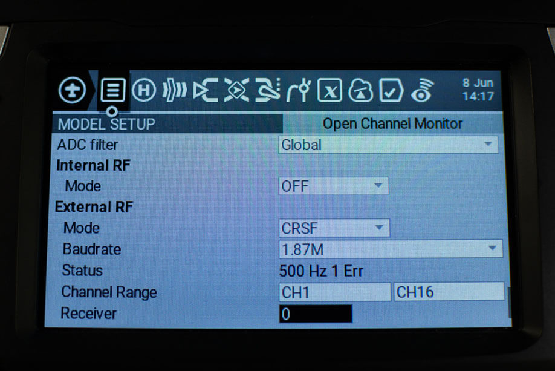
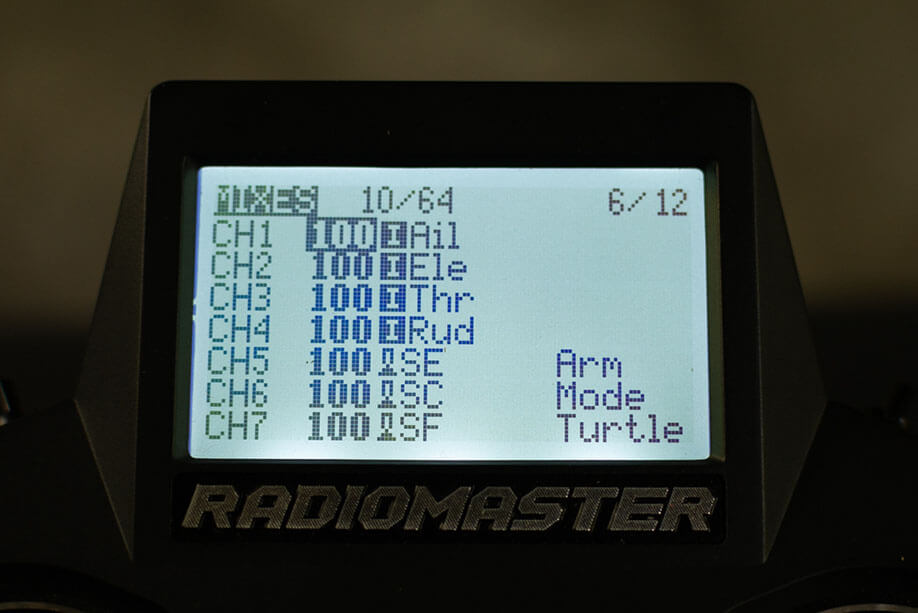
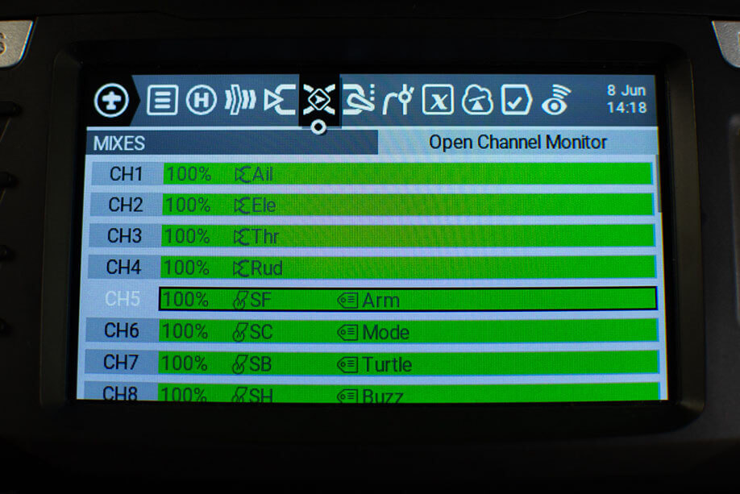

## External ExpressLRS Modules

Insert or attach your External ExpressLRS Transmitter Module into your Radio module bay, making sure no pins are bent or missing. External ExpressLRS Modules require three (3) pins to work: VCC/VBAT, GND and S.Port.

-insert image of module bays, full-size and nano, pins marked-

## Internal ExpressLRS Modules

Make sure you do have an Internal ExpressLRS Modules on your shiny new radio. The following handsets come in both ExpressLRS or 4-in-1 variants; with some coming in with a third (CC2500).

- RadioMaster TX16S MKII (ELRS, 4-in-1 CC2500) - ExpressLRS variant will have an ELRS sticker on the box.
- RadioMaster TX12 MKII (ELRS, 4-in-1, CC2500) - ExpressLRS variant will have an ELRS sticker on the box and an ELRS sticker in the JR module bay.
- RadioMaster Zorro (ELRS, 4-in-1, CC2500) - ExpressLRS variant will have an ELRS sticker on the box.
- RadioMaster Boxer (ELRS, 4-in-1, CC2500) - ExpressLRS variant will have an ELRS sticker on the box and an ELRS sticker in the JR module bay.
- Jumper T-Lite V2 (ELRS, 4-in-1, CC2500) 
- Jumper T-Pro (ELRS, 4-in-1)
- BetaFPV Lite Radio 3 Pro (ELRS, CC2500) - A sticker with the barcode at the bottom of the box should tell you it's an ELRS variant or the CC2500 variant.

## Radio Operating System

ExpressLRS **requires** CRSFShot or Mixer Sync to ensure full support for high packet rates. You should have [OpenTX 2.3.12](https://www.open-tx.org/2021/06/14/opentx-2.3.12) or newer; or [EdgeTX 2.4.0](https://github.com/EdgeTX/edgetx/releases/tag/v2.4.0) or newer; These version have full CRSFShot/Mixer Sync support.

To determine your Radio Operating System Version, load the Version page from the System Menu of your Radio:

1. Press the ++"SYS"++ Key.
    - Older Radios or those with only one Menu Key will need to long-press the ++context-menu++ Key to access the System Menu.
    - Consult your Radio User's Manual on how to access the System Menu.
2. Press ++"PAGE"++ Key until you get to the Version Page.

-show images of how to get to the version page on both b&w and colored screens-

If you have an older version, please first update your Radio OS to at least the mentioned versions. Please consult your Radio Operating System Updating Procedure if you don't know how.

ExpressLRS highly recommends [EdgeTX](https://github.com/EdgeTX/edgetx/releases) for best experience and compatibility. EdgeTX have introduced options that old and new Radio handsets will benefit from, like One Bit Sample Mode (mainly for old Frsky Radios like the X9D and the QX7) and Mega Bauds (Baudrates higher than 400K).

## Radio Settings

### Serial Baud Rate

The Baud Rate is the speed to which (in this instance) the Transmitter module and the Radio Handset communicate. It is measured in bits per second. Common baud rates include 115200bps and 400000bps.

A Faster or higher baud rate means that the module and radio can talk much faster, further lowering the end-to-end latency of the system. However, not all radio handsets or transmitter modules are capable of higher baud rates as this is highly dependent on the hardware.

Depending on the firmware that is running on your radio handset, you can change the baud rate setting to better suit your setup. This setting can be found in the System Menu -> Hardware page, under the Max Bauds (earlier OpenTX) or Baudrate (EdgeTX; recent OpenTX). On EdgeTX 2.7.0 and later, External RF modules now have their own Baudrate setting (see Model Setup section below). Internal ExpressLRS Modules will still use the Baudrate setting in the System Menu -> Hardware page.

To get to the baudrate setting on your radio:

=== "EdgeTX, Internal Module"

    1. Press the ++"SYS"++ Key. 
        - Older Radios or those with only one Menu Key will need to long-press the ++context-menu++ Key to access the System Menu.
        - Consult your Radio User's Manual on how to get to the System Menu.
    2. Press the ++"PAGE"++ Key until you get to the Hardware page.
    3. Scroll down until you reach the Baudrate setting.
    4. Press the ++enter++ Key.
    5. Use the Scroll wheel to change and select the Baudrate you want to use.
    6. Press ++enter++ Key once to apply the changes.
    7. Reboot the Radio (turn it Off, then turn it On again).

    <figure markdown>
    
    <figcaption>Baudrate setting on EdgeTX for Internal ExpressLRS Modules</figcaption>
    </figure>

=== "EdgeTX, External Module"

    1. Press the ++"MDL"++ Key. 
        - Older Radios or those with only one Menu Key will need to short-press the ++context-menu++ Key to access the Model Menu.
        - Consult your Radio User's Manual on how to get to the Model Menu.
    2. Press the ++"PAGE"++ Key until you get to the Model Setup page. On Colored Screen Radios, this should not be needed.
    3. Scroll down until you reach the External RF settings.
    4. Select the Baudrate setting.
    5. Press the ++enter++ Key.
    6. Use the Scroll wheel to change and select the Baudrate you want to use.
    7. Press ++enter++ Key once to apply the changes.
    8. Reboot the Radio (turn it Off, then turn it On again).

    <figure markdown>
    
    <figcaption>Baudrate setting on EdgeTX for External ExpressLRS Modules</figcaption>
    </figure>

=== "OpenTX"

    1. Press the ++"SYS"++ Key. 
        - Older Radios or those with only one Menu Key will need to long-press the ++context-menu++ Key to access the System Menu.
        - Consult your Radio User's Manual on how to get to the System Menu.
    2. Press the ++"PAGE"++ Key until you get to the Hardware page.
    3. Scroll down until you reach the Baudrate setting.
        - If you don't see this setting, that means your radio doesn't support changing the baudrate in this firmware and is locked at 400000.
    4. Press the ++enter++ Key.
    5. Use the Scroll wheel to change and select the Baudrate you want to use.
    6. Press ++enter++ Key once to apply the changes.
    7. Reboot the Radio (turn it Off, then turn it On again).

    <figure markdown>
    
    <figcaption>Baudrate setting on Older Radios</figcaption>
    </figure>

**Considerations for the Baudrate Settings** 

| Baud Rate | Max Packet Rate | Radio Firmware | Notes |
| ---- | ---- | ---- | --------- |
| 115200 | 250Hz | OpenTX/EdgeTX | QX7 without Crossfire/Inverter Mod |
| 400000 | F500 | OpenTX/EdgeTX | QX7, X9D and older radios will need a hardware mod to be reliable |
| 400000+ | F1000 | EdgeTX only | |

Radios such as the Frsky QX7, X10/S, and X12 will require either the [Crossfire Mod](https://blog.seidel-philipp.de/fixed-inverter-mod-for-tbs-crossfire-and-frsky-qx7/) or the OneBit Sample mode (found just before the ADC Filter setting in EdgeTX System Menu -> Hardware page) if a 400K or higher Baud Rate is desired. The Taranis X9D(+) has proven to be finicky even with the default 400K Baud Rate setting (see [Troubleshooting the X9D](../../hardware/x9d-troubleshooting.md)) and could use the OneBit Sample Mode as well.

As this setting also involves the module, it should be noted that you must also consider the type of module you are using with the radio. For instance, the R9M 2018 cannot reliably run at 400K Baud Rate setting and will require the [Resistor Mod](../../hardware/inverter-mod.md) first. If you can run your Radio Handset at a lower 115200 Baud Rate, then you don't have to do this Mod. STM-based modules like the R9M 2019, Ghost, Happymodel ES915TX or the Gen1 No OLED NamimnoRC Flash and Voyager modules can run at 1.87M Baud Rate. ESP-based modules like the Happymodel ES24TX, BetaFPV Nano & Micro or the Axisflying Thor can run up-to 3.75M or even 5.25M.

Be warned though. Just because you can doesn't mean you should. If you're experiencing constant Telemetry Lost/Recovered even nearby and/or that the Lua Script fails to load properly, then it's a sign your radio and/or module cannot run the selected Baud Rate. Lower it down a notch or settle with 400K Baud Rate.

### ADC Filter

The ADC filter is enabled by default in OpenTX and is known to cause issues with RC Command data. This can result in "jagged" RC command responses in black box logs, caused by sequential RC packets that have the same command value (which were "smoothed" by the ADC filter). We recommend turning the ADC filter OFF in [OpenTX/EdgeTX](https://www.youtube.com/watch?v=ESr2H_EZ89Q).

To check and change this setting, follow these steps:

1. Press ++"SYS"++ Key.
    - Older Radios or those with only one Menu Key will need to long-press the ++context-menu++ Key to access the System Menu.
    - Consult your Radio User's Manual on how to get to the System Menu.
2. Press the ++"PAGE"++ Key until you reach the Hardware Page.
3. Scroll down until you reach the ADC Filter setting.
4. Press ++enter++ Key to toggle it On or Off.

??? info "EdgeTX 2.7.0 Per-model Settings"

    With EdgeTX 2.7 or newer, you can set this per-model (Global, On, Off) as this is helpful on Fixed Wing models equipped with PWM receivers connected to slower servos.

    1. Press ++"MDL"++ Key.
        - Older Radios or those with only one Menu Key will need to short-press the ++context-menu++ Key to access the Model Menu.
        - Consult your Radio User's Manual on how to get to the Model Menu.
    2. Press the ++"PAGE"++ Key until you reach the Model Setup Page. On Colored Screen Radios, this should not be needed.
    3. Scroll down until you reach the ADC Filter setting.
    4. Press ++enter++ Key once.
    5. Use the Scroll wheel to select between Global(uses the setting from the Hardware page in the System Menu), On or Off.
    6. Press ++enter++ Key once more to set it.

## Model Setup

### RF Protocol

!!! Note
    If you're using an External ExpressLRS Module, make sure the Internal RF Module is **OFF**.

    If your Radio has an Internal ExpressLRS Module, and you want to use it instead of an external module, then set External RF Module to **OFF**, and then set the Internal RF Module to **CRSF** Protocol.

ExpressLRS uses the CRSF serial protocol to communicate between the transmitter and the TX module. Follow the following procedure to set it up on the current selected Model:

=== "External ExpressLRS Modules"

    1. Press the ++"MDL"++ Key.
        - Older Radios or those with only one Menu Key will need to short-press the ++context-menu++ Key to access the Model Menu.
        - Consult your Radio User's Manual on how to get to the Model Menu.
    2. Press the ++"PAGE"++ Key until you reach the Model Setup Page. On Colored Screen Radios, this should not be needed.
    3. Scroll down until you reach the Internal RF settings. Set this to `Off`.
    3. Scroll down until you reach the External RF settings.
    4. Set the Mode to `CRSF`.
        - You can also change the baudrate setting at this point.
    5. (Optional) Set the Receiver ID to a Unique Number.
    6. Press the ++"RTN"++ Key or Exit the Model Menu

    <figure markdown>
    
    </figure>

    <figure markdown>
    
    </figure>

=== "Internal ExpressLRS Modules"

    1. Press the ++"MDL"++ Key.
        - Older Radios or those with only one Menu Key will need to short-press the ++context-menu++ Key to access the Model Menu.
        - Consult your Radio User's Manual on how to get to the Model Menu.
    2. Press the ++"PAGE"++ Key until you reach the Model Setup Page. On Colored Screen Radios, this should not be needed.
    3. Scroll down until you reach the Internal RF settings.
    4. Set the Mode to `CRSF`.
    5. (Optional) Set the Receiver ID to a Unique Number.
    6. Scroll down until you reach the External RF settings. Set this to Off.
    7. Press the ++"RTN"++ Key or Exit the Model Menu

    ??? info "No CRSF Mode Option?"
        If for some reason, you cannot find the CRSF Protocol under the Internal RF Modes, set the `Internal Module Type` to CRSF via your Radio's `System Menu -> Hardware` page.

        1. Press the ++"SYS"++ Key. 
            - Radios without a dedicated ++"SYS"++ Key will need to long-press the ++context-menu++ Key to access the System Menu.
            - Consult your Radio User's Manual on how to get to the System Menu.
        2. Press the ++"PAGE"++ Key until you get to the Hardware page.
        3. Scroll down until you reach the Internal RF settings.
        4. Set the Type to `CRSF`.
            - You can also set the Baudrate at this point.
        5. Press the ++"RTN"++ Key or Exit the Hardware Menu, and go back into setting your Internal RF module.

    <figure markdown>
    
    </figure>

    <figure markdown>
    
    </figure>

!!! Note
    The iFlight Commando 8 is NOT using an internal RF module for its ExpressLRS units, unlike the RadioMaster Zorro, RadioMaster TX16S MK2, RadioMaster TX12 MK2, Jumper T-lite V2, Jumper T-pro or the BetaFPV Lite Radio 3 Pro.

    Set the Internal RF module to Off, and set the External RF module to CRSF protocol, as any External RF module requires.

### Switches and Aux Channels

By default, a fresh model does not have any Aux Channels configured (Aux channels start from Ch5, with the first 4 Channels assigned to your joysticks). If moving any of the switches in your radio doesn't affect your Modes in Betaflight or INAV, this is one of the main reasons. So let's get this sorted out!

1. Press the ++"MDL"++ Key.
    - Older Radios or those with only one Menu Key will need to short-press the ++context-menu++ Key to access the Model Menu.
    - Consult your Radio User's Manual on how to get to the Model Menu.
2. Press the ++"PAGE"++ Key until you reach the Mixes Page.
3. Scroll down to the Channel you want to configure.
4. Select the Channel, long press ++enter++ and select Edit.
5. (Optional) You can name this channel however you want to remind you of its purpose.
6. Select Source. Press the ++enter++ Key.
7. Activate or flick the Switch you'd want to use for this channel. An example would be for CH5, which will be your Arming switch, you'd want to choose a 2-position switch.
8. Press ++enter++ Key once more to set the switch.
9. Press ++"RTN"++ Key once to exit the Channel Mix editor.

Repeat these steps until you have configured all the switches you think you will need.

=== "Mono-Screen Radio"

    <figure markdown>
    
    </figure>
    
    <figure markdown>
    
    </figure>

=== "Colored-Screen Radio"

    <figure markdown>
    
    </figure>

    <figure markdown>
    
    </figure>