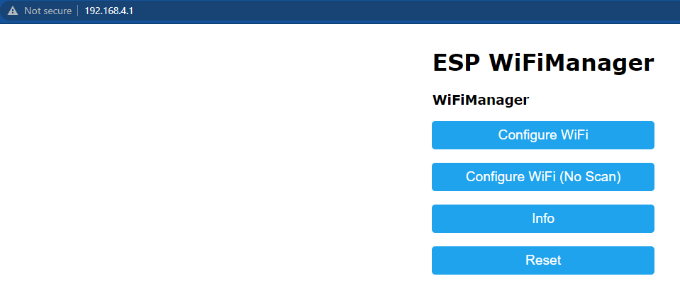

## Flashing via Wifi

Target: `NamimnoRC_Voyager_900_TX_via_WiFi`

Device Category: `NamimnoRC VOYAGER 900 MHz`

Device: `NamimnoRC VOYAGER 900 TX`

#### Method 1

With the correct target selected and [Firmware Options] set, **Build** your firmware using the ExpressLRS Configurator.

Once it's done, it should open the Target folder for you where the `firmware.elrs` file is. Do not close this window so you can easily locate the correct file to upload to the module.

These Tx Modules are STM32-based so they require a separate ESP "backpack" device for Wifi Flashing/Updating. 

Attach the module to your JR Bays and power it up. Connect to the `ESP Wifi Manager` Hotspot that the device will activate. Once connected, navigate to http://elrs_tx.local/.

Press `Configure WiFi` and set your home network SSID and password. This will enable your Tx Module to connect to your local home network.

On your browser, refresh the http://elrs_tx.local/ and scroll towards the STM32 Firmware Update section, as shown below:

Drag-and-drop the `firmware.elrs` file created by the ExpressLRS Configurator into the Choose File field, or manually navigate to the Folder by clicking the Choose File button. You can also upload the `firmware.bin` file but change the offset to *0x4000*.Once the correct file is selected, click the `Upload and Flash STM32`. Wait for the process to complete, and the module will reboot (~1min). Using the [ExpressLRS lua] script, verify that you have the latest version.

#### Method 2

These Tx Modules are STM32-based so they require a separate ESP "backpack" device for Wifi Flashing/Updating. 

Attach the module to your JR Bays and power it up. Connect to the `ESP Wifi Manager` Hotspot that the device will activate. Once connected, navigate to http://elrs_tx.local/.

Press `Configure WiFi` and set your home network SSID and password. This will enable your Tx Module to connect to your local home network.

Using the ExpressLRS Configurator, select the correct Target and set your [Firmware Options]. Click **Build and Flash** and wait for the compile process to complete. You should see a section as pictured below and the Success message marking the update process complete.

Using the [ExpressLRS lua] script, verify that you have the latest version.

## Flashing via OpenTX Radio

!!! note
    The `NamimnoRC_Voyager_900_TX_via_WiFi` Target will work for this method too!

Device Category: `NamimnoRC VOYAGER 900 MHz`

Device: `NamimnoRC VOYAGER 900 TX`

With the correct target selected and [Firmware Options] set, **Build** your firmware using the ExpressLRS Configurator.

Once it's done, it should open the Target folder for you where the `NamimnoRC_Voyager_900_TX-<version>.elrs` file is. Do not close this window so you can easily locate the correct file to copy to your Radio SD Card.

Copy the `NamimnoRC_Voyager_900_TX-<version>.elrs` file into your radio's SD Card `/FIRMWARE` folder.

Once copied, navigate to the `/FIRMWARE` Folder on your Radio and select/highlight the `NamimnoRC_Voyager_900_TX-<version>.elrs` file, long-press the Enter key and select `Flash external ELRS`. Flashing will then commence and after a few seconds, radio should show a `Flash Successful` message and you're done!

Using the [ExpressLRS lua] script, verify that you have the latest version.

## Flashing via STLink

Target: `NamimnoRC_Voyager_900_TX_via_STLINK`

Device Category: `NamimnoRC VOYAGER 900 MHz`

Device: `NamimnoRC VOYAGER 900 TX`

**ONLY USE THIS METHOD IF THE FIRMWARE HAS BEEN CORRUPTED** 

Begin by disassembling the module by unscrewing the 4 screws at the rear of the module with a 1.5mm hex wrench. Carefully seperate the parts of the module and detach the cable from the main PCB.

Wire your `STLink v2` to the module's pins as show below:

With the module connected shown above, and your configuration set, hit **Build & Flash** in the ExpressLRS Configurator and wait for the process to finish. Once that's done, and the Success Message showing, you can now remove/unsolder the STLink, and re-assemble the module, and put it into your Radio's Module Bay. If the Radio has CRSF selected, the light should turn green meaning the module has communication with your radio.

Verification can be done using the [ExpressLRS lua] script. It should show the Version Number and Hash at the bottom, as well as the options you can set. If it's showing "Loading" at the top, check if External Module is set to CRSF for the selected model in your radio, and that internal RF module is set to off. See [General Troubleshooting] section for other ways to determine your module is flashed and ready for flying.

[Firmware Options]: ../firmware-options.md
[Radio Preparation]: tx-prep.md
[ExpressLRS lua]: lua-howto.md
[General Troubleshooting]: ../troubleshooting.md#general-troubleshooting