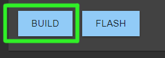
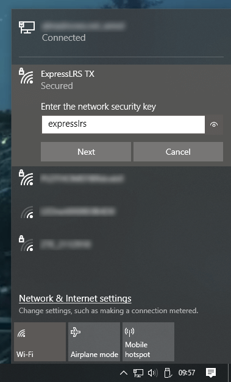
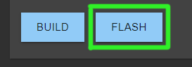
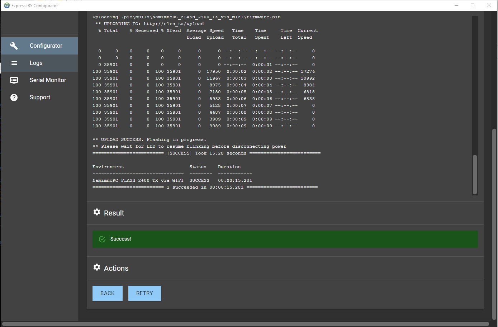

## ESP-based Device Updating Methods

=== "via WiFi"

    <figure markdown>
    
    </figure>

    === "Manual Upload via AP"

        !!! Info "Heads up!"
            This option is only possible if you haven't previously flashed or configured your TX Module with your Home WiFi SSID and Password or it's unable to connect to said WiFi Network because the router is Off or unreachable.

        1. Launch the [ExpressLRS Configurator](../installing-configurator.md) on your Computer.
            - Make sure Official Releases is active from the horizontal tab.
            - Make sure you have selected the Released version you want to flash into your TX module.
        2. Select the Device Category and Device target appropriate for your hardware.
        3. Set the [firmware options](../firmware-options.md) for your device.
            - Regulatory Domain (choose the domain appropriate for the location or country you're flying)
            - Binding Phrase (take note of this phrase as this should be the same on your other devices)
            - Local WiFi Network Credentials (will be used the next time the device goes into WiFi mode)
        4. Click the ++"Build"++ button.
            
            <figure markdown>
            
            </figure>
            
        5. Once the Build process is done, a Temp folder window should popup containing your firmware binaries.
            - You can use any of these files.
            - Do not close this Temp folder unless you have already copied the firmware file somewhere safe, like into your smartphone folder if you're planning to use your smartphone to upload the file in the next steps.
            - the firmware file named with the format `<device target name> + <version>.bin` is best used if you'll be moving these firmware files into one folder, so you know what firmware version it is and for which device it is.
        6. On your Radio, press the ++"SYS"++ Key to display the Tools Menu where Lua Scripts can be found.
        7. Scroll down and select `ExpressLRS` Lua Script.
            - If the script is nowhere to be found, download it from [this page](../transmitters/lua-howto.md) and save it into your Radio SD Card Scripts/Tools/ folder.
        8. Press ++enter++ to Load it.
            - If the script is stuck on a "Loading..." screen, go back to the [Radio Preparation](../transmitters/tx-prep.md) Page and make sure you have configured your radio properly for ExpressLRS use.
        9. Scroll down and select `Wifi Connectivity` and press ++enter++.
        10. Select `Enable WiFi` and press ++enter++.
        11. The `WiFi Running` screen will show up. Your TX module is now in WiFi mode.
            - If the Script stopped and is showing a Syntax Error, do not worry. The module is still in WiFi mode. The Syntax Error could be because you're on an older radio, older EdgeTX/OpenTX firmware or both. It could also be due to the fact your TX module is on an earlier firmware version and you're using a more recent Lua Script.

        12. Using a WiFi-capable device such as your smartphone or laptop, scan for the `ExpressLRS TX` Access Point. Connect to this Access Point.

            { align=right }

            - If your TX Module is previously flashed with your Home WiFi SSID and Password, and it is able to connect to that WiFi Network, then the Access Point will not show up.
            - `expresslrs` is the Password for this Access Point.

             

        13. Once you have connected to the `ExpressLRS TX` Access Point, open up a Browser window and type in the IP Address `10.0.0.1` on the Address Bar and press ++enter++. The ExpressLRS Web UI will load.
        14. Activate the `Update` Tab.
        15. Drag-and-drop the Firmware file from the Temp folder into the File Upload field.
            - You can also use the Browse or Choose File button and browse for the file yourself, specially if you've copied it somewhere else on an earlier step.
        16. Click the ++"Update"++ button to start the Updating procedure.
        17. Wait for the firmware file to get uploaded and flashed into your device. It would only take a minute or two and you will see the Success Popup Message.
        18. On your Radio, the `WiFi Running` screen should disappear and it should be back to the WiFi Connectivity Menu of the ExpressLRS Lua Script.
        19. Long-press the ++"RTN"++ Key to exit the ExpressLRS Lua Script. Reload it to check for the ExpressLRS Firmware version and verify your TX module has been updated.

    === "Manual Upload via Local WiFi"

        !!! Info "Heads up!"
            This option is only possible if you have previously flashed or configured your TX Module with your Home WiFi SSID and Password and it's able to connect to said WiFi Network.

        1. Launch the [ExpressLRS Configurator](../installing-configurator.md) on your Computer.
            - Make sure Official Releases is active from the horizontal tab.
            - Make sure you have selected the Released version you want to flash into your TX module.
        2. Select the Device Category and Device target appropriate for your hardware.
        3. Set the [firmware options](../firmware-options.md) for your device.
            - Regulatory Domain (choose the domain appropriate for the location or country you're flying)
            - Binding Phrase (take note of this phrase as this should be the same on your other devices)
            - Local WiFi Network Credentials (will be used the next time the device goes into WiFi mode)
        4. Click the ++"Build"++ button.
            
            <figure markdown>
            
            </figure>
            
        5. Once the Build process is done, a Temp folder window should popup containing your firmware binaries.
            - You can use any of these files.
            - Do not close this Temp folder unless you have already copied the firmware file somewhere safe, like into your smartphone folder if you're planning to use your smartphone to upload the file in the next steps.
            - the firmware file named with the format `<device target name> + <version>.bin` is best used if you'll be moving these firmware files into one folder, so you know what firmware version it is and for which device it is.
        6. On your Radio, press the ++"SYS"++ Key to display the Tools Menu where Lua Scripts can be found.
        7. Scroll down and select `ExpressLRS` Lua Script.
            - If the script is nowhere to be found, download it from [this page](../transmitters/lua-howto.md) and save it into your Radio SD Card Scripts/Tools/ folder.
        8. Press ++enter++ to Load it.
            - If the script is stuck on a "Loading..." screen, go back to the [Radio Preparation](../transmitters/tx-prep.md) Page and make sure you have configured your radio properly for ExpressLRS use.
        9. Scroll down and select `Wifi Connectivity` and press ++enter++.
        10. Select `Enable WiFi` and press ++enter++.
        11. The `WiFi Running` screen will show up. Your TX module is now in WiFi mode.
            - If the Script stopped and is showing a Syntax Error, do not worry. The module is still in WiFi mode. The Syntax Error could be because you're on an older radio, older EdgeTX/OpenTX firmware or both. It could also be due to the fact your TX module is on an earlier firmware version and you're using a more recent Lua Script.

        12. With your module now in WiFi Mode and it was able to connect to your Local WiFi Network, open a Browser window on any WiFi-capable device that is also connected to the same Local WiFi Network. Type in the Address http://elrs_tx.local on your browser's Address Bar. The ExpressLRS Web UI should load.
            - If your browser cannot resolve this address and it cannot load the ExpressLRS Web UI, this means that MDNS is not working on your device or network.

            ??? tip "Use the IP Address instead!"
                === "The `arp` Command"

                    1. Open up a Command Prompt window on your computer.
                    2. Execute the command `arp -a` which will list all the devices in the Network.
                    3. Use each of the IP Addresses marked as `Dynamic` as URL into your Browser until you get to the ExpressLRS Web UI.

                === "Router DHCP List"
                    1. Log in into your Router dashboard.
                    2. Check the DHCP List and look for the "elrs" device.
                    3. Take note of the IP Address given by your router.
                    4. Use this IP address into your Browser as the URL.

        13. Activate the `Update` Tab.
        14. Drag-and-drop the Firmware file from the Temp folder into the File Upload field.
            - You can also use the Browse or Choose File button and browse for the file yourself, specially if you've copied it somewhere else on an earlier step.
        15. Click the ++"Update"++ button to start the Updating procedure.
        16. Wait for the firmware file to get uploaded and flashed into your device. It would only take a minute or two and you will see the Success Popup Message.
        17. On your Radio, the `WiFi Running` screen should disappear and it should be back to the WiFi Connectivity Menu of the ExpressLRS Lua Script.
        18. Long-press the ++"RTN"++ Key to exit the ExpressLRS Lua Script. Reload it to check for the ExpressLRS Firmware version and verify your TX module has been updated.

    === "Auto Upload"

        !!! Info "Heads up!"
            This option is only possible if you have previously flashed or configured your TX Module with your Home WiFi SSID and Password and it's able to connect to said WiFi Network. 
            
            MDNS must also be working and that your browser can resolve the address http://elrs_tx.local and it can load the ExpressLRS Web UI from said address.

        1. On your Radio, press the ++"SYS"++ Key to display the Tools Menu where Lua Scripts can be found.
        2. Scroll down and select `ExpressLRS` Lua Script.
            - If the script is nowhere to be found, download it from [this page](../transmitters/lua-howto.md) and save it into your Radio SD Card Scripts/Tools/ folder.
        3. Press ++enter++ to Load it.
            - If the script is stuck on a "Loading..." screen, go back to the [Radio Preparation](../transmitters/tx-prep.md) Page and make sure you have configured your radio properly for ExpressLRS use.
        4. Scroll down and select `Wifi Connectivity` and press ++enter++.
        5. Select `Enable WiFi` and press ++enter++.
        6. The `WiFi Running` screen will show up. Your TX module is now in WiFi mode.
            - If the Script stopped and is showing a Syntax Error, do not worry. The module is still in WiFi mode. The Syntax Error could be because you're on an older radio, older EdgeTX/OpenTX firmware or both. It could also be due to the fact your TX module is on an earlier firmware version and you're using a more recent Lua Script.
        7. Launch the [ExpressLRS Configurator](../installing-configurator.md) on your Computer.
            - Make sure Official Releases is active from the horizontal tab.
            - Make sure you have selected the Released version you want to flash into your TX module.
        8. Select the Device Category and Device target appropriate for your hardware.
        9. Set the [firmware options](../firmware-options.md) for your device.
            - Regulatory Domain (choose the domain appropriate for the location or country you're flying)
            - Binding Phrase (take note of this phrase as this should be the same on your other devices)
            - Local WiFi Network Credentials (will be used the next time the device goes into WiFi mode)
        10. Click the ++"Build & Flash"++ button.

            <figure markdown>
            
            </figure>
        
        11. Wait for the upload to finish. A Green Success bar will show up in the ExpressLRS Configurator.

            <figure markdown>
            
            </figure>

        12. On your Radio, the `WiFi Running` screen should disappear and it should be back to the WiFi Connectivity Menu of the ExpressLRS Lua Script.
        13. Long-press the ++"RTN"++ Key to exit the ExpressLRS Lua Script. Reload it to check for the ExpressLRS Firmware version and verify your TX module has been updated.

=== "via UART"

    <figure markdown>
    
    </figure>

=== "via ETX Passthrough"

    <figure markdown>
    
    </figure>