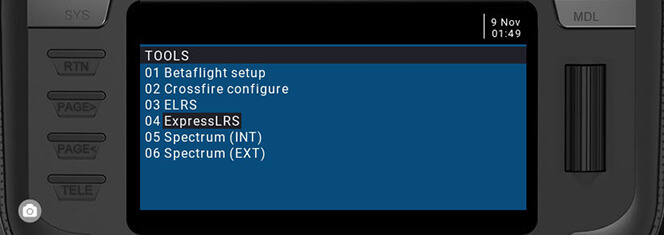

## Flashing via Wifi

Target: `Vantac_Lite_2400_TX_via_WIFI`

Device Category: `Vantac 2.4 GHz`

Device: `Vantac Lite 2400 TX`

### Method 1

With the correct target selected and [Firmware Options] set, **Build** your firmware using the ExpressLRS Configurator.

Once it's done, it should open the Target folder for you where the `Vantac_Lite_2400_TX-<version>.bin` file is. Do not close this window so you can easily locate the correct file to upload to the module.

The next steps will require the [ExpressLRS Lua Script](https://github.com/ExpressLRS/ExpressLRS/blob/2.1.0/src/lua/elrsV2.lua?raw=true) (right-click, save as). Download the ExpressLRS lua script and save it to your Radio's `/Scripts/Tools` folder. Insert/attach your module into your module bay and make sure it's not loose and there's proper connection with the radio (see the [Radio Preparation] page). Execute the ExpressLRS lua script by pressing "System Menu" in your radio and then under Tools, select `ExpressLRS`.

If the script is stuck at `Loading...`, then there's a chance your Radio External RF module is not set to CRSF or that your module is not well-connected to the module bay pins.

Select **WiFi Connectivity** from the Lua script and then select **Enable WiFi**. Press OK once more to activate the WiFi on the Tx Module. Connect to the Access Point the module will create called `ExpressLRS TX`, with the password being `expresslrs`.

<figure markdown>

</figure>

Using your browser, navigate to the correct page (typically http://10.0.0.1/) and it should show an upload form (you will have to scroll down a bit). You can drag-and-drop the `Vantac_Lite_2400_TX-<version>.bin` file that the ExpressLRS Configurator created. You can also click the `Choose File` button and navigate to the folder where the firmware was created. Ensure that you have selected the correct firmware file and click `Update`.

Once the file is uploaded, a pop-up confirmation will show up. Wait for the Lua script screen to close the "WiFi Running" screen and your module should be updated now.

Verify the version and hash in the main screen of ExpressLRS Lua script.

**Join Local Network**

You can configure Home Network SSID and Password if you chose not to use ExpressLRS Configurator to set them. Once these are set, you can use the next two methods below.

### Method 2

With the correct target selected and [Firmware Options] set, **Build** your firmware using the ExpressLRS Configurator.

Once it's done, it should open the Target folder for you where the `Vantac_Lite_2400_TX-<version>.bin` file is. Do not close this window so you can easily locate the correct file to upload to the module.

Using the [ExpressLRS Lua Script](https://github.com/ExpressLRS/ExpressLRS/blob/2.1.0/src/lua/elrsV2.lua?raw=true) (right-click, save as), select `Wifi Connectivity` then choose `Enable WiFi` and if you have flashed your Tx Module with your Home WiFi Network details or have set it in Join Network section of the Update Page, it will connect to the local network automatically.

Using your browser, navigate to http://elrs_tx.local and the WiFi Update page should show up. Scroll down towards the Firmware Update section, as shown below:

Drag-and-drop the `Vantac_Lite_2400_TX-<version>.bin` file created by the ExpressLRS Configurator into the Choose File field, or manually navigate to the Folder by clicking the `Choose File` button. Once the correct file is selected, click the `Update`. Wait for the process to complete, and the module will reboot (~1min).

Verify the version and hash in the main screen of ExpressLRS Lua script.

### Method 3

Using the [ExpressLRS Lua Script](https://github.com/ExpressLRS/ExpressLRS/blob/2.1.0/src/lua/elrsV2.lua?raw=true) (right-click, save as), select `Wifi Connectivity` then choose `Enable WiFi` and if you have flashed your Tx Module with your Home WiFi Network details or have set it in Join Network section of the Update Page, it will connect to the network automatically.

Using the ExpressLRS Configurator, select the correct Target and set your [Firmware Options]. Click **Build and Flash** and wait for the compile process to complete. You should see a section as pictured below and the Success message marking the update process complete.

Verify the version and hash in the main screen of ExpressLRS Lua script.

## Flashing via USB/UART

Target: `Vantac_Lite_2400_TX_via_UART`

Device Category: `Vantac 2.4 GHz`

Device: `Vantac Lite 2400 TX`

Attach a USB-C Data Cable to your module and Computer. Windows users might have to install [CH340 Windows Drivers](https://sparks.gogo.co.nz/assets/_site_/downloads/CH34x_Install_Windows_v3_4.zip) to ensure the device is properly detected and initialized. For other Operating Systems, head to this [site](http://www.wch-ic.com/downloads/CH341SER_ZIP.html) to download your needed drivers.

Using the ExpressLRS Configurator with the correct Target selected and [Firmware Options] set, hit **Build & Flash**. Wait for the process to finish, and you should be greeted with the "Success" message.

Verify the version and hash in the main screen of ExpressLRS Lua script.