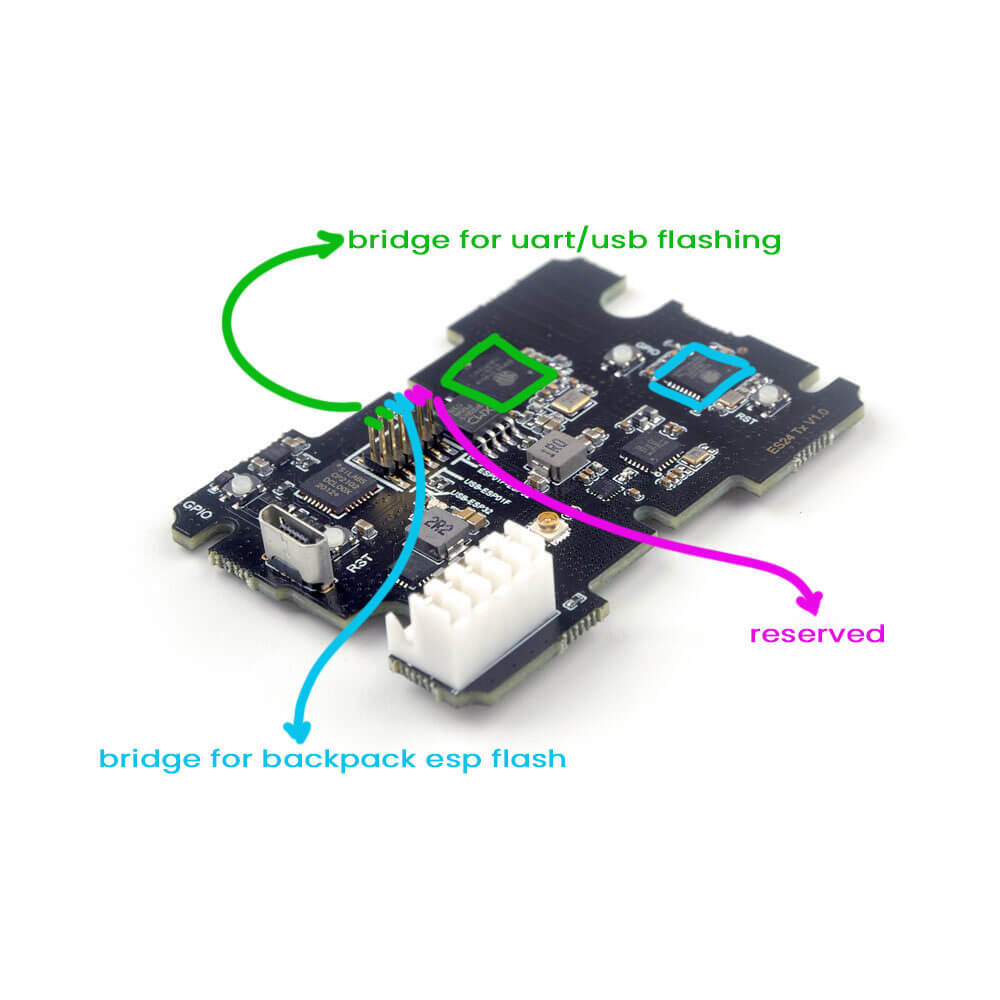
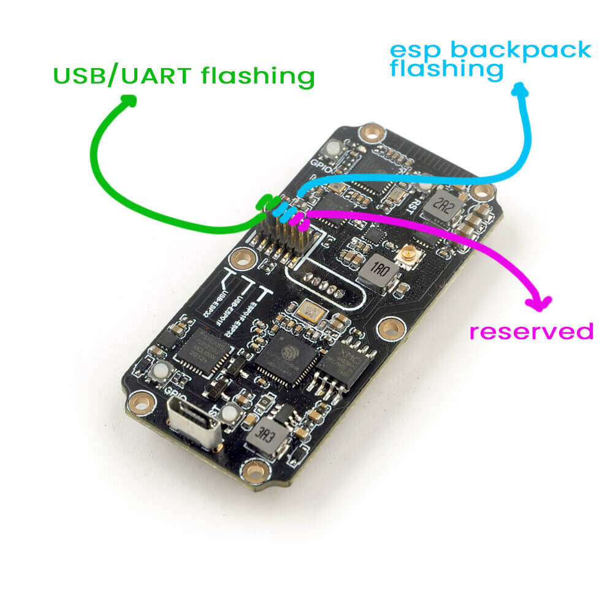

## Flashing via WiFi

Target: HappyModel_ES24TX_2400_TX_via_WIFI

**Build** your firmware using the ExpressLRS Configurator. Once it's done, it should open the Target folder for you where the `firmware.bin` file is. Do not close this window so you can easily locate the correct file to upload to the module.

The next steps will require the [ELRS Lua Script](https://github.com/ExpressLRS/ExpressLRS/blob/master/src/lua/ELRS.lua?raw=true) (right-click, save as). Download the ELRS.lua script and save it to your Radio's `/Scripts/Tools` folder. Insert/attach your module into your module bay and make sure it's not loose and there's proper connection with the radio. Execute the ELRS.lua script by pressing "System Menu" in your radio and then under Tools, select ELRS.lua.

At first, it will show "Mismatch"; it's normal. Tap `Enter` once on your radio to "Force Use" the script. If it's showing a "Connecting" message, then recheck the connection of the module to your radio.

Select "Wifi Update" from the lua script. Lua script will instruct you to go to a specific Ip Address, but you have to first connect to the Wifi Hotspot it created. It will show up in your network as `ExpressLRS TX Module`, and the password is simply `expresslrs`.

Using your browser, navigate to the correct page (typically http://10.0.0.1/) and it should show an upload form (you will have to scroll down a bit). You can drag-and-drop the firmware.bin file from the folder that ExpressLRS Configurator opened for you, or you can manually navigate to it via the `Browse` or `Choose File` button on the Upload form. Click on `Update` once and the update process should commence. Take note that you should be taking a TX firmware.bin file. The folder name where you can get this file is the same as the Target you have selected in the ExpressLRS Configurator.

Once the file is uploaded, the webserver should load a White page, with the message **Update Success! Rebooting...**

As it rebooted, the connection to the Webserver got terminated. Check via the Lua Script whether you have successfully updated the TX module. The first line of the lua script should show a 6-character hash that corresponds to the Git commit hash for the firmware version you have on the module. There should be no more "Mismatch" messages as well.

## Flashing via USB/UART

Target: HappyModel_ES24TX_2400_TX_via_UART

This method requires you move two jumpers into specific pins in the module board. See the following image for the jumper location and which pin should be bridged for this method to work.

The jumpers should be moved into the USB/UART (Green) position from the images above. Attach your USB cable into the module and your computer. [CP210x Drivers](https://www.silabs.com/developers/usb-to-uart-bridge-vcp-drivers) will have to be installed for this to work properly (Windows). Make sure your computer recognizes the module as a USB-to-UART Bridge device, otherwise, this method will not work.

Using the ExpressLRS Configurator with the correct Target selected and options set, hit **Build & Flash**. Wait for the process to finish, and you should be greeted with the "Success" message.

Assemble the module back together and attach it to your radio module bay and verify with the [ELRS.lua](https://github.com/ExpressLRS/ExpressLRS/blob/master/src/lua/ELRS.lua?raw=true) script if you have successfully updated your module.