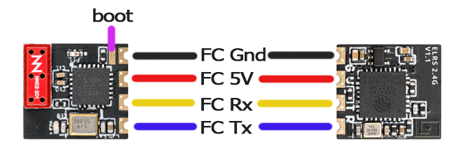
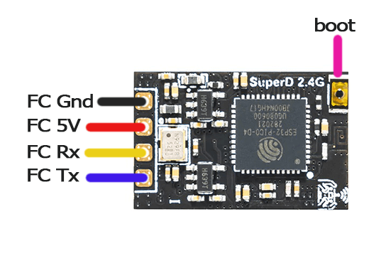
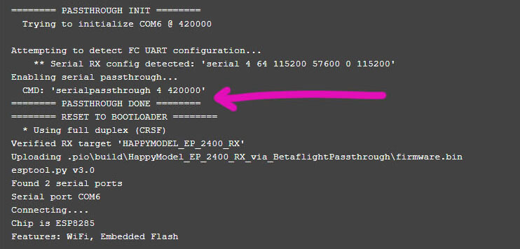

## HELP I BRICKED MY RX!

Take a breath, calm down, relax.

ALL the ESP-based Receivers have a factory-installed bootloader onboard which CANNOT be damaged or tampered with. You can completely screw up the upgrade and always get it back using this default bootloader.

So technically, your receiver is not bricked unless you have damaged the hardware itself.

But for argument's sake, let's use the word "bricked" or "soft-bricked" for a receiver that is not in working order and is not behaving as expected.

Follow the steps below very closely to recover your "bricked" Receiver.

1. Make sure your Receiver only powers up with a LiPo Connected.
    - If your receiver powers up with just USB connected, move the 5v wire of the receiver into a 5v pad that only powers up with LiPo connected.
        - Take a multi-meter in DC Voltmeter mode.
        - Plug in USB into your Flight Controller. Disconnect LiPo.
        - Probe/check each of the 5v pads in the Flight Controller.
        - The 5v pads that read 0v on the multi-meter are pads that will only power up when a LiPo is connected.
        - Solder your Receiver 5v into this pad.
    - If in the above steps, you're not able to find a 5v pad suitable for this procedure, follow the following:
        - Disconnect the 5v wire of the Receiver from the 5v pad on the Flight Controller.
        - Solder a different length of wire into any of the 5v pads on the Flight Controller.
        - Expose a suitable length of conductor of this wire that you can connect with the Receiver's 5v wire LATER.

2. If you've connected a LiPo from the previous step, disconnect it. Also, unplug the Flight Controller from your computer.

3. Prepare the receiver for bootloader mode.
    - If your Receiver have boot pads, bridge them together with solder.
    - If your Receiver has a button, use an alligator clip to keep the button pressed.
    - If your Receiver only has one Boot pad, connect it to a Ground pad.

    <figure markdown>
    
    <figcaption>Example Receiver with Boot Pad</figcaption>
    </figure>

    <figure markdown>
    
    <figcaption>Example Receiver with Boot Button</figcaption>
    </figure>

    !!! warning "Notice"
        Even if your Receiver LED is only lighting up solid, DO NOT skip this step to ensure the receiver is indeed in its Bootloader State.

4. Connect to Betaflight or INAV Configurator and make sure you've properly [configured your FC](receivers/configuring-fc.md) for ExpressLRS use. Set `Telemetry` to **disabled** for now.

5. ++"Save & Reboot"++. Close Betaflight Configurator. Also, close any other App that's potentially using COM Ports.

    !!! info "Cura Slicer"
        We found Cura Slicer and possibly others like it would keep a COM port open or busy preventing successful flashing/recovery via Passthrough.

6. Unplug-replug the USB cable. This will ensure the Flight Controller has a fresh connection to the computer and that the COM port is not busy or in use.

7. On the ExpressLRS Configurator, select the Firmware Version you're trying to recover. Select your Device Category and Device Target as well, along with your usual Firmware Options.

8. Set the Flashing Method to `Betaflight Passthrough`.

    <figure markdown>
    
    </figure>

9. Click the `Build and Flash` button. Wait for the Line **PASSTHROUGH DONE** to appear in the Build Log.

    <figure markdown>
    
    </figure>

    ??? tip "Not Seeing PASSTHROUGH DONE?"
        You've probably skipped some of the steps above or you've misconfigured your flight controller. Go back and make sure to follow EVERY step.

10. Plug in LiPo or twist the 5v Wires together to power up the receiver (see Step 1). The receiver LED should be Solid.

    <figure markdown>
    
    </figure>

11. Wait for the process to finish, hopefully with the Success Message. Otherwise, repeat the procedure above or try a different approach (like reflashing via FTDI/UART Adapter).

12. You can now power down the flight controller, and disconnect LiPo and/or USB.

13. Remove the boot pads bridging or connection to Ground, or, if your Receiver has a button, remove the alligator clip used to press the button.

14. Repower up the receiver to verify it is back in its normal working state.

    <figure markdown>
    
    </figure>

### Wall of Text? Here's a vid!

<figure markdown>
<iframe width="640" height="390" src="https://www.youtube.com/embed/jYLwaWBkM_A" title="YouTube video player" frameborder="0" allow="accelerometer; autoplay; clipboard-write; encrypted-media; gyroscope; picture-in-picture" allowfullscreen></iframe>
</figure>

## What about the TX?

Most ESP-based ExpressLRS TX Modules either have the via UART Flashing Procedure or the via ETX Passthrough Flashing method available to them. Use any of these other methods to recover your ESP-based TX Module. 

For STM-based ExpressLRS TX Modules, there's via STLink Flashing method.

ExpressLRS TX Modules are much harder to screw up during updates, more so if you're following the official Flashing Guides on this website.
