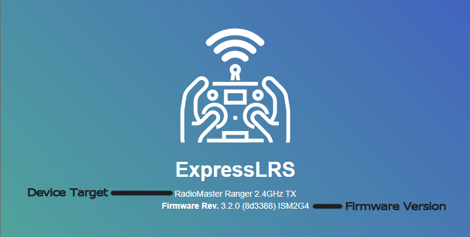
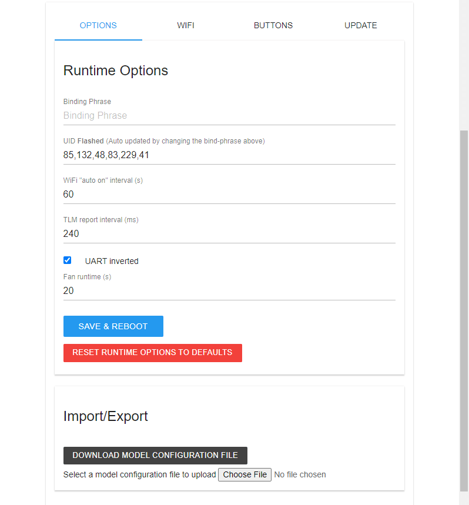
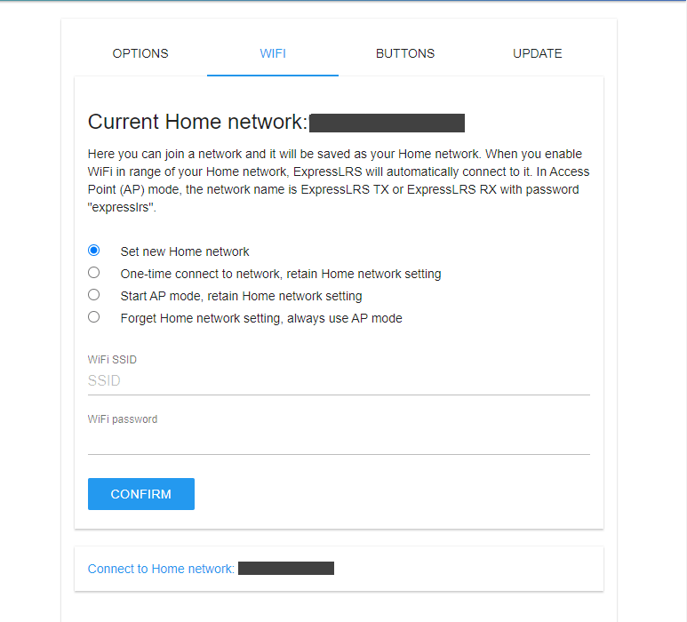
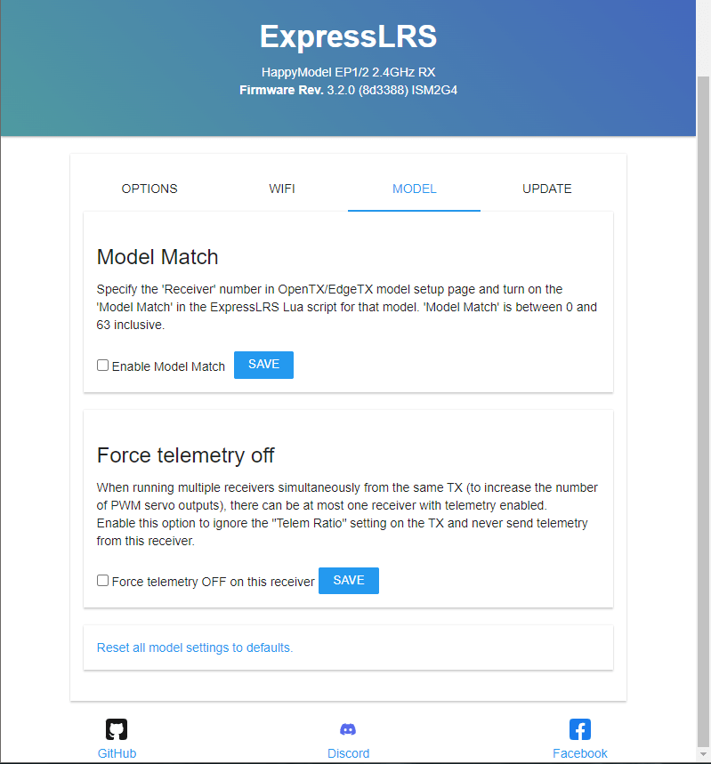
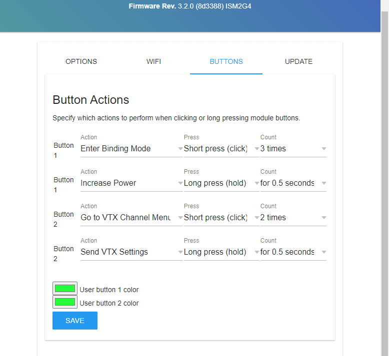
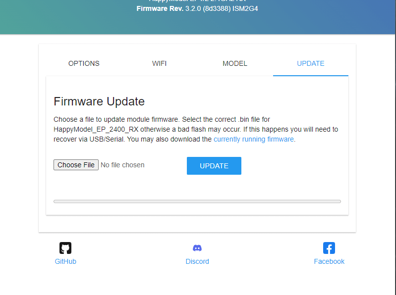
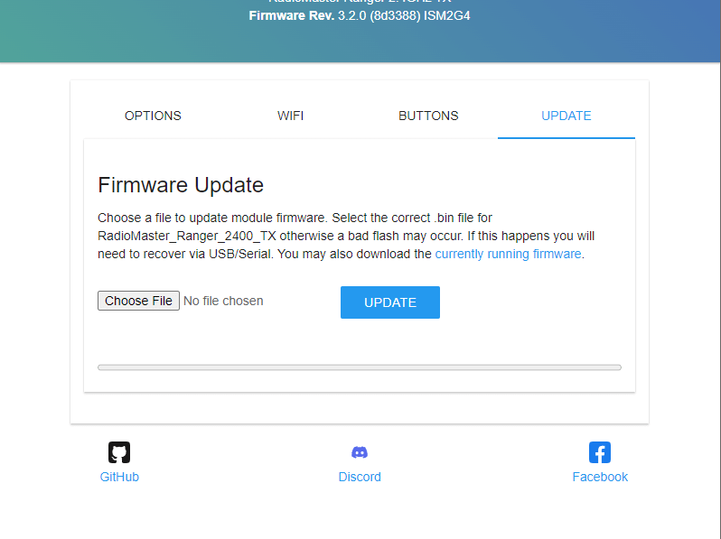

## How to get to the Web UI
=== "Receivers"
   
    1. Put your Receiver into WiFi Mode.

        === "Auto WiFi On"

            1. Make sure your Radio with your TX Module is Off.

            2. Power-cycle your receiver (turn it Off then turn it back On). The Receiver LED should be blinking slowly as shown below. 
        
                <figure markdown>
                
                </figure>

                ??? warning "Receiver LED not Blinking! (click/tap to expand)"
                    If it has a Solid LED light, it may be in bootloader mode if you've only just wired it up. [Rewire](../quick-start/receivers/wiring-up.md) your receiver into a different uart. If you have attempted to update it before, then it could be soft-bricked. Follow the [Unbricking](../quick-start/unbricking.md) procedure to get it back into normal working condition.

            3. Wait for about 60 seconds or until the Receiver LED blinks rapidly or alternate between green or yellow indicating it is now in WiFi Mode.

                <figure markdown>
                
                <figcaption>ESP8285-based Receiver with single-color LED</figcaption>
                </figure>

                <figure markdown>
                
                <figcaption>ESP32-based Receiver with RGB LED</figcaption>
                </figure>

        === "via Lua Script"
            1. Make sure the Receiver and TX Module are in sync and bound. RSSI indicators on your Radio Home screen should be visible and the Receiver LED should be Solid as shown.

                <figure markdown>
                
                </figure>

            2. Press the ++"SYS"++ Key on your Radio.
                - Older Radios or those with only one Menu Key will need to long-press the ++context-menu++ Key to access the System Menu.
                - Consult your Radio User's Manual on how to access the System Menu.
            3. You are now in the Tools Menu where Lua Scripts can be found. Scroll down and select `ExpressLRS` Lua Script.

                <figure markdown>
                ![Lua Script]
                </figure>

                - If the script is nowhere to be found, download it from [this page](./transmitters/lua-howto.md) and save it into your Radio SD Card Scripts/Tools/ folder.
            4. Press ++enter++ to Load it.

                <figure markdown >
                ![Lua Running]
                </figure> 

                - If the script is stuck on a "Loading..." screen, go back to the [Radio Preparation](./transmitters/tx-prep.md) Page and make sure you have configured your radio properly for ExpressLRS use.
                - there should be a C in the top right corner of the Lua Script indicating TX Module and Receiver are Connected.
            5. Scroll down and select `Wifi Connectivity` and press ++enter++.
            6. Select `Enable RX WiFi` and press ++enter++.

                <figure markdown>
                ![Lua WiFi RX]
                </figure>

            7. The `WiFi Running` screen will briefly show up. Your Receiver is now in WiFi mode as indicated by the rapidly blinking LED.

                <figure markdown>
                
                <figcaption>ESP8285-based Receiver with single-color LED</figcaption>
                </figure>

                <figure markdown>
                
                <figcaption>ESP32-based Receiver with RGB LED</figcaption>
                </figure>

                !!! info "Note"
                    It is normal for the receiver will disconnect from the TX Module once it is in WiFi Mode. You will hear your radio announce "Telemetry Lost" if you have the sound pack on your Radio SD Card.

        === "via Button"
            1. If your receiver is equipped with a boot button, you can use this to put the receiver into WiFi mode. 
                - Locate the boot button on your receiver:

            	<figure markdown>
            	
            	<figcaption>Example Receiver with Boot Button</figcaption>
            	</figure>
			
            2. Press and hold the boot button on the receiver for 5 seconds. The LED should begin blinking rapidly indicating the receiver is in WiFi mode.

                <figure markdown>
                
                <figcaption>ESP8285-based Receiver with single-color LED</figcaption>
                </figure>

                <figure markdown>
                
                <figcaption>ESP32-based Receiver with RGB LED</figcaption>
                </figure>
				
    4. Scan for the `ExpressLRS RX` Access Point. 
        { align=right }

        - If your Receiver is previously flashed with your Home WiFi SSID and Password, and it can connect to that WiFi Network, then the Access Point will not show up.
        - `expresslrs` is the Password for this Access Point.

         

    3. Load the Web UI on your browser using these addresses:
        - http://10.0.0.1/ - If you have connected to the `ExpressLRS RX` Access Point

            !!! Note
                This IP address is also often used by some routers. Computers with an ethernet connection to their routers will find that this page doesn't load the ExpressLRS Web UI and instead loads their router or ISP modem configuration dashboards.

                We recommend disconnecting from the network first or trying a different device instead, e.g. smartphone or tablet.

            !!! Note
                On some devices a network login prompt might pop up. Clicking this will often show an incomplete version of the webui that won't behave as expected. Please navigate to http://10.0.0.1/ manually in your browser instead.

        - http://elrs_rx.local - If you have previously set your Home WiFi SSID and Password into your Receiver when you flashed it.

            !!! Note
                If your browser cannot resolve this address, chances are MDNS is not set up and working on your computer or network.

            ??? tip "Use the IP Address instead! (click/tap to expand)"
                === "The `arp` Command"

                    1. Open up a Command Prompt window on your computer.
                    2. Execute the command `arp -a` which will list all the devices in the Network.
                    3. Try each of the IP Addresses marked as `Dynamic` as a URL in your Browser until you get to the ExpressLRS Web UI.

                === "Router DHCP List"
                    1. Log in to your Router dashboard.
                    2. Check the DHCP List and look for the "elrs" device.
                    3. Take note of the IP Address given by your router.
                    4. Use this IP address in your Browser as the URL.
    
=== "TX Modules"

    1. Put your module into wifi mode.

        === "via ExpressLRS Lua Script" 

            1. Press the ++"SYS"++ Key on your Radio.
                - Older Radios or those with only one Menu Key will need to long-press the ++context-menu++ Key to access the System Menu.
                - Consult your Radio User's Manual on how to access the System Menu.
            2. You are now in the Tools Menu where Lua Scripts can be found. Scroll down and select `ExpressLRS` Lua Script.

                <figure markdown>
                ![Lua Script]
                </figure>

                - If the script is nowhere to be found, download it from [this page](./transmitters/lua-howto.md) and save it into your Radio SD Card Scripts/Tools/ folder.
            3. Press ++enter++ to Load it.

                <figure markdown >
                ![Lua Running]
                </figure> 

                - If the script is stuck on a "Loading..." screen, go back to the [Radio Preparation](./transmitters/tx-prep.md) Page and make sure you have configured your radio properly for ExpressLRS use.
            4. Scroll down and select `Wifi Connectivity` and press ++enter++.
            5. Select `Enable WiFi` and press ++enter++.

                <figure markdown>
                ![Lua WiFi]
                </figure>

            6. The `WiFi Running` screen will show up. Your TX module is now in WiFi mode.
                - If the Script stopped and is showing a Syntax Error, do not worry. The module is still in WiFi mode. The Syntax Error could be because you're on an older radio, older EdgeTX/OpenTX firmware or both. It could also be due to the fact your TX module is on an earlier firmware version and you're using a more recent Lua Script.

        === "External Module detached from Radio"

            1. With your TX module disconnected from your Radio module bay, power it up either via an external power source (2S) or by plugging in a USB cable into its USB Port.
            2. Let it be for 60s and the RGB LED will turn into a Green Breathing LED pattern indicating it is now in WiFi Mode.
                - TX Modules with an OLED Screen will also show a message regarding WiFi mode.

    2. Scan for the `ExpressLRS TX` Access Point. 
        { align=right }

        - If your TX Module is previously flashed with your Home WiFi SSID and Password, and it can connect to that WiFi Network, then the Access Point will not show up.
        - `expresslrs` is the Password for this Access Point.

         

    3. Load the Web UI on your browser using these addresses:
        - http://10.0.0.1/ - If you have connected to the `ExpressLRS TX` Access Point

            !!! Note
                This IP address is also often used by some routers. Computers with an ethernet connection to their routers will find that this page doesn't load the ExpressLRS Web UI and instead loads their router or ISP modem configuration dashboards.

                We recommend disconnecting from the network first or trying a different device instead, e.g. smartphone or tablet.

            !!! Note
                On some devices a network login prompt might pop up. Clicking this will often show an incomplete version of the webui that won't behave as expected. Please navigate to http://10.0.0.1/ manually in your browser instead.

        - http://elrs_tx.local - If you have previously set your Home WiFi SSID and Password into your TX Module when you flashed it.

            !!! Note
                If your browser cannot resolve this address, chances are MDNS is not set up and working on your computer or network.

            ??? tip "Use the IP Address instead! (click/tap to expand)"
                === "The `arp` Command"

                    1. Open up a Command Prompt window on your computer.
                    2. Execute the command `arp -a` which will list all the devices in the Network.
                    3. Try each of the IP Addresses marked as `Dynamic` as a URL in your Browser until you get to the ExpressLRS Web UI.

                === "Router DHCP List"
                    1. Log in to your Router dashboard.
                    2. Check the DHCP List and look for the "elrs" device.
                    3. Take note of the IP Address given by your router.
                    4. Use this IP address in your Browser as the URL.

## The ExpressLRS Web UI Explained

The ExpressLRS Web UI is an essential part of the ExpressLRS ecosystem. In earlier versions of the project, its main use is for updating the ExpressLRS firmware and logging or debugging (on select hardware).

ExpressLRS 3.0 has further expanded the capabilities of the ExpressLRS Web UI. Users are able to change Firmware Parameters, including the Binding Phrase, Receiver Protocol, Regulatory Domain (on 900MHz devices) and more.

ExpressLRS 4.0 improves upon this with a new layout allowing for more sections or pages to be shown to users, including the previously-hidden Hardware Layout page.

=== "ExpressLRS 4.0+ Web UI"
    ## ExpressLRS 4.0 Web UI

    ExpressLRS 4.0 brought changes to how the ExpressLRS Web UI is presented, together with a few QOL updates. The layout has changed, favoring a vertical navigation menu in order to show a lot more, including access to previously "hidden" pages and options.

    ### Information Tab
    This Tab will show the basic information about the device, including Hardware name, Firmware version, GitHub commit hash, Radio Chip, Regulatory Domain, Binding UID and any options that's been changed from the default or flashed settings.

    <figure markdown>
    
    </figure>

    ### Binding Tab

    Use this tab to update the Binding Phrase or UID on your ExpressLRS device. Devices with the same Binding Phrase, and consequently, UID is Bound together and should connect and sync when powered up.

    Traditionally Bound receivers will get the last four UID numbers from the TX, and will show up in this tab as well.

    By default, the hardware's MAC is used to determine the UID.

    <figure markdown>
    
    <figcaption>Receiver Web UI Binding Tab</figcaption>
    </figure>

    <figure markdown>
    
    <figcaption>TX Module Web UI Binding Tab</figcaption>
    </figure>

    ### Options Tab

    This tab hosts any Runtime Options for the device. Runtime Options are settings you have set during firmware flashing. Any changes made in this tab will be overridden settings flash into the device.

    <figure markdown>
    
    <figcaption>Receiver Web UI Options Tab</figcaption>
    </figure>

    <figure markdown>
    
    <figcaption>TX Module Web UI Options Tab</figcaption>
    </figure>

    ### Connections Tab

    This tab allows users to change each PWM Output pin's parameters and/or reassign them to a different function. See [PWM Receivers](../hardware/pwm-receivers.md) and [Serial Protocols](../software/serial-protocols.md) for more information. This tab only shows up for receivers with PWM outputs available.

    <figure markdown>
    
    </figure>

    ### Serial Tab

    This tab allows users to change the serial protocol and baudrate of a UART-based receiver. See [Serial Protocols](../software/serial-protocols.md) for more information.

    <figure markdown>
    
    </figure>

    ### Buttons Tab

    This tab allows you to change how the Mode buttons on select External TX modules will work. You can also change the LED color for each of the buttons on modules with separate illumination for the buttons (like the RadioMaster Bandit or Ranger).

    <figure markdown>
    
    </figure>

    ### Import/Export Tab

    This tab allows you to Export or Import TX Module per-model Configuration. See [Model Config Matching](../software/model-config-match.md).

    <figure markdown>
    
    </figure>

    ### WiFi Tab

    This tab lets you change the device' WiFi network connectivity and how it will behave when it is in WiFi mode.

    <figure markdown>
    
    </figure>

    ### Update Tab

    The Update Tab is where you can upload the firmware file the ExpressLRS Configurator or ExpressLRS Web Flasher has prepared for you.

    <figure markdown>
    
    </figure>

    ### Hardware Layout

    This tab is for Advanced Users only. It holds the hardware pin assignments, power management instructions and hardware capability definitions. Do not edit any of the settings here unless you know what you're doing or you've been instructed to.

    !!! warning "Warning"
        DO NOT edit the settings here if you don't know what they are for or what implications they bring to your hardware. Setting Max Power level to 2W will not make your non-PA receiver to work at 2W. It might look like it is in 2W but it will not work at 2W.

    <figure markdown>
    
    </figure>

    ### Continuous Wave

    This tab is for Advanced Users only. This allows a user to put the RF chip into a mode where it transmits a continuous wave at the center frequency that the module is made for. It can help determine whether there's a frequency shift or deviation from the ideal frequency. See [Crystal Frequency Error](../hardware/crystal-frequency-error.md).

    <figure markdown>
    
    </figure>

    ### LR1121 Firmware

    This tab is for Advanced Users only. This allows a user to manually flash the Semtech LR1121 RF chip used on Dual-Band hardware. ExpressLRS can also do this automatically as needed.

    !!! warning "Warning"
        DO NOT flash the LR1121 RF chipset without prior research or knowledge. Flashing the wrong or incompatible firmware will render your device unusable and may require a reflash via a Serial connection or reuploading the correct RF chipset firmware.

    <figure markdown>
    
    </figure>

=== "ExpressLRS 3.0+ Web UI"
    ## ExpressLRS 3.0 Web UI

    ### The Banner

    <figure markdown>
        
        <figcaption>The ExpressLRS Web UI Banner </figcaption>
    </figure>

    ### The Options Tab

    This tab allows users to change firmware options without reflashing their devices. It also allows the import and export of the Configuration from one device to another, useful for setting up backup equipment.

    Options common to both Receivers and TX Modules:

    - Binding Phrase: Type in your Binding Phrase here if you want to update it from either the factory setting or from an earlier flashed setting.

        !!! abstract "It's Blank!"
            This field doesn't store the plain text Binding Phrase. If you see it blank like shown, do not worry. The next field, UID, has the information.

    - UID: As you type in your Binding Phrase in the field above, this read-only field will update with the UID translation. This is what actually gets saved in your device.

    - Regulatory Domain: This only applies to the 900MHz system. This field allows users to change the Regulatory Domain for their device.

        !!! abstract "What about 2.4GHz?"
            The EU_CE Regulatory Domain setting is a Compile-time option and the LBT code needs to be baked in for it to work properly.
    
    - WiFi "Auto On" Interval (in seconds): This field allows you to change how soon WiFi automatically activates when the device is powered up and it's not getting a valid CRSF signal (for TX Modules) or sync packets (for Receivers).

    === "Receiver Options"

        <figure markdown>
            
            <figcaption>ExpressLRS Receiver Options Tab</figcaption>
        </figure>

        - UART Baud: The baud rate to which the receiver will send and receive signals to or from a Flight Controller or other serially connected device. Under normal circumstances, this setting should be left at the default 420000 baud.
        - Exception: If you are running KISS/Kiss Ultra firmware set the receiver's UART baud rate to 400000, as KISS uses this baud rate for CRSF.

        - Invert TX Pin: This setting should also be left disabled or unchecked under normal circumstances. It inverts the CRSF signal coming out of the TX pin of the receiver.
        - Receivers that will be connected to an SBUS pad on Flight Controllers without extra uninverted RX pads should enable this setting. Additionally the command `set serialrx_inverted = on` will be needed in the Flight Controller configuration.

        - Lock on First Connection: This setting speeds up the reconnection of a Receiver and TX Module if you don't ever change your RF Mode/Packet Rate.

    === "TX Module Options"

        <figure markdown>
            
            <figcaption>ExpressLRS TX Module Options Tab</figcaption>
        </figure>

        - TLM Report Interval: This setting controls how often Telemetry packets are sent back to the radio. 240LU is the default setting and is already fast for EdgeTX or OpenTX.

        - UART Inverted: Keep this enabled or checked if you're using your TX module on an OpenTX or EdgeTX Radio. The S.Port pins in External Module bays are inverted bidirectional pins.

        - Fan Runtime (in seconds): This setting controls how long the fan on the TX Module will keep spinning even after the current Transmit Power of the module is already Lower than the Fan Threshold Lua Script setting.

    ### The WiFi Tab

    <figure markdown>
    
    <figcaption>ExpressLRS Web UI WiFi Tab</figcaption>
    </figure>

    ### The Model Tab

    <figure markdown>
    
    <figcaption>ExpressLRS Receiver Web UI Model Tab</figcaption>
    </figure>

    <figure markdown>
    
    <figcaption>ExpressLRS PWM Receiver Web UI Output Settings</figcaption>
    </figure>

    ### The Buttons Tab

    This section is available for External TX modules with two Mode buttons:

    - the RadioMaster Ranger
    - the RadioMaster Bandit
    - the RadioMaster Nomad
    - the BetaFPV Super G

    <figure markdown>
    
    <figcaption>ExpressLRS TX Module Buttons Tab</figcaption>
    </figure>

    ### The Update Tab

    === "Receiver Update Tab"
        <figure markdown>
        
        <figcaption>ExpressLRS Receiver Update Tab</figcaption>
        </figure>

    === "TX Module Update Tab"
        <figure markdown>
        
        <figcaption>ExpressLRS TX Module Update Tab</figcaption>
        </figure>

[Lua Script]: ../assets/images/lua1.jpg
[Lua Running]: ../assets/images/lua/config-bw.png
[Lua WiFi]: ../assets/images/lua/wifi-bw.png
[Lua WiFi RX]: ../assets/images/lua/wifi-bw-rx.png
