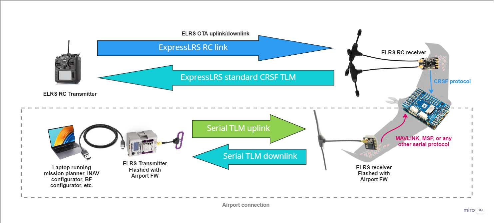

## Description

AirPort provides a firmware option that allows you to turn a regular ExpressLRS transmitter and receiver pair into a bi-directional transparent serial data link, over the air.
The TX module is intended to connect via USB to a laptop, and the RX connects to a free UART on your FC, as per usual. This then allows serial data comms between the peers, in any protocol you wish to use, for example, MAVLINK (Ardupilot), MSP (Betaflight and INAV), or any other telemetry protocol you might wish to use. This may also be useful for wireless ground comms, for example: transmitting CRSF from your handset to an antenna tracker.

!!! warning "Warning"
    The AirPort option completely replaces the RC link, and repurposes it as a data link. If you intend to retain RC control via ELRS, you will need to run 2x TXs and 2x RXs on the ground and air, respectively. One TX+RX pair sends your normal RC link data, just as it does now, and the other TX+RX pair sends the serial data.

## Required Hardware

<figure markdown>

<figcaption>Airport Hardware</figcaption>
</figure>

* **ExpressLRS TX module**: A dedicated external TX module is required for the data link. The TX should ideally have an external USB port to make it easy to attach to a computer (assuming a computer is the desired endpoint for the data link). It is also favorable to use a module with a screen and a 5-way button, which makes packet rate and power selection easier. The TX should use an ESP-based microcontroller (for access to the WebUI).
* **ExpressLRS RX**: Any ExpressLRS ESP-based receiver is compatible with AirPort (technically STM-based receivers can work too, but it will be harder to set up and is therefore not covered in this guide). Receivers with higher telemetry power output (i.e. 100mW telemetry power) will provide better results.

!!! tip "Frequency band" 
      If you plan to use two side-by-side ELRS links on the craft (one for RC and one for telemetry), it is HIGHLY recommended to use different frequencies for each link. For example, you will see good results with RC on 2.4GHz and AirPort on 900MHz. The range will be severely reduced if both RC and AirPort are on the same frequency band.

## Data rate vs Baud rate

AirPort uses a 64-byte buffer to queue bytes that it receives from the FC or GCS, before sending them over the air. If the buffer overflows, the entire 64 bytes are discarded. For this reason, it is VERY important to select a serial baud rate that limits the flow of serial bytes to match the maximum over-the-air (OTA) data rate.

The OTA data rate is determined by the selected packet rate. A faster packet rate will result in a higher data rate at the expense of range. The table below shows the baud rate you should use when configuring the AirPort feature.

| Packet Rate | Maximum OTA Data Rate (bytes/s) | Baud Rate to Select |
|---|---|---|
| 25Hz | 62 | 600 |
| 50Hz | 125 | 1200 |
| 100Hz | 250 | 2400 |
| 100Hz Full Res | 500 | 4800 |
| 200Hz | 500 | 4800 |
| 250Hz | 625 | 4800 |
| 333Hz Full Res | 1665 | 14400 or 9600 |
| 500Hz | 1250 | 9600 |
| 1000Hz | 2500 | 19200 |

A good baseline is:

  * 100Hz Full Res at 4800 baud for 868/915MHz
  * 333Hz Full Res at 14400 or 9600 baud for 2.4GHz

## Configuring AirPort

!!! warning "Warning"
    Once AirPort is enabled, there will be no way to access the RX settings from the LUA script. Before enabling the AirPort option, it is recommended that you bind the TX and RX normally, and (using the LUA) set the RX telemetry power output to maximum. If you already have AirPort enabled, and need to change the RX power, you will need to disable the AirPort checkbox by doing the reverse of the steps below, change the power using LUA, then re-enable AirPort.

!!! warning "Binding Phrases"
    Use a binding phrase that is different from whatever you are using for your RC link if you intend to run RC + AirPort side by side in ANY way.

=== "TX Modules"

      1. Flash the TX Module with the latest ELRS release version (AirPort is available in `v3.3.0` onwards). 

      2. Enable WiFi on the TX module. This can be enabled by inserting the TX into a handset, and in the LUA script select `WiFi Connectivity` -> `Enable WiFi`. WiFi can also be enabled via the screen + 5-way if your TX has one (while powered via USB).

      3. Using a computer or mobile device, connect to the TX WiFi using your preferred method (hotspot or home WiFi).

      4. Open the WebUI (`10.0.0.1` for hotspot, or `http://elrs_tx.local` for home WiFi) in a browser.

      5. In the ELRS WebUI, check the `Use as AirPort Serial device` checkbox.

      6. In the `AirPort UART baud` field, enter your desired baud rate. IMPORTANT: Pay close attention to the "Data rate vs Baud rate" section above when choosing your baud. A good default is `9600` baud for 2.4GHz and `4800`` baud for 868/900MHz.

      7. Click `SAVE & REBOOT`.

=== "RXes"

      1. Flash the RX with the latest ELRS release version (AirPort is available in `v3.3.0` onwards). 

      2. Enable WiFi on the RX. This can be enabled by powering on the RX with no TX powered and waiting for the WiFi timeout.

      3. Using a computer or mobile device, connect to the RX WiFi using your preferred method (hotspot or home WiFi).

      4. Open the WebUI (`10.0.0.1` for hotspot, or `http://elrs_rx.local` for home WiFi) in a browser.

      5. In the ELRS WebUI, check the `Use as AirPort Serial device` checkbox.

      6. In the `AirPort UART baud` field, enter your desired baud rate. IMPORTANT: Pay close attention to the "Data rate vs Baud rate" section above when choosing your baud. A good default is `9600` baud for 2.4GHz and `4800`` baud for 868/900MHz.

      7. Click `SAVE & REBOOT`.

### (Optional) Pre-Installation Operation Checks

Once you have enabled the AirPort setting on both TX and RX, they should be ready to send bi-directional serial data. If you have an FTDI (USB to serial adapter) handy, you can confirm that the link is working as expected before installing it in a craft.

1. Using a suitable USB cable, connect your TX module to a computer.
2. Open a serial terminal client, such as PuTTY, and connect to the COM port for your TX module using the baud rate you chose in the section above.
3. Connect your FTDI to your computer, and connect the RX to the FTDI
4. Open a second instance of PuTTY, and connect to the COM port for your FTDI using the baud rate you chose in the section above.
5. Type chars into each PuTTY window, and confirm you can see them on the opposite terminal session (i.e. typing into the TX PuTTY should result in the same chars appearing in the RX PuTTY window). If you see comms, everything is working.

## Installation

Connect the RX to a spare UART on your flight controller, as per normal:

<figure markdown>

<figcaption>Example AirPort Receiver Wiring</figcaption>
</figure>

Using the appropriate Configurator tool for your FC firmware, configure your selected UART with your desired telemetry protocol. For example, if using AirPort for MAVLINK in Ardupilot, you would set:

* `SERIALN_BAUD` to the baud you entered in the section above,
* `SERIALN_OPTIONS` to `0`,
* `SERIALN_PROTOCOL` to `1` or `2` (for MAVLINKv1 or MAVLINKv2).

Connect the TX to a computer via USB, open the program that you intend to view the telemetry in, then connect to the COM port for your TX module at the baud you entered above. For example, if using AirPort for MAVLINK in Ardupilot, you would open Mission Planner / QGC etc. and select the TX COM port, enter the baud, then click Connect.
