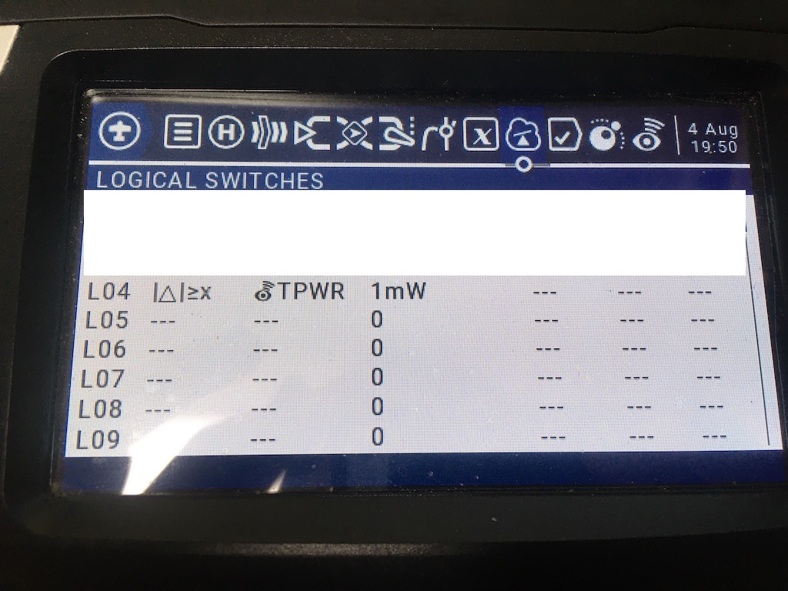

## Description

Dynamic Power allows the TX module to lower its output power from the configured power level using signal information from the RX. The TX will lower power if the signal level is above a threshold (see below) and will raise power if it is not, has a low LQ, or has a sudden drop in LQ. Because Dynamic Power relies on telemetry, telemetry must be enabled. That is, "Telem Ratio" must be set to anything except "Off" or "Race".

!!! warning "Warning"
    Dynamic Power relies on telemetry. If no telemetry is received while armed, then the power level will be kicked up to the maximum configured power level.

### How to configure Dynamic Power

In the ELRS Lua script, select `> TX Power`. There are four configurable elements.

* `Max Power`: The output power will never exceed this power output level in any situation.
* `Dynamic`: Three options are available.
    - `Off`: Fixed power, always set power to the configured `Max Power` output.
    - `Dyn`: Dynamic power is enabled.
    - `AUX9`-`AUX12`: Dynamic power is enabled only when this AUX channel is `high`, and power is fixed to the `Max Power` when `low`. [Demo Video](https://www.youtube.com/watch?v=wdPWw2xu8Ig)
* `Ramp-Up`: Controls how readily Dynamic Power raises transmit power *and* how reluctant it is to lower power again afterward (see [Ramp-Up (Raise/Lower Aggressiveness)](#ramp-up-raiselower-aggressiveness)). Three options are available.
    - `Normal`: Default behavior.
    - `Aggressive`: Raises power sooner/more readily in response to degrading signal or missed telemetry, and requires a better signal than `Normal` before lowering power again.
    - `Very Aggressive`: Raises power even sooner/more readily than `Aggressive`, and requires an even better signal before lowering. Uses more power on average, and keeps it up longer once raised, in exchange for a faster reaction to degrading link quality and less back-and-forth power churn.
* `Fan Thresh`: Fan threshold. If the module has a fan, it will be enabled starting at this power level after a short delay.

Another important setting is to make sure your craft is **armed** on AUX1=`high` (~2000us). See [Switch Modes](switch-config.md) for more information about AUX channels.

## Details

### Starting Power

On module power up with Dynamic Power enabled, transmit power is set to the minimum supported power.

### Lowering Power

For non-FLRC modes, Dynamic Power uses the average signal to noise ratio (SNR) reported by the receiver. If the SNR is above a threshold, the power will be lowered by one level. SNR is used because it takes into account interference (the "noise" in signal-to-noise) and is not affected by receivers with LNAs, which boost RSSI dBm. The thresholds for lowering the power are specific to each packet rate. For example, 250Hz (LoRa) will lower the power if SNR is >= 9.5 but 150Hz (LoRa) will lower power if the SNR is >= 8.5.

For FLRC modes (packet rates beginning with `F` or `D`) Dynamic Power averages the last few RSSI dBm readings from the RX. If the RSSI is >= -83dBm, the transmit power is lowered by one level.

For both algorithms, the power will only be lowered if the link quality (LQ) is 95% or higher.

These specific numbers (-83dBm, 95% LQ, and the per-rate SNR values) are the `Normal` `Ramp-Up` preset. `Aggressive`/`Very Aggressive` require correspondingly better signal before lowering &mdash; see [Ramp-Up (Raise/Lower Aggressiveness)](#ramp-up-raiselower-aggressiveness).

### Raising Power

The opposite of the "lowering power" algorithm is also in place, to raise power as needed slowly such as when flying away on a long range flight. The algorithms are the same as for lowering power, except with different thresholds. Examples:

  * 250Hz (LoRa) raise power if SNR <= 3.0
  * 150Hz (LoRa) raise power if SNR <= 0.0
  * F500 (FLRC) raise power if RSSI <= -89 dBm. Note that all FLRC modes use this same limit.

To be proactive when telemetry is not received, Dynamic Power will also increase power one level for each missed telemetry packet, starting when two are missed back to back.

  * TX misses first telemetry packet: no action, maintain power level
  * TX misses second telemetry packet: increase power 1 level
  * TX misses third telemetry packet: increase power 1 level
  * ...
  * TX receives telemetry packet: normal raise / lower conditions apply

In addition to the slow power ramp up, three LQ-based conditions will raise the power immediately to the maximum configured value.

1. If the LQ ever drops below the hard limit (50% LQ), the power will jump to the max.
2. If the LQ drops suddenly in a single telemetry update compared to the moving average. This is intended to react to flying behind a structure where the LQ suddenly takes a hit and is expected to drop further. Example: LQ is running 100% (as ExpressLRS does under most conditions) and the TX receives a telemetry packet with 80% LQ, the power will jump to the max.
3. If telemetry is lost entirely with the arm switch high. Any time the TX is "disconnected" while armed, the power will jump to the max.

Finally, if reported LQ is below 85% and no other condition has been met this period, increase the power one level.

### Ramp-Up (Raise/Lower Aggressiveness)

The `Ramp-Up` setting adjusts the raising logic above *and* its matching lowering logic together: as the preset gets more aggressive, power raises sooner (at a better signal than it otherwise would), while the corresponding lower threshold moves the opposite way, requiring an even better signal before backing off. The raise/lower pair is moved together deliberately so the gap between them does not shrink as the preset escalates &mdash; a bigger swing between the two thresholds means fewer borderline readings can trigger both a raise and (moments later) a lower, i.e. less power "churn," on top of the faster reaction to a genuinely degrading link. There is no lowering counterpart for the missed-telemetry mechanism, since that mechanism never lowers power itself.

The table below shows real, absolute numbers rather than raw offsets, using the same reference rates already used earlier on this page (F500 for FLRC/RSSI, 250Hz LoRa @2.4GHz for the pre-statistics SNR default) so the values are easy to put in perspective. RSSI sensitivity and the per-rate SNR table values differ by packet rate, so on a different rate the same *offsets* apply on top of a different starting number &mdash; see the footnote below the table.

| Mechanism | Normal | Aggressive | Very Aggressive |
|---|---|---|---|
| Missed-telemetry raise delay (see [Raising Power](#raising-power)), for 250Hz (LoRa @2.4GHz) at its default `1:64` telemetry ratio (4ms OTA period &times; 64 = 256ms nominal LinkStats period) | 512ms (full debounce, waits for a 2nd miss) | 384ms (reacts partway into the 2nd period) | 256ms (reacts on the 1st miss, every time) |
| RSSI-based raise / lower thresholds, for F500 (FLRC), &minus;104dBm sensitivity | &minus;89 / &minus;83dBm (6dB gap) | &minus;85 / &minus;79dBm (6dB gap) | &minus;81 / &minus;75dBm (6dB gap) |
| SNR-based raise / lower thresholds, pre-statistics default, for 250Hz (LoRa @2.4GHz), before the 48-sample SNR window fills | 3.0 / 9.5dB (6.5dB gap) | 4.0 / 10.5dB (6.5dB gap) | 5.0 / 11.5dB (6.5dB gap) |
| SNR-based raise / lower thresholds, statistically-derived, once the SNR window is full (relative to your own flight's live SNR mean/jitter &mdash; there's no fixed absolute number here) | mean &minus;3.25&sigma; / mean +0.5&sigma; (3.75&sigma; span) | mean &minus;2.5&sigma; / mean +1.25&sigma; (3.75&sigma; span) | mean &minus;1.75&sigma; / mean +2.0&sigma; (3.75&sigma; span) |
| LQ-based fallback raise threshold / LQ required to permit any lowering | 85% / 95% LQ (10-point gap) | 90% / 97% LQ (7-point gap) | 93% / 98% LQ (5-point gap) |

On a different packet rate, the RSSI row shifts with that rate's own RXsensitivity (always +15/+21/+19/+25/+23/+29dB above it for Normal/Aggressive/Very Aggressive respectively), and the pre-statistics SNR row shifts with that rate's own compiled table value (always +0/+0, +1/+1, +2/+2dB above it). The missed-telemetry row scales the same way with whatever air rate and telemetry ratio you've actually configured (nominal period = OTA packet period &times; telemetry ratio denominator, with a 512ms floor on the Normal-preset baseline) &mdash; the delay is always exactly 2.0&times;/1.5&times;/1.0&times; that nominal period.

For RSSI and the pre-statistics SNR default, the raise/lower gap is provably constant (both sides get the exact same offset). For the statistically-derived SNR threshold, the total raise-to-lower span (in standard deviations of your own flight's SNR jitter) is also held constant at 3.75&sigma;, just shifted so the raise point sits closer to your average and the lower point sits further above it. The LQ-based pair is the one exception on two counts: because LQ is bounded at 100%, the gap still narrows somewhat at `Very Aggressive` (10 &rarr; 7 &rarr; 5 points) &mdash; there simply isn't unlimited headroom left to push both thresholds apart as they approach the ceiling &mdash; and neither side steps in perfectly linear increments: the lowering-permission threshold (+2, +1) stops at 98% rather than the linear-but-stricter 99%, and the raise threshold (+5, +3) stops at 93% rather than the linear 95%, precisely to keep that gap from narrowing to a 3-point cliff that fired too readily on ordinary link noise. Every raise threshold also carries a runtime floor at least 1 unit below its paired lower threshold as a defensive backstop, though with the values above it never actually needs to clamp anything.

A caveat worth knowing before picking `Very Aggressive`: the LQ-based fallback (93% raise trigger, 5 points below the 98%-LQ-to-lower requirement) and the statistically-derived SNR raise (1.75&sigma; below your flight's own rolling average, which under typical jitter is satisfied by chance roughly 1 in 25 samples even on a healthy link) both sit closer to ordinary link noise than the other presets' thresholds do, so they can trigger &mdash; and then take a while to permit lowering again &mdash; somewhat more often in busy 2.4GHz environments (multi-pilot events, WiFi-congested venues) even without real signal degradation. This isn't a bug &mdash; the algorithm still only ever raises power in response to something real, never drops the link over it &mdash; but it does mean `Very Aggressive` can keep the TX at higher average power for extended stretches more than the name's "one more notch" framing suggests.

## Notes

### Minimum Recommended Telemetry Ratio

Because dynamic power relies on information coming back from the RX to know how to adjust the power, dynamic power is only available if the "Telemetry Ratio" is not set to Off / Race. Any ratio will allow it to operate, but the algorithm is optimized around having at least 2x Link Statistics telemetry packets per second, which is provided with the "Std" telemetry option. If using a manual telemetry ratio, it is recommended to use **at least** the ratio suggested below.

| Packet Air Rate | Telemetry Ratio |
|---|---|
| 1000Hz | 1:128 |
| 500Hz | 1:128 |
| 250Hz | 1:64 |
| 200Hz | 1:64 |
| 150Hz | 1:32 |
| 100Hz | 1:32 |
| 50Hz | 1:16 |

On startup, the output power will be set to the lowest possible value. If telemetry is lost while disarmed, the output power will stay at the current value until telemetry is received again. This is intended to prevent everyone's TX from blasting to max power when swapping batteries.

### OSD Power Display

To see the current output power on your FPV OSD, enable the `TX Uplink Power` OSD element and set `Switch Mode` to `Wide` in the ELRS lua. `TX Uplink Power` is not available if `Switch Mode` is set to `Hybrid`, or on older Betaflight (<4.3.0) and iNav (<2.6.0) versions. 

### EdgeTX / OpenTX Power Readout

Alternatively, a handset special function can be used to generate an audio notification when the TX power level changes.

* Set a logical switch to `|Δ|>x` / `TPWR` / `1mW` as shown in L04 below. The logical switch triggers when the power changes by at least 1mW.

<figure markdown>

</figure>

* For a readout when the power changes, set a special function triggered from the logical switch, and assign `Play Value` / `TPWR` / `1x` (SF10 in the picture). If instead you'd prefer the power to be read out periodically, choose a switch to enable the special function, and assign `Play Value` / `TPWR` / (SF11 in the picture, with 10s interval).

<figure markdown>

</figure>

!!! note "Note"
    OpenTX has no value for 50mW in the CRSF Telemetry protocol and instead will be read as 0mW. EdgeTX versions 2.5.0 and newer have the proper 50mW readout.
